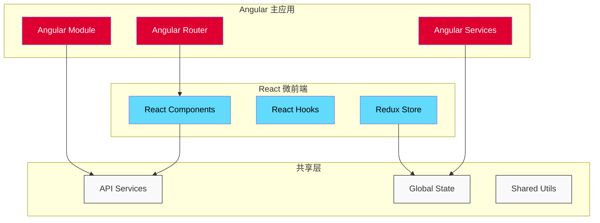

# Flow360 UI 架构文档

欢迎来到 Flow360 UI 前端架构文档中心。本文档集详细介绍了 Flow360 计算流体力学（CFD）仿真平台的前端架构设计、技术实现和最佳实践。

## 项目概述

Flow360 UI 是一个基于 **Angular 17+** 和 **React 18+** 的混合架构前端应用，为计算流体力学仿真提供了完整的 Web 界面。该项目展现了现代企业级 SPA 应用的典型架构特征，包括微前端设计理念、响应式状态管理、强大的可视化能力等。

### 🏗️ 技术架构特点

- **混合框架架构**：Angular 主框架 + React 微前端组件
- **企业级组件设计**：33+ 核心服务的复杂依赖管理
- **3D 可视化引擎**：基于 WebGL 的高性能 CFD 结果渲染
- **响应式状态管理**：RxJS + Redux 模式的数据流控制
- **模块化设计**：微前端架构支持的组件独立开发

## 📚 架构文档导航

### 🔧 核心架构分析

- **[项目总体架构](project)** - 从架构师角度深度解读 Flow360 的整体技术架构
  - 技术栈选型分析
  - 架构决策与权衡
  - 性能优化策略

- **[React 集成架构](react)** - 详细分析 Angular-React 混合架构的设计与实现
  - 微前端集成方案
  - 组件间通信机制
  - 状态同步策略

- **[Workbench 组件架构](workbench)** - 核心工作台组件的企业级架构设计
  - 工作台布局系统
  - 面板管理机制
  - 用户交互模式

### 🎨 组件与模块分析

- **[编辑器面板架构](editor-panel)** - 编辑器面板的组件设计和交互模式
  - 面板组件化设计
  - 数据绑定机制
  - 用户操作流程

- **[可视化服务架构](service)** - 33个核心服务的复杂可视化系统分析
  - 3D 渲染引擎架构
  - 场变量可视化系统
  - 数据处理流水线
  - 性能优化技术

## 🎯 文档使用指南

### 适合的读者群体

- **前端架构师**：了解企业级混合架构的设计思路
- **Angular 开发者**：学习大型 Angular 应用的架构实践
- **React 开发者**：掌握微前端集成的最佳实践
- **可视化开发者**：深入理解 3D 可视化系统的架构设计

### 阅读建议

1. **新手入门**：建议从 [项目总体架构](project) 开始，了解整体设计理念
2. **架构师**：重点关注 [React 集成架构](react) 和 [可视化服务架构](service)
3. **开发者**：深入学习 [Workbench 组件架构](workbench) 和 [编辑器面板架构](editor-panel)

## 🚀 技术亮点

### 混合架构创新

### 服务架构层次
- **数据管理层**：ProjectService、SimulationDataService 等
- **可视化层**：VisualizationService、RenderingConfigService 等
- **交互层**：WorkbenchService、UserInteractionService 等
- **工具层**：UtilityService、ValidationService 等

## 📈 文档更新记录

| 日期 | 版本 | 更新内容 |
|------|------|----------|
| 2025-07-30 | v1.1 | 添加可视化架构文档，完善导航结构 |
| 2025-07-24 | v1.0 | 初始版本，包含核心架构文档 |

---

💡 **提示**：本文档集持续更新中，如有疑问或建议，欢迎反馈！
