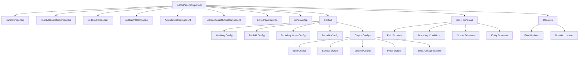
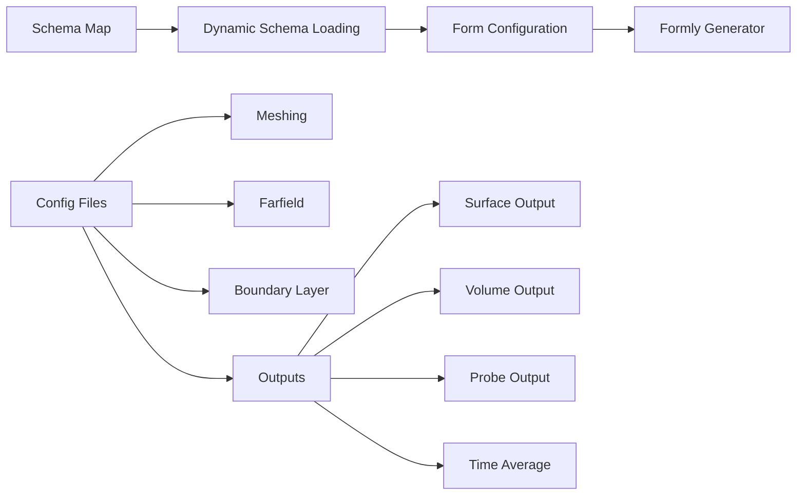
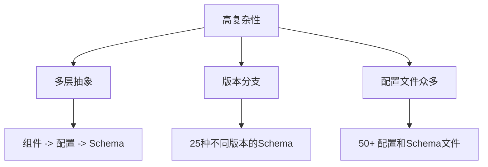
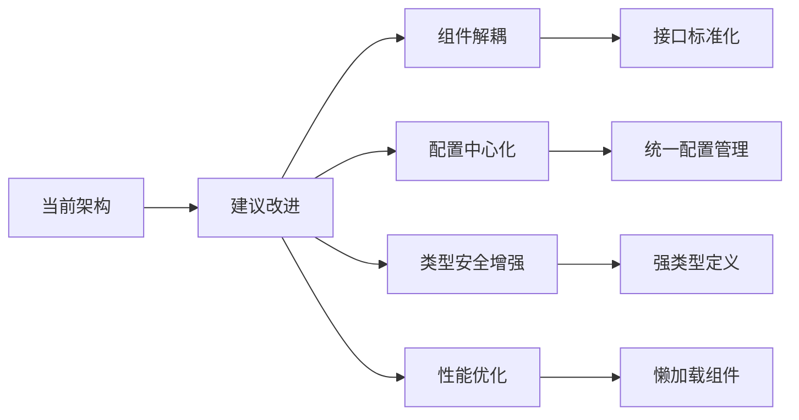

---
title: "Flow360 Editor Panel 组件架构分析"
date: 2025-07-22T10:00:00+08:00
draft: false
description: "深入分析 Flow360 工作台中 Editor Panel 组件的架构设计、功能实现和优化建议"
tags: 
  - "Angular"
  - "前端架构"
  - "组件设计"
  - "Flow360"
  - "CFD"
categories:
  - "前端开发"
  - "架构分析"
author: "Flow360 Team"
toc: true
math: false
mermaid: true
weight: 1
summary: "详细分析 Flow360 Editor Panel 组件的模块化架构、配置驱动设计以及从企业级应用角度的优缺点评估"
keywords:
  - "Angular组件"
  - "配置驱动"
  - "模块化架构"
  - "响应式设计"
  - "版本兼容"
series: "Flow360 架构分析"
aliases:
  - "/posts/editor-panel-analysis"
---

# Flow360 Editor Panel 组件架构分析

## 概述

`editor-panel` 是 Flow360 工作台中的核心编辑组件，负责处理各种仿真参数的配置和编辑。它是一个高度可配置的面板系统，支持多种类型的表单和自定义组件。

## 组件结构分析

### 主要组件层次结构

### 核心组件功能分析

#### 1. EditorPanelComponent（主组件）
**功能职责：**
- 作为编辑面板的主控制器和容器
- 管理面板的显示/隐藏状态和尺寸
- 根据不同的表单类型渲染不同的子组件
- 处理表单数据的转换和验证
- 管理面板的折叠/展开状态

**关键特性：**
- 使用 Angular Signals 进行响应式状态管理
- 支持动态宽度调整（默认430px，特殊类型520px）
- 支持版本兼容性处理（v25+ 新特性）
- 提供模型类型切换功能（边界条件类型切换）

#### 2. EditorPanelService
**功能职责：**
- 全局状态管理服务
- 控制强制重渲染（forceRender）
- 管理覆盖层显示状态（showOverlay）

#### 3. 自定义组件系列

##### BetDiskComponent & BetDiskV2Component
**功能职责：**
- 处理 BET（Blade Element Theory）磁盘模型配置
- 支持文件上传和数据可视化
- 提供拖拽系数和扭转角度的图表展示
- V2版本支持更新的数据格式和UI

##### ActuatorDiskComponent
**功能职责：**
- 配置激励盘模型参数
- 处理力分布数据和CSV文件上传
- 提供实体选择和几何参数设置

##### AeroacousticOutputComponent
**功能职责：**
- 配置气动声学输出参数
- 专门针对v25+版本的声学分析功能

#### 4. 配置系统（Configs）

**功能职责：**
- 提供动态表单配置
- 根据版本和项目类型选择合适的schema
- 统一管理各种输出类型的配置参数

#### 5. JSON Schema系统
**功能职责：**
- 定义表单结构和验证规则
- 支持多版本schema（如Fluid_25_2.json, Fluid_25_6.json）
- 提供边界条件、实体、输出等各类配置的schema定义

#### 6. 更新器系统（Updaters）
**功能职责：**
- 处理数据版本升级和迁移
- 确保不同版本间的数据兼容性

## 架构优缺点分析

### 优点

#### 1. 高度模块化和可扩展性
- **组件分离**：每种特殊表单类型都有独立的组件，便于维护和扩展
- **配置驱动**：通过JSON Schema和配置文件驱动表单生成，新增功能无需修改核心代码
- **版本兼容**：良好的版本管理机制，支持向后兼容

#### 2. 响应式设计
- **信号系统**：大量使用Angular Signals实现高效的响应式更新
- **计算属性**：通过computed()优化性能，避免不必要的重计算
- **动态渲染**：根据数据类型动态选择渲染组件

#### 3. 用户体验优化
- **动态面板尺寸**：根据内容类型自动调整面板宽度
- **折叠功能**：支持面板折叠以节省空间
- **实时预览**：某些组件提供数据可视化和实时预览

#### 4. 数据处理能力
- **数据转换**：统一的数据转换机制处理不同格式间的转换
- **文件上传**：支持CSV、JSON等多种文件格式的上传和解析
- **验证机制**：完整的数据验证和错误处理

### 缺点

#### 1. 复杂性管理

- **学习曲线陡峭**：新开发者需要理解多层抽象关系
- **调试困难**：动态配置使得问题定位变得复杂
- **文档依赖**：需要详细文档说明各层之间的关系

#### 2. 维护成本
- **Schema维护**：每个版本都需要维护对应的Schema文件
- **兼容性测试**：版本升级时需要测试大量的配置组合
- **配置同步**：多个配置文件之间可能存在不一致的风险

#### 3. 性能考虑
- **重渲染机制**：通过repaint信号强制重渲染可能影响性能
- **大型表单**：复杂的嵌套表单可能导致渲染性能问题
- **内存占用**：大量的配置和Schema文件会增加内存占用

#### 4. 扩展限制
- **紧耦合风险**：某些自定义组件与主组件耦合较紧
- **配置复杂度**：新增功能需要在多个层面添加配置
- **类型安全**：大量使用NzSafeAny类型，降低了类型安全性

## 改进建议

### 1. 架构优化

### 2. 具体建议

#### 组件层面
- **接口标准化**：为所有自定义组件定义统一的接口规范
- **懒加载**：对大型组件实现懒加载以提升初始加载性能
- **组件通信**：使用更规范的事件总线或状态管理方案

#### 配置管理
- **配置合并**：考虑将相似的配置文件合并以减少维护成本
- **版本策略**：建立更清晰的版本管理和迁移策略
- **配置验证**：在构建时验证配置文件的一致性

#### 开发体验
- **类型定义**：为所有配置和数据模型提供严格的TypeScript类型定义
- **开发工具**：提供配置文件的可视化编辑和验证工具
- **文档生成**：从代码和配置自动生成架构文档

## 总结

Editor Panel组件是Flow360中设计精良的核心组件，体现了现代前端架构的诸多优秀实践。其配置驱动的设计理念和模块化架构为系统的可扩展性和维护性奠定了良好基础。

虽然存在复杂性管理和维护成本方面的挑战，但这些都是高度可配置系统的常见权衡。通过持续的架构优化和工具改进，可以在保持系统灵活性的同时降低开发和维护成本。

该组件架构特别适合需要处理复杂配置、支持多版本兼容、且需要高度定制化的企业级应用场景。
