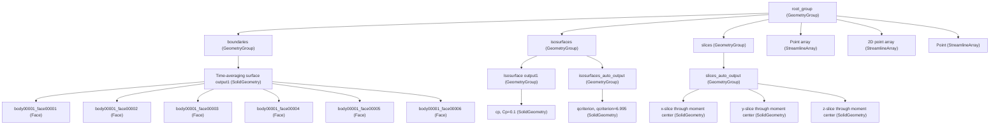

---
title: "Flow360 UI 数据结构层级视图（Mermaid）"
date: "2025-08-11"
draft: false
---

# 层级视图

基于提供的 JSON 结构，生成如下层级关系图：

```mermaid
flowchart TD
  root["root_group (GeometryGroup)"]

  root --> boundaries["boundaries (GeometryGroup)"]
  boundaries --> timeavg["Time-averaging surface output1 (SolidGeometry)"]
  timeavg --> face1["body00001_face00001 (Face)"]
  timeavg --> face2["body00001_face00002 (Face)"]
  timeavg --> face3["body00001_face00003 (Face)"]
  timeavg --> face4["body00001_face00004 (Face)"]
  timeavg --> face5["body00001_face00005 (Face)"]
  timeavg --> face6["body00001_face00006 (Face)"]

  root --> isosurfaces["isosurfaces (GeometryGroup)"]
  isosurfaces --> iso_group1["Isosurface output1 (GeometryGroup)"]
  iso_group1 --> cp01["cp, Cp=0.1 (SolidGeometry)"]
  isosurfaces --> iso_auto["isosurfaces_auto_output (GeometryGroup)"]
  iso_auto --> qcrit["qcriterion, qcriterion=6.995 (SolidGeometry)"]

  root --> slices["slices (GeometryGroup)"]
  slices --> slices_auto["slices_auto_output (GeometryGroup)"]
  slices_auto --> x_slice["x-slice through moment center (SolidGeometry)"]
  slices_auto --> y_slice["y-slice through moment center (SolidGeometry)"]
  slices_auto --> z_slice["z-slice through moment center (SolidGeometry)"]

  root --> point_array["Point array (StreamlineArray)"]
  root --> point_2d["2D point array (StreamlineArray)"]
  root --> point["Point (StreamlineArray)"]
```
