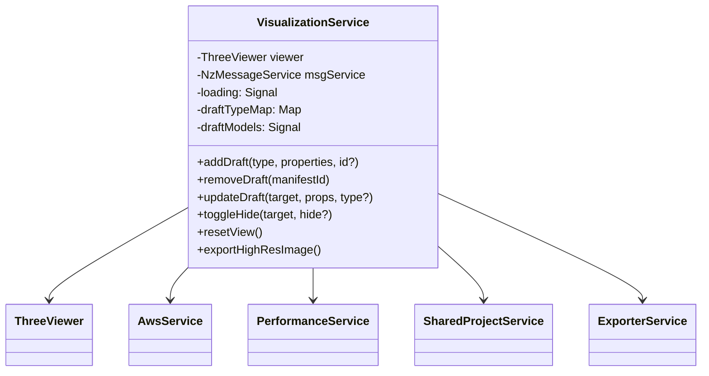

# Flow360 可视化服务解析

## 概述

`VisualizationService` 是 Flow360 应用中的核心服务，负责处理三维可视化渲染、模型管理和交互功能。该服务基于 Three.js 构建，提供了丰富的 3D 可视化能力，包括模型加载、渲染控制、相机操作、选择与悬停交互等功能。

该服务主要用于 CFD（计算流体动力学）数据的可视化，支持流线、等值面、切片等多种可视化方式，并提供了丰富的交互工具，使用户能够直观地分析和理解复杂的流体动力学数据。

## 架构设计



## 核心功能

### 1. 模型加载与管理

服务通过 `loadManifest` 方法加载项目清单数据，支持从 S3 获取资源，并提供缓存机制以提高性能。模型加载过程中会记录性能指标，并通过信号机制通知 UI 更新加载状态。

```typescript
// 从 S3 获取资源的示例代码
async getS3Resource(key: string, options?: GetS3ResourceOptions): Promise<ArrayBuffer> {
  // 实现资源获取、重试逻辑和缓存
}
```

### 2. 可视化控制

服务提供了丰富的可视化控制功能，包括：

- **显示/隐藏控制**：通过 `toggleHide`、`showAll`、`hideAll` 等方法控制模型的可见性
- **线框模式**：使用 `setWireframe` 方法切换线框显示模式
- **LOD (Level of Detail) 管理**：通过 `setLodLevel` 控制模型的细节级别
- **相机控制**：提供 `resetView`、`zoomToSelected`、`fitWalls` 等方法操作相机视角
- **LIC (Line Integral Convolution) 效果**：通过 `showLIC` 和 `clearLIC` 控制流场可视化效果

### 3. 交互功能

服务实现了丰富的交互功能，支持模型的选择、悬停和拾取：

- **选择与悬停**：通过 `select`、`unselect`、`hover`、`unhover` 等方法实现
- **拾取控制**：使用 `resetPickableEntityTypes` 和 `togglePickableEntityType` 控制可拾取的实体类型

### 4. 草图工具

服务提供了完整的草图工具支持，可以创建、编辑和管理各种几何体：

- **添加草图**：通过 `addDraft` 方法添加平面、点、线、圆等几何体
- **更新草图**：使用 `updateDraft` 方法更新几何体属性
- **复制草图**：通过 `duplicateDraft` 方法复制现有几何体
- **删除草图**：使用 `removeDraft` 方法删除几何体

### 5. 导出功能

服务支持导出高分辨率图像和当前渲染视图：

```typescript
exportHighResImage(targetWidth: number, targetHeight: number, format: string) {
  return this.viewer.exportHighResImage(targetWidth, targetHeight, format);
}

exportRenderedImage(mimeType = 'image/webp'): Promise<Blob> {
  return this.exporterService.exportImage(this.viewer, mimeType);
}
```

## 状态管理

服务使用 Angular 的信号 (Signal) API 进行状态管理，主要包括：

- **加载状态**：`loading` 信号表示模型加载状态
- **草图模型**：`draftModels` 信号管理所有草图模型
- **选择状态**：通过 `selectedIds` 计算属性获取当前选中的实体
- **悬停状态**：通过 `hoverIds` 计算属性获取当前悬停的实体
- **可见性变化**：`visibleChange` 信号在可见性变化时触发

## 性能优化

服务实现了多种性能优化策略：

1. **资源缓存**：通过 `s3ResCache` 缓存已加载的 S3 资源
2. **LOD 管理**：支持不同细节级别的模型，根据视图距离自动切换
3. **延迟加载**：使用 `waitHideToShow` 方法实现模型的延迟加载
4. **批量处理**：多处使用批量操作以减少渲染更新次数

## 导入的库和组件功能推测

通过分析 `visualization.service.ts` 文件的导入语句，我们可以推测以下库和组件的功能：

### Angular 核心库

```typescript
import { computed, effect, inject, isSignal, signal, Signal } from '@angular/core';
import { DestroyRef, inject as injectCore } from '@angular/core';
```

- **Signal API**：使用 Angular 的信号 API 进行响应式状态管理
- **DestroyRef**：用于组件销毁时进行资源清理

### Three.js 相关

```typescript
import { Camera, Matrix4, Vector3 } from 'three';
```

- **Three.js**：3D 图形渲染库，提供相机、矩阵和向量等基础组件
- 用于实现 3D 场景的渲染和交互

### Lodash 工具库

```typescript
import { debounce, deepClone, isEqual } from 'lodash-es';
```

- **debounce**：用于限制函数调用频率，优化性能
- **deepClone**：用于深度复制对象，避免引用问题
- **isEqual**：用于对象比较

### RxJS 响应式编程

```typescript
import { BehaviorSubject, Subject } from 'rxjs';
```

- **BehaviorSubject/Subject**：用于实现观察者模式，处理异步事件流

### UUID 生成

```typescript
import { v4 as uuidv4 } from 'uuid';
```

- **uuidv4**：生成唯一标识符，用于模型和实例的唯一标识

### 自定义组件

```typescript
import { ThreeViewer } from '@flow360/three-viewer';
import { FieldController } from '@flow360/three-viewer';
```

- **ThreeViewer**：自定义的 Three.js 封装组件，提供高级渲染功能
- **FieldController**：用于控制场数据的显示和交互

## 与外部服务集成

服务与多个外部服务集成：

- **AwsService**：用于 S3 资源获取，处理云存储中的模型和数据文件
- **PerformanceService**：用于性能监控和记录，跟踪渲染和加载性能
- **SharedProjectService**：用于项目数据共享，管理项目级别的设置和状态
- **ExporterService**：用于导出图像和数据，支持高分辨率图像导出

## CFD 特定可视化功能

通过代码分析，我们可以看到 `VisualizationService` 提供了多种专门针对 CFD 数据的可视化功能：

### 1. 流线可视化

```typescript
showLIC(instanceId?: ObjectInstanceId) {
  if (!instanceId || this.licInstanceIds.has(instanceId)) {
    return;
  }

  this.viewer.animateLIC = true;
  this._checkAndSwitchAutoRefresh('lic', true);
  this.viewer.setLICState(instanceId, true);
  this.licInstanceIds.add(instanceId);
}
```

服务支持 LIC (Line Integral Convolution) 技术来可视化流场，这是一种高级的流场可视化方法，能够直观地展示流体的流动方向和速度。

### 2. 特定区域聚焦

```typescript
async fitWalls() {
  await this.fitWithTag('wall');
}

async fitFarfields() {
  await this.fitWithTag('farfield');
}
```

服务提供了针对 CFD 模型中特定区域（如壁面、远场边界）的聚焦功能，帮助用户快速定位关键区域。

### 3. 通用体积数据处理

```typescript
updateGenericVolums(data: GenericVolumeData[]) {
  // 处理通用体积数据
}
```

服务能够处理通用体积数据，这对于可视化 CFD 中的体积数据（如压力场、速度场等）非常重要。

### 4. 多种几何体支持

服务支持多种几何体类型，包括平面、点、线、圆等，这些几何体可用于创建切片面、采样点等 CFD 分析中常用的元素。

## Draft 概念解析

Draft 在 UVF (Universal Visualization Framework) 中是一个核心概念，代表用户可以在三维场景中创建和操作的临时性几何对象。通过分析代码，我们可以总结 Draft 的以下特点：

### 1. 临时性几何对象

Draft 是一种临时性的几何对象，用户可以在三维场景中快速创建、编辑和删除，而不会影响底层的数据模型。这些对象通常用于：

- 创建辅助线、点、面等用于分析的几何体
- 标记感兴趣的区域
- 创建用于切片、采样的几何体
- 添加临时注释或测量工具

### 2. 类型多样性

`VisualizationService` 中的 `draftTypeMap` 定义了多种 Draft 类型，包括但不限于：

- 平面 (Plane)
- 点 (Point)
- 点阵列 (PointArray)
- 线 (Line)
- 圆柱体 (Cylinder)
- 立方体 (Box)
- 切片 (Slice)

每种类型都有特定的几何特性和用途，例如平面可用于创建切片，点可用于标记特定位置。

### 3. 属性可配置

Draft 对象具有丰富的可配置属性，通过 `DraftProps` 和 `DraftPropsMap` 定义：

```typescript
interface Draft {
  userId: string;
  id: string;
  type: string;
  name: string;
  projectId?: string;
  // 其他属性...
}
```

这些属性包括位置、尺寸、颜色、透明度等，可以通过 `updateDraft` 方法动态修改。

### 4. 可交互性

Draft 对象支持丰富的交互操作：

- 选择：通过 `select` 和 `unselect` 方法
- 悬停：通过 `hover` 和 `unhover` 方法
- 显示/隐藏：通过 `toggleHide` 方法
- 复制：通过 `duplicateDraft` 方法

### 5. 状态管理

`VisualizationService` 使用 Angular 的信号 API 管理 Draft 的状态：

- `draftModels` 信号存储所有草图模型
- `draftView` 计算属性生成可视化草图列表
- `selectedIds` 和 `hoverIds` 计算属性跟踪选择和悬停状态

## ThreeViewer 内容添加入口

通过代码分析，我们可以识别出向 ThreeViewer 添加内容的主要入口：

### 1. VisualizationService 的 addDraft 方法

```typescript
addDraft<T extends keyof AddDraftTypeMap>(
  type: T,
  properties: AddDraftTypeMap[T],
  id?: string
): string {
  // 创建并添加草图模型的实现
}
```

这是最常用的添加内容入口，支持添加各种类型的草图对象，如平面、点、线等。该方法会：

1. 根据类型和属性创建草图模型
2. 分配唯一ID（如果未提供）
3. 将模型添加到 ThreeViewer 实例
4. 更新内部状态和视图

### 2. 特定服务的封装方法

多个服务封装了 `addDraft` 方法，提供了更专业化的接口：

- `EntitiesDraftDataService`：管理实体草图数据，提供添加不同类型草图的专用方法
- `ExporterService`：处理导出相关功能，可能添加临时可视化元素
- `SharedProjectService`：管理项目级别的可视化元素

### 3. ThreeViewer 的底层 API

`ThreeViewer` 类本身提供了更底层的 API 用于直接操作场景：

- 场景管理：添加/移除对象到场景图
- 材质控制：创建和应用材质
- 几何体创建：生成各种三维几何体
- 渲染控制：管理渲染循环和效果

这些 API 通常不直接使用，而是通过 `VisualizationService` 的高级接口进行封装和调用。

## 渲染位置分析

通过分析代码，我们可以确定 ThreeViewer 的渲染流程和位置：

### 1. DOM 容器创建

`VisualizationService` 在构造函数中创建一个 DOM 容器元素：

```typescript
constructor() {
  // 创建容器元素
  this.container = document.createElement('div');
  this.container.style.width = '100%';
  this.container.style.height = '100%';
  this.container.style.position = 'relative';
  // ...
}
```

### 2. ThreeViewer 初始化

使用创建的容器初始化 ThreeViewer 实例：

```typescript
this.viewer = new ThreeViewer({
  container: this.container,
  // 其他配置...
});
```

### 3. 附加到目标 HTML 元素

通过 `attachTo` 方法将容器附加到页面上的目标元素：

```typescript
attachTo(element: HTMLElement) {
  // 清除现有内容
  while (element.firstChild) {
    element.removeChild(element.firstChild);
  }
  
  // 附加容器
  element.appendChild(this.container);
  
  // 调整大小和更新
  this.viewer.resize();
}
```

### 4. 渲染到 Canvas

ThreeViewer 内部使用 Three.js 的 WebGLRenderer，将场景渲染到 Canvas 元素：

```typescript
// ThreeViewer 内部的渲染器初始化（简化示例）
this.renderer = new THREE.WebGLRenderer({
  canvas: this.canvas,
  antialias: true,
  // 其他配置...
});
```

### 5. 组件集成

最终，渲染结果通过 Angular 组件层次结构显示在用户界面上：

- `CaseDetailComponent`：案例详情页面，包含可视化区域
- `VisualizationComponent`：专用的可视化组件，调用 `visualizationService.attachTo`
- `EntitiesTreeComponent`：实体树组件，与可视化服务交互

渲染流程总结：DOM容器创建 → ThreeViewer初始化 → 附加到目标元素 → WebGL渲染到Canvas → 组件显示在UI中

## 场数据控制器分析

在 Flow360 的可视化服务中，场数据（Field）的控制和管理是通过两个关键控制器实现的：`FieldController` 和 `FieldsController`。这两个控制器位于 `/projects/flow360/src/app/services/visualization/controllers/` 目录下，负责处理 CFD 数据的场数据可视化和交互。

### FieldController 控制器

`FieldController` 是单个场数据实例的控制器，负责管理和操作单个对象实例的场数据可视化。它封装了底层 UVF (Universal Visualization Framework) 的 `UvfFieldController`，提供了更高级的接口和功能。

#### 核心功能

1. **场数据选择与切换**
   - 通过 `setFieldName` 方法选择要显示的场数据（如压力、速度等）
   - 支持向量场的分量选择（X、Y、Z 分量）
   - 提供 `fieldNames` 信号获取可用场数据列表

2. **数据范围控制**
   - 通过 `setMinMax` 方法设置场数据的显示范围
   - 支持 `resetMinMax` 方法重置为默认范围
   - 提供 `minMaxValues` 和 `minMaxScalar` 信号获取当前范围

3. **对数比例控制**
   - 通过 `setLogScale` 方法切换线性/对数比例显示
   - 自动处理对数比例下的负值和零值问题
   - 提供 `isLogScale` 信号获取当前比例状态

4. **颜色映射控制**
   - 通过 `setTheme` 方法设置颜色映射方案
   - 提供 `theme` 信号获取当前颜色映射

5. **等值线/等值面控制**
   - 通过 `setContourSteps` 设置等值线/面的数量
   - 通过 `setContourLineType` 设置等值线类型
   - 通过 `setContourSurfaceColorType` 设置等值面颜色类型
   - 通过 `setContourLineColor` 设置等值线颜色

6. **裁剪控制**
   - 通过 `setClipType` 设置裁剪类型（Above/Below/Disable）
   - 通过 `setClipValue` 设置裁剪值
   - 通过 `setClipAreaType` 设置裁剪区域类型
   - 通过 `setClipColor` 设置裁剪区域颜色

7. **流线可视化**
   - 通过 `setLIC` 方法控制 LIC (Line Integral Convolution) 效果
   - 通过 `setTubeWidthConvert` 设置流线管宽度
   - 通过 `setStreamlineDirection` 设置流线方向

8. **状态恢复**
   - 通过 `restoreSetting` 方法从缓存数据恢复场数据设置

#### 实现细节

`FieldController` 大量使用了 Angular 的信号 API 进行状态管理，将底层 UVF 控制器的状态转换为 Angular 信号，实现了响应式的状态更新。同时，它还处理了单位转换、性能优化（如使用 throttle 限制更新频率）等细节。

```typescript
// 使用 Angular 信号 API 包装底层控制器状态
this.fieldNames = toAngularSignal(
  uvfComputed(() => {
    const names = new Set<string>();
    this.controller.fieldNames.forEach(fieldName => {
      names.add(fieldName);
      const fieldComponnetsNames = this.getFieldComponentsNames(fieldName);
      fieldComponnetsNames.forEach(name => {
        names.add(name);
      });
    });
    return Array.from(names.values()).sort((a, b) => a.localeCompare(b));
  }),
  { injector: this.injector }
);
```

### FieldsController 控制器

`FieldsController` 是多个场数据实例的集合控制器，负责管理和协调多个 `FieldController` 实例。它主要用于处理多个对象同时显示场数据的情况，确保它们使用一致的设置和范围。

#### 核心功能

1. **控制器集合管理**
   - 通过 `initialize` 方法初始化多个 `FieldController` 实例
   - 提供 `controllers` 信号存储和管理所有控制器实例
   - 支持动态添加和移除控制器

2. **全局状态聚合**
   - 聚合所有控制器的场数据名称列表
   - 计算全局的数据范围（最小值和最大值）
   - 聚合所有控制器的单位映射

3. **批量操作**
   - 通过 `setFieldName` 方法同时设置所有控制器的场数据
   - 通过 `setTheme` 方法同时设置所有控制器的颜色映射
   - 通过 `setLogScale` 方法同时设置所有控制器的比例类型
   - 通过 `setMinMax` 方法同时设置所有控制器的数据范围
   - 提供其他批量设置方法（等值线、裁剪、流线等）

4. **状态恢复与清理**
   - 通过 `restoreSetting` 方法恢复所有控制器的设置
   - 通过 `dispose` 方法清理所有控制器资源

#### 实现细节

`FieldsController` 使用计算属性（computed）从多个控制器中聚合状态，并提供统一的接口进行批量操作。它还处理了控制器的异步初始化和可见性变化。

```typescript
// 聚合多个控制器的数据范围
minMaxValues: Signal<[number, number]> = computed(() => {
  let minMaxValues: [number, number] = [Infinity, -Infinity];

  for (const controller of this.controllers()) {
    const [min, max] = controller.minMaxValues();

    minMaxValues = [Math.min(minMaxValues[0], min), Math.max(minMaxValues[1], max)];
  }

  return minMaxValues;
});
```

### 控制器之间的关系

`FieldController` 和 `FieldsController` 之间是一对多的关系：

- `FieldController` 负责单个对象实例的场数据控制
- `FieldsController` 管理多个 `FieldController` 实例，提供统一的接口

这种设计模式允许系统既能精细控制单个对象的场数据显示，又能在需要时对多个对象进行一致的批量操作。例如，用户可以选择多个对象，然后通过 `FieldsController` 同时调整它们的颜色映射或数据范围。

### 与 VisualizationService 的集成

这两个控制器与 `VisualizationService` 紧密集成：

1. `VisualizationService` 负责创建和管理这些控制器
2. 控制器通过 `VisualizationService` 获取对象实例和模型信息
3. 控制器调用 `VisualizationService` 的方法（如 `showLIC`、`clearLIC`）来实现特定的可视化效果

```typescript
// FieldController 构造函数中获取底层控制器
constructor(
  private visualizationService: VisualizationService,
  instanceId: ObjectInstanceId,
  options?: FieldControllerOptions
) {
  // ...
  this.controller = this.visualizationService.getFieldController(instanceId);
  // ...
}
```

## 总结

`VisualizationService` 是 Flow360 应用的核心可视化引擎，提供了强大的 3D 渲染、交互和模型管理能力。通过与 Three.js 的集成，以及精心设计的 API，该服务使应用能够呈现复杂的 CFD (计算流体动力学) 数据可视化，并支持用户进行直观的交互操作。

服务实现了多种专门针对 CFD 数据的可视化功能，包括流线可视化、特定区域聚焦、通用体积数据处理等，这些功能使 Flow360 能够满足专业 CFD 分析的需求。其中，`FieldController` 和 `FieldsController` 作为专门的场数据控制器，提供了丰富的场数据可视化控制功能，使用户能够灵活地调整和分析 CFD 计算结果。

服务的设计遵循了响应式编程模式，大量使用信号机制进行状态管理，同时通过缓存、批处理和 LOD 等技术确保了在处理大型 3D 模型时的性能表现。通过与 AWS 服务的集成，该服务还能够高效地处理云端存储的大型 CFD 数据集。