---
title: "Flow360 Workbench 组件架构分析"
date: 2025-07-22T11:00:00+08:00
draft: false
description: "从架构师角度深度解读 Flow360 Workbench 核心组件的设计理念、架构模式和实现策略"
tags: 
  - "Angular"
  - "企业级架构"
  - "状态管理"
  - "微服务前端"
  - "Flow360"
  - "CFD平台"
categories:
  - "前端架构"
  - "系统设计"
author: "Flow360 Architecture Team"
toc: true
math: false
mermaid: true
weight: 1
summary: "深入分析 Flow360 Workbench 的企业级前端架构设计，包括状态管理、组件编排、服务层设计等核心架构模式"
keywords:
  - "Angular架构"
  - "状态管理"
  - "微前端"
  - "服务编排"
  - "响应式编程"
series: "Flow360 架构分析"
aliases:
  - "/posts/workbench-architecture"
---

# Flow360 Workbench 组件架构分析

## 架构概览

Workbench 组件是 Flow360 平台的核心工作台，承载着整个 CFD 仿真工作流的管理和协调功能。从架构师角度来看，这是一个典型的**企业级复杂单页应用（SPA）**，体现了现代前端架构的多种设计模式和最佳实践。

## 核心架构特征

### 1. 多层次架构设计

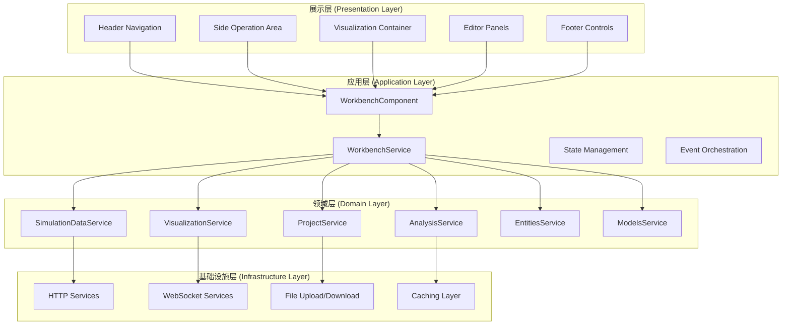

### 2. 组件协调与编排模式

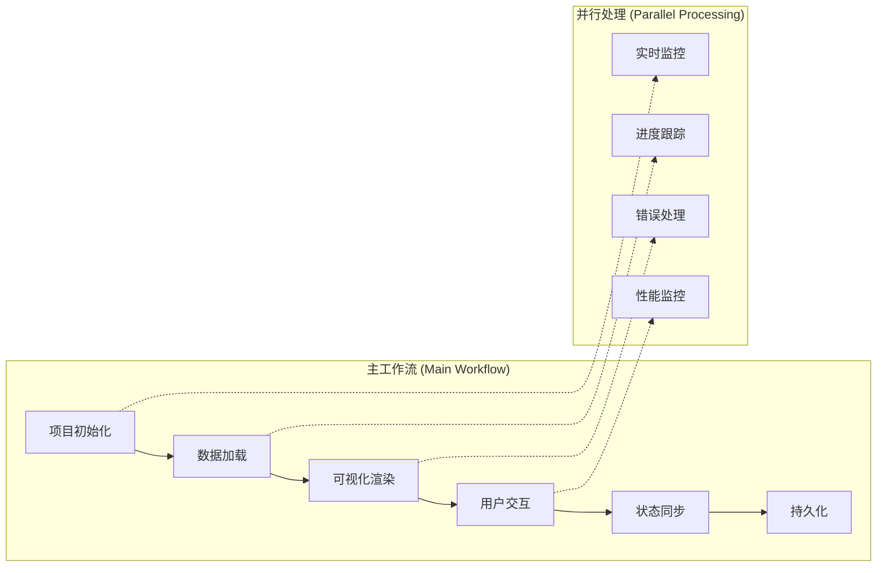

## 详细架构分析

### 1. 状态管理架构

Workbench 采用了**多层次状态管理**策略，结合了 Angular Signals 和传统的服务注入模式：

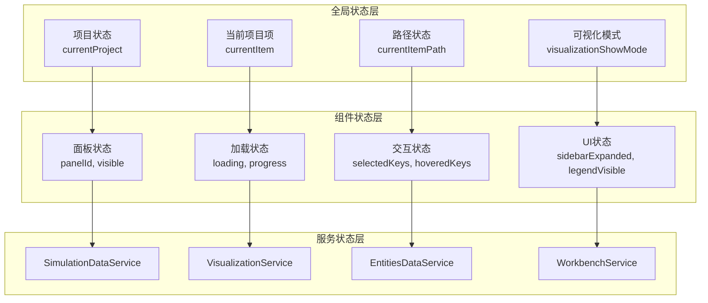

**关键设计模式：**
- **Signal-Based Reactivity**: 使用 Angular Signals 实现细粒度的响应式更新
- **Computed Values**: 大量使用 computed() 进行派生状态计算
- **Effect-Driven Side Effects**: 通过 effect() 处理副作用和数据同步

### 2. 服务层架构设计

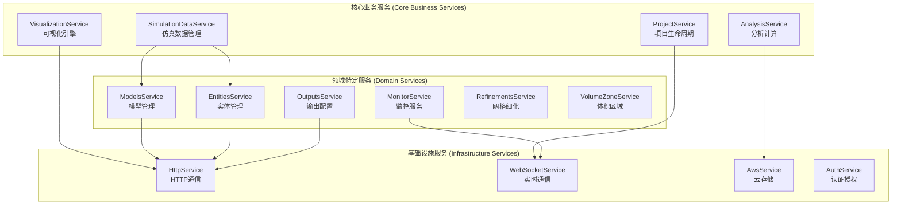

### 3. 数据流架构

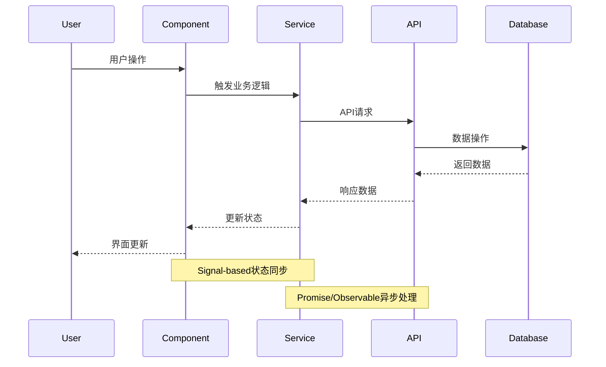

### 4. 组件生命周期管理

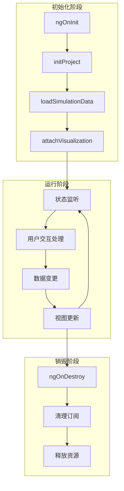

## 架构设计模式分析

### 1. 微前端架构特征

虽然是单体应用，但 Workbench 体现了微前端的设计理念：

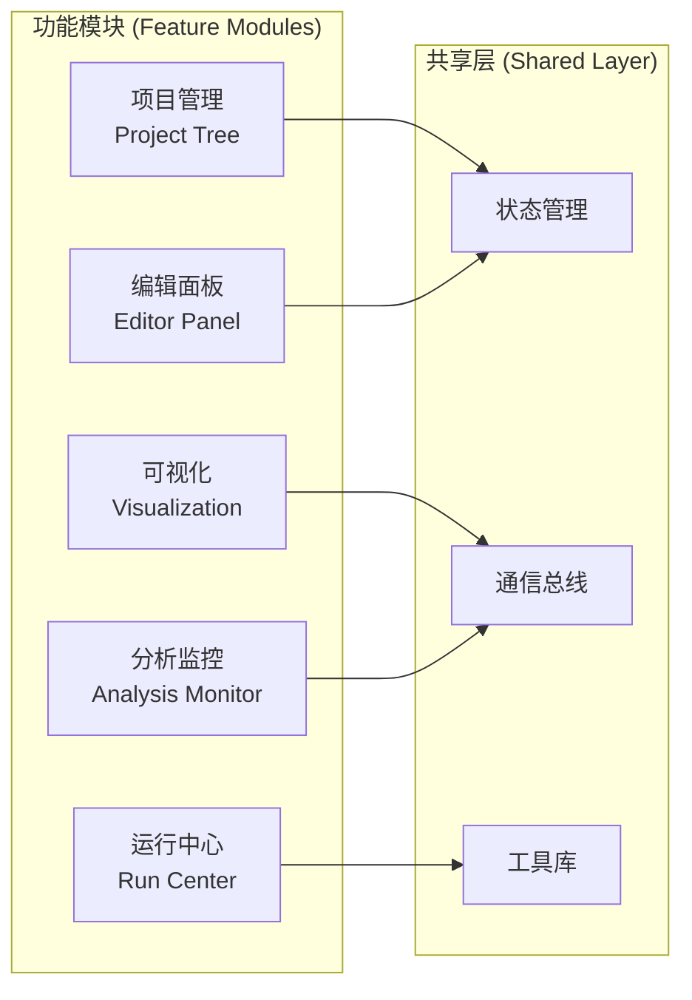

### 2. 事件驱动架构

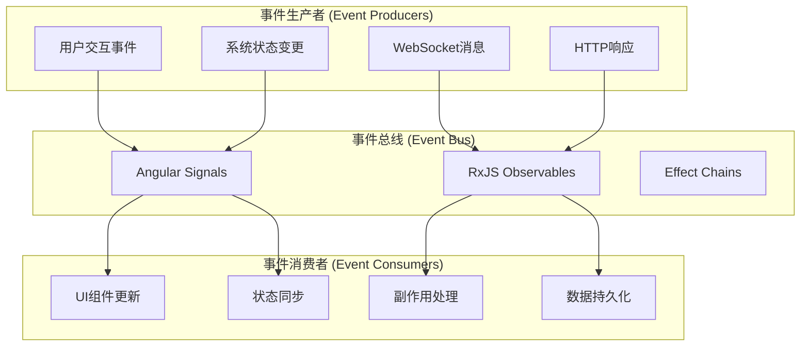

### 3. 依赖注入架构

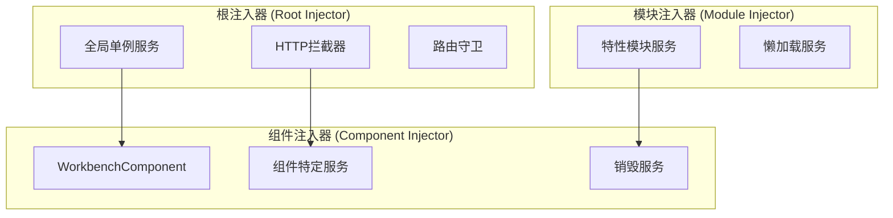

## 架构优势分析

### 1. 可扩展性 (Scalability)

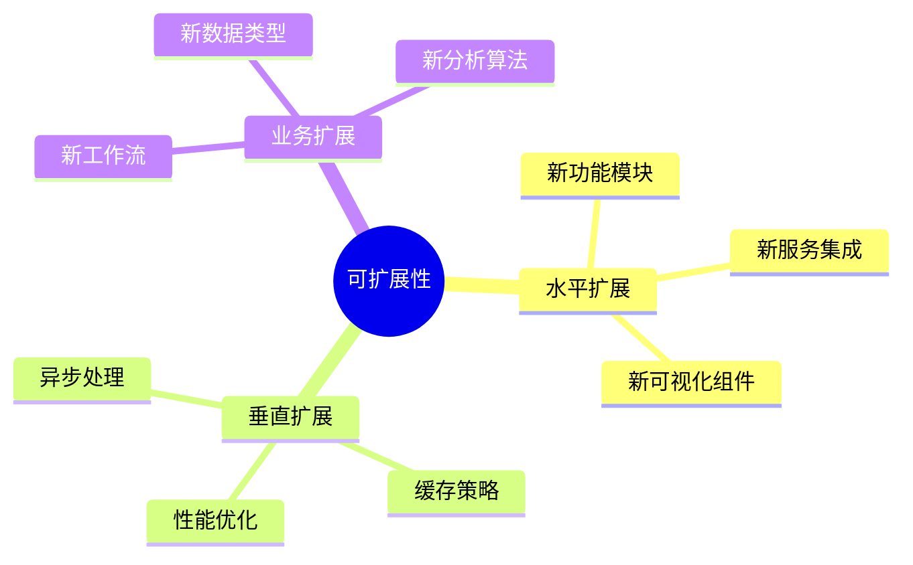

**优势特点：**
- **模块化设计**: 每个功能域都有独立的服务和组件
- **插件化架构**: 新功能可以通过服务注入无缝集成
- **配置驱动**: 通过配置文件和Schema驱动功能扩展

### 2. 维护性 (Maintainability)

- **关注点分离**: 业务逻辑、UI逻辑、数据逻辑清晰分离
- **统一的错误处理**: 集中式错误处理和用户反馈机制
- **代码复用**: 大量可复用组件和服务
- **类型安全**: TypeScript提供强类型保证

### 3. 性能优化 (Performance)

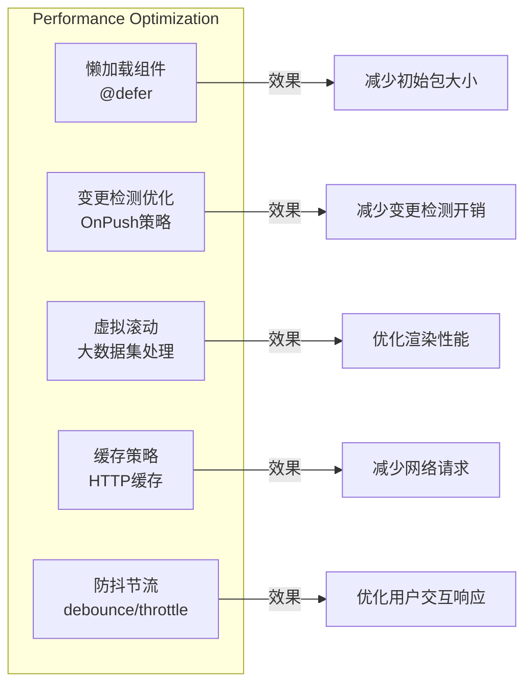

## 架构挑战与权衡

### 1. 复杂性管理

**挑战:**
- 大量的服务依赖关系
- 复杂的状态管理逻辑
- 多层抽象导致的理解难度

**解决方案:**
- 清晰的架构分层
- 完善的类型定义
- 详细的文档和注释

### 2. 性能vs功能权衡

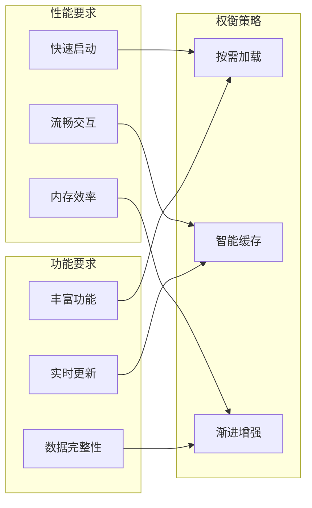

### 3. 状态一致性

**挑战:**
- 多个数据源的状态同步
- 实时数据与本地状态的一致性
- 并发操作的处理

**解决方案:**
- 使用 Signals 实现细粒度响应式更新
- 实现乐观更新和回滚机制
- 通过 Effect 处理副作用和数据同步

## 技术债务与改进建议

### 1. 短期改进

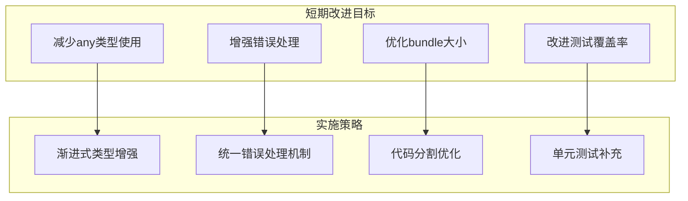

### 2. 长期架构演进

- **微前端改造**: 考虑将大型功能模块拆分为独立的微前端应用
- **状态管理升级**: 引入更专业的状态管理解决方案
- **性能监控**: 建立完善的性能监控和分析体系
- **API设计优化**: 向GraphQL或更RESTful的API设计演进

## 核心服务功能分析

基于对Workbench相关服务的深度分析，以下是各个核心服务的功能概括：

### 1. SimulationDataService - 仿真数据管理核心

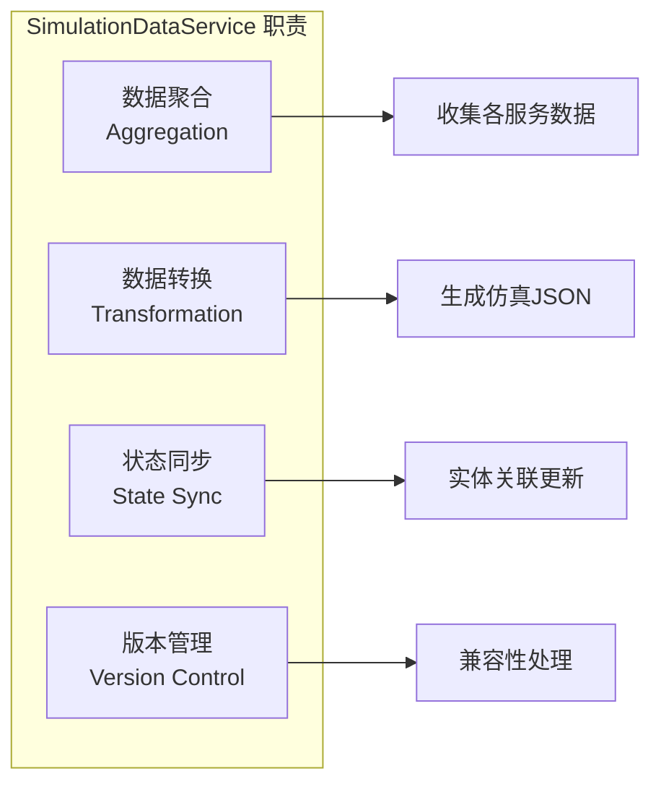

**核心功能：**
- **数据聚合中心**: 整合来自ModelsService、RefinementsService、OutputsService等的数据
- **JSON生成**: 生成完整的仿真配置JSON，包含网格、模型、输出等所有配置
- **实体管理**: 处理stored_entities的更新和关联，确保几何实体引用的正确性
- **版本兼容**: 通过triggerFormUpdateFields处理不同版本间的数据兼容性

### 2. ModelsService - 物理模型管理

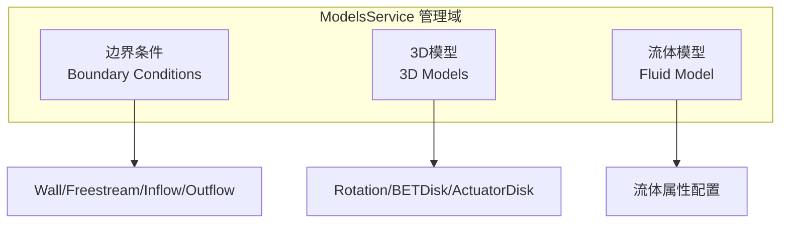

**核心功能：**
- **边界条件管理**: 支持7种边界条件类型（Wall、Freestream、Inflow等）
- **3D模型管理**: 处理旋转、BET盘、激励盘等复杂3D模型
- **流体属性**: 管理流体的物理属性和求解器配置
- **类型切换**: 提供边界条件类型的动态切换功能

### 3. EntitiesDataService - 几何实体数据管理

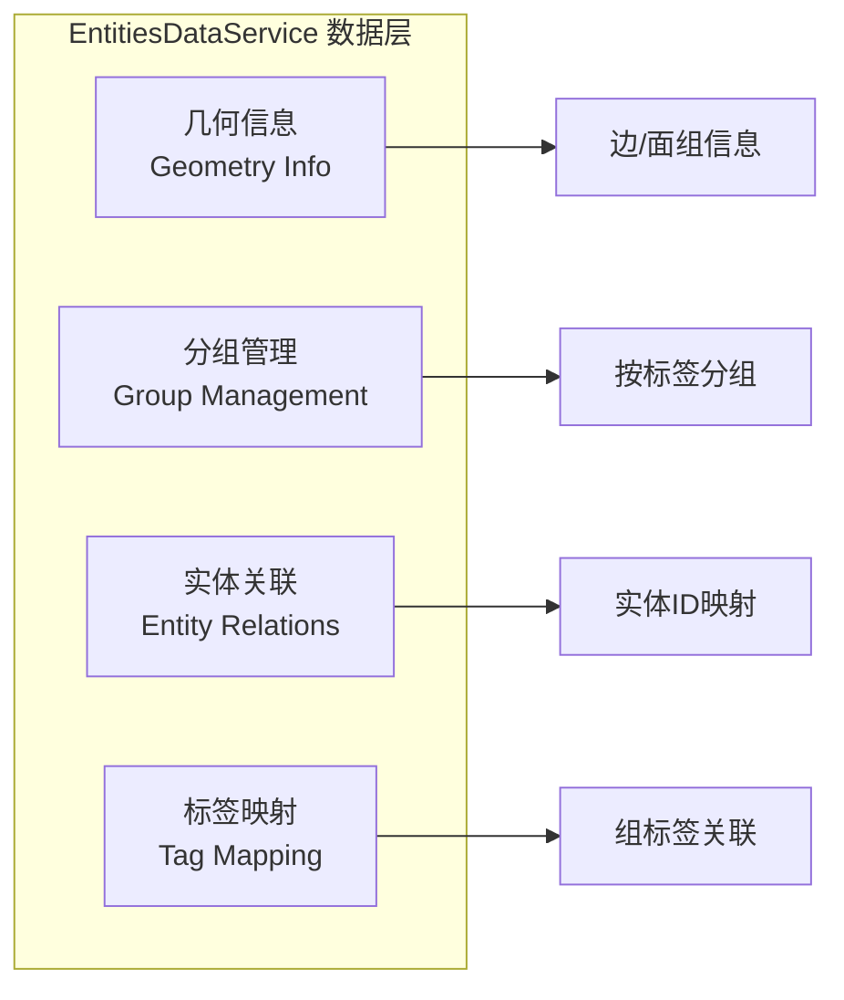

**核心功能：**
- **几何信息管理**: 处理Geometry、SurfaceMesh、VolumeMesh的实体信息
- **分组管理**: 基于边/面属性的分组和标签管理
- **实体映射**: 维护实体ID到组的映射关系
- **多类型支持**: 同时支持几何、表面网格、体网格的实体数据

### 4. OutputsService - 输出配置管理

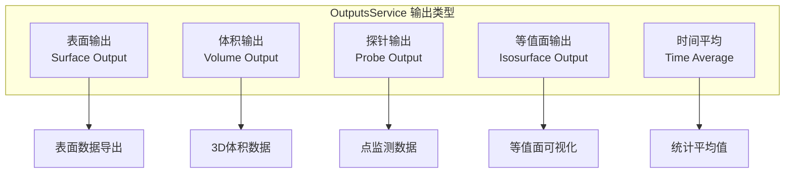

**核心功能：**
- **输出类型管理**: 支持多种CFD输出类型的配置
- **CRUD操作**: 提供输出配置的增删改查功能
- **数据格式化**: 统一输出数据的格式和结构
- **特殊处理**: 针对IsosurfaceOutput等特殊类型的数据转换

### 5. VolumeZoneService - 体积区域管理

**核心功能：**
- **Farfield管理**: 处理自动和用户定义的远场边界
- **区域配置**: 管理各种体积区域的配置参数
- **方法更新**: 处理区域计算方法的版本兼容性
- **动态操作**: 支持体积区域的动态添加、删除和复制

### 6. RefinementsService - 网格细化管理

**核心功能：**
- **细化类型**: 支持6种网格细化类型（表面边、表面、边界层等）
- **参数管理**: 管理各种细化参数的配置
- **类型映射**: 维护细化类型的显示名称映射
- **批量操作**: 支持细化配置的批量管理

### 7. MonitorService - 监控数据管理

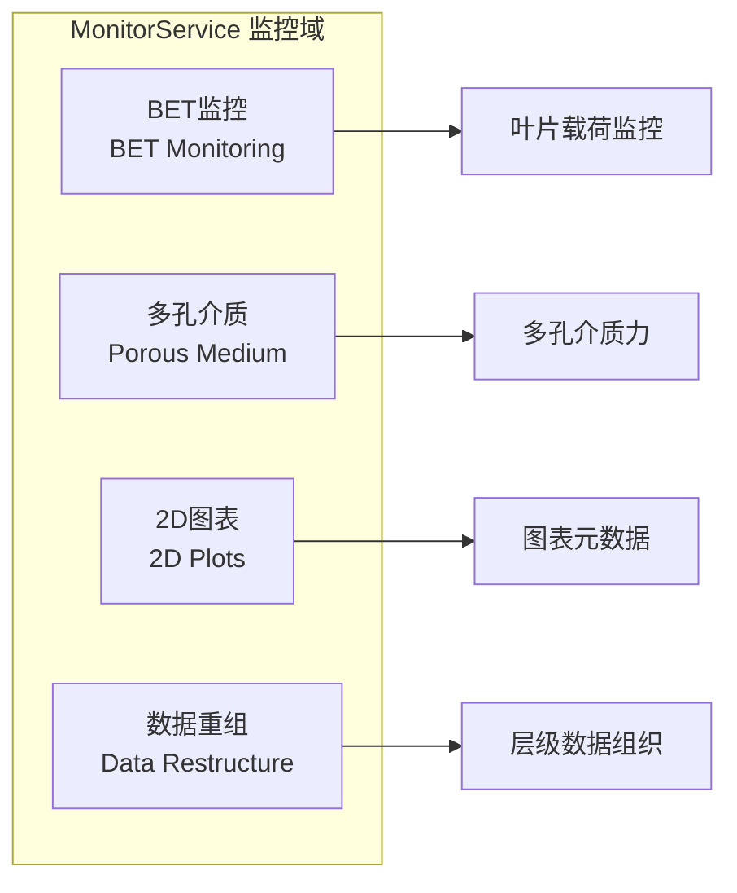

**核心功能：**
- **监控数据组织**: 将平面的监控数据重组为层级结构
- **BET专项**: 专门处理BET盘的力矩和截面载荷监控
- **图表管理**: 管理2D图表的元数据和配置
- **数据转换**: 智能重组监控数据的显示结构

## 服务间协作模式

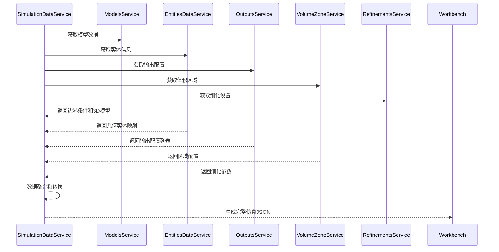

这些服务体现了**单一职责**和**高内聚低耦合**的设计原则，每个服务专注于特定的业务领域，通过SimulationDataService进行统一的数据聚合和协调。

## 总结

Flow360 Workbench 组件展现了企业级前端应用的典型架构特征：

### 架构亮点

1. **分层设计清晰**: 展示层、应用层、领域层、基础设施层职责明确
2. **状态管理先进**: 采用Angular Signals实现响应式状态管理
3. **服务编排合理**: 通过依赖注入实现松耦合的服务架构
4. **业务领域分离**: 每个服务专注特定的CFD业务领域
5. **性能优化到位**: 多种性能优化策略的综合运用

### 适用场景

这种架构特别适合于：
- **复杂业务逻辑**的企业级应用
- **实时数据处理**的专业软件
- **多用户协作**的工作台系统
- **高度可配置**的平台级产品
- **领域专业化**的科学计算软件

Workbench 的架构设计为 Flow360 平台的可扩展性和维护性奠定了坚实基础，是现代前端架构设计的优秀实践案例。特别是其服务层的设计，充分体现了领域驱动设计（DDD）的思想，将复杂的CFD业务逻辑合理分解为多个专业化的服务模块。
