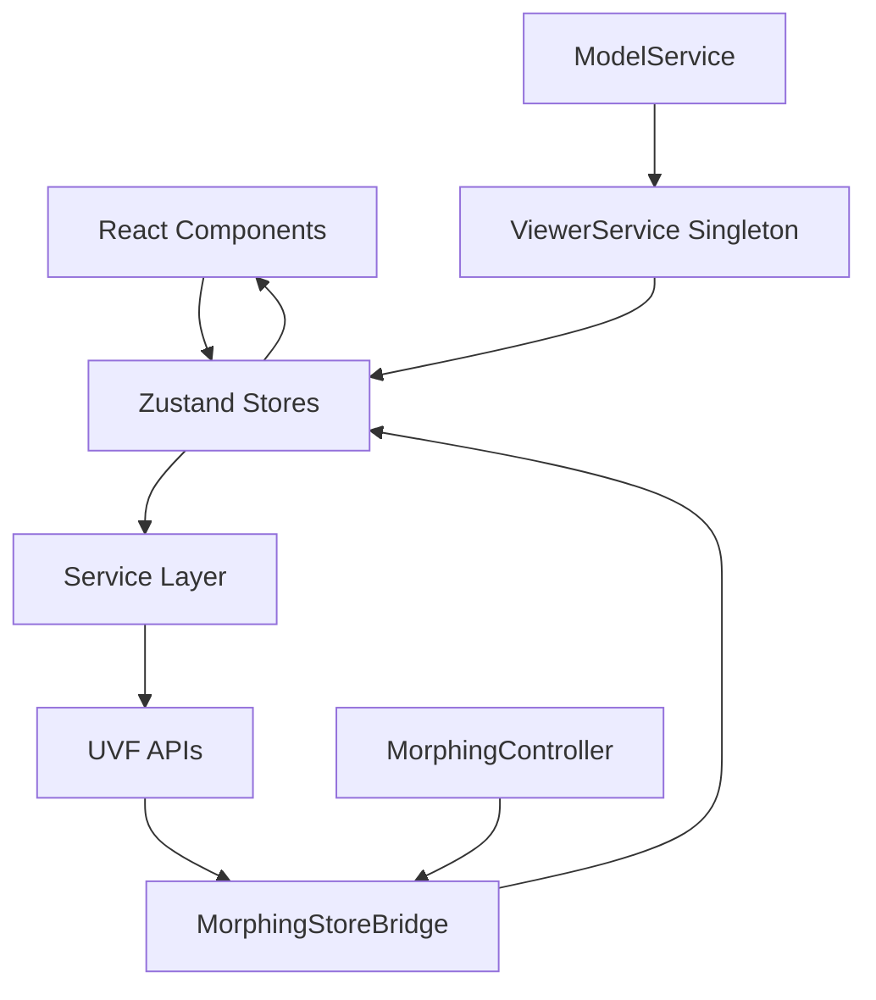
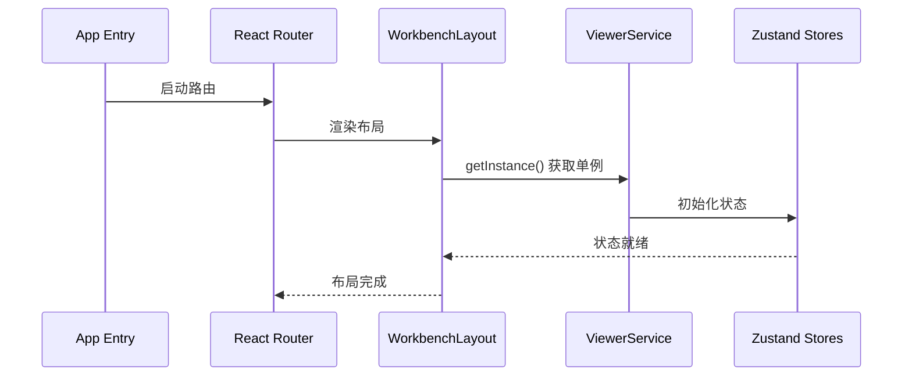
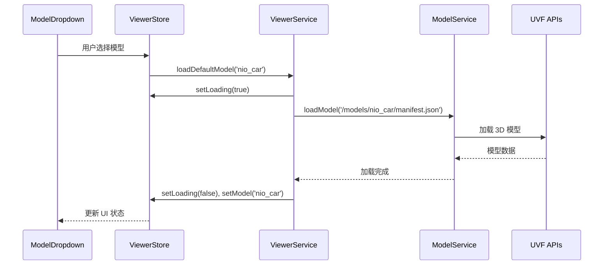
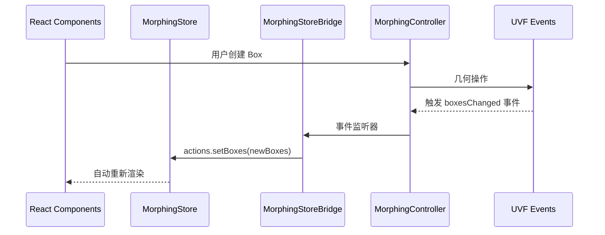
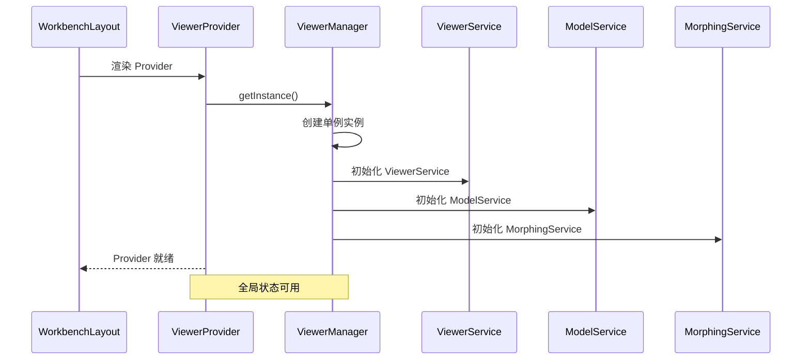
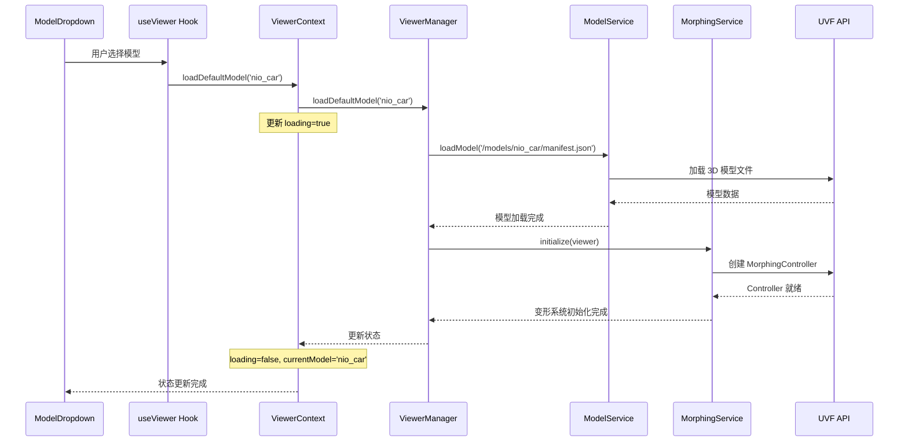
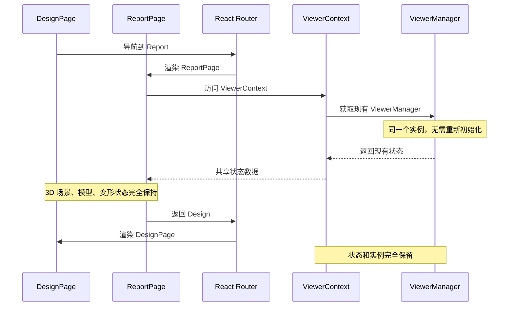
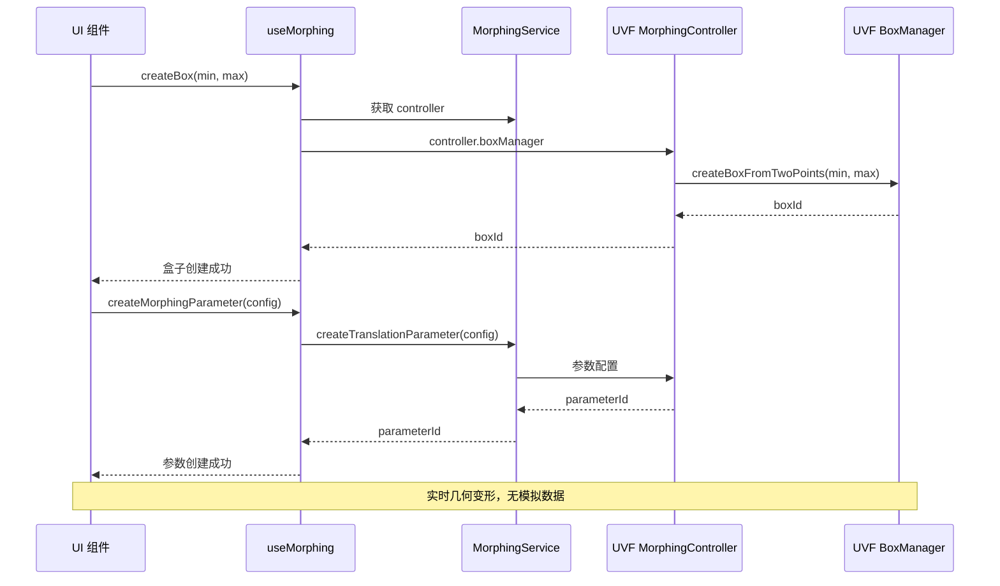
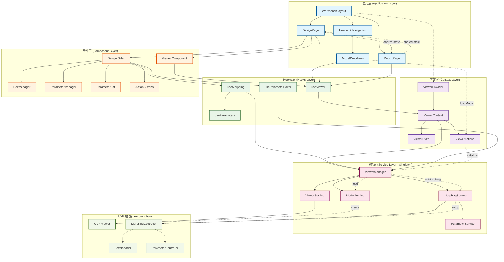

# Flow360 Physics 项目解读

## 一、项目概述

Flow360 Physics 是一个基于 React + UVF 的 3D 可视化与几何变形应用，主要用于汽车模型的 3D 渲染和几何参数化变形操作。

### 核心技术栈
- **前端框架**：React 18、TypeScript、React Router DOM 6
- **UI 组件库**：Ant Design 5.13、@ant-design/icons
- **3D 引擎**：@flexcompute/uvf 1.14（UVF 统一可视化框架）
- **构建工具**：Rsbuild（基于 Rspack）
- **样式方案**：Less + Tailwind CSS
- **状态管理**：Zustand + 自定义服务层
- **包管理器**：pnpm

### 核心特性
- ✅ **单例服务架构** - ViewerService 全局单例管理
- ✅ **Zustand 状态管理** - 响应式数据流
- ✅ **真实 UVF API 集成** - 直接使用 MorphingController
- ✅ **跨页面状态保持** - Design/Report 页面无缝切换
- ✅ **类型安全开发** - 完整 TypeScript 类型定义
- ✅ **参数化几何变形** - 实时几何参数调整
- ✅ **模块化架构设计** - 清晰的分层与服务解耦

## 二、架构设计

### 2.1 整体架构图

```
┌─────────────────────────────────────────────────────────────┐
│                      Flow360 Physics                        │
├─────────────────────────────────────────────────────────────┤
│  UI Layer (React Components)                               │
│  ├── WorkbenchLayout (Header + Navigation)                 │
│  ├── DesignPage (Sider + Viewer + Tools)                  │
│  ├── ReportPage (Viewer + Visualization Controls)         │
│  └── Shared Components (ModelDropdown, Logo, etc.)        │
├─────────────────────────────────────────────────────────────┤
│  State Layer (Zustand Stores)                             │
│  ├── viewerStore.ts (Viewer UI State)                     │
│  ├── morphingStore.ts (Morphing UI State)                 │
│  └── Auto-sync with Service Layer                         │
├─────────────────────────────────────────────────────────────┤
│  Service Layer (Business Logic)                           │
│  ├── ViewerService (Singleton - 3D Rendering)             │
│  ├── ModelService (Model Loading)                         │
│  ├── MorphingStoreBridge (State Sync)                     │
│  └── Resource Management                                   │
├─────────────────────────────────────────────────────────────┤
│  UVF Integration                                           │
│  ├── ThreeViewer (3D Rendering Engine)                    │
│  ├── MorphingController (Geometry Deformation)            │
│  └── Model Loading & Resource Management                   │
└─────────────────────────────────────────────────────────────┘
```

### 2.2 数据流设计



## 三、核心代码解读

### 3.1 应用入口与路由

`src/index.tsx` - 应用入口，配置暗色主题：

```typescript
import { ConfigProvider, theme } from 'antd';
import { flow360PhysicsTheme } from './styles/theme';

root.render(
  <ConfigProvider
    theme={{
      ...flow360PhysicsTheme,
      algorithm: theme.darkAlgorithm, // Dark mode
    }}
  >
    <AppRouter />
  </ConfigProvider>
);
```

`src/router/index.tsx` - 路由配置，支持懒加载：

```typescript
const AppRouter: React.FC = () => {
  return (
    <Router>
      <Suspense fallback={<Spin spinning={true} delay={500} />}>
        <Routes>
          <Route path="/" element={<HomePage />} />
          <Route path="/startup" element={<StartupPage />} />
          <Route path="/workbench/*" element={<WorkbenchLayout />}>
            <Route path="report" element={<ReportPage />} />
            <Route path="design" element={<DesignPage />} />
          </Route>
        </Routes>
      </Suspense>
    </Router>
  );
};
```

### 3.2 Zustand 状态管理

`src/state/viewerStore.ts` - Viewer UI 状态管理：

```typescript
export interface ViewerUIState {
  isInitialized: boolean;
  isInitializing: boolean;
  isLoading: boolean;
  currentModel: string | null;
  loadingProgress: string;
  error?: string;
  viewerService: ViewerService;
  nioCarMaterialsEnabled: boolean;
}

export const useViewerStore = create<ViewerStore>(() => ({
  isInitialized: false,
  isInitializing: false,
  isLoading: false,
  currentModel: null,
  loadingProgress: '',
  viewerService: ViewerService.getInstance(), // 单例注入
  nioCarMaterialsEnabled: false,
  // ... actions
}));
```

`src/state/morphingStore.ts` - Morphing UI 状态管理：

```typescript
export interface MorphingUIState {
  morphingController: MorphingController | null;
  isInitialized: boolean;
  isLoading: boolean;
  isDeforming: boolean;
  boxes: MorphingBox[];
  loadedBoxIds: number[];
  selectedEntityIds: number[];
  selectedBoxIds: number[];
  interactionMode: 'select' | 'createBox' | 'splitBox';
  selectionMode: 'point' | 'edge' | 'box';
  transformMode: 'none' | 'translate' | 'rotate' | 'scale';
  activeParameterId?: string;
  parameters: Array<MorphingParameter>;
  constraints: Array<{
    id: string;
    type: string;
    enabled: boolean;
  }>;
}
```

### 3.3 ViewerService - 核心服务层

`src/services/viewer/ViewerService.ts` - 单例服务管理器：

```typescript
export class ViewerService {
  private static _instance: ViewerService | null = null;
  
  static getInstance(): ViewerService {
    if (!ViewerService._instance) {
      ViewerService._instance = new ViewerService();
    }
    return ViewerService._instance;
  }

  // Core properties
  public viewerInstance: AnyThreeViewer | null = null;
  public morphingController: MorphingController | null = null;
  private modelService: ModelService;
  private morphingBridge: MorphingStoreBridge | null = null;

  // 关键方法
  async initializeViewer(container: HTMLElement): Promise<void>
  async loadModel(manifestPath: string): Promise<void>
  async loadDefaultModel(modelType: string): Promise<void>
  async toggleNioCarMaterials(): Promise<void>
  dispose(): void
}
```

**设计亮点**：
- 单例模式确保全局唯一实例
- 封装 UVF ThreeViewer 和 MorphingController
- 集成 ModelService 处理模型加载
- 通过 MorphingStoreBridge 自动同步状态

### 3.4 MorphingStoreBridge - 状态同步桥

`src/services/viewer/MorphingStoreBridge.ts` - 自动状态同步：

```typescript
export class MorphingStoreBridge {
  constructor(
    private morphingController: MorphingController,
    private store: MorphingStore
  ) {
    this.setupEventListeners();
  }

  private setupEventListeners(): void {
    // 监听 UVF 事件，自动更新 Zustand store
    this.morphingController.addEventListener('boxesChanged', () => {
      this.syncBoxes();
    });
    
    this.morphingController.addEventListener('selectionChanged', () => {
      this.syncSelection();
    });
  }

  private syncBoxes(): void {
    const boxes = this.morphingController.boxes || [];
    this.store.actions.setBoxes(boxes);
  }
}
```

### 3.5 WorkbenchLayout - 主布局

`src/pages/workbench/index.tsx` - 主工作台布局：

```typescript
const WorkbenchLayout: React.FC = () => {
  const location = useLocation();
  const navigate = useNavigate();
  const active = location.pathname.includes('/design') ? 'design' : 'report';

  return (
    <Layout className="workbench-root">
      <Header className="workbench-header">
        <div className="workbench-header-left">
          <LogoIcon />
          <ModelDropdown />
        </div>
        <div className="flex gap-[24px] cursor-pointer">
          <div className={active === 'report' ? 'workbench-content-active' : ''}>
            Report
          </div>
          <div className={active === 'design' ? 'workbench-content-active' : ''}>
            Design
          </div>
        </div>
        <div className="workbench-header-right">
          {/* Actions */}
        </div>
      </Header>
      <Outlet /> {/* DesignPage or ReportPage */}
    </Layout>
  );
};
```

## 四、数据流分析

### 4.1 应用初始化流程



### 4.2 模型加载流程



### 4.3 Morphing 状态同步流程



## 五、关键特性实现

### 5.1 单例模式确保资源唯一性

```typescript
// ViewerService 单例
export class ViewerService {
  private static _instance: ViewerService | null = null;
  
  static getInstance(): ViewerService {
    if (!ViewerService._instance) {
      ViewerService._instance = new ViewerService();
    }
    return ViewerService._instance;
  }
  
  static resetInstance(): void {
    if (ViewerService._instance) {
      ViewerService._instance.dispose();
      ViewerService._instance = null;
    }
  }
}
```

### 5.2 Zustand 响应式状态管理

```typescript
// 状态订阅与更新
const useViewer = () => {
  const store = useViewerStore();
  const { viewerService } = store;
  
  const initializeViewer = async (container: HTMLElement) => {
    store.actions.setInitializing(true);
    await viewerService.initializeViewer(container);
    store.actions.setInitialized();
  };
  
  return { ...store, initializeViewer };
};
```

### 5.3 跨页面状态保持

由于使用单例 ViewerService 和全局 Zustand stores，在 Design 和 Report 页面之间切换时：

- 3D Viewer 实例保持不变
- 模型数据完全保留
- Morphing 状态持续存在
- 无需重新初始化

### 5.4 自动状态同步机制

```typescript
// MorphingStoreBridge 自动同步 UVF 状态到 Zustand
export class MorphingStoreBridge {
  private setupEventListeners(): void {
    this.morphingController.addEventListener('boxesChanged', () => {
      this.syncBoxes();
    });
    
    this.morphingController.addEventListener('selectionChanged', () => {
      this.syncSelection();
    });
    
    this.morphingController.addEventListener('parametersChanged', () => {
      this.syncParameters();
    });
  }
}
```

## 六、技术亮点

### 6.1 现代化状态管理
- **Zustand**: 轻量级、TypeScript 友好的状态管理
- **自动同步**: MorphingStoreBridge 实现 UVF ↔ React 状态自动同步
- **单向数据流**: UI → Actions → Store → UI

### 6.2 企业级架构设计
- **分层架构**: UI Layer → State Layer → Service Layer → UVF APIs
- **单例模式**: 确保 ViewerService 全局唯一
- **桥接模式**: MorphingStoreBridge 解耦 UVF 与 React 状态

### 6.3 真实 API 集成
- 直接使用 `@flexcompute/uvf` 的 MorphingController
- 无模拟数据，生产级几何变形功能
- 完整的类型定义支持

### 6.4 性能优化
- **懒加载路由**: React.lazy() 实现页面级代码分割
- **单例资源管理**: 避免重复创建 3D 渲染实例
- **状态持久化**: 跨页面切换无需重新加载

## 七、项目结构详细分析

### 7.1 目录结构解读

```
src/
├── assets/                    # 静态资源
│   ├── favicon-dark.ico      # 暗色图标
│   ├── favicon-light.ico     # 亮色图标
│   ├── logo.svg              # Logo
│   ├── fonts/                # 字体文件
│   └── images/               # 图片资源
├── components/               # 共享组件
│   ├── logo/                 # Logo 组件
│   └── material-toggle/      # 材质切换组件
├── pages/                    # 页面组件
│   ├── home/                 # 首页
│   ├── startup/              # 启动页
│   │   └── components/       # 启动页组件
│   │       ├── select-existing-modal/  # 选择现有项目模态框
│   │       └── upload-mesh-modal/      # 上传网格模态框
│   └── workbench/            # 工作台页面
│       ├── design-page.tsx   # 设计页面
│       ├── report-page.tsx   # 报告页面
│       ├── index.tsx         # 工作台布局
│       └── components/       # 工作台组件
│           ├── design/       # 设计相关组件
│           │   ├── index.tsx # 设计主组件
│           │   ├── content/  # 设计内容区
│           │   └── sider/    # 设计侧边栏
│           │       ├── components/     # 侧边栏子组件
│           │       │   ├── ActionButtons.tsx      # 操作按钮
│           │       │   ├── BoxManager.tsx         # 盒子管理器
│           │       │   ├── ModelSelector.tsx     # 模型选择器
│           │       │   ├── ParameterEditForm.tsx # 参数编辑表单
│           │       │   ├── ParameterItem.tsx     # 参数项
│           │       │   └── ParameterList.tsx     # 参数列表
│           │       └── hooks/          # 侧边栏钩子
│           │           ├── useBoxManager.ts       # 盒子管理钩子
│           │           ├── useParameterEditor.ts  # 参数编辑钩子
│           │           └── useParameterList.ts    # 参数列表钩子
│           ├── model-dropdown/  # 模型下拉选择
│           ├── report/         # 报告组件
│           ├── viewer/         # 3D 查看器组件
│           └── visualization-list/  # 可视化列表
├── router/                   # 路由配置
├── services/                 # 服务层
│   ├── index.ts             # 服务导出
│   └── viewer/              # 查看器服务
│       ├── getResource.ts   # 资源获取
│       ├── getResource.test.ts # 资源获取测试
│       ├── ModelService.ts  # 模型服务
│       ├── MorphingStoreBridge.ts # 状态同步桥
│       ├── types.ts         # 类型定义
│       └── ViewerService.ts # 查看器服务
├── state/                   # 状态管理
│   ├── morphingStore.ts     # 变形状态
│   └── viewerStore.ts       # 查看器状态
├── styles/                  # 样式文件
│   ├── tailwind.css         # Tailwind CSS
│   ├── theme.less           # 主题样式
│   └── theme.ts             # 主题配置
├── types/                   # 类型定义
│   ├── images.d.ts          # 图片类型
│   └── svg.d.ts             # SVG 类型
└── utils/                   # 工具函数
    └── nioCarUtils.ts       # NIO 汽车工具
```

### 7.2 核心页面组件

#### 7.2.1 WorkbenchLayout 主布局

`src/pages/workbench/index.tsx` - 工作台主布局：

```typescript
const WorkbenchLayout: React.FC = () => {
  const location = useLocation();
  const navigate = useNavigate();
  const active = location.pathname.includes('/design') ? 'design' : 'report';

  return (
    <Layout className="workbench-root">
      <Header className="workbench-header">
        <div className="workbench-header-left">
          <LogoIcon />
          <ModelDropdown />  {/* 模型选择下拉框 */}
        </div>
        <div className="flex gap-[24px] cursor-pointer">
          {/* Design/Report 切换导航 */}
          <div className={active === 'report' ? 'workbench-content-active' : ''}>
            Report
          </div>
          <div className={active === 'design' ? 'workbench-content-active' : ''}>
            Design
          </div>
        </div>
        <div className="workbench-header-right">
          {/* 操作按钮区域 */}
        </div>
      </Header>
      <Outlet /> {/* 子路由出口：DesignPage 或 ReportPage */}
    </Layout>
  );
};
```

#### 7.2.2 DesignPage 设计页面

`src/pages/workbench/design-page.tsx` - 设计模式页面：

```typescript
const DesignPage: React.FC = () => {
  return (
    <Layout className="design-page">
      <DesignComponent />  {/* 设计主组件 */}
    </Layout>
  );
};
```

#### 7.2.3 ReportPage 报告页面

`src/pages/workbench/report-page.tsx` - 报告模式页面：

```typescript
const ReportPage: React.FC = () => {
  return (
    <Layout className="report-page">
      <ReportComponent />  {/* 报告主组件 */}
    </Layout>
  );
};
```

### 7.3 设计模式组件结构

#### 7.3.1 Design 主组件

`src/pages/workbench/components/design/index.tsx`:

```typescript
const DesignComponent: React.FC = () => {
  return (
    <Layout className="design-layout">
      <Sider className="design-sider">
        <DesignSider />  {/* 设计侧边栏 */}
      </Sider>
      <Layout>
        <Content className="design-content">
          <DesignContent />  {/* 设计内容区 */}
        </Content>
      </Layout>
    </Layout>
  );
};
```

#### 7.3.2 DesignSider 侧边栏

`src/pages/workbench/components/design/sider/index.tsx` - 包含所有设计工具：

- **ActionButtons**: 操作按钮（创建盒子、拆分盒子等）
- **BoxManager**: 盒子管理器（显示、编辑变形盒子）
- **ModelSelector**: 模型选择器
- **ParameterEditForm**: 参数编辑表单
- **ParameterList**: 参数列表显示

#### 7.3.3 DesignContent 内容区

`src/pages/workbench/components/design/content/index.tsx` - 主要包含 3D 查看器：

```typescript
const DesignContent: React.FC = () => {
  return (
    <div className="design-content">
      <ViewerComponent />  {/* 3D 查看器 */}
    </div>
  );
};
```

### 7.4 报告模式组件结构

#### 7.4.1 Report 主组件

`src/pages/workbench/components/report/index.tsx`:

```typescript
const ReportComponent: React.FC = () => {
  return (
    <Layout className="report-layout">
      <Sider className="report-sider">
        <VisualizationList />  {/* 可视化选项列表 */}
      </Sider>
      <Layout>
        <Content className="report-content">
          <ViewerComponent />  {/* 共享的 3D 查看器 */}
        </Content>
      </Layout>
    </Layout>
  );
};
```

#### 7.4.2 VisualizationList 可视化列表

`src/pages/workbench/components/visualization-list/index.tsx` - 可视化选项管理：

```typescript
const VisualizationList: React.FC = () => {
  const [selectedItem, setSelectedItem] = useState<string>('pressure-coefficient');
  
  const visualizationGroups = [
    {
      key: 'surface',
      title: 'Surface visualization',
      items: [
        { key: 'pressure-coefficient', label: 'Pressure coefficient (Cp)' },
        { key: 'pressure-gradient', label: 'Pressure gradient' },
        { key: 'wall-shear-stress', label: 'Wall shear stress' },
      ],
    },
    {
      key: 'slice',
      title: 'Slice visualization',
      items: [{ key: 'velocity', label: 'Velocity' }],
    },
    // ... 更多可视化组
  ];

  // 单选模式实现
  const handleItemClick = (itemKey: string) => {
    setSelectedItem(itemKey);
  };
};
```

### 7.5 共享组件

#### 7.5.1 ViewerComponent 3D 查看器

`src/pages/workbench/components/viewer/index.tsx` - 在设计和报告页面间共享：

```typescript
const ViewerComponent: React.FC = () => {
  const containerRef = useRef<HTMLDivElement>(null);
  const { isInitialized, viewerService } = useViewerStore();

  useEffect(() => {
    if (containerRef.current && !isInitialized) {
      viewerService.initializeViewer(containerRef.current);
    }
  }, []);

  return (
    <div ref={containerRef} className="viewer-container" />
  );
};
```

#### 7.5.2 ModelDropdown 模型选择器

`src/pages/workbench/components/model-dropdown/index.tsx`:

```typescript
const ModelDropdown: React.FC = () => {
  const { currentModel, viewerService } = useViewerStore();
  
  const handleModelChange = async (modelType: string) => {
    await viewerService.loadDefaultModel(modelType);
  };

  return (
    <Dropdown menu={{ onClick: ({ key }) => handleModelChange(key) }}>
      <Button>{currentModel || 'Select Model'}</Button>
    </Dropdown>
  );
};
```

### 7.6 状态管理钩子

#### 7.6.1 设计模式钩子

- **useBoxManager**: 管理变形盒子的创建、编辑、删除
- **useParameterEditor**: 处理参数的编辑和约束设置
- **useParameterList**: 管理参数列表的显示和筛选

#### 7.6.2 通用钩子

- **useViewerStore**: 访问全局查看器状态
- **useMorphingStore**: 访问变形相关状态

## 八、设计模式应用

### 8.1 单例模式 (Singleton Pattern)
- **ViewerService**: 确保全局唯一 3D 渲染实例
- **ModelService**: 统一模型加载管理
- **优势**: 避免资源冲突，内存优化，状态一致性

### 8.2 桥接模式 (Bridge Pattern)
- **MorphingStoreBridge**: 连接 UVF API 与 React 状态
- **优势**: 解耦 UVF 底层实现与 React 组件状态

### 8.3 观察者模式 (Observer Pattern)
- **Zustand Stores**: 响应式状态更新
- **UVF Event Listeners**: 自动同步 3D 引擎状态
- **优势**: 自动化状态同步，减少手动更新

### 8.4 组合模式 (Composition Pattern)
- **页面组件组合**: Layout → Sider + Content
- **功能组件组合**: 设计工具的模块化组合
- **优势**: 灵活的组件复用和布局调整

## 九、开发最佳实践

### 9.1 TypeScript 类型安全
- 完整的 UVF API 类型定义
- 严格的接口约束
- 编译时错误检查

### 9.2 模块化设计
- 清晰的目录结构
- 单一职责原则
- 松耦合高内聚

### 9.3 性能优化策略
- 懒加载路由
- 单例资源管理
- 状态最小化原则

### 9.4 错误处理
- 服务层异常捕获
- UI 友好的错误提示
- 状态重置机制

这个项目展现了现代前端架构的最佳实践，通过合理的分层设计、状态管理和组件组合，实现了一个高性能、可维护的 3D 可视化应用。
  const location = useLocation();
  const navigate = useNavigate();
  const active = location.pathname.includes('/design') ? 'design' : 'report';

  return (
    <ViewerProvider>  {/* 关键：ViewerProvider 包裹整个布局 */}
      <Layout className="workbench-root">
        <Header className="workbench-header">
          <LogoIcon />
          <ModelDropdown />  {/* 模型选择下拉框 */}
          <Navigation />     {/* Design/Report 导航 */}
        </Header>
        <Outlet />  {/* 子路由出口：DesignPage 或 ReportPage */}
      </Layout>
    </ViewerProvider>
  );
};
```

**架构要点**：
- ViewerProvider 包裹确保所有子组件可访问全局状态
- 使用 React Router 实现页面路由
- Header 固定，内容区域动态切换

### 3.5 ModelDropdown - 模型选择器

`src/pages/workbench/components/model-dropdown/index.tsx` 控制模型加载：

```typescript
const ModelDropdown: React.FC = () => {
  const { actions } = useViewer();
  const [modelLabel, setModelLabel] = useState<string>('nio car');

  const menu_props: MenuProps = {
    onClick: async ({ key }) => {
      const found = items.find((i) => i.key === key);
      if (found) {
        setModelLabel(found.label);
        await actions.loadDefaultModel(found.modelType);  // 调用全局方法
      }
    },
  };
};
```

**设计思路**：
- 通过 `useViewer()` 获取全局操作方法
- 直接调用 `loadDefaultModel` 触发模型切换
- UI 状态与全局状态自动同步

## 四、数据流分析

### 4.1 应用初始化流程



### 4.2 模型加载流程



### 4.3 跨页面状态共享



### 4.4 几何变形操作流程



## 五、关键设计模式

### 5.1 单例模式 (Singleton Pattern)
- **ViewerManager**: 确保全局唯一 3D 渲染实例
- **好处**: 避免资源冲突，内存优化，状态一致性

### 5.2 上下文模式 (Context Pattern)  
- **ViewerContext**: 全局状态管理与依赖注入
- **好处**: 避免 prop drilling，组件解耦

### 5.3 自定义 Hook 模式
- **useViewer**, **useMorphing**: 业务逻辑封装
- **好处**: 逻辑复用，组件简化，类型安全

### 5.4 服务层模式 (Service Layer)
- **ViewerService**, **ModelService**, **MorphingService**: 业务逻辑分离
- **好处**: 职责清晰，易于测试，可维护性高

## 六、技术亮点

### 6.1 真实 API 集成
- 直接使用 `@flexcompute/uvf` 的 MorphingController
- 无模拟数据，生产级几何变形功能
- 完整的类型定义支持

### 6.2 跨页面状态保持
- Design 和 Report 页面共享同一 Viewer 实例
- 模型、变形状态、相机视角完全保持
- 无需重新初始化，性能优化

### 6.3 类型安全开发
- 完整的 TypeScript 类型定义
- 编译时错误检测
- 优秀的开发体验和 IntelliSense 支持

### 6.4 模块化架构
- 清晰的分层结构
- 服务解耦，职责单一
- 易于扩展和维护

这个架构设计非常适合复杂的 3D 可视化应用，提供了良好的开发体验和用户体验。

### 系统分层图




# Flow360 Physics 项目引用库详细说明

## 🎯 核心依赖库分析

### 1. **@flexcompute/uvf** (核心 3D 引擎库)
**版本**: `1.15.0-alpha.0`  
**作用**: Flexcompute 公司自研的统一可视化框架，专门用于 3D 模型渲染和几何变形

#### 主要引入的对象及作用：

```typescript
import { 
  ThreeViewer,           // 3D 场景查看器主类
  MorphingController,    // 几何变形控制器
  wait                   // 异步等待工具函数
} from '@flexcompute/uvf';

import type { 
  AnyThreeViewer,        // ThreeViewer 类型定义
  ObjectInstanceId,      // 3D 对象实例ID类型
  MorphingBox,          // 变形盒子类型
  MorphingParameter     // 变形参数类型
} from '@flexcompute/uvf';
```

**详细说明**:
- **`ThreeViewer`**: 核心 3D 渲染引擎，基于 Three.js 封装
  - 管理 3D 场景、相机、灯光
  - 处理模型加载和显示
  - 提供交互功能（选择、悬停、聚焦）
  - 渲染管线控制

- **`MorphingController`**: 几何变形系统的核心控制器
  - 管理变形盒子的创建、编辑、删除
  - 控制参数化变形操作
  - 处理用户交互模式（选择、创建盒子、拆分）
  - 实时几何变形计算

- **`wait`**: 异步操作辅助函数
  - 用于等待渲染完成
  - 避免阻塞 UI 线程
  - 确保操作的正确时序

---

### 2. **Zustand** (状态管理库)
**版本**: `^5.0.8`  
**作用**: 轻量级、TypeScript 友好的状态管理库

#### 引入的对象及作用：

```typescript
import { create } from 'zustand';

// 创建状态 store
export const useViewerStore = create<ViewerStore>(() => ({
  // 状态定义
}));
```

**详细说明**:
- **`create`**: 核心状态创建函数
  - 创建响应式状态存储
  - 自动处理状态更新和组件重渲染
  - 支持 TypeScript 类型推导
  - 比 Redux 更简洁，比 Context 性能更好

**为什么选择 Zustand**:
- 📦 **轻量**: 仅 2.6KB gzipped
- 🎯 **简单**: 无需 Provider 包裹
- ⚡ **快速**: 精确的重渲染控制
- 🔧 **灵活**: 支持中间件和持久化

---

### 3. **Ant Design** (UI 组件库)
**版本**: `^5.13.0`  
**作用**: 企业级 React UI 组件库

#### 引入的主要对象：

```typescript
import { 
  ConfigProvider,    // 全局配置提供者
  theme,            // 主题配置对象
  Layout,           // 布局组件
  Button,           // 按钮组件
  Dropdown,         // 下拉菜单
  Typography,       // 文字排版
  Spin              // 加载动画
} from 'antd';

import { 
  DownOutlined,     // 向下箭头图标
  RightOutlined,    // 向右箭头图标
  PlusOutlined      // 加号图标
} from '@ant-design/icons';
```

**详细说明**:
- **`ConfigProvider`**: 全局配置组件
  - 统一设置主题色彩
  - 配置暗色模式
  - 国际化设置

- **`theme`**: 主题系统
  - `theme.darkAlgorithm`: 暗色主题算法
  - 动态主题切换支持

- **UI 组件**: 提供一致的设计语言和交互体验

---

### 4. **React Router DOM** (路由管理)
**版本**: `^6.21.0`  
**作用**: React 应用的声明式路由库

#### 引入的对象及作用：

```typescript
import {
  BrowserRouter as Router,  // 浏览器路由器
  Routes,                   // 路由容器
  Route,                    // 单个路由
  Navigate,                 // 导航重定向
  Outlet,                   // 子路由出口
  useLocation,              // 获取当前位置
  useNavigate               // 程序化导航
} from 'react-router-dom';
```

**详细说明**:
- **`BrowserRouter`**: 使用 HTML5 history API 的路由器
- **`Routes`**: 路由匹配容器
- **`Outlet`**: 嵌套路由的子组件渲染位置
- **`useLocation`**: 获取当前路径信息
- **`useNavigate`**: 编程式导航函数

---

### 5. **Three.js** (3D 图形库)
**版本**: `^0.174.0`  
**作用**: Web 3D 图形渲染基础库

**说明**: 
- UVF 内部依赖 Three.js
- 提供 WebGL 渲染能力
- 处理 3D 数学计算
- 材质、几何体、动画系统

---

### 6. **RxJS** (响应式编程库)
**版本**: `^7.8.2`  
**作用**: 响应式扩展库，用于处理异步数据流

#### 可能的用途：
```typescript
// 示例：处理 UVF 事件流
import { fromEvent, filter, debounceTime } from 'rxjs';

// 监听 3D 场景交互事件
const selection$ = fromEvent(morphingController, 'selectionChange')
  .pipe(
    debounceTime(100),  // 防抖
    filter(event => event.selectedIds.length > 0)
  );
```

---

### 7. **ahooks** (React Hooks 工具库)
**版本**: `^3.9.0`  
**作用**: 高质量可靠的 React Hooks 库

#### 可能使用的 Hooks：
```typescript
import { 
  useRequest,      // 数据请求
  useDebounce,     // 防抖
  useThrottle,     // 节流
  usePrevious,     // 获取前一个值
  useMount,        // 组件挂载
  useUnmount       // 组件卸载
} from 'ahooks';
```

---

### 8. **type-fest** (TypeScript 工具类型)
**版本**: `^4.41.0`  
**作用**: 提供高级 TypeScript 工具类型

#### 常用类型：
```typescript
import type { 
  Simplify,        // 简化复杂类型
  PartialDeep,     // 深度可选
  RequiredDeep,    // 深度必需
  Merge            // 类型合并
} from 'type-fest';
```

---

## 🔧 开发依赖库说明

### 1. **Rsbuild** (构建工具)
**版本**: `^1.4.13`  
**作用**: 基于 Rspack 的高性能构建工具

#### 插件说明：
- **`@rsbuild/plugin-react`**: React 支持
- **`@rsbuild/plugin-less`**: Less 样式预处理
- **`@rsbuild/plugin-svgr`**: SVG 组件化

### 2. **Tailwind CSS** (原子化 CSS 框架)
**版本**: `^4.1.11`  
**作用**: 实用优先的 CSS 框架

### 3. **TypeScript & ESLint** (代码质量工具)
- **TypeScript**: 类型安全
- **ESLint**: 代码规范检查
- **Prettier**: 代码格式化

---

## 🎯 核心库的作用关系图

```mermaid
graph TD
    subgraph "UI Layer"
        React[React 19.1.1]
        AntD[Ant Design 5.13]
        Router[React Router DOM 6.21]
    end
    
    subgraph "State Management"
        Zustand[Zustand 5.0.8]
        ahooks[ahooks 3.9.0]
    end
    
    subgraph "3D Engine"
        UVF[@flexcompute/uvf 1.15.0]
        Three[Three.js 0.174.0]
    end
    
    subgraph "Utils & Types"
        RxJS[RxJS 7.8.2]
        TypeFest[type-fest 4.41.0]
        TailwindCSS[Tailwind CSS 4.1.11]
    end
    
    subgraph "Build Tools"
        Rsbuild[Rsbuild 1.4.13]
        TypeScript[TypeScript 5.9.2]
        ESLint[ESLint 9.30.0]
    end

    React --> AntD
    React --> Router
    React --> Zustand
    React --> ahooks
    
    UVF --> Three
    UVF --> RxJS
    
    Zustand --> TypeFest
    
    Rsbuild --> React
    Rsbuild --> TypeScript
    Rsbuild --> ESLint
    Rsbuild --> TailwindCSS
```

## 💡 关键设计决策

### 为什么选择这些库？

1. **@flexcompute/uvf**: 专门为物理仿真设计，支持复杂几何变形
2. **Zustand**: 相比 Redux 更轻量，相比 Context 性能更好
3. **Ant Design**: 企业级组件库，开箱即用，主题定制能力强
4. **React Router DOM v6**: 声明式路由，支持嵌套路由
5. **Rsbuild**: 比 Webpack 更快，比 Vite 更稳定的企业级构建工具

### 版本选择策略

- **React 19**: 最新版本，性能优化和并发特性
- **Ant Design 5.x**: 新架构，更好的 TypeScript 支持
- **Zustand 5.x**: 最新稳定版，API 简洁
- **UVF Alpha 版本**: 尝鲜最新的几何变形功能

这些库的组合形成了一个现代化、高性能、类型安全的 3D 可视化应用架构。
