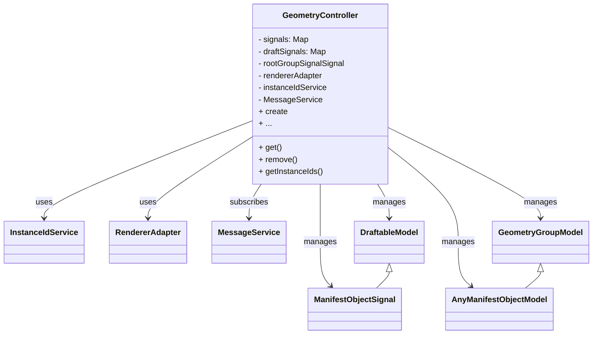

---
title: "GeometryController 架构解读"
date: 2025-08-26T10:06:32+08:00
draft: false
author: "架构师"
description: "深入分析UVF框架中GeometryController的架构设计，包括数据与信号管理、实例化与层级结构、草稿与编辑支持等核心功能"
tags: ["UVF", "架构设计", "几何控制器", "信号系统", "实例管理", "草稿系统"]
categories: ["架构分析", "UVF框架"]
keywords: ["GeometryController", "UVF", "统一可视化框架", "架构分析", "信号管理", "实例化", "草稿系统"]
weight: 100
showInHome: true
toc: true
summary: "本文从架构师视角深入分析UVF框架中的GeometryController组件，详细解读其在数据与信号管理、实例化与层级结构、草稿与编辑支持、消息与同步机制、渲染与可视化适配等方面的核心功能和设计原理。"
---

## GeometryController 架构解读（架构师视角）

### 6. 功能分组梳理

#### 1. 数据与信号管理
- 管理所有正式模型（signals）和草稿模型（draftSignals），实现响应式数据流。
- 支持模型的增删查改、唯一性校验、信号订阅与分发。

#### 2. 实例化与层级结构
- 通过 instanceIdService 支持模型与实例ID的映射。
- 支持多实例、多层级嵌套、packed geometry（如solid/quilt与其face/edge的关联）。
- 提供 getInstanceIds、getModelIdFromInstanceId、getModelPath 等多种层级/实例查询能力。

#### 3. 草稿与编辑支持
- 支持通过 create 工厂方法创建各种 DraftableModel，便于交互式编辑。
- 支持 draftModelsForGroup、draftsByGroupId 等分组管理草稿。
- 支持草稿与正式模型并存、撤销、批量操作等编辑场景。

#### 4. 消息与同步机制
- 通过 MessageService 实现模型的远程推送、订阅、异步同步。
- 支持 ingestModel 自动解码、注册、实例化模型。
- 支持 ghost/orphan 检测，保证数据一致性。

#### 5. 渲染与可视化适配
- 通过 rendererAdapter 统一驱动底层渲染引擎。
- 支持实例的可见性、着色、销毁、packed entity 渲染等。
- 提供 createInstanceIdsForScene、disposeInstanceId 等场景级渲染管理能力。

#### 6. 辅助与扩展能力
- 支持类型查询（types）、节点遍历（nodes/map/filter/find）、批量操作等。
- 支持 contextId/contextUuid 机制，保证模型ID全局唯一。
- 支持 transformModelForContext、updateModelSignalData 等高级扩展能力。

### 1. 主要职责
`GeometryController` 是 UVF（Unified Visualization Framework）中负责**几何模型管理、实例化、信号分发、草稿对象管理、消息同步**的核心控制器。它连接了数据模型、渲染适配器、消息服务等多个子系统，是场景数据流转的中枢。

### 2. 关键组成
- **signals / draftSignals**：分别存储正式模型和草稿模型的信号（可观察对象），支持响应式更新。
- **rootGroupSignalSignal / rootGroup**：根组信号，驱动整个场景树的构建和更新。
- **rendererAdapter**：渲染适配器，负责与底层渲染引擎对接。
- **instanceIdService**：实例ID服务，负责模型与实例ID的映射和管理。
- **MessageService**：消息服务，支持远程/异步模型推送与订阅。
- **draftsByGroupId / packedEntitiesByPackedGeometryId**：多路映射，支持组与草稿、几何体与面/边的高效关联。
- **create 工厂属性**：用于创建各种 DraftableModel（如 box/plane/axis 等），便于扩展和统一管理。

### 3. 主要流程
1. **模型推送与同步**：通过 MessageService 推送模型，自动解码、注册、实例化，驱动场景树和信号更新。
2. **实例化与层级管理**：支持模型-实例ID的多对多映射，递归构建场景树，支持分组、嵌套、packed geometry 等复杂结构。
3. **响应式信号流**：所有模型变更通过信号机制驱动 UI/渲染自动响应。
4. **草稿与正式模型并存**：支持草稿模型的增删改查，便于交互式编辑和撤销。
5. **渲染适配与可视化**：通过 rendererAdapter 统一驱动底层渲染，支持实例的可见性、着色、销毁等操作。

### 4. 架构关系图

### 5. 架构亮点
- **响应式信号驱动**：所有模型变更自动通知 UI/渲染，极大提升交互体验。
- **解耦与可扩展性**：通过工厂、适配器、服务等模式，便于扩展新类型、对接新渲染后端。
- **多实例/多层级支持**：支持复杂的场景树、packed geometry、草稿与正式模型并存。
- **消息驱动**：天然支持远程/异步数据流，适合分布式/协作场景。

---