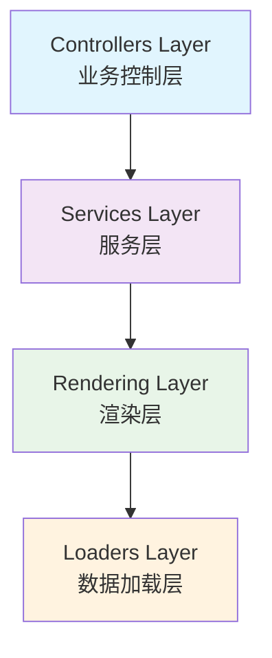
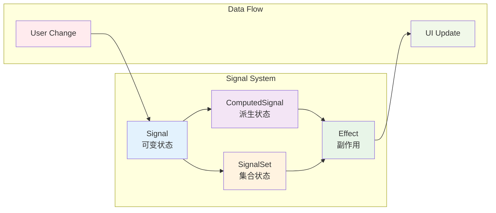
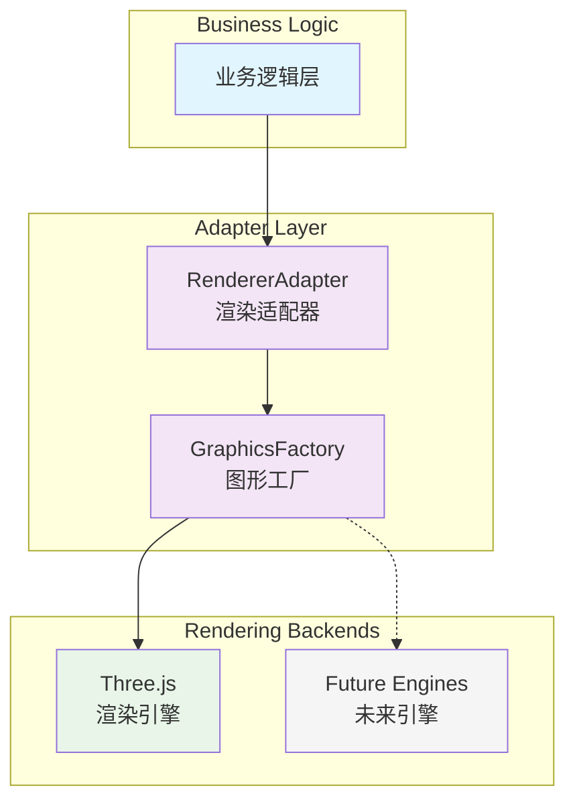
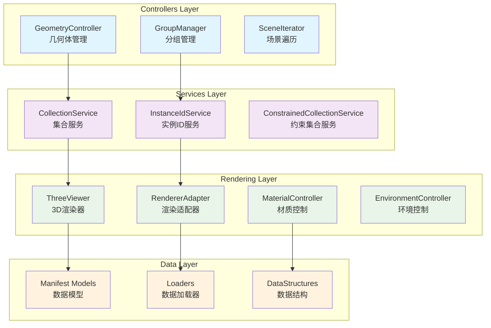
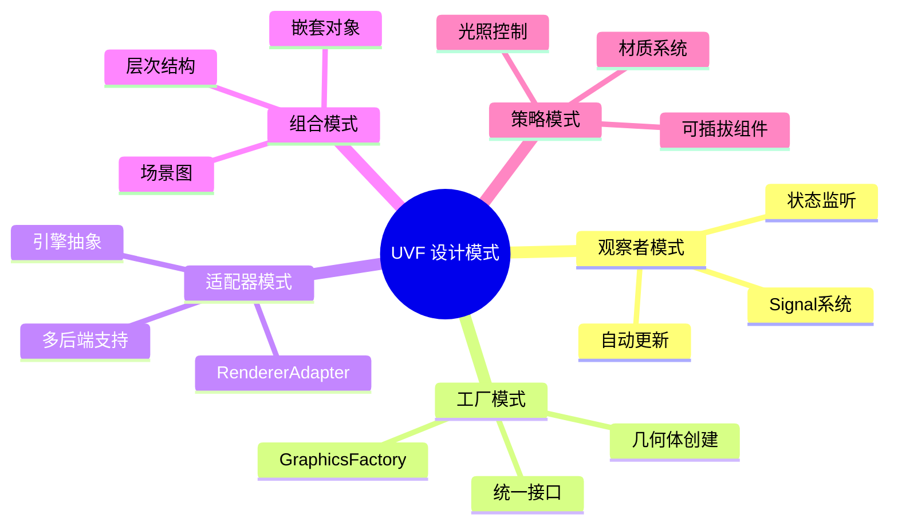
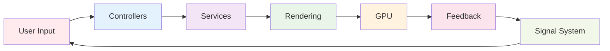
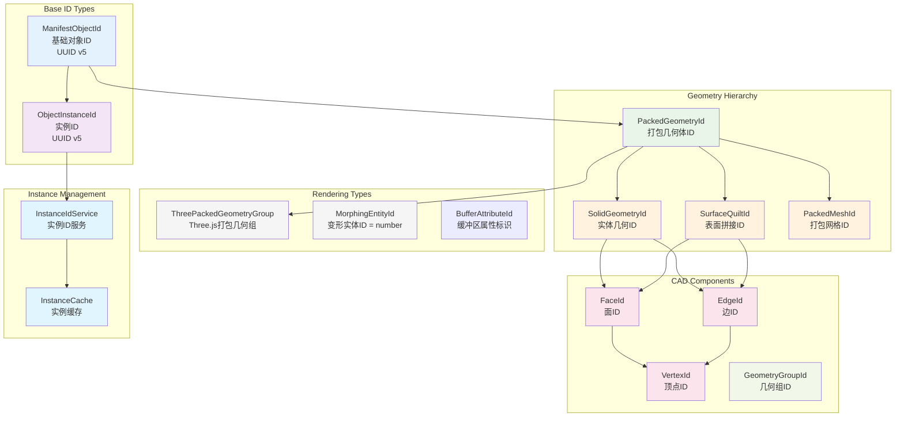
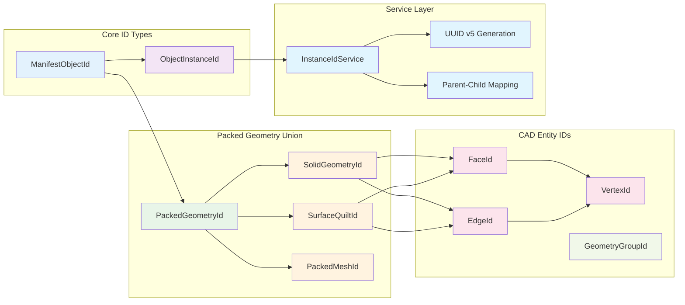
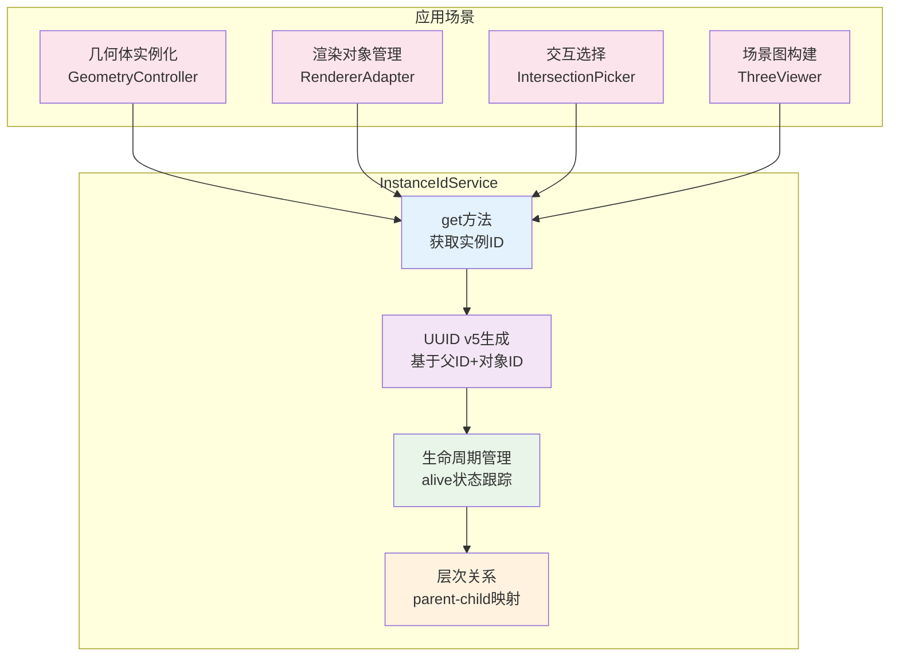

# UVF (Unified Visualization Framework) 架构解读

## 项目概述

UVF是一个专为Web端3D可视化设计的统一可视化框架，基于TypeScript开发，采用响应式信号系统和适配器模式，支持复杂几何体的高性能渲染和交互。

## 核心架构设计

### 1. 分层架构模式

### 2. 响应式信号系统

框架基于Signal机制实现响应式编程：
- **Signal**: 可变状态管理
- **ComputedSignal**: 派生状态计算
- **Effect**: 副作用处理
- **SignalSet**: 集合状态管理

这种设计保证了数据变更的自动传播和界面的实时更新。

### 3. 适配器模式

通过`RendererAdapter`实现了渲染引擎的抽象化，当前主要支持Three.js：
- 解耦业务逻辑与具体渲染实现
- 支持多种渲染后端扩展
- 统一的几何体工厂接口

## 核心模块分析

### Controllers 控制器层

#### GeometryController
- **职责**: 3D几何体生命周期管理
- **特性**: 
  - 支持多种几何类型（Box、Sphere、Cylinder、Face等）
  - UUID-based标识系统
  - 分组管理机制
  - LOD(Level of Detail)支持

#### GroupManager
- **职责**: 对象分组和属性管理
- **设计特点**:
  - 基于MultiMap实现多对多关系
  - 响应式属性更新
  - 支持动态启用/禁用

### Rendering 渲染层

#### ThreeViewer
- **核心组件**: 3D场景渲染和交互管理
- **功能特性**:
  - 高性能渲染管线
  - 多种相机控制模式
  - 选择/悬停交互
  - 材质和光照管理
  - 后处理效果

#### RendererAdapter
- **架构作用**: 渲染引擎抽象层
- **设计优势**:
  - 支持异步加载和进度追踪
  - 内置错误处理和重试机制
  - 资源生命周期管理
  - 背景任务处理

### Manifest 数据模型层

定义了完整的3D对象类型系统：
- **几何体类型**: Point、Edge、Face、Solid等
- **属性系统**: Transform、Material、Color等
- **元数据管理**: Attribution、Bundle等

### Services 服务层

#### CollectionService
- 集合状态管理服务
- 支持约束条件的集合操作

#### InstanceIdService  
- 对象实例标识管理
- 支持高效的ID分配和回收

### Loaders 数据加载层

- **异步加载**: 支持Promise-based的资源加载
- **进度追踪**: 内置加载进度监控
- **错误处理**: 完善的超时和重试机制
- **缓存策略**: 智能资源缓存管理

## 技术特性

### 1. 高性能渲染
- WebGL-based渲染管线
- LOD自动切换
- 批量渲染优化
- 内存管理策略

### 2. 响应式架构
- 信号驱动的状态管理
- 自动依赖追踪
- 最小化重渲染

### 3. 类型安全
- 完整的TypeScript类型定义
- 编译时类型检查
- 泛型系统支持

### 4. 可扩展性
- 插件化架构设计
- 适配器模式支持
- 钩子函数机制

## 设计模式应用

### 1. 观察者模式
Signal系统实现了高效的观察者模式，支持细粒度的状态监听。

### 2. 工厂模式
`GraphicsFactory`为不同几何体类型提供统一的创建接口。

### 3. 适配器模式
`RendererAdapter`抽象了不同渲染引擎的差异。

### 4. 组合模式
场景图结构支持复杂的3D对象层次组织。

### 5. 策略模式
材质、光照、控制器等都采用策略模式实现可插拔。

## 数据流架构

1. **输入处理**: 用户交互通过Controllers处理
2. **状态管理**: Services层管理应用状态
3. **渲染管线**: Rendering层负责GPU渲染
4. **反馈循环**: Signal系统保证状态同步

## 性能优化策略

### 1. 渲染优化
- 视锥剔除
- 遮挡剔除  
- 批量绘制
- 实例化渲染

### 2. 内存管理
- 对象池模式
- 懒加载策略
- 自动垃圾回收
- 资源释放机制

### 3. 异步处理
- Web Workers支持
- 流式数据加载
- 渐进式渲染
- 后台任务调度

## 扩展指南

```mermaid
graph TD
    subgraph "扩展新几何体类型"
        A1[定义数据模型<br/>manifest/models] --> A2[实现渲染逻辑<br/>rendering/renderers]
        A2 --> A3[添加控制逻辑<br/>controllers]
    end
    
    subgraph "集成新渲染引擎"
        B1[实现RendererAdapter<br/>接口] --> B2[创建GraphicsFactory<br/>工厂]
        B2 --> B3[注册到渲染系统<br/>系统集成]
    end
    
    subgraph "扩展交互功能"
        C1[添加事件处理<br/>ThreeViewer] --> C2[暴露交互状态<br/>Signal系统]
        C2 --> C3[添加业务逻辑<br/>Controllers层]
    end
    
    style A1 fill:#e1f5fe
    style A2 fill:#e8f5e8
    style A3 fill:#f3e5f5
    style B1 fill:#e1f5fe
    style B2 fill:#e8f5e8
    style B3 fill:#f3e5f5
    style C1 fill:#e1f5fe
    style C2 fill:#e8f5e8
    style C3 fill:#f3e5f5
```

### 1. 添加新几何体类型
1. 在`manifest/models`中定义数据模型
2. 在`rendering/renderers`中实现渲染逻辑
3. 在`controllers`中添加控制逻辑

### 2. 集成新渲染引擎
1. 实现`RendererAdapter`接口
2. 创建对应的`GraphicsFactory`
3. 注册到渲染系统

### 3. 扩展交互功能
1. 在`ThreeViewer`中添加事件处理
2. 通过Signal系统暴露交互状态
3. 在Controllers层添加业务逻辑

## 总结

UVF展现了现代Web 3D框架的优秀架构设计：
- **清晰的分层结构**便于维护和扩展
- **响应式信号系统**提供高效的状态管理
- **适配器模式**实现了良好的解耦
- **类型安全的设计**降低了运行时错误
- **高性能的渲染管线**满足复杂场景需求

这种架构设计使得UVF既能处理简单的3D可视化需求，也能支撑大规模工业级应用的复杂渲染场景。

## 类型ID系统分析

UVF框架中定义了一套完整的标识符(ID)系统来管理3D场景中的各种对象和实例，形成了清晰的层次结构。

### ID类型层次结构

### ID类型关系映射

### 核心ID类型说明

1. **ManifestObjectId**: 
   - 基础对象标识符，使用UUID v5生成
   - 所有manifest对象的根ID类型

2. **ObjectInstanceId**: 
   - 对象实例标识符，也使用UUID v5
   - 通过InstanceIdService管理父子关系

3. **PackedGeometryId**: 
   - 联合类型：`SolidGeometryId | SurfaceQuiltId | PackedMeshId`
   - 用于标识打包的几何体数据

4. **CAD实体ID**:
   - **FaceId**: CAD面的标识符
   - **EdgeId**: CAD边的标识符  
   - **VertexId**: CAD顶点的标识符
   - **GeometryGroupId**: 几何组标识符

5. **渲染特定ID**:
   - **ThreePackedGeometryGroup**: Three.js打包几何组
   - **MorphingEntityId**: 变形实体ID (number类型)
   - 各种BufferAttribute相关的标识符

### InstanceIdService服务

这套ID系统的设计体现了UVF框架的以下特点：

1. **类型安全**: 使用TypeScript严格类型定义确保ID使用的正确性
2. **层次清晰**: 从基础对象到具体几何实体的清晰层次结构
3. **实例管理**: 通过InstanceIdService实现复杂的实例化和生命周期管理
4. **渲染解耦**: 不同渲染后端可以有自己的ID扩展(如Three.js相关ID)
5. **高性能**: UUID v5确保全局唯一性的同时保持高性能