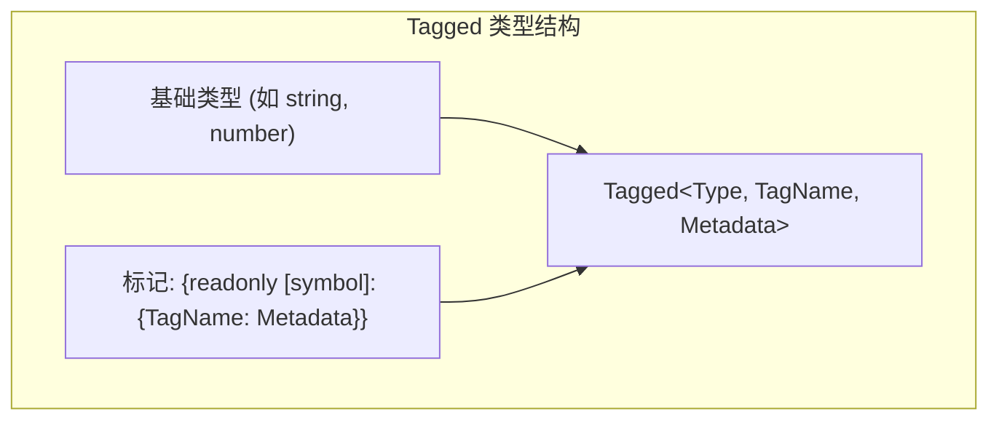

# Tagged 类型系统

## 概述

Tagged 类型是 UVF 框架中实现类型安全的核心机制，基于 TypeScript 的类型标记（type tagging）技术。它允许我们创建具有相同运行时结构但在类型系统中被视为完全不同的类型，从而在编译时捕获潜在的类型错误。

Tagged 类型源自 `type-fest` 库，但在 UVF 中得到了广泛应用和扩展，形成了一套完整的类型安全保障体系。

```typescript
export type Tagged<Type, TagName extends PropertyKey, TagMetadata = never> = Type & Tag<TagName, TagMetadata>;
```

## ManifestObjectModel 中的 Tagged 类型应用

在 UVF 的 `ManifestObjectModel` 中，Tagged 类型被广泛应用于确保类型安全和区分不同的数据类型：

```typescript
export type ManifestObjectModel<
  IDType extends ManifestObjectId,
  TManifestType extends ManifestObjectType,
  TProperties extends Properties | undefined = undefined,
  TAttributions extends Attributions | undefined = undefined,
  TResources extends Resources | undefined = undefined,
  TManifestObjectTags extends ManifestObjectTags | undefined = undefined,
  TVersion extends ManifestObjectVersion | undefined = ManifestObjectVersion,
> = {
  id: IDType;
  type: TManifestType;
  properties?: TProperties;
  attributions?: TAttributions;
  resources?: TResources;
  tags?: TManifestObjectTags;
  version?: TVersion;
  __updateCount?: number;
  __manifestId?: IDType;
};
```

### 核心 Tagged 类型

`ManifestObjectModel` 中使用了三个主要的 Tagged 类型：

1. **ManifestObjectId**：对象唯一标识符
   ```typescript
   export type ManifestObjectId = Tagged<string, 'ManifestObjectId'>;
   ```
   - **作用**：区分不同类型的对象ID，防止混用
   - **可能的值**：`'12345'`、`'box-1'`、`'face-2'` 等字符串形式的标识符

2. **ManifestObjectType**：对象类型标识符
   ```typescript
   export type ManifestObjectType = Tagged<string, 'ManifestObjectType'>;
   ```
   - **作用**：标识清单对象的类型
   - **可能的值**：`'box'`、`'face'`、`'edge'`、`'group'`、`'geometry'` 等

3. **ManifestObjectVersion**：对象版本标识符
   ```typescript
   export type ManifestObjectVersion = Tagged<string, 'ManifestObjectVersion'>;
   ```
   - **作用**：表示对象模型的版本
   - **可能的值**：`'1.0.0'`、`'2.1.3'` 等语义化版本号

## 核心原理

Tagged 类型的工作原理基于 TypeScript 的交叉类型（Intersection Types）和唯一符号（Unique Symbols）:

1. 使用唯一符号作为不可见的属性键
2. 通过交叉类型给基础类型添加"标记"属性
3. 编译器能够区分相同基础类型的不同标记版本



## UVF 中的应用

在 UVF 框架中，Tagged 类型被广泛应用于以下场景：

### 1. ID 类型区分

```typescript
// 为不同实体类型定义专用的 ID 类型
type BoxId = Tagged<ManifestObjectId, 'BoxId'>;
type FaceId = Tagged<ManifestObjectId, 'FaceId'>;
type EdgeId = Tagged<ManifestObjectId, 'EdgeId'>;

// 使用示例
function getFace(id: FaceId) { /* ... */ }

// 类型安全：不能传入 EdgeId 作为 FaceId 使用
getFace(edgeId); // 编译错误
```

### ManifestObjectModel 中的 ID 类型派生

在 `ManifestObjectModel` 中，各种不同的几何对象类型都是从基础的 `ManifestObjectId` 派生出来的，形成了一个类型安全的 ID 层次结构：

```typescript
// 基本几何图元
export type BoxId = Tagged<ManifestObjectId, 'BoxId'>;
export type CylinderId = Tagged<ManifestObjectId, 'CylinderId'>;
export type PointId = Tagged<ManifestObjectId, 'PointId'>;
export type PointArrayId = Tagged<ManifestObjectId, 'PointArrayId'>;
export type SpriteId = Tagged<ManifestObjectId, 'SpriteId'>;
export type OriginPointId = Tagged<ManifestObjectId, 'OriginPointId'>;

// CAD 模型相关 ID
export type EdgeId = Tagged<ManifestObjectId, 'EdgeId'>;
export type FaceId = Tagged<ManifestObjectId, 'FaceId'>;
export type SolidGeometryId = Tagged<ManifestObjectId, 'SolidGeometryId'>;
export type StreamLineId = Tagged<ManifestObjectId, 'SolidGeometryId'>;
export type SurfaceQuiltId = Tagged<ManifestObjectId, 'SurfaceQuiltId'>;
export type VertexId = Tagged<ManifestObjectId, 'VertexId'>;
export type EdgeVertexBoundaryId = Tagged<ManifestObjectId, 'EdgeVertexBoundaryId'>;

// 组织结构相关 ID
export type GeometryGroupId = Tagged<ManifestObjectId, 'GeometryGroupId'>;
export type ObjectListId = Tagged<ManifestObjectId, 'ObjectListId'>;

// 辅助几何元素 ID
export type AngleId = Tagged<ManifestObjectId, 'AngleId'>;
export type AxisId = Tagged<ManifestObjectId, 'AxisId'>;
export type CircleAreaId = Tagged<ManifestObjectId, 'CircleAreaId'>;
export type PlaneId = Tagged<ManifestObjectId, 'PlaneId'>;

// 其他标识符
export type GroupName = Tagged<string, 'GroupName'>;
export type ObjectInstanceId = Tagged<string, 'ObjectInstanceId'>;
export type AttributionType = Tagged<string, 'AttributionType'>;
```

这种类型设计确保了即使所有 ID 在运行时都是字符串，但在编译时会被视为不同的类型，防止错误地混用不同类型的 ID。

### 2. 模型类型安全

```typescript
// 模型类型标记
type BoxModelType = Tagged<ManifestObjectType, 'Box'>;
type FaceModelType = Tagged<ManifestObjectType, 'Face'>;

// 模型对象定义
interface BoxModel extends ManifestObjectModel<BoxId, BoxModelType> {
  properties: BoxProperties;
}
```

### ManifestObjectModel 中的类型系统

`ManifestObjectModel` 泛型接口利用 Tagged 类型构建了一个高度类型安全的模型系统：

```typescript
export type ManifestObjectModel<
  IDType extends ManifestObjectId,
  TManifestType extends ManifestObjectType,
  TProperties extends Properties | undefined = undefined,
  TAttributions extends Attributions | undefined = undefined,
  TResources extends Resources | undefined = undefined,
  TManifestObjectTags extends ManifestObjectTags | undefined = undefined,
  TVersion extends ManifestObjectVersion | undefined = ManifestObjectVersion,
> = {
  id: IDType;                   // 使用特定的 Tagged ID 类型
  type: TManifestType;          // 使用特定的 Tagged 类型标识符
  properties?: TProperties;     // 对象属性
  attributions?: TAttributions; // 归属信息
  resources?: TResources;       // 资源引用
  tags?: TManifestObjectTags;   // 元数据标签
  version?: TVersion;           // 版本信息（Tagged 字符串）
  __updateCount?: number;       // 内部更新计数
  __manifestId?: IDType;        // 内部原始 ID 引用
};
```

这种设计具有以下优势：

1. **类型关联**：确保 ID 类型和模型类型匹配（如 `BoxId` 与 `BoxModelType`）
2. **类型安全**：防止错误地混用不同类型的模型和 ID
3. **类型推导**：通过特定的 ID 类型可以推断出对应的模型类型
4. **版本控制**：使用 Tagged 类型作为版本标识，确保版本兼容性检查

例如，下面是一个应用这种类型系统的几何对象模型：

```typescript
// 盒子几何体定义
export interface BoxModel extends ManifestObjectModel<BoxId, BoxModelType, BoxProperties> {
  // BoxId 和 BoxModelType 都是 Tagged 类型
}

// 几何面定义
export interface FaceModel extends ManifestObjectModel<FaceId, FaceModelType, FaceProperties> {
  // FaceId 和 FaceModelType 都是 Tagged 类型
}
```

这确保了：
- 不能用 `FaceId` 创建 `BoxModel`
- 不能将 `BoxModel` 传递给需要 `FaceModel` 的函数
- 编译器可以根据 ID 类型自动推断出正确的模型类型

### 3. 带元数据的标记

UVF 使用标记元数据存储额外类型信息：

```typescript
// 使用元数据存储结构信息
type BinaryField<T> = Tagged<ArrayBuffer, 'BinaryField', T>;

// 示例：存储点云数据类型信息
type PointCloudData = BinaryField<{
  format: 'XYZ' | 'XYZRGB';
  count: number;
}>;

// 获取元数据
type FormatInfo = GetTagMetadata<PointCloudData, 'BinaryField'>;
// FormatInfo = { format: 'XYZ' | 'XYZRGB'; count: number; }
```

### ManifestObjectModel 中的元数据应用

在 `ManifestObjectModel` 中，元数据参数主要用于以下几个方面：

1. **版本信息**：`ManifestObjectVersion` 可以携带版本元数据
   
   ```typescript
   // 带有元数据的版本类型
   type ManifestObjectVersionWithMetadata = Tagged<string, 'ManifestObjectVersion', {
     major: number;
     minor: number;
     patch: number;
     isCompatible: (other: ManifestObjectVersion) => boolean;
   }>;
   ```

2. **资源信息**：`Resources` 类型中使用元数据标记不同类型的资源
   
   ```typescript
   // 几何资源类型
   type GeometryResource<T> = Tagged<string, 'GeometryResource', T>;
   
   // 使用示例
   const meshResource: GeometryResource<{
     format: 'gltf' | 'obj' | 'stl';
     vertexCount: number;
   }> = 'mesh.gltf' as any;
   ```

3. **二进制数据类型标记**：用于在编译时指定二进制数据的结构
   
   ```typescript
   // 特定于特定几何体类型的二进制数据
   type BoxBinaryData = Tagged<ArrayBuffer, 'BoxData', {
     dimensions: Vector3;
     materialIndex: number;
   }>;
   
   // 向量场数据
   type VectorFieldData = Tagged<ArrayBuffer, 'VectorField', {
     dimensions: [number, number, number];
     componentType: 'float32' | 'float64';
     components: 3 | 4;
   }>;
   ```

这种元数据标记的方法使得 UVF 框架可以在类型级别编码数据结构信息，而不需要在运行时进行额外的检查或保存冗余的结构信息。

## 多重标记

UVF 支持给类型添加多个标记，形成复合标记类型：

```typescript
// 基础标记
type ValidatedType = Tagged<string, 'Validated'>;

// 添加额外标记
type NormalizedValidatedType = Tagged<ValidatedType, 'Normalized'>;

// 或使用联合类型
type CompleteType = Tagged<string, 'Validated' | 'Normalized' | 'Formatted'>;
```

### ManifestObjectModel 中的多重标记

在 `ManifestObjectModel` 中，多重标记的一个重要应用是构建类型层次结构：

```typescript
// 1. 基础几何对象 ID
export type GeometryObjectId = Tagged<ManifestObjectId, 'GeometryObject'>;

// 2. 几何体子类型 ID
export type SolidGeometryId = Tagged<GeometryObjectId, 'SolidGeometry'>;
export type SurfaceGeometryId = Tagged<GeometryObjectId, 'SurfaceGeometry'>;
export type CurveGeometryId = Tagged<GeometryObjectId, 'CurveGeometry'>;

// 3. 具体几何体类型 ID
export type BoxId = Tagged<SolidGeometryId, 'Box'>;
export type SphereId = Tagged<SolidGeometryId, 'Sphere'>;
export type FaceId = Tagged<SurfaceGeometryId, 'Face'>;
export type EdgeId = Tagged<CurveGeometryId, 'Edge'>;
```

这种层次化的标记允许创建可以处理特定层次的通用函数：

```typescript
// 处理任何几何对象的函数
function processGeometry(id: GeometryObjectId) { /* ... */ }

// 处理任何固体几何体的函数
function processSolid(id: SolidGeometryId) { /* ... */ }

// 处理盒子几何体的函数
function processBox(id: BoxId) { /* ... */ }

// 使用示例
const boxId: BoxId = '123' as BoxId;
processGeometry(boxId);  // 有效：BoxId 可以作为 GeometryObjectId 使用
processSolid(boxId);     // 有效：BoxId 可以作为 SolidGeometryId 使用
processBox(boxId);       // 有效：直接使用 BoxId

const faceId: FaceId = '456' as FaceId;
processGeometry(faceId); // 有效：FaceId 可以作为 GeometryObjectId 使用
processSolid(faceId);    // 错误：FaceId 不能作为 SolidGeometryId 使用
```

这种设计在 UVF 中用于构建丰富的类型层次结构，同时保持类型安全。

## 与普通类型兼容性

Tagged 类型保留与基础类型的兼容性：

```typescript
// Tagged 类型可以用于基础类型操作
function processLength(boxId: BoxId) {
  // BoxId 是基于 string 的 Tagged 类型，可以使用 string 的所有方法
  return boxId.length;
}
```

### ManifestObjectModel 中的类型兼容性

在 `ManifestObjectModel` 中，Tagged 类型的兼容性规则如下：

1. **基础类型兼容性**：Tagged 类型可以用于其基础类型的操作
   
   ```typescript
   // ManifestObjectId 是 Tagged<string, 'ManifestObjectId'>
   function getIdLength(id: ManifestObjectId): number {
     return id.length; // 可以使用 string 的所有方法
   }
   
   function joinIds(ids: ManifestObjectId[]): string {
     return ids.join(','); // 可以使用数组方法和字符串方法
   }
   ```

2. **向上兼容性**：派生 Tagged 类型可以用作其基础 Tagged 类型
   
   ```typescript
   // BoxId 是 Tagged<ManifestObjectId, 'BoxId'>
   function processManifestObject(id: ManifestObjectId) { /* ... */ }
   
   const boxId: BoxId = '123' as BoxId;
   processManifestObject(boxId); // 有效：BoxId 可以用作 ManifestObjectId
   ```

3. **不可向下兼容**：基础 Tagged 类型不能用作派生 Tagged 类型
   
   ```typescript
   function processBox(id: BoxId) { /* ... */ }
   
   const manifestId: ManifestObjectId = '123' as ManifestObjectId;
   processBox(manifestId); // 错误：ManifestObjectId 不能用作 BoxId
   ```

4. **不可横向兼容**：不同派生 Tagged 类型之间不能互相赋值
   
   ```typescript
   const boxId: BoxId = '123' as BoxId;
   const faceId: FaceId = boxId; // 错误：BoxId 不能赋值给 FaceId
   ```

这些兼容性规则在 UVF 框架中确保了类型安全，同时保持了代码的灵活性。

## 类型解包

使用 `UnwrapTagged` 可以移除标记，恢复原始类型：

```typescript
type AccountType = Tagged<'SAVINGS' | 'CHECKING', 'AccountType'>;

// 移除标记
type OriginalType = UnwrapTagged<AccountType>; // 'SAVINGS' | 'CHECKING'

// 用于对象键
const accountBalances: Record<UnwrapTagged<AccountType>, number> = {
  SAVINGS: 1000,
  CHECKING: 500
};
```

### ManifestObjectModel 中的类型解包

在 `ManifestObjectModel` 中，类型解包主要用于以下场景：

1. **序列化/反序列化**：在将模型对象转换为 JSON 时，需要去除类型标记
   
   ```typescript
   export type ManifestObjectModelJson<
     IDType extends ManifestObjectId,
     TManifestType extends ManifestObjectType,
     /* ... 其他类型参数 ... */
   > = Simplify<
     Jsonify<
       ManifestObjectModel<IDType, TManifestType, /* ... 其他参数 ... */>
     >
   >;
   ```
   
   `Jsonify` 类型在内部使用了类似 `UnwrapTagged` 的机制，将 Tagged 类型转换为其基础类型。

2. **通用集合**：当需要创建包含不同 Tagged 类型的集合时
   
   ```typescript
   // 所有几何对象 ID 的映射
   type GeometryIdMap = Record<string, UnwrapTagged<ManifestObjectId>>;
   
   // 在实际使用时，需要通过类型断言恢复 Tagged 类型
   function getGeometryId(key: string): ManifestObjectId {
     return geometryIdMap[key] as ManifestObjectId;
   }
   ```

3. **类型转换**：在需要从一种 Tagged 类型转换到另一种 Tagged 类型时
   
   ```typescript
   function convertToBoxId(id: ManifestObjectId): BoxId {
     // 先解包为基础类型，再重新打包为目标 Tagged 类型
     const baseId: UnwrapTagged<ManifestObjectId> = id as any;
     return baseId as BoxId;
   }
   ```

这些应用使得 UVF 框架能够在保持类型安全的同时，处理需要类型转换或序列化的场景。

## 最佳实践

UVF 框架中使用 Tagged 类型的最佳实践：

1. **保持一致性**：同一概念使用相同的标记类型
2. **命名规范**：使用后缀 `Id` 表示实体标识符类型
3. **文档化**：在类型定义中清晰说明标记类型的用途
4. **避免过度使用**：仅在确实需要类型区分的场景使用
5. **组合标记**：复杂领域模型可以使用多重标记表达丰富语义

### ManifestObjectModel 最佳实践

在使用 `ManifestObjectModel` 和 Tagged 类型时，特别推荐以下实践：

1. **ID 类型与模型类型匹配**：确保 ID 类型和模型类型一一对应
   
   ```typescript
   // ID 类型
   export type BoxId = Tagged<ManifestObjectId, 'BoxId'>;
   // 对应的模型类型
   export type BoxModelType = Tagged<ManifestObjectType, 'Box'>;
   // 完整模型定义
   export interface BoxModel extends ManifestObjectModel<BoxId, BoxModelType, BoxProperties> {}
   ```

2. **工厂函数创建 Tagged 值**：使用专用函数创建 Tagged 类型的值，而不是直接类型断言
   
   ```typescript
   // 不推荐
   const id = '12345' as BoxId;
   
   // 推荐
   function createBoxId(value: string): BoxId {
     // 可以添加验证逻辑
     if (!value.match(/^[a-zA-Z0-9-_]+$/)) {
       throw new Error('Invalid box ID format');
     }
     return value as BoxId;
   }
   
   const id = createBoxId('12345');
   ```

3. **类型守卫**：创建类型守卫函数以在运行时检查值的类型
   
   ```typescript
   function isBoxId(id: ManifestObjectId): id is BoxId {
     // 可以添加运行时检查逻辑，例如检查前缀
     return (id as string).startsWith('box-');
   }
   
   function processId(id: ManifestObjectId) {
     if (isBoxId(id)) {
       // 此处 id 的类型为 BoxId
       processBox(id);
     }
   }
   ```

4. **在模型接口中使用精确类型**：使用最具体的 Tagged 类型，而不是基础 Tagged 类型
   
   ```typescript
   // 不推荐
   interface BoxModel {
     id: ManifestObjectId; // 太宽泛
     type: ManifestObjectType;
   }
   
   // 推荐
   interface BoxModel {
     id: BoxId; // 更精确
     type: BoxModelType;
   }
   ```

5. **统一版本管理**：使用 Tagged 类型管理版本兼容性
   
   ```typescript
   export type BoxModelV1 = Tagged<BoxModel, 'v1'>;
   export type BoxModelV2 = Tagged<BoxModel, 'v2'>;
   
   function upgradeModel(model: BoxModelV1): BoxModelV2 {
     // 执行版本转换逻辑
   }
   ```

这些实践在 UVF 中广泛应用于 `ManifestObjectModel` 及其相关类型，确保了代码的类型安全和可维护性。

## 性能考虑

Tagged 类型是纯 TypeScript 类型构造，不会增加运行时开销：

- 编译后，标记信息完全被擦除
- 不会影响运行时性能
- 不增加内存占用

### ManifestObjectModel 中的性能影响

在 `ManifestObjectModel` 使用 Tagged 类型时需要注意：

1. **类型擦除**：所有 Tagged 类型在编译后都会被擦除，例如 `BoxId` 在运行时就是普通字符串
   
   ```typescript
   // TypeScript 代码
   const id: BoxId = '12345' as BoxId;
   
   // 编译后的 JavaScript
   const id = '12345'; // Tagged 类型信息完全消失
   ```

2. **运行时验证**：如果需要在运行时验证类型，需要额外的代码
   
   ```typescript
   // 运行时类型验证示例
   function validateBoxId(id: unknown): asserts id is BoxId {
     if (typeof id !== 'string' || !id.match(/^box-/)) {
       throw new Error('Invalid BoxId');
     }
   }
   ```

3. **序列化效率**：使用 Tagged 类型不会影响 JSON 序列化/反序列化的性能
   
   ```typescript
   // 序列化 ManifestObjectModel
   const boxModel: BoxModel = { /* ... */ };
   const json = JSON.stringify(boxModel); // 与使用普通类型完全相同的性能
   ```

4. **类型编译开销**：复杂的 Tagged 类型系统可能增加 TypeScript 编译器的负担，但不影响运行时性能
   
   ```typescript
   // 复杂的类型层次可能导致 TypeScript 编译变慢
   type ComplexTypeHierarchy = Tagged<Tagged<Tagged<string, 'A'>, 'B'>, 'C'>;
   ```

这些性能考虑对于 `ManifestObjectModel` 等大型类型系统尤为重要，确保类型安全不会牺牲运行时性能。

## io-ts 与 Tagged 类型的集成

在 UVF 框架中，Tagged 类型系统通常与 io-ts 库集成使用，为类型安全提供双重保障：Tagged 类型提供编译时类型安全，而 io-ts 提供运行时类型验证。

### io-ts 简介

io-ts 是一个运行时类型系统库，允许在运行时验证数据的类型结构。在导入时，通常使用命名空间 `t`：

```typescript
import * as t from 'io-ts/es6';
```

这个命名空间提供了各种类型构造器和编解码器，用于定义和验证数据结构。

### Tagged 类型与 io-ts 的结合

在 UVF 中，每个 Tagged 类型通常都有一个对应的 io-ts 编解码器（codec），用于在运行时验证数据：

```typescript
// 定义 Tagged 类型
export type ManifestObjectId = Tagged<string, 'ManifestObjectId'>;

// 对应的 io-ts 编解码器
export const manifestObjectIdC = t.string as unknown as t.Type<ManifestObjectId>;
```

这种模式为 UVF 提供了两层保护：

1. **编译时保护**：Tagged 类型确保在编译时不能错误地混用不同类型的 ID
2. **运行时保护**：io-ts 编解码器确保从外部来源（如 JSON）的数据符合预期的结构

### 编解码器的工作原理

io-ts 编解码器的核心功能是验证和转换数据：

```typescript
// 从 JSON 数据解码到类型安全的模型
function decodeModel(json: unknown): Either<Errors, BoxModel> {
  return boxModelCodec.decode(json);
}

// 结果处理
const result = decodeModel(someJsonData);
if (isRight(result)) {
  // 类型安全的模型，TypeScript 知道这是 BoxModel 类型
  const model = result.right;
  console.log(model.properties.width); // 类型安全的访问
} else {
  // 处理验证错误
  console.error(result.left);
}
```

### 为什么 Tagged 类型需要 io-ts

虽然 Tagged 类型提供了编译时的类型安全，但它们在运行时被擦除，无法区分不同的 Tagged 类型。例如，`BoxId` 和 `FaceId` 在运行时都只是普通字符串。

io-ts 通过以下方式补充了这一不足：

1. **外部数据验证**：验证 API 响应、JSON 文件等外部数据
2. **模式验证**：确保数据符合预期的结构，包括所有必需字段
3. **格式验证**：可以实现自定义编解码器，验证值的格式（如 UUID 格式）
4. **错误处理**：提供详细的验证错误信息，便于调试

### io-ts 编解码器的实现模式

在 UVF 中，Tagged 类型的 io-ts 编解码器通常通过类型断言实现：

```typescript
// 基础 Tagged 类型编解码器
export const manifestObjectIdC = t.string as unknown as t.Type<ManifestObjectId>;

// 派生 Tagged 类型编解码器
export const boxIdC = manifestObjectIdC as t.Type<BoxId>;
```

对于更复杂的类型，通常使用 `t.type` 创建对象编解码器：

```typescript
// BoxModel 编解码器
export const boxModelC = t.type({
  id: boxIdC,
  type: boxModelTypeC,
  properties: t.type({
    width: t.number,
    height: t.number,
    depth: t.number
  })
});
```

### 实际应用示例

以下是 UVF 中 Tagged 类型与 io-ts 集成的完整示例：

```typescript
// 1. 导入依赖
import * as t from 'io-ts/es6';
import { Tagged } from 'type-fest';
import { pipe } from 'fp-ts/function';
import { fold } from 'fp-ts/Either';

// 2. 定义 Tagged 类型
export type BoxId = Tagged<string, 'BoxId'>;

// 3. 创建 io-ts 编解码器
export const boxIdC = t.string as t.Type<BoxId>;

// 4. 定义模型类型
export interface BoxProperties {
  width: number;
  height: number;
  depth: number;
}

export const boxPropertiesC = t.type({
  width: t.number,
  height: t.number,
  depth: t.number
});

export interface BoxModel {
  id: BoxId;
  properties: BoxProperties;
}

export const boxModelC = t.type({
  id: boxIdC,
  properties: boxPropertiesC
});

// 5. 使用编解码器验证数据
const validateBox = (json: unknown) => 
  pipe(
    boxModelC.decode(json),
    fold(
      errors => {
        console.error('验证失败:', errors);
        return null;
      },
      validBox => {
        console.log('验证成功:', validBox);
        return validBox;
      }
    )
  );

// 6. 使用示例
const jsonData = {
  id: 'box-123',
  properties: {
    width: 10,
    height: 20,
    depth: 15
  }
};

const box = validateBox(jsonData);
// 如果验证成功，box 现在是类型安全的 BoxModel
```

这种模式在 UVF 框架中广泛应用于各种模型的定义和验证，确保了从外部数据源加载的 3D 场景数据的类型安全和一致性。

## 示例：完整类型定义

```typescript
// 定义 Tagged 类型基础设施
declare const tag: unique symbol;

type TagContainer<Token> = {
  readonly [tag]: Token;
};

type Tag<Token extends PropertyKey, TagMetadata> = 
  TagContainer<{[K in Token]: TagMetadata}>;

// 标记类型定义
export type Tagged<Type, TagName extends PropertyKey, TagMetadata = never> = 
  Type & Tag<TagName, TagMetadata>;

// 获取标记元数据
export type GetTagMetadata<
  Type extends Tag<TagName, unknown>, 
  TagName extends PropertyKey
> = Type[typeof tag][TagName];

// 移除标记
export type UnwrapTagged<TaggedType extends Tag<PropertyKey, any>> =
  RemoveAllTags<TaggedType>;
```

### ManifestObjectModel 完整示例

下面是一个使用 `ManifestObjectModel` 和 Tagged 类型构建模型系统的完整示例：

```typescript
// 1. 基础 Tagged 类型
export type ManifestObjectId = Tagged<string, 'ManifestObjectId'>;
export type ManifestObjectType = Tagged<string, 'ManifestObjectType'>;
export type ManifestObjectVersion = Tagged<string, 'ManifestObjectVersion'>;

// 2. 派生 ID 类型
export type BoxId = Tagged<ManifestObjectId, 'BoxId'>;
export type SphereId = Tagged<ManifestObjectId, 'SphereId'>;

// 3. 派生类型标识符
export type BoxModelType = Tagged<ManifestObjectType, 'Box'>;
export type SphereModelType = Tagged<ManifestObjectType, 'Sphere'>;

// 4. 属性类型
export interface BoxProperties {
  width: number;
  height: number;
  depth: number;
  material?: string;
}

export interface SphereProperties {
  radius: number;
  segments?: number;
  material?: string;
}

// 5. 模型定义
export interface BoxModel extends ManifestObjectModel<BoxId, BoxModelType, BoxProperties> {}
export interface SphereModel extends ManifestObjectModel<SphereId, SphereModelType, SphereProperties> {}

// 6. 工厂函数
export function createBoxModel(
  id: string,
  width: number,
  height: number,
  depth: number,
  material?: string
): BoxModel {
  return {
    id: id as BoxId,
    type: 'Box' as BoxModelType,
    properties: {
      width,
      height,
      depth,
      material
    }
  };
}

// 7. 类型安全函数
export function processGeometry(model: BoxModel | SphereModel) {
  if (model.type === 'Box' as BoxModelType) {
    // TypeScript 知道这是 BoxModel
    console.log(`处理盒子：${model.properties.width} x ${model.properties.height} x ${model.properties.depth}`);
  } else if (model.type === 'Sphere' as SphereModelType) {
    // TypeScript 知道这是 SphereModel
    console.log(`处理球体：半径 ${model.properties.radius}`);
  }
}
```

这个示例展示了 `ManifestObjectModel` 和 Tagged 类型如何协同工作，提供类型安全、可扩展的模型系统。

## 总结

Tagged 类型系统是 UVF 框架类型安全的基石，通过在编译时区分不同的概念，显著提高了代码的安全性和可维护性。它实现了：

- **类型级别的领域模型**：将业务概念映射到类型系统
- **编译时错误检测**：防止类型混用导致的逻辑错误
- **自文档化的代码**：类型名称传达业务含义
- **无运行时开销**：纯类型系统构造，不影响性能

### ManifestObjectModel 中 Tagged 类型的核心价值

在 `ManifestObjectModel` 中，Tagged 类型提供了以下核心价值：

1. **类型安全**：确保 ID、类型和版本等关键字段的类型安全，防止错误混用
   
2. **模型一致性**：强制维护模型类型和 ID 类型之间的一致关系
   
3. **可扩展性**：通过派生 Tagged 类型，可以轻松扩展模型系统以支持新的对象类型
   
4. **类型导航**：在 IDE 中提供更好的类型提示和导航体验
   
5. **运行时透明**：不影响运行时性能，标记信息在编译后被完全擦除

`ManifestObjectModel` 通过 Tagged 类型系统，构建了一个强大而灵活的 3D 对象模型表示层，为 UVF 框架提供了坚实的类型基础。这种设计使 UVF 能够以类型安全的方式处理复杂的 3D 场景数据，同时保持高性能和良好的开发体验。

总而言之，Tagged 类型是 UVF 框架中的关键设计模式，特别是在 `ManifestObjectModel` 这样的核心类型中，它通过静态类型检查提供了更强的类型安全保障，同时不影响运行时性能，是现代 TypeScript 应用程序类型系统设计的优秀范例。