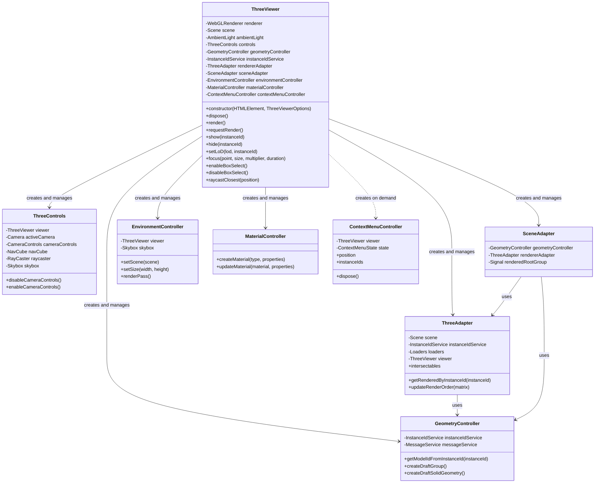
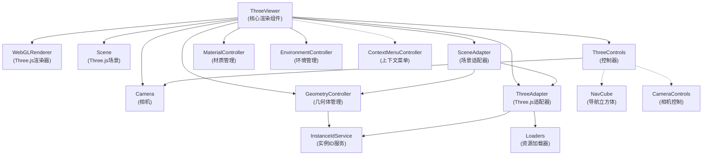
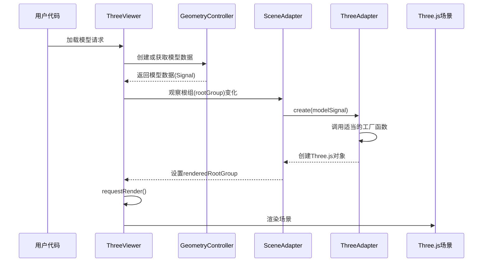
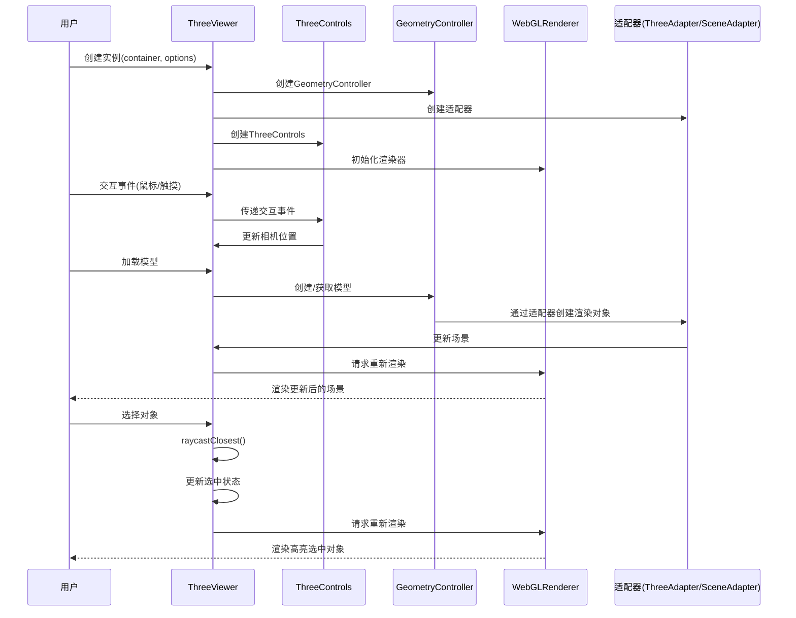
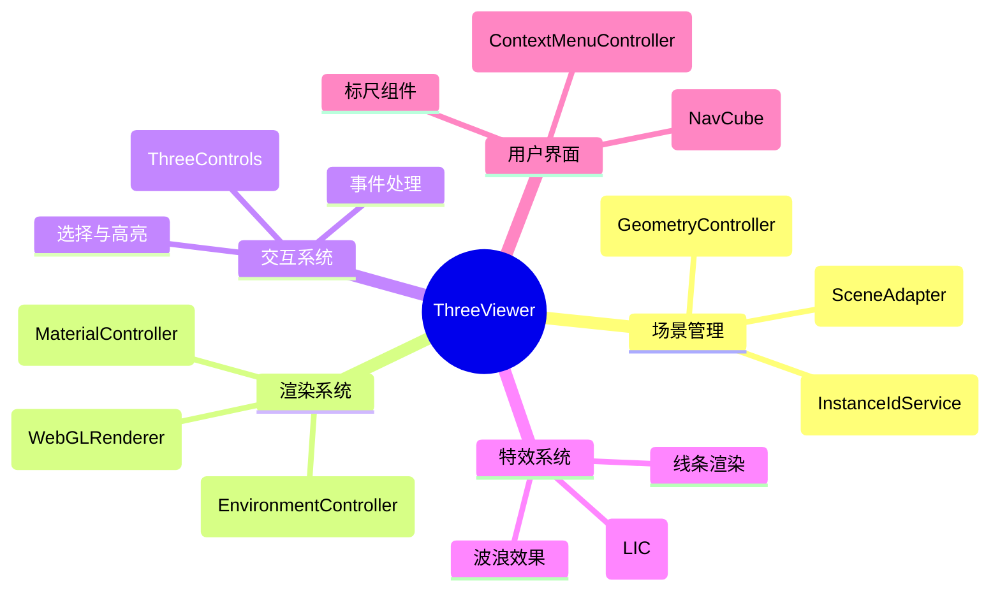
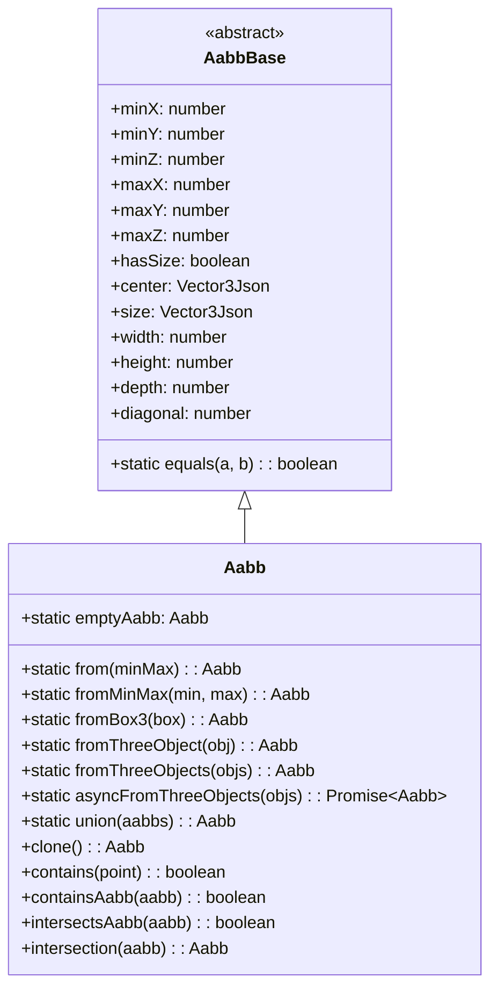
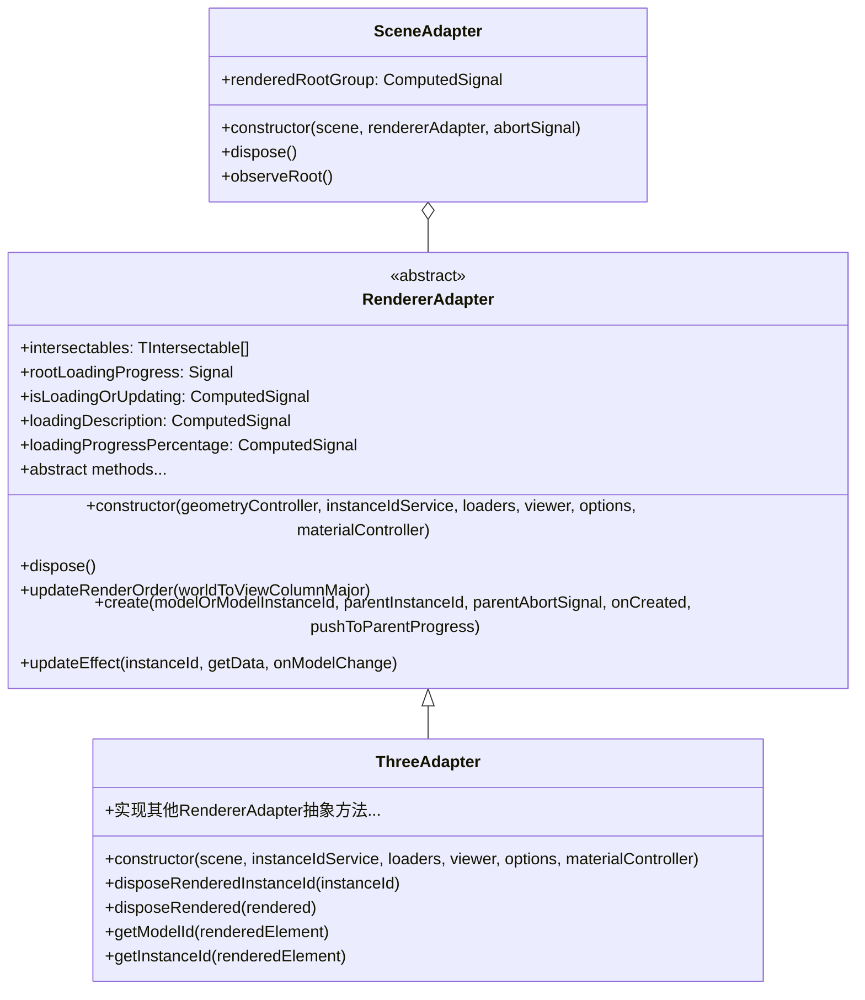

# ThreeViewer 架构分析

ThreeViewer 是统一可视化框架 (UVF) 的核心渲染组件，负责3D场景的渲染、交互和管理。本文档从架构角度分析 ThreeViewer 的结构、组件关系和主要功能。

## 基本架构

ThreeViewer 作为核心渲染组件，协调多个控制器和适配器，形成一个完整的3D可视化系统。



## 核心组件关系

ThreeViewer 采用了组合设计模式，将不同的功能封装在专门的控制器和适配器中，以下是各个核心组件的职责：



## 场景对象加载流程

ThreeViewer 通过一套精心设计的多层次架构将对象添加到场景中。这一过程涉及多个组件的协作，形成了一个灵活而强大的场景管理系统。

### 场景对象加载的整体流程



### 详细的对象添加机制

ThreeViewer 往场景中添加物体的过程涉及以下几个关键步骤：

1. **数据模型定义**：所有要添加到场景中的对象首先需要通过 `GeometryController` 创建或获取相应的数据模型。这些模型遵循 Manifest 数据规范，通过类型系统确保数据的完整性和一致性。

2. **实例ID分配**：通过 `InstanceIdService`，每个模型及其在场景中的实例都会被分配唯一的ID。这种ID机制确保了对象可以在不同的上下文中被准确引用。

3. **适配器转换**：核心的转换过程发生在 `SceneAdapter` 和 `ThreeAdapter` 中：
   
   - `SceneAdapter` 监听 `GeometryController` 的 `rootGroup` 信号变化
   - 当 `rootGroup` 发生变化时，`SceneAdapter` 会调用 `ThreeAdapter.create()` 方法
   - `ThreeAdapter` 根据模型类型选择适当的工厂函数创建 Three.js 对象
   - 创建完成后，Three.js 对象被添加到渲染树中

4. **响应式更新**：整个过程采用信号系统（基于 TC39 Signals 提案）实现响应式更新：

   ```typescript
   // SceneAdapter中的关键代码
   this.disposeFns.push(
     effect(() => {
       const rootGroup = geometryController.rootGroup.get();
       if (rootGroup) {
         // 创建或更新场景根组
         const rootGroupSignal = geometryController.rootGroup;
         rendererAdapter.create(
           rootGroupSignal,
           undefined,
           abortSignal,
           (renderedRootGroup: RenderedGroupType) => {
             // 更新渲染的根组
             this._renderedRootGroup?.set(renderedRootGroup);
             rendererAdapter.updateVisibleIds([...]);
           }
         );
       }
     })
   );
   ```

5. **异步加载与进度跟踪**：
   - 对于需要从外部加载的资源（如GLTF模型），系统支持异步加载
   - `RendererAdapter.create()` 方法返回包含 promise、progress 和 abortController 的对象
   - 进度信号可以连接到UI组件，展示加载进度

6. **对象层次结构管理**：
   - 场景中的对象通过父子关系组织成层次结构
   - `ThreeAdapter` 提供了 `addChild()`、`removeChild()`、`setParent()` 等方法管理这种结构
   - 当父对象移动或变换时，子对象会自动跟随

### 重要的设计模式

ThreeViewer 在对象添加过程中应用了多种设计模式：

1. **适配器模式**：`ThreeAdapter` 和 `SceneAdapter` 将框架内部模型转换为 Three.js 对象
2. **工厂模式**：不同类型的对象由专用的工厂函数创建
3. **观察者模式**：通过信号系统实现数据变化的自动传播
4. **组合模式**：对象组织为树状结构，统一处理个体和组合对象

### 场景添加物体示例

以下是一个向 ThreeViewer 场景中添加简单几何体的示例代码：

```typescript
// 假设我们已经有了一个 ThreeViewer 实例
const viewer = new ThreeViewer(container, options);

// 1. 获取几何控制器
const geometryController = viewer.geometryController;

// 2. 创建一个盒子模型
// 使用 BoxDraft 来定义盒子的属性
const boxDraft = new BoxDraft({
  id: 'myBox',         // 为盒子指定一个唯一ID
  center: [0, 0, 0],   // 盒子中心位置 [x, y, z]
  size: [1, 1, 1],     // 盒子尺寸 [width, height, depth]
  color: 0x3366ff,     // 盒子颜色
  opacity: 1.0         // 透明度
});

// 3. 将盒子添加到场景中
// 创建模型，返回一个包含模型信号的对象
const boxModel = geometryController.createModel(boxDraft);

// 4. 等待模型渲染完成
viewer.waitForInstanceToRender(boxModel.instanceId)
  .then(() => {
    console.log('盒子已成功渲染到场景中');
    
    // 5. 对相机进行调整，以便查看新添加的物体
    viewer.resetView();
    // 或者聚焦到新添加的物体
    viewer.focus([0, 0, 0], 2, 1.5);
  });

// 6. 修改盒子的属性
// 获取模型信号
const boxSignal = geometryController.getModelSignal(boxModel.instanceId);
if (boxSignal) {
  // 更新盒子的属性
  boxSignal.update(draft => {
    draft.color = 0xff0000; // 将颜色改为红色
    draft.opacity = 0.8;    // 调整透明度
  });
}
```

如果需要添加更复杂的对象或从外部加载模型，可以使用以下方式：

```typescript
// 创建一个组（用于组织多个对象）
const groupDraft = new GeometryGroupDraft({
  id: 'myGroup',
  name: '我的模型组'
});

const groupModel = geometryController.createModel(groupDraft);

// 从GLTF文件加载模型
geometryController.createFromUrl({
  url: 'path/to/model.gltf', // 模型URL
  type: 'gltf',              // 文件类型
  parentId: groupModel.id    // 指定父级组ID
}).then(result => {
  console.log('模型已加载', result);
  
  // 聚焦到加载的模型
  viewer.resetView();
});

// 添加其他基本几何体
// 创建一个球体
const sphereDraft = new SphereDraft({
  id: 'mySphere',
  center: [2, 0, 0],
  radius: 0.5,
  color: 0x00ff00
});

// 创建一个圆柱体
const cylinderDraft = new CylinderDraft({
  id: 'myCylinder',
  base: [0, 0, 2],
  top: [0, 2, 2],
  radius: 0.3,
  color: 0xffff00
});

// 创建一个文本标签
const textDraft = new TextSpriteDraft({
  id: 'myText',
  position: [0, 3, 0],
  text: '这是一个标签',
  color: 0xffffff,
  backgroundColor: 0x000000
});
```

在这些示例中，每个几何体从创建到渲染的过程都遵循前面描述的流程：首先创建数据模型，然后由 GeometryController 管理，接着通过 SceneAdapter 和 ThreeAdapter 转换为 Three.js 对象，最后渲染到场景中。整个过程都由信号系统自动管理和更新，使得开发者可以专注于应用逻辑而非底层渲染细节。

## 数据流向和交互模型



## 功能模块

ThreeViewer类包含多个功能模块，分别处理不同的任务：



## 总结

ThreeViewer 作为统一可视化框架的核心渲染组件，通过精心设计的架构将复杂的3D渲染和交互功能进行了良好的封装和组织。它采用了面向对象和组件化的设计方法，将不同的功能责任分配给专门的控制器和适配器，使得整个系统既灵活又可扩展。

特别是在场景对象管理方面，ThreeViewer 通过多层次的适配器架构和响应式信号系统，实现了数据模型到渲染对象的高效转换和管理。这种设计不仅使代码结构更加清晰，还提高了系统的可维护性和扩展性。开发者可以轻松地添加新的对象类型，而无需修改核心架构。

通过ThreeViewer，开发者可以轻松地构建复杂的3D可视化应用，而无需直接处理底层的Three.js细节，真正实现了"统一可视化框架"的设计理念。

## 附录：核心共享组件分析

### Shared 模块解析

UVF 框架的 `rendering/shared` 模块提供了一系列基础工具类，用于3D场景中的几何计算、视口管理和UI事件处理。这些组件作为渲染系统的基础设施，被 ThreeViewer 及其相关组件广泛使用。

#### Aabb（轴对齐包围盒）

Aabb 是 Axis-Aligned Bounding Box（轴对齐包围盒）的缩写，是3D图形编程中的一个基本概念。在 UVF 框架中，Aabb 类提供了一套完整的工具来处理和操作这些包围盒。



##### Aabb 的主要功能：

1. **边界计算**：确定3D对象或一组对象在空间中的边界
   - `minX/Y/Z` 和 `maxX/Y/Z`：定义包围盒的六个边界平面
   - 边界计算支持单个对象和对象集合

2. **空间分析**：
   - 计算体积、中心点、对角线长度等几何属性
   - 检测点是否在包围盒内
   - 检测包围盒之间的包含和相交关系

3. **性能优化**：
   - `asyncFromThreeObjects` 方法支持非阻塞计算，防止大型场景计算时阻塞UI
   - 缓存和复用包围盒计算结果

4. **场景管理**：
   - 在 ThreeViewer 中，`aabb` 和 `visibleAabb` 信号用于跟踪整个场景和可见对象的边界
   - 这些信号驱动相机控制、视图重置和对象聚焦等功能

##### Aabb 在 ThreeViewer 中的应用：

1. **相机控制**：
   - 计算场景边界以确定合适的相机位置和视图
   - `resetView()` 方法使用 Aabb 来定位相机，确保整个场景可见

2. **对象聚焦**：
   - `focus()` 方法使用 Aabb 来计算需要聚焦的位置和缩放级别

3. **碰撞检测**：
   - 提供快速的初步碰撞检测，减少详细几何计算的需要

4. **性能优化**：
   - 通过 `visibleAabb` 只考虑可见对象，减少不必要的计算
   - 层次化的包围盒可以快速排除不在视图中的对象

#### ViewPort（视口）

ViewPort 类管理相机的视口参数，处理屏幕空间和世界空间之间的映射关系。

```typescript
class ViewPort {
  public left: number;
  public right: number;
  public top: number;
  public bottom: number;
  
  // 基于包围盒和容器尺寸创建视口
  static createFromBoundingBoxAndContainerSize(aabb: AabbBase, containerSize: Vector2Json): ViewPort;
  
  // 应用缩放和偏移
  applyZoom(zoomFactor: number): ViewPort;
  applyOffset(offsetX: number, offsetY: number): ViewPort;
}
```

ViewPort 与 Aabb 配合使用，将3D空间的边界转换为相机可以理解的视口参数，确保场景正确显示。

#### UIEvents（用户界面事件）

提供标准化的用户交互事件处理，包括：

- 鼠标事件（点击、移动、滚轮等）
- 触摸事件
- 指针事件
- 键盘事件

这些事件定义使 ThreeViewer 能够提供一致的交互体验，无论用户使用什么设备。

### ThreeViewer 构造函数选项

ThreeViewer 构造函数接受两个参数：`container` (一个 HTMLElement) 和 `options` (一个配置对象)。下面详细介绍 `options` 对象的各个参数及其作用。

```javascript
new ThreeViewer(this.container, {
  messageService: this.msgService,
  defaultHoverSelectedColor: 0xcc620a,
  loaders: { getResource: (path, options) => this.getResource(path, options) },
  hasStats: JSON.parse(localStorage.getItem('visualizationDebugMode') ?? 'false'),
});
```

#### 关键参数解析

1. **messageService**
   - 类型：`MessageService` 对象
   - 作用：提供消息传递和事件通知功能，用于组件间通信和状态变更广播
   - 示例用途：将加载进度、错误或警告消息传递给应用程序的其他部分

2. **defaultHoverSelectedColor**
   - 类型：十六进制颜色值（数字）
   - 作用：设置当对象同时被悬停和选中时的高亮颜色
   - 示例值：`0xcc620a`（橙色）
   - 默认值：系统预定义的默认橙色高亮

3. **loaders.getResource**
   - 类型：函数 `(path, options) => Promise<...>`
   - 作用：自定义资源加载器，负责获取模型、纹理等外部资源
   - 实现：通常将应用程序的资源获取逻辑封装并传递给 ThreeViewer
   - 示例用途：从服务器、本地文件系统或其他来源加载模型数据

4. **hasStats**
   - 类型：布尔值
   - 作用：控制是否显示性能统计信息（FPS、渲染时间等）
   - 示例实现：通过 localStorage 控制，便于切换调试模式
   - 应用场景：开发和调试时启用，生产环境通常禁用

#### 其他常用选项参数

除了示例中展示的参数外，ThreeViewer 还支持以下重要选项：

- **defaultBackgroundColor**：场景背景颜色（十六进制数值）
- **defaultDraftColor**：草图对象的默认颜色
- **defaultDraftOpacity**：草图对象的默认透明度（0.0-1.0）
- **defaultAmbientLightStrength**：环境光强度
- **defaultSkyboxState**：是否默认启用天空盒
- **initialUnitLabel**：初始单位标签（如 "m"、"cm" 等）
- **abortSignal**：用于中止操作的信号，中止时 viewer 实例将被销毁
- **watermark**：水印配置选项

#### 与相机和控制相关的选项

ThreeViewer 继承了 ThreeControlsOptions，因此还支持以下与相机和控制相关的选项：

- **defaultEyePosition**：相机的默认位置
- **directionalLightColor**：方向光颜色
- **directionalLightIntensity**：方向光强度
- **scaleLabelFormatter**：自定义比例尺标签格式化函数
- **scaleDisplayPrecision**：比例尺显示精度

### 渲染器架构与适配器模式

UVF 的渲染系统采用了适配器模式，将底层图形API（如Three.js）的具体实现与框架的核心逻辑解耦。这种设计使得框架能够在不修改核心代码的情况下，支持不同的渲染后端。

#### RendererAdapter 抽象类

`RendererAdapter` 是一个抽象基类，定义了渲染适配器必须实现的接口。任何特定渲染引擎的适配器（如 `ThreeAdapter`）都必须继承并实现这个类的抽象方法。



#### 必须实现的抽象方法

`RendererAdapter` 定义了以下必须由子类实现的抽象方法：

##### 渲染排序与控制
- **renderOrderComparatorFactory**: 生成渲染顺序比较器，用于透明对象的深度排序
- **applyRenderOrder**: 应用渲染顺序排序的框架无关函数

##### 工厂与对象创建
- **getFactory**: 获取用于创建渲染对象的工厂函数
- **hasFactory**: 测试是否存在用于模型类型的工厂

##### 对象管理
- **disposeRenderedInstanceId**: 销毁指定实例ID的渲染对象
- **disposeRendered**: 销毁指定的渲染对象
- **getModelId**: 获取渲染元素的模型ID
- **getInstanceId**: 获取渲染元素的实例ID
- **getInstancePath**: 获取渲染元素的实例路径

##### 层次结构管理
- **addChild**: 将子对象添加到组中
- **clearChildren**: 清除组中的所有子对象
- **getChildren**: 获取组中的所有子对象
- **getPackedGeometryChildren**: 获取打包几何体的子对象
- **getChildInstanceIds**: 获取组中所有子对象的实例ID
- **getParent**: 获取元素的父对象
- **getParentModelId**: 获取渲染元素的父模型ID
- **getParentInstanceId**: 获取渲染元素的父实例ID
- **removeFromParent**: 从父对象中移除元素
- **removeChild**: 从组中移除子对象
- **setParent**: 设置元素的父对象

##### 查询与过滤
- **getRenderedNonGroupDrafts**: 获取所有非组类型的草图渲染对象
- **getRenderedNonGroupManifests**: 获取所有非组类型的清单渲染对象

#### SceneAdapter 场景适配器

`SceneAdapter` 类协调 `RendererAdapter` 与场景之间的交互，负责：

1. 观察根组模型的变化
2. 创建和管理渲染的根组
3. 提供场景层次结构的视图

`SceneAdapter` 使用信号系统通知视图变化，并通过 `renderedRootGroup` 计算信号提供对场景根组的访问。

#### ThreeAdapter 实现

`ThreeAdapter` 是 `RendererAdapter` 的具体实现，专门用于 Three.js 渲染库。它实现了所有抽象方法，并提供以下核心功能：

1. 将模型转换为 Three.js 对象
2. 管理 Three.js 对象层次结构
3. 处理 Three.js 特定的渲染优化和对象排序
4. 提供与 Three.js 交互的方法

### 共享组件的设计哲学

UVF 框架的共享组件展现了以下设计哲学：

1. **抽象与复用**：将常用功能抽象为独立组件，在框架中多处复用
2. **性能优先**：提供异步方法和优化算法，确保即使处理大场景也能保持流畅
3. **类型安全**：利用 TypeScript 的类型系统确保接口一致性
4. **与Three.js集成**：提供与Three.js对象的无缝转换方法

这些共享组件为 ThreeViewer 提供了坚实的基础，使高层功能能够专注于业务逻辑而非底层几何和视图计算。
