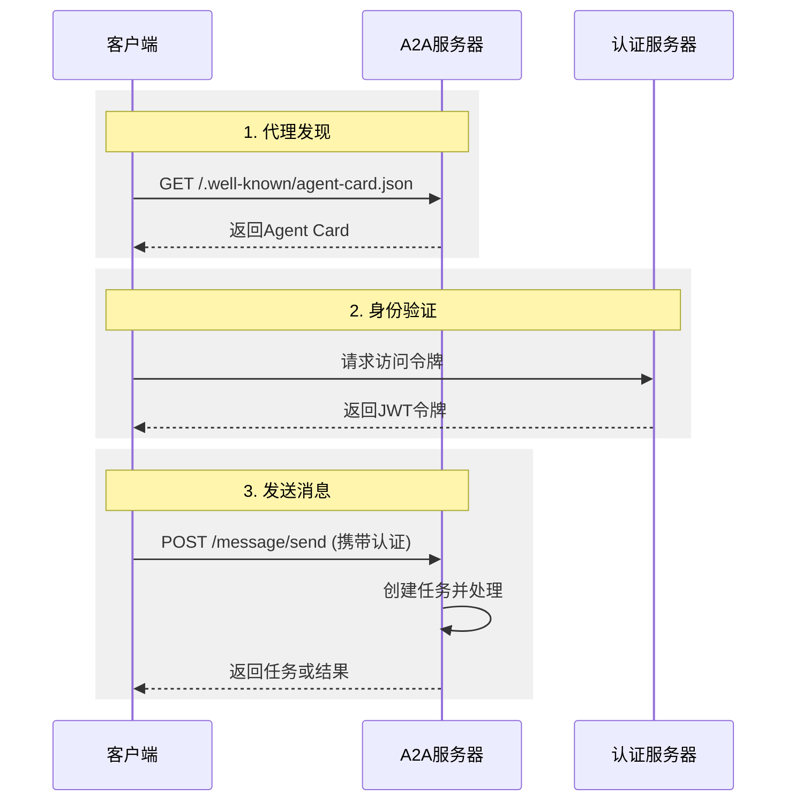

# A2A协议基础概念

## 什么是A2A？

Agent2Agent（A2A）协议是一个开放标准，解决AI代理间通信和协作的根本挑战：**不同团队、技术栈、组织构建的AI代理如何有效协作？**

### 典型应用场景

用户要求AI助手制定国际旅行计划，需要协调多个专业代理：
- 航班预订代理
- 酒店预订代理  
- 旅游推荐代理
- 货币汇率代理

没有统一协议，每个集成都是定制化方案，难以扩展和维护。

### A2A解决方案

A2A为独立的"黑盒"代理系统提供标准化交互方式：

- **统一通信格式** - JSON-RPC 2.0 over HTTP(S)的消息结构和传输
- **代理发现机制** - 通过Agent Card公布和发现代理能力
- **任务管理工作流** - 支持长时间运行和多轮交互的任务
- **多模态数据交换** - 处理文本、文件、结构化数据等多种内容
- **安全通信原则** - 无需暴露内部状态的安全协作机制

### 设计原则

- **简单性** - 基于HTTP、JSON-RPC、SSE等成熟标准
- **企业级就绪** - 内置认证、授权、安全、监控支持
- **异步优先** - 原生支持长时间任务和断开连接场景
- **模式无关** - 支持多种内容类型的灵活交互
- **不透明执行** - 保护代理内部逻辑和知识产权

## 核心概念

### 参与者


- **用户** - 发起请求的人类或自动化服务
- **A2A客户端** - 代表用户请求的应用程序或代理
- **A2A服务器** - 提供HTTP端点的远程代理，处理请求并返回结果

### 基础组件

#### Agent Card（代理卡片）
JSON格式的代理"身份证"，通常位于`/.well-known/agent-card.json`：

```json
{
  "name": "旅行助手",
  "description": "专业的旅行规划代理",
  "url": "https://api.example.com/travel-agent",
  "capabilities": {
    "streaming": true,
    "pushNotifications": false
  },
  "skills": [
    {
      "id": "flight_booking",
      "name": "航班预订",
      "description": "搜索和预订国际航班"
    }
  ],
  "defaultInputModes": ["text/plain"],
  "defaultOutputModes": ["text/plain", "application/json"]
}
```

#### Task（任务）
有状态的工作单元，具有唯一ID和生命周期：

- `submitted` - 已提交
- `working` - 处理中
- `input-required` - 需要输入
- `completed` - 已完成
- `failed` - 失败
- `cancelled` - 已取消

#### Message（消息）
客户端和代理间的通信单元：

```json
{
  "messageId": "msg-123",
  "role": "user",
  "parts": [
    {
      "kind": "text", 
      "text": "请帮我预订明天到巴黎的航班"
    }
  ]
}
```

#### Part（内容部分）
消息或工件的基本内容单元：

- **TextPart** - 纯文本内容
- **FilePart** - 文件数据（内联或URI引用）
- **DataPart** - 结构化JSON数据

#### Artifact（工件）
任务生成的有形输出结果：

```json
{
  "artifactId": "flight-result-456",
  "name": "航班预订确认",
  "description": "巴黎航班预订详情",
  "parts": [
    {
      "kind": "data",
      "data": {
        "flightNumber": "AF123",
        "departure": "2024-01-15T10:00:00Z",
        "price": "€450"
      }
    }
  ]
}
```

### 交互机制

#### 1. 请求/响应（轮询）
- 客户端发送`message/send`请求
- 服务器立即响应或返回任务状态
- 客户端轮询`tasks/get`获取更新

#### 2. 流式传输（SSE）
- 客户端发送`message/stream`请求
- 服务器保持HTTP连接开放
- 实时推送任务状态和工件更新

#### 3. 推送通知
- 客户端提供webhook URL
- 服务器在关键状态变化时发送通知
- 适用于长时间运行的任务

### 上下文管理

**contextId** - 逻辑分组相关任务和消息的标识符：

- 服务器生成，用于维护会话上下文
- 支持多任务协作和上下文共享
- LLM代理可用于管理对话历史

### 安全与认证

A2A采用标准Web安全实践：

- **传输安全** - 强制HTTPS加密
- **认证方式** - API Key、OAuth 2.0、mTLS等
- **授权控制** - 基于技能和资源的细粒度权限
- **Agent Card声明** - 在代理卡片中公布安全要求

### 请求生命周期



## A2A与MCP的关系

A2A和[模型上下文协议（MCP）](https://modelcontextprotocol.io/)是互补的标准：

- **MCP** - 连接代理到工具、API和资源的结构化接口
- **A2A** - 实现代理间动态、多模态的对等通信

### 协作模式


代理系统同时使用两种协议：
- 使用MCP访问工具和数据源
- 使用A2A与其他代理协作

### 汽车修理厂示例

1. **客户交互（A2A）** - 客户与接待代理对话诊断问题
2. **工具使用（MCP）** - 机械师代理调用诊断工具和数据库
3. **供应商协作（A2A）** - 与零件供应商代理协商采购

通过理解这些基础概念，开发者可以有效设计和实现A2A兼容的代理系统。