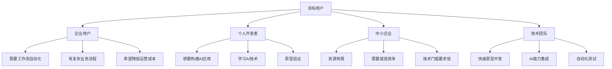
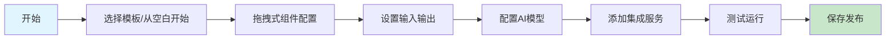
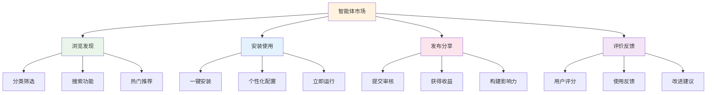
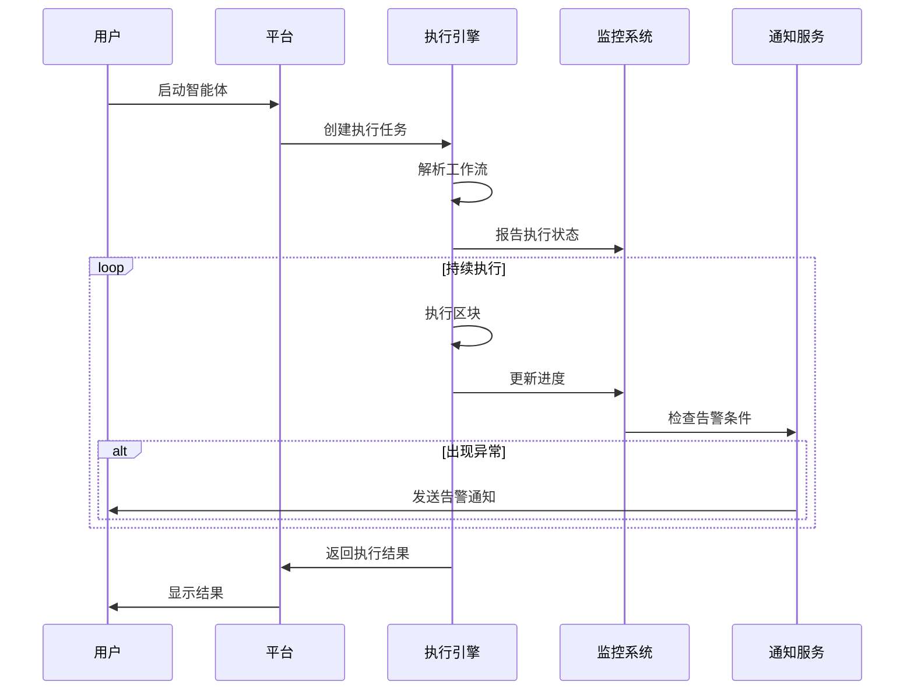
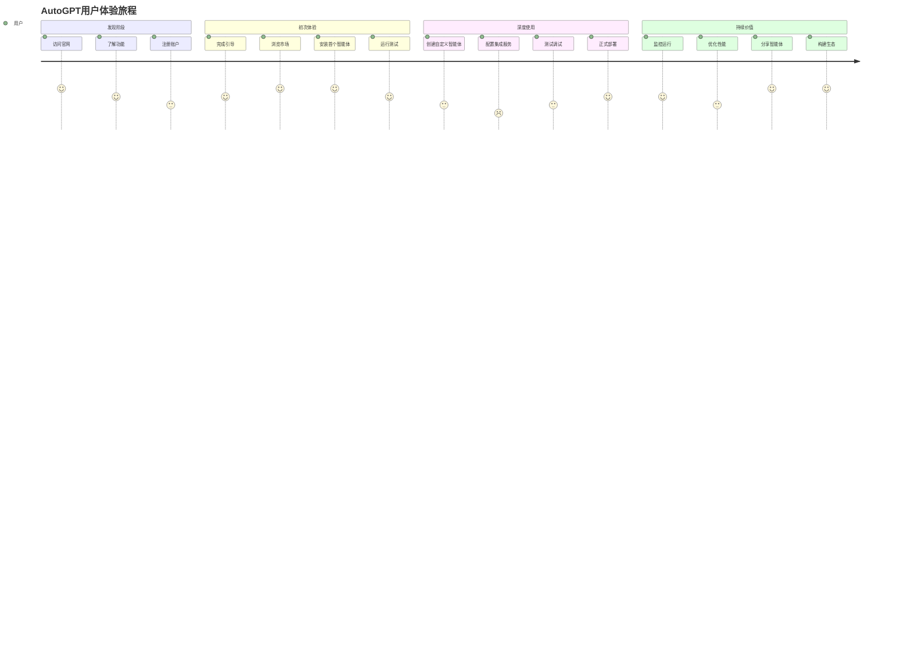
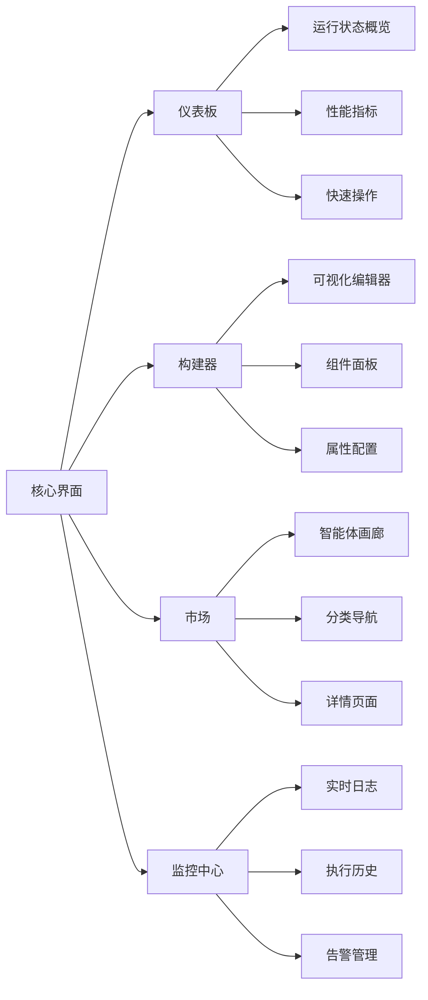
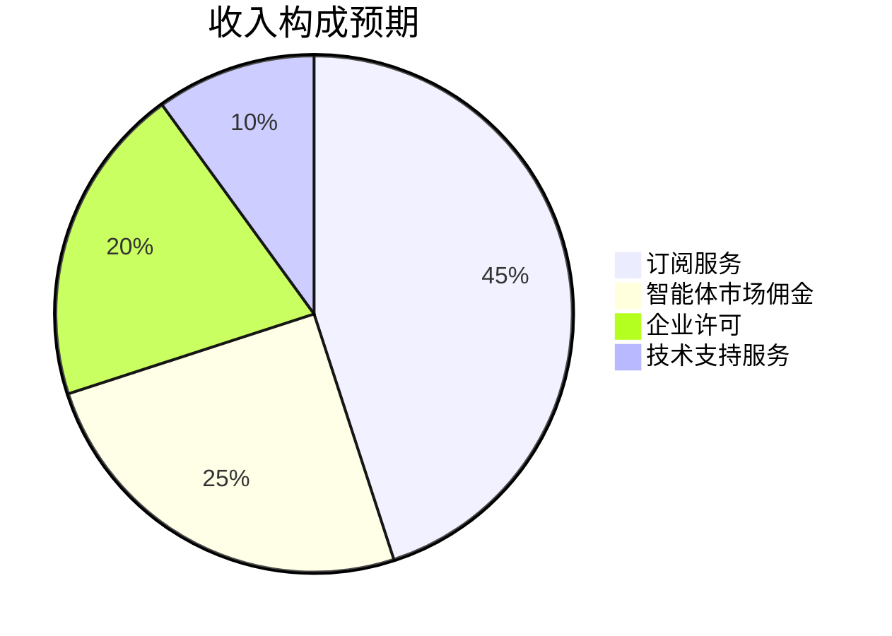
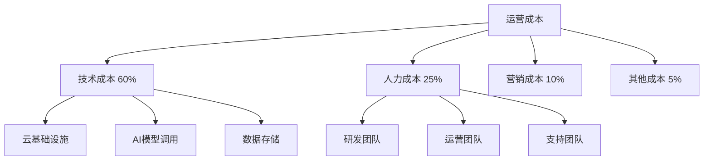
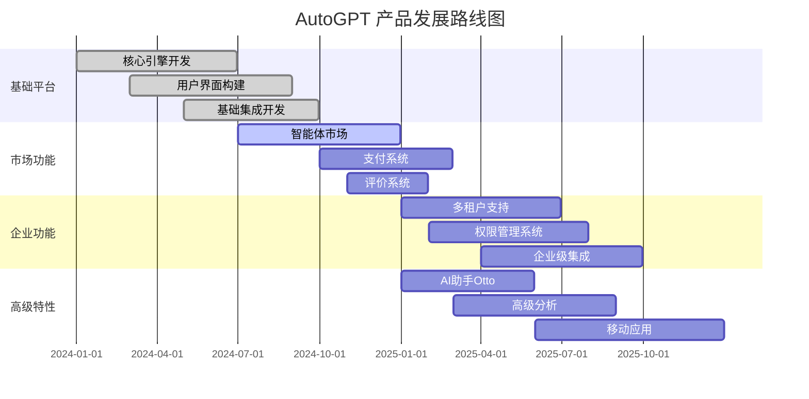

# AutoGPT 产品文档 - 产品经理视角

## 📋 项目概述

AutoGPT 是一个强大的 AI 智能体平台，允许用户创建、部署和管理持续运行的 AI 智能体来自动化复杂的工作流程。该平台提供了自托管和云托管两种解决方案，致力于让 AI 自动化触手可及。

### 🚀 核心价值主张

- **低代码/无代码**：通过可视化界面构建智能体，无需编程知识
- **持续自动化**：智能体可以持续运行，处理复杂的多步骤任务
- **丰富的集成**：支持超过50种第三方服务和API集成
- **企业级**：提供用户管理、权限控制、监控和分析功能

## 🎯 目标用户群体

**图表说明**：AutoGPT平台面向多种用户群体，包括需要工作流自动化的企业用户、希望构建AI应用的个人开发者、资源有限但需提高效率的中小企业，以及需要快速原型开发的技术团队。

## 🌟 核心功能特性

### 1. 智能体构建器 (Agent Builder)

**图表说明**：智能体构建流程从选择模板开始，通过可视化的拖拽操作配置组件，设置输入输出参数，选择合适的AI模型，集成第三方服务，经过测试后发布智能体。

- **可视化编辑器**：拖拽式区块组装，直观易用
- **预设模板**：提供多种行业场景的智能体模板
- **实时预览**：即时查看构建效果和执行流程
- **版本管理**：支持智能体版本控制和回滚

### 2. 智能体市场 (Marketplace)

**图表说明**：智能体市场提供完整的生态系统，用户可以浏览发现各类智能体，一键安装并个性化配置，同时也可以发布分享自己的智能体获得收益，通过评价反馈机制持续改进。

### 3. 执行引擎与监控

**图表说明**：智能体执行流程显示了从用户启动智能体到获得结果的完整过程，包括任务创建、工作流解析、持续执行监控、异常告警和结果返回等关键步骤。

## 📱 用户旅程图

**图表说明**：用户旅程图展现了从发现AutoGPT到深度使用的完整体验路径，分为发现阶段、初次体验、深度使用和持续价值四个阶段，数值表示用户满意度评分。

## 🎨 用户界面设计原则

### 设计理念
- **简洁直观**：清晰的视觉层次，减少认知负荷
- **功能导向**：以用户任务为中心的界面布局
- **一致性**：统一的设计语言和交互模式
- **可访问性**：支持多种设备和无障碍访问

### 关键界面组件

**图表说明**：AutoGPT的核心界面包括仪表板、构建器、市场和监控中心四大模块，每个模块都有其特定的功能组件，为用户提供完整的平台体验。

## 📊 商业模式分析

### 收入模式

**图表说明**：AutoGPT的收入模式多元化，主要包括云服务订阅、智能体市场交易佣金、企业级许可销售和技术支持服务，形成可持续的商业模式。

### 成本结构

**图表说明**：成本结构显示技术成本占主导地位（60%），主要用于云基础设施、AI模型调用和数据存储，人力成本次之（25%），营销和其他成本相对较低。

## 🚧 产品路线图

**图表说明**：产品路线图展示了AutoGPT从基础平台建设到企业级功能完善的发展计划，分为基础平台、市场功能、企业功能和高级特性四个阶段，时间跨度为两年。

## 🎯 关键性能指标 (KPI)

### 用户增长指标
- **月活跃用户数 (MAU)**：目标增长率 20%/月
- **用户留存率**：30天留存率 > 40%
- **用户转化率**：免费用户到付费用户 > 5%

### 平台健康度指标
- **智能体创建数**：平均每用户创建 2+ 个智能体
- **智能体成功执行率**：> 95%
- **平台可用性**：> 99.9%

### 商业指标
- **月度经常性收入 (MRR)**：目标年增长率 300%
- **客户获取成本 (CAC)**：< 3个月收入
- **客户生命周期价值 (LTV)**：> 12个月收入

## 🔮 未来展望

### 技术发展方向
1. **多模态AI支持**：图像、语音、视频处理能力
2. **边缘计算**：支持本地部署和边缘执行
3. **联邦学习**：保护隐私的分布式模型训练
4. **自动优化**：AI驱动的智能体性能自动调优

### 市场拓展计划
1. **垂直行业解决方案**：针对特定行业的定制化智能体
2. **国际化**：多语言支持和本地化部署
3. **生态伙伴**：与更多企业和开发者建立合作关系
4. **开源社区**：构建活跃的开源贡献者社区

---

*本文档反映了AutoGPT项目的产品战略和发展方向，为产品决策提供全面的业务视角分析。*