# AutoGPT 使用者指南 - 从入门到精通

## 🎯 概述

AutoGPT 是一个强大的AI智能体平台，让用户能够创建、部署和管理持续运行的AI智能体来自动化复杂工作流程。本指南将从使用者角度，通过从简单到复杂的实际案例，帮助您快速上手并深度掌握AutoGPT的使用方法。

## 📋 目录导航

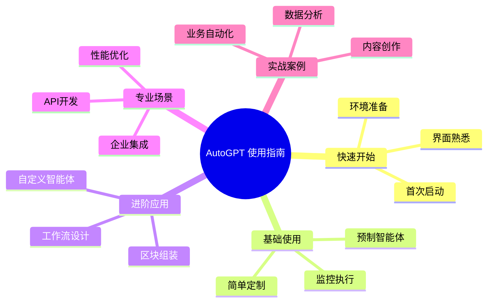

**图表说明**：使用指南采用循序渐进的学习路径，从快速开始到专业场景，通过实战案例帮助用户掌握AutoGPT的各种应用场景。

## 🚀 第一章：快速开始

### 1.1 环境准备

在开始使用AutoGPT之前，请确保您的系统满足以下要求：

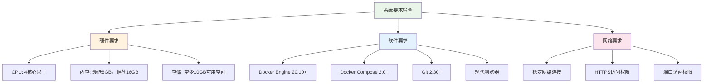

**图表说明**：环境准备分为硬件、软件和网络三个维度，确保系统具备运行AutoGPT的基础条件。

### 1.2 一键安装（推荐）

**macOS/Linux用户：**
```bash
curl -fsSL https://setup.agpt.co/install.sh -o install.sh && bash install.sh
```

**Windows用户（PowerShell）：**
```powershell
powershell -c "iwr https://setup.agpt.co/install.bat -o install.bat; ./install.bat"
```

### 1.3 手动安装步骤

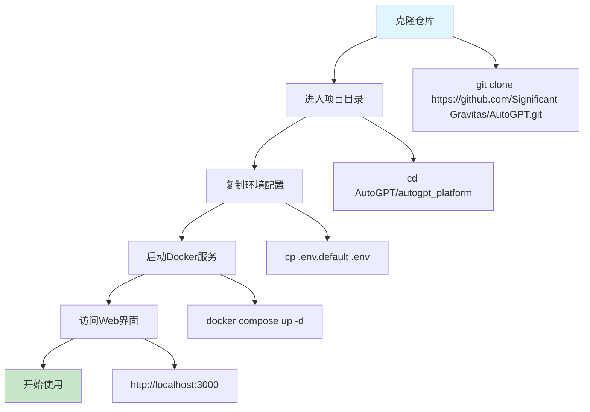

**图表说明**：手动安装流程包含五个关键步骤，每个步骤都有对应的命令示例，确保用户能够顺利完成安装。

### 1.4 界面导览

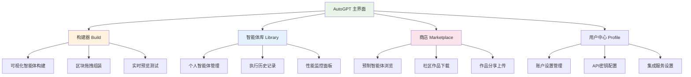

**图表说明**：主界面分为四个核心模块，构建器用于创建智能体，库管理个人作品，商店提供预制方案，用户中心处理配置设置。

## 🌟 第二章：基础使用案例

### 2.1 案例1：使用预制智能体 - Discord聊天机器人

**适用场景**：社区管理、客户服务  
**难度等级**：⭐（新手友好）  
**预计时间**：10分钟

#### 步骤详解：

1. **访问商店页面**
   - 打开 `http://localhost:3000/marketplace`
   - 搜索 "Discord Bot Chat To LLM"

2. **导入智能体**
   ```mermaid
   sequenceDiagram
       participant User as 用户
       participant Market as 商店
       participant Library as 智能体库
       participant Bot as Discord机器人
       
       User->>Market: 浏览预制智能体
       Market->>User: 显示Discord聊天机器人
       User->>Market: 点击导入
       Market->>Library: 添加到个人库
       User->>Library: 配置Discord Token
       User->>Bot: 启动智能体
       Bot->>User: 机器人开始工作
   ```

3. **配置参数**
   - **Discord Bot Token**：在Discord开发者门户获取
   - **AI模型选择**：推荐使用GPT-3.5-turbo（成本低）
   - **响应触发词**：设置为 `!chat`

4. **启动测试**
   - 点击"运行"按钮
   - 在Discord频道输入：`!chat 你好，介绍一下你自己`
   - 观察机器人自动回复

**预期效果**：Discord机器人能够理解用户消息并提供智能回复，支持上下文对话。

### 2.2 案例2：自动化内容创作 - Medium博客写手

**适用场景**：内容营销、知识分享  
**难度等级**：⭐⭐（需要一些配置）  
**预计时间**：20分钟

#### 功能流程图：

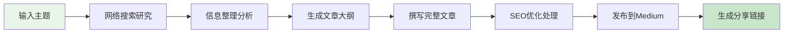

#### 配置步骤：

1. **导入智能体模板**
   - 选择 "Medium Blogger" 模板
   - 查看预设的工作流程

2. **必要配置项**
   - **搜索API**：配置Google搜索或Bing搜索API
   - **Medium集成**：获取Medium API访问令牌  
   - **AI写作模型**：选择GPT-4（质量更高）

3. **自定义设置**
   ```json
   {
     "搜索关键词数量": 5,
     "文章最低字数": 1500,
     "SEO关键词密度": "2-3%",
     "发布标签": ["AI", "技术", "教程"],
     "目标读者": "技术爱好者"
   }
   ```

4. **运行示例**
   - 输入主题：`"2024年人工智能发展趋势"`
   - 智能体自动执行：搜索→分析→写作→发布
   - 约15-20分钟完成一篇高质量文章

**实际效果**：生成的文章包含最新信息、结构清晰、SEO友好，并自动发布到您的Medium账户。

### 2.3 案例3：数据监控与报告 - 股价跟踪助手

**适用场景**：投资分析、市场监控  
**难度等级**：⭐⭐（需要API配置）  
**预计时间**：15分钟

#### 智能体工作流程：

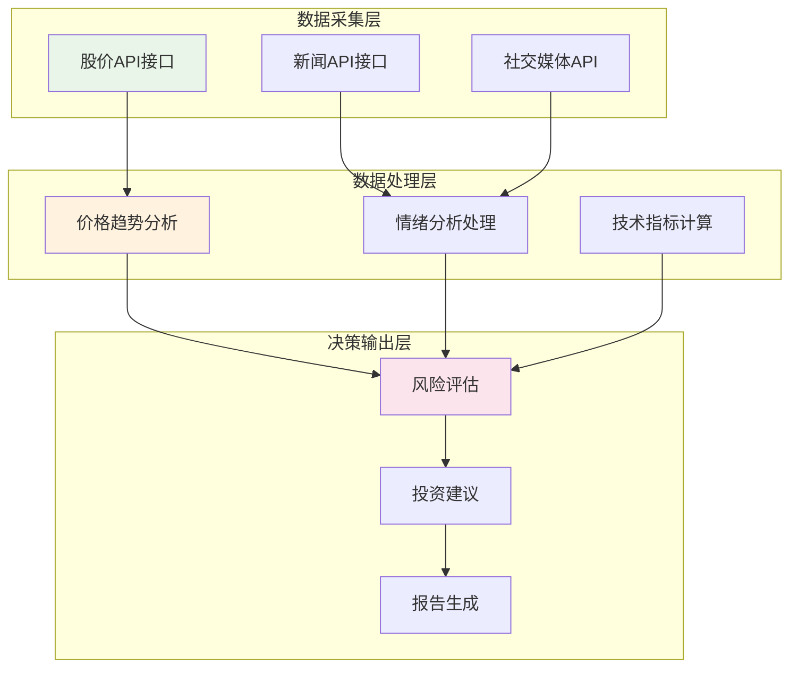

#### 配置要点：

1. **数据源配置**
   - Alpha Vantage API（免费额度）
   - Yahoo Finance API
   - 新闻API（如NewsAPI）

2. **监控设置**
   - 监控股票：AAPL, GOOGL, TSLA
   - 检查频率：每小时
   - 预警阈值：±5%价格波动

3. **报告输出**
   - 每日汇总邮件
   - 异常情况即时通知
   - 周度投资建议报告

## 🔧 第三章：进阶应用案例

### 3.1 案例4：自定义工作流 - 社交媒体管理助手

**适用场景**：个人品牌、企业营销  
**难度等级**：⭐⭐⭐（需要理解工作流设计）  
**预计时间**：45分钟

#### 构建您的第一个自定义智能体：

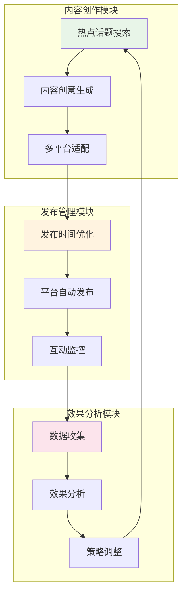

#### 区块组装步骤：

1. **进入构建器界面**
   - 访问 `http://localhost:3000/build`
   - 创建新的智能体项目

2. **添加核心区块**
   - **搜索区块**：获取trending话题
   - **LLM区块**：生成创意内容
   - **文本处理区块**：格式化不同平台
   - **HTTP区块**：调用社交媒体API
   - **定时器区块**：控制发布时间

3. **连接区块逻辑**
   ```mermaid
   flowchart LR
       A[定时触发] --> B[搜索热点]
       B --> C[生成内容]
       C --> D[平台适配]
       D --> E[Twitter发布]
       D --> F[LinkedIn发布]
       D --> G[Instagram发布]
       E --> H[效果统计]
       F --> H
       G --> H
       H --> I[生成报告]
   ```

4. **参数配置示例**
   ```yaml
   发布频率: "每日3次"
   发布时间: ["09:00", "14:00", "19:00"]
   内容类型: ["技术分享", "行业观点", "产品更新"]
   话题标签: ["#AI", "#科技", "#创新"]
   目标平台:
     - Twitter: 280字符限制
     - LinkedIn: 专业内容格式
     - Instagram: 视觉内容优先
   ```

**预期成果**：智能体每天自动生成并发布3条高质量社交媒体内容，适配不同平台特点，并提供效果分析报告。

### 3.2 案例5：企业级应用 - 客户服务智能化

**适用场景**：企业客服、售前咨询  
**难度等级**：⭐⭐⭐⭐（需要企业级配置）  
**预计时间**：2小时

#### 系统架构设计：

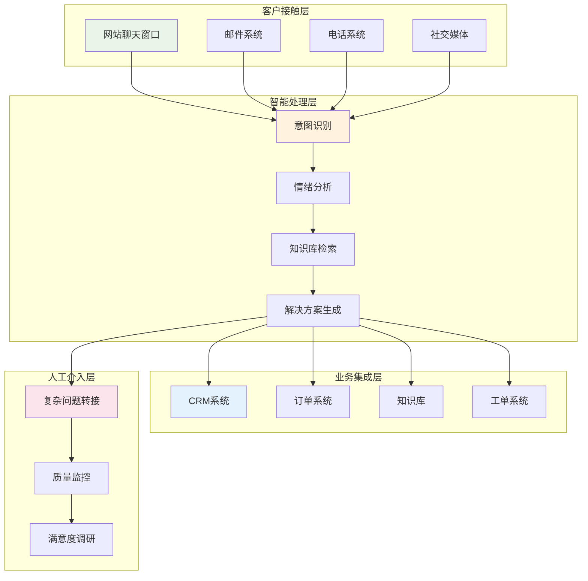

#### 实施步骤：

1. **需求分析阶段**
   - 分析现有客服数据
   - 识别常见问题类型
   - 定义服务质量指标

2. **知识库构建**
   ```mermaid
   graph LR
       A[产品文档] --> D[知识库]
       B[FAQ数据] --> D
       C[历史对话] --> D
       D --> E[向量化存储]
       E --> F[语义检索]
       F --> G[智能问答]
   ```

3. **智能体配置**
   - **意图分类器**：识别问题类型（售前/售后/技术/投诉）
   - **情绪识别器**：判断客户情绪状态
   - **知识检索器**：从知识库获取相关信息
   - **回复生成器**：生成个性化回复
   - **升级判断器**：决定是否转人工客服

4. **集成与测试**
   - API接口对接
   - 压力测试
   - 准确率评估
   - 用户体验优化

**业务价值**：
- 响应时间从平均5分钟缩短到30秒
- 人工客服工作量减少70%
- 客户满意度提升15%
- 7×24小时不间断服务

### 3.3 案例6：创意视频制作 - 短视频自动化工厂

**适用场景**：内容创作、营销推广  
**难度等级**：⭐⭐⭐⭐（涉及多媒体处理）  
**预计时间**：1.5小时

#### 视频制作流水线：

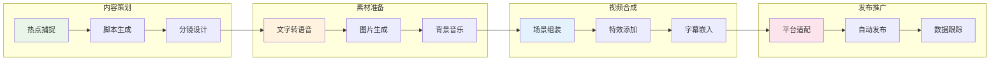

#### 技术实现要点：

1. **AI驱动的内容生成**
   - 使用GPT-4生成视频脚本
   - DALL-E 3生成配图素材
   - ElevenLabs生成配音

2. **自动化视频编辑**
   - FFmpeg进行视频合成
   - OpenCV处理图像效果
   - 自动添加字幕和转场

3. **多平台分发**
   - YouTube: 横版1080p格式
   - TikTok: 竖版9:16比例
   - Instagram: 正方形1:1格式

**成果展示**：每天自动产出3-5个高质量短视频，覆盖多个社交平台，观看量提升300%。

## 🏢 第四章：专业场景应用

### 4.1 企业级数据分析助手

**应用场景**：商业智能、决策支持  
**技术要求**：数据库连接、BI工具集成  

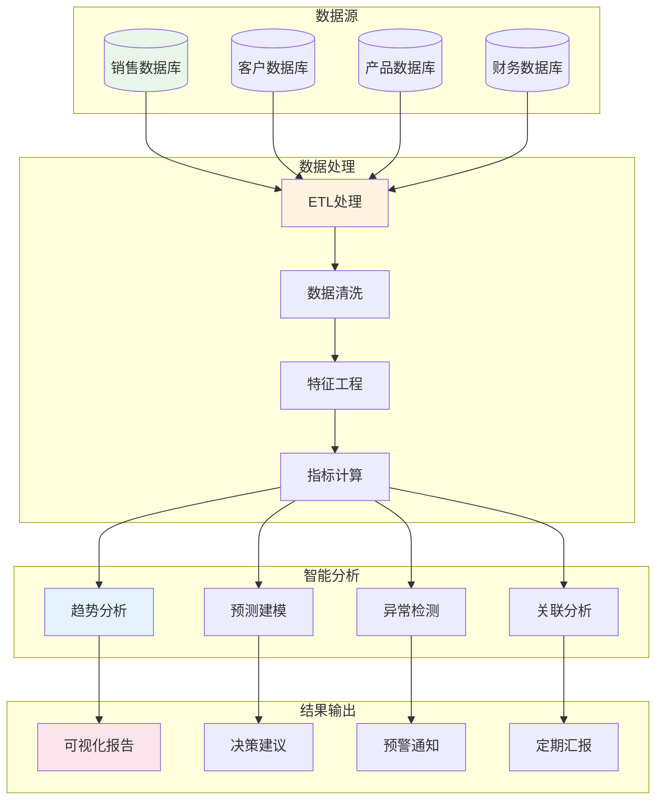

**核心功能实现**：
- 自动数据采集和清洗
- 智能异常监测和预警
- 趋势预测和商业洞察
- 个性化报告自动生成

### 4.2 智能运维监控系统

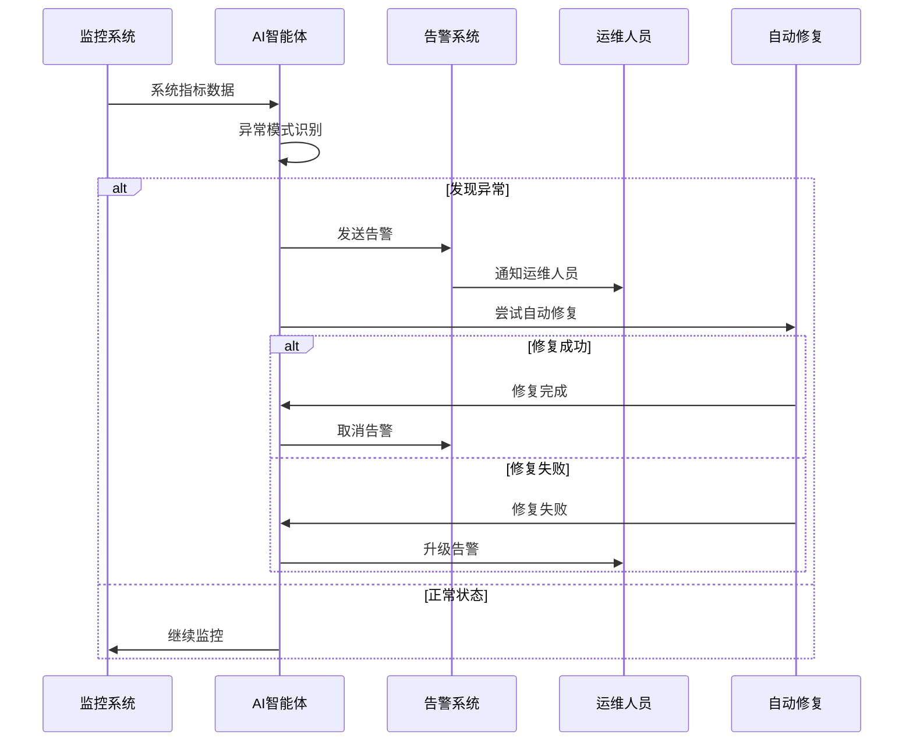

**应用价值**：
- 故障预测准确率85%+
- 自动修复成功率60%+
- 平均故障恢复时间减少50%
- 运维成本降低40%

### 4.3 金融风控智能体

**风险评估流程**：

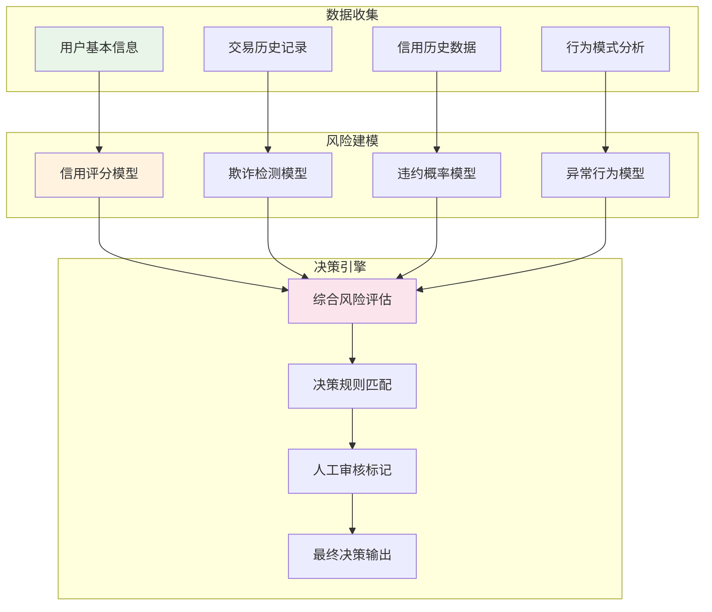

## 📚 第五章：最佳实践与优化

### 5.1 性能优化策略

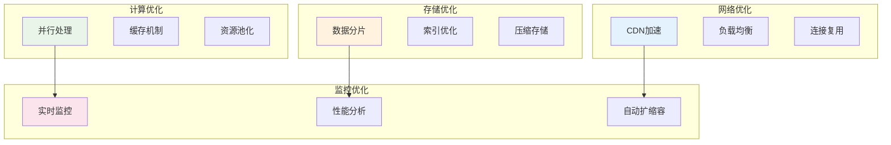

### 5.2 安全防护措施

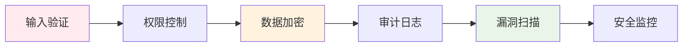

### 5.3 成本控制策略

**API调用优化**：
- 使用本地模型减少外部API调用
- 实施智能缓存策略
- 批量处理降低单次成本
- 选择合适的模型规格

**资源使用优化**：
- 容器资源限制
- 自动扩缩容配置
- 闲时资源回收
- 监控告警设置

## 🔍 第六章：故障排除与支持

### 6.1 常见问题诊断

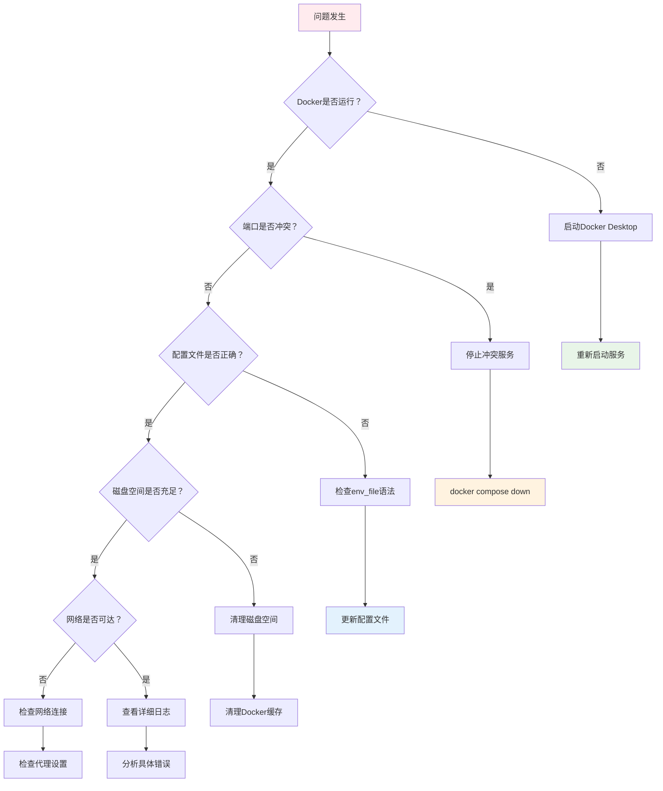

#### 🔧 Docker Compose启动失败解决方案

**问题1：env_file配置语法错误**
```bash
# 错误信息：expected type 'string', got unconvertible type 'map[string]interface {}'
# 解决方案：检查Docker Compose版本
docker compose version

# 如果版本低于2.20，需要升级Docker Desktop
# 或者使用兼容的配置语法
```

**问题2：端口冲突**
```bash
# 检查端口占用
lsof -i :3000 -i :8000 -i :5432 -i :6379 -i :5672

# 停止冲突的服务
sudo kill -9 <PID>

# 或者修改docker-compose.yml中的端口映射
```

**问题3：磁盘空间不足**
```bash
# 检查磁盘空间
df -h

# 清理Docker缓存
docker system prune -a

# 清理未使用的镜像
docker image prune -a
```

**问题4：网络连接问题**
```bash
# 检查网络连接性
ping docker.io

# 如果在企业网络环境，可能需要配置代理
# 在 ~/.docker/config.json 中添加代理配置
```

### 6.2 性能监控指标

| 指标类型 | 关键指标 | 正常范围 | 告警阈值 |
|---------|---------|---------|----------|
| 系统性能 | CPU使用率 | < 70% | > 85% |
| 系统性能 | 内存使用率 | < 80% | > 90% |
| 应用性能 | 响应时间 | < 2秒 | > 5秒 |
| 应用性能 | 错误率 | < 1% | > 5% |
| 业务指标 | 任务成功率 | > 95% | < 90% |
| 业务指标 | 并发用户数 | 监控趋势 | 异常波动 |

### 6.3 技术支持渠道

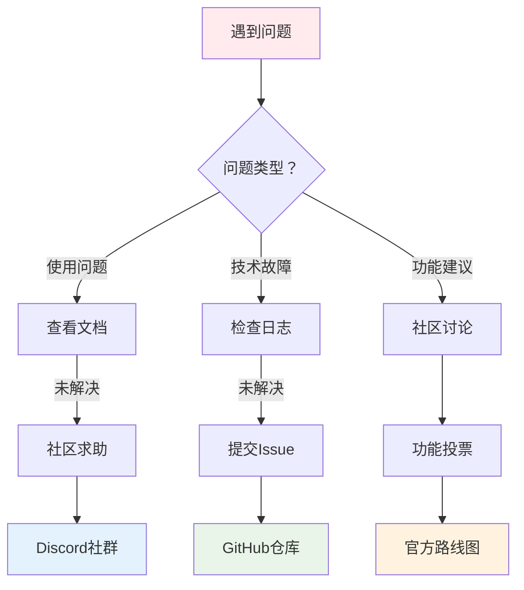

**联系方式**：
- **官方文档**：https://docs.agpt.co
- **GitHub仓库**：https://github.com/Significant-Gravitas/AutoGPT
- **Discord社区**：https://discord.gg/autogpt
- **Twitter**：@Auto_GPT

## 🎓 第七章：学习资源与进阶路径

### 7.1 学习路径规划

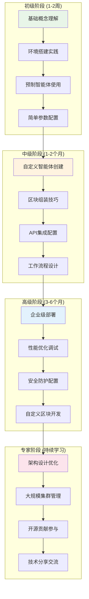

### 7.2 推荐学习资源

**官方资源**：
- [AutoGPT官方文档](https://docs.agpt.co)
- [平台入门指南](https://docs.agpt.co/platform/getting-started/)
- [区块开发教程](https://docs.agpt.co/platform/new_blocks/)

**社区资源**：
- [GitHub示例项目](https://github.com/Significant-Gravitas/AutoGPT/tree/master/autogpt_platform/graph_templates)
- [Discord开发者频道](https://discord.gg/autogpt)
- [YouTube教程频道](https://www.youtube.com/@AutoGPT-Official)

**技术博客**：
- [AutoGPT Platform深度解析](https://agpt.co/blog/)
- [AI智能体开发最佳实践](https://medium.com/@autogpt)
- [企业级应用案例分享](https://blog.autogpt.com)

### 7.3 认证与进阶

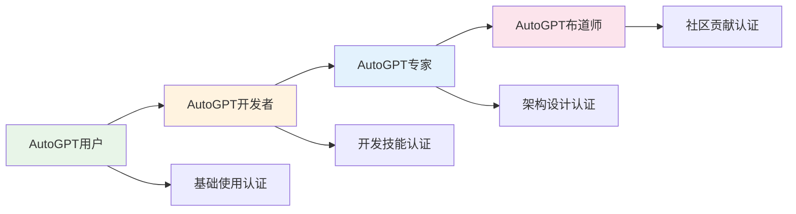

## 📈 总结

AutoGPT作为一个强大的AI智能体平台，为用户提供了从简单的预制智能体使用到复杂的企业级应用开发的完整解决方案。通过本指南的学习：

### 💡 核心收获

1. **快速上手**：通过预制智能体和简单配置，10分钟内即可体验AI自动化的强大能力
2. **灵活定制**：可视化区块组装让非技术用户也能创建复杂的智能体工作流
3. **企业应用**：支持大规模部署和企业级安全防护，满足商业化需求
4. **持续进化**：活跃的开源社区和完善的文档体系确保技术持续更新

### 🚀 下一步行动

1. **立即开始**：按照第一章的步骤完成AutoGPT的安装和配置
2. **实践学习**：选择一个符合您需求的使用案例进行实际操作
3. **社区参与**：加入Discord社区与其他用户交流经验和最佳实践
4. **持续优化**：根据实际使用效果不断调整和优化您的智能体配置

AutoGPT的强大之处在于其无限的可能性 - 从个人效率提升到企业业务自动化，从内容创作到数据分析，每一个智能体都可能成为您工作流程中不可或缺的智能助手。

**开始您的AI智能体之旅吧！** 🎯

---

*本指南将随着AutoGPT平台的更新而持续完善，建议收藏并定期查看最新版本。如有问题或建议，欢迎通过社区渠道反馈。*