# AutoGPT 开发文档 - 开发者视角

## 💻 开发环境设置

AutoGPT 是一个基于 Python 后端和 TypeScript 前端的现代化 AI 智能体平台。本文档将从开发者角度深入解析项目结构、开发流程和最佳实践。

### 🛠️ 技术栈概述

**后端技术栈**
- **Python 3.11+** - 现代异步编程
- **FastAPI** - 高性能异步 Web 框架
- **Prisma ORM** - 现代数据库 ORM
- **PostgreSQL** - 主数据库
- **Redis** - 缓存和会话存储
- **RabbitMQ** - 异步任务队列

**前端技术栈**
- **Next.js 15** - React 全栈框架
- **TypeScript** - 静态类型检查
- **Tailwind CSS** - 原子化 CSS 框架
- **Radix UI** - 无障碍组件库
- **React Query** - 数据获取和状态管理

## 📁 项目代码结构

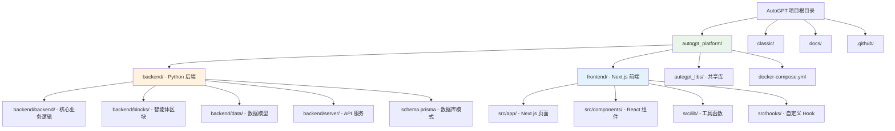

**图表说明**：AutoGPT项目采用monorepo结构，主要包含新平台(autogpt_platform)和经典版本(classic)。新平台分为后端(Python)和前端(Next.js)两个主要模块，各自包含完整的业务逻辑和UI组件。

## 🏗️ 后端架构深度解析

### 核心模块架构

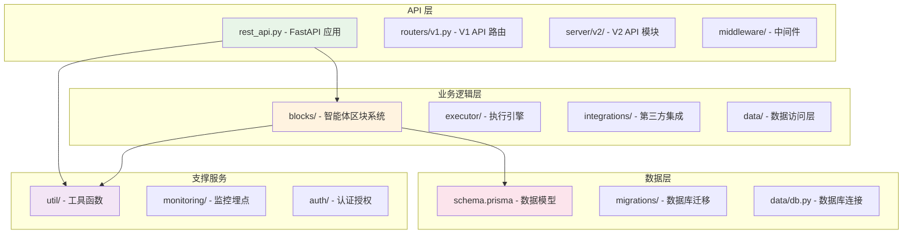

**图表说明**：后端采用分层架构，API层负责请求处理和路由，业务逻辑层包含智能体核心功能，数据层管理持久化存储，支撑服务提供横切关注点功能。

### 智能体区块系统

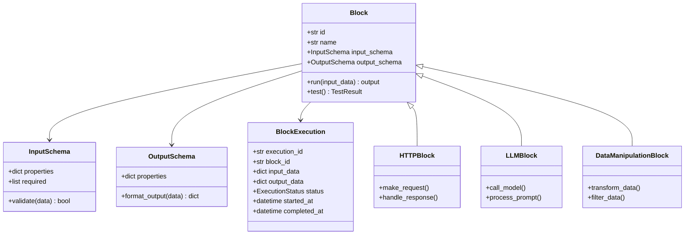

**图表说明**：区块系统采用面向对象设计，基础Block类定义了输入输出模式和执行接口，各种具体区块类型继承并实现特定功能，通过BlockExecution记录执行状态。

### API 路由结构

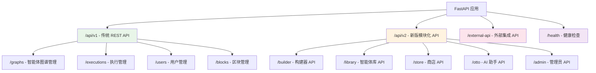

**图表说明**：API采用版本化设计，V1为传统REST API，V2采用模块化结构，外部API服务第三方集成，健康检查支持运维监控。

## 🎨 前端架构深度解析

### Next.js 应用结构

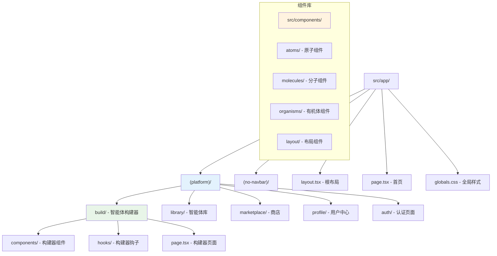

**图表说明**：前端采用Next.js App Router架构，按照平台功能分组路由，组件库遵循原子设计原则，分为原子、分子、有机体和布局四个层次。

### React 组件架构

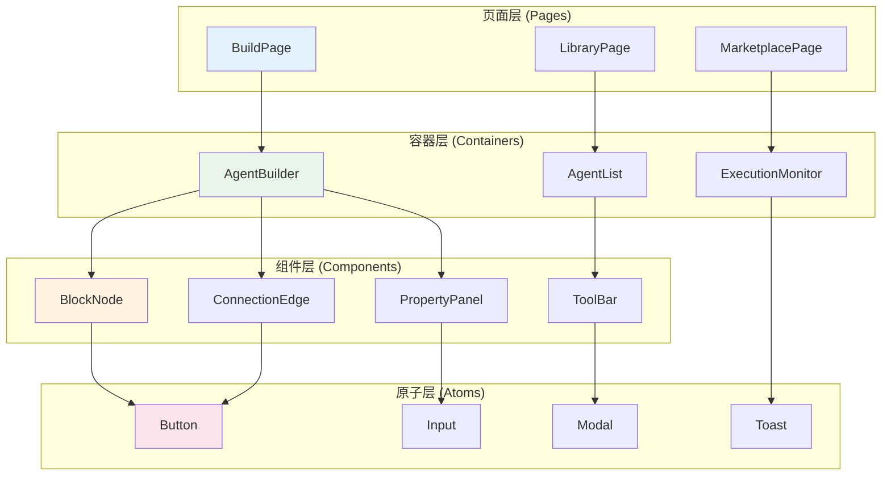

**图表说明**：React组件采用分层架构，页面层负责路由和布局，容器层管理状态和业务逻辑，组件层实现具体功能，原子层提供基础UI元素。

### 状态管理策略

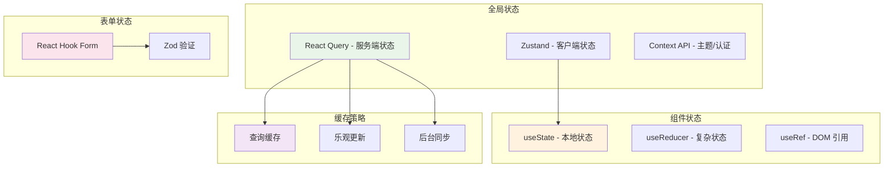

**图表说明**：状态管理采用多层次策略，React Query管理服务端状态和缓存，Zustand管理客户端全局状态，React Hook Form处理表单状态，各层状态独立管理避免冲突。

## 🔧 开发工作流程

### 开发环境搭建

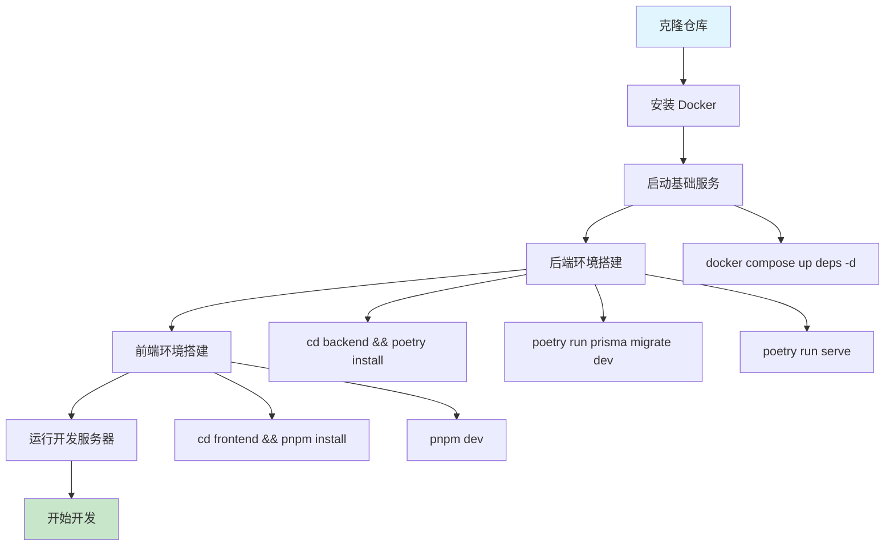

**图表说明**：开发环境搭建流程从仓库克隆开始，通过Docker启动基础服务，分别设置后端Poetry环境和前端pnpm环境，最后启动开发服务器。

**图表说明**：采用Git Flow工作流程，功能开发在feature分支进行，关键修复使用hotfix分支，主分支保持稳定，通过合并请求进行代码审查。

### 代码质量保证

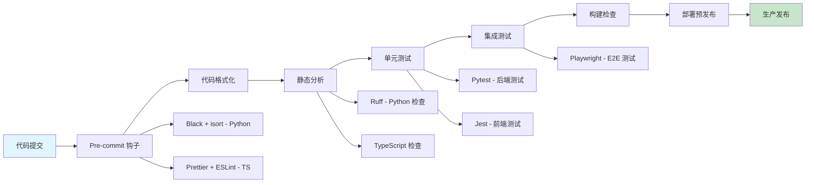

**图表说明**：代码质量保证流程包括提交前检查、自动化格式化、静态分析、多层次测试和构建验证，确保代码质量和系统稳定性。

## 🧪 测试策略

### 测试金字塔

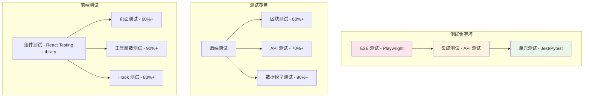

**图表说明**：测试策略遵循测试金字塔原则，单元测试覆盖面最广，集成测试验证模块交互，E2E测试保证用户体验，各层测试覆盖率目标明确。

### 测试执行流程

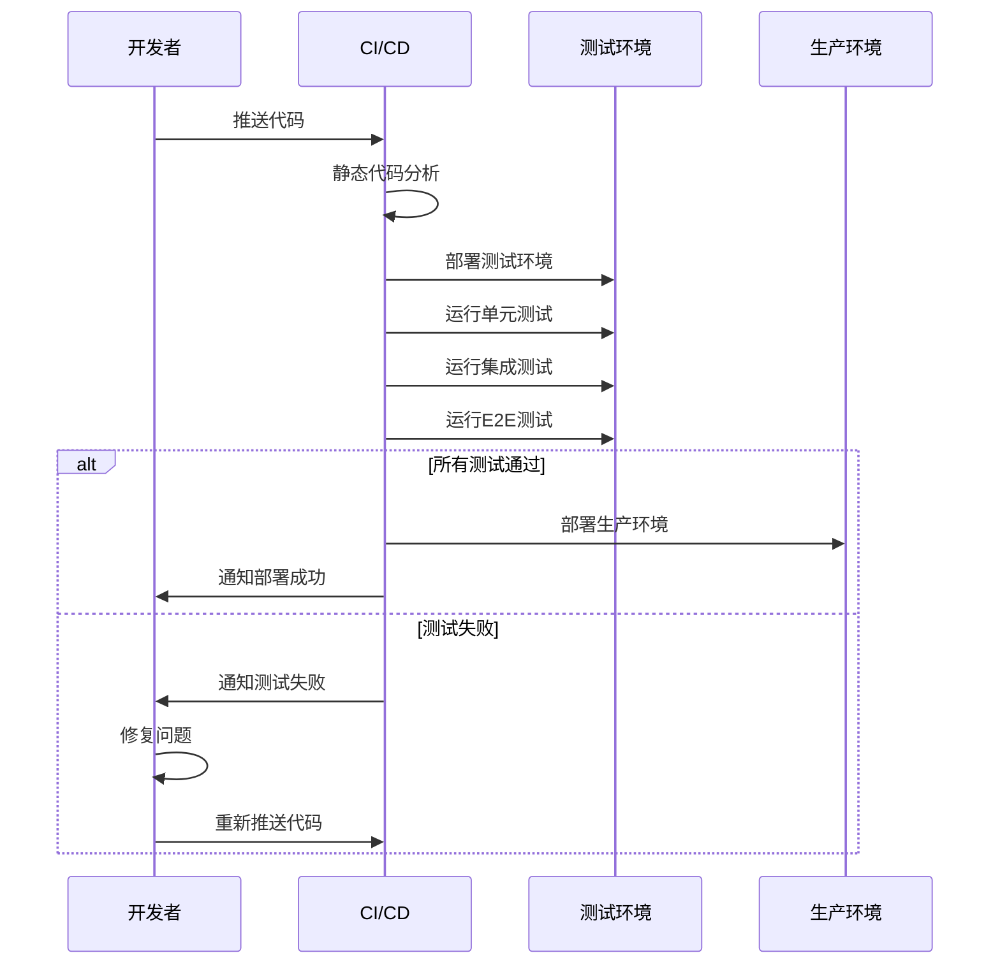

**图表说明**：测试执行流程自动化运行，从代码推送触发CI/CD管道，依次执行静态分析、各层测试，只有全部通过才能部署生产环境。

## 🚀 部署与发布

### 容器化部署

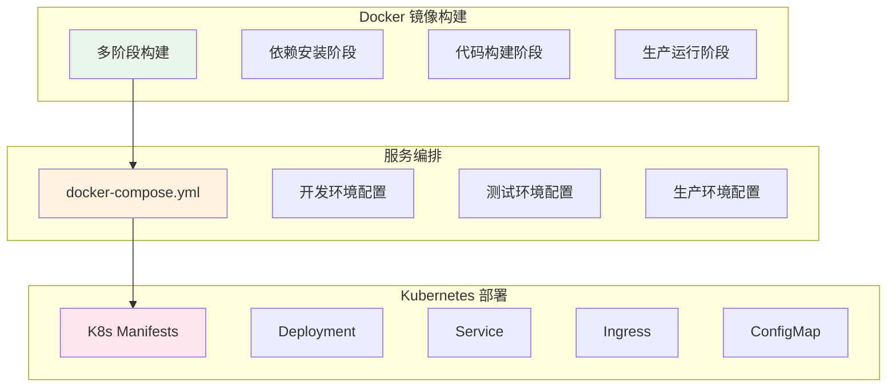

**图表说明**：容器化部署采用多阶段Docker构建优化镜像大小，Docker Compose管理本地开发环境，Kubernetes负责生产环境的服务编排和管理。

### CI/CD 流水线

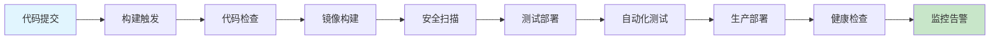

**图表说明**：CI/CD流水线从代码提交开始，经过构建、测试、安全扫描等多个阶段，最终自动部署到生产环境并启动监控。

## 📚 开发最佳实践

### 代码规范

```typescript
// 类型定义示例
interface AgentBlock {
  id: string;
  name: string;
  type: BlockType;
  inputSchema: JSONSchema;
  outputSchema: JSONSchema;
  execute(input: unknown): Promise<unknown>;
}

// React 组件示例
const BlockNode: React.FC<BlockNodeProps> = ({ 
  block, 
  position, 
  onUpdate 
}) => {
  const { data, isLoading, error } = useQuery({
    queryKey: ['block', block.id],
    queryFn: () => fetchBlockData(block.id),
  });

  return (
    <div className="block-node" data-testid="block-node">
      {/* 组件内容 */}
    </div>
  );
};
```

### Python 代码规范

```python
# 区块实现示例
class HTTPBlock(Block):
    """HTTP 请求区块，用于发送 HTTP 请求并处理响应"""
    
    class Input(BlockSchema):
        url: str = Field(description="请求URL")
        method: HttpMethod = Field(default=HttpMethod.GET)
        headers: Dict[str, str] = Field(default_factory=dict)
        
    class Output(BlockSchema):
        status_code: int = Field(description="HTTP状态码")
        response_data: Any = Field(description="响应数据")
        
    def __init__(self):
        super().__init__(
            id="http_request",
            description="发送HTTP请求",
            categories={BlockCategory.COMMUNICATION},
            input_schema=HTTPBlock.Input,
            output_schema=HTTPBlock.Output,
        )
    
    async def run(self, input_data: HTTPBlock.Input, **kwargs) -> HTTPBlock.Output:
        async with aiohttp.ClientSession() as session:
            async with session.request(
                method=input_data.method.value,
                url=input_data.url,
                headers=input_data.headers
            ) as response:
                data = await response.json()
                return HTTPBlock.Output(
                    status_code=response.status,
                    response_data=data
                )
```

### 性能优化指南

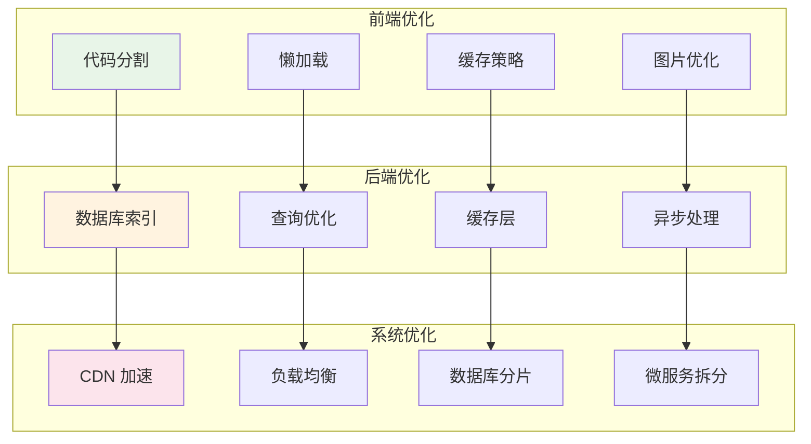

**图表说明**：性能优化从前端、后端、系统三个层面入手，前端重点优化资源加载和渲染，后端优化数据访问和处理，系统层面优化架构和部署。

## 🔍 调试与监控

### 本地调试工具

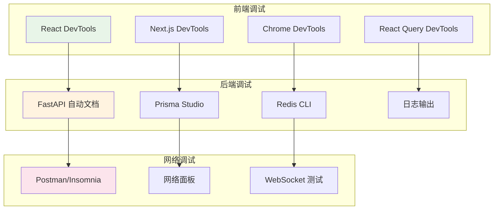

**图表说明**：调试工具涵盖前端、后端和网络各个层面，React DevTools调试组件状态，FastAPI提供API文档，Postman测试接口，形成完整的调试工具链。

### 生产监控

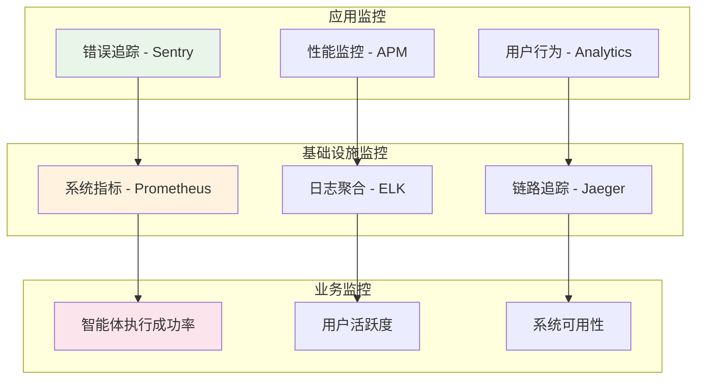

**图表说明**：生产监控分为应用监控、基础设施监控和业务监控三个维度，从技术指标到业务指标全面覆盖，确保系统稳定运行。

## 🎯 开发者成长路径

### 技能发展图谱

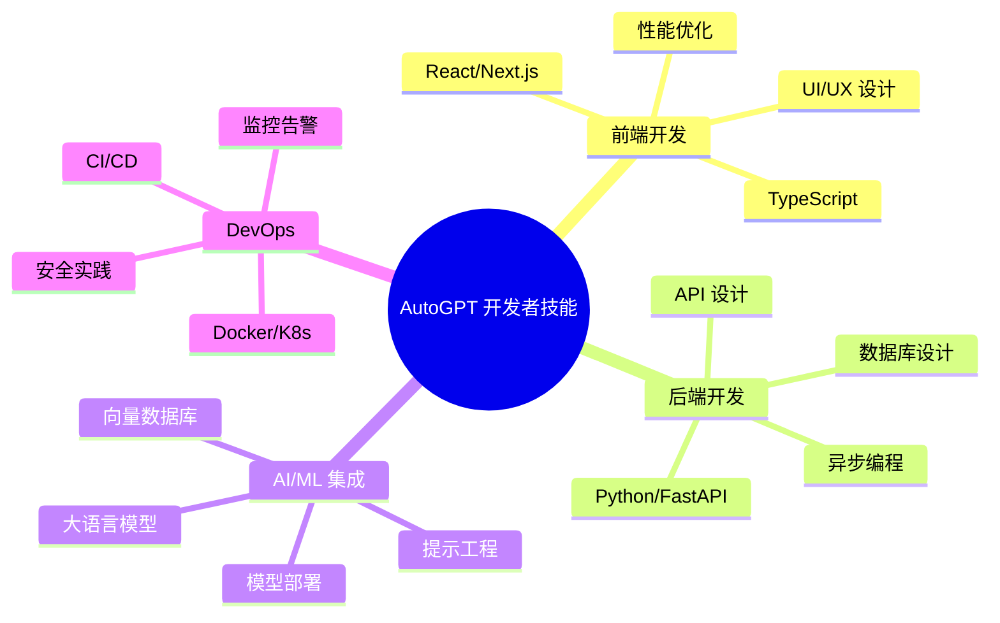

**图表说明**：开发者技能图谱涵盖前端开发、后端开发、AI/ML集成和DevOps四个核心领域，每个领域都有具体的技能要求和学习路径。

---

*本文档为AutoGPT开发者提供了全面的技术指南，从环境搭建到生产部署，助力开发者快速上手并深度参与项目开发。*