# AutoGPT 技术文档 - 架构师视角

## 🏗️ 系统架构概览

AutoGPT 是一个基于微服务架构的现代化 AI 智能体平台，采用前后端分离的设计模式，支持高并发、高可用和水平扩展。

### 🎯 架构设计原则

- **微服务架构**：松耦合、独立部署、技术栈多样化
- **事件驱动**：异步消息处理，提高系统响应性
- **云原生**：容器化部署，支持 Kubernetes 编排
- **可观测性**：全链路监控、日志聚合、性能分析

## 🏢 整体系统架构

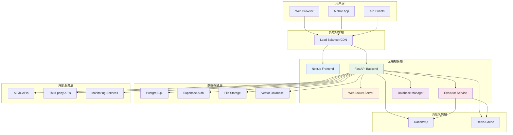

**图表说明**：AutoGPT采用分层架构设计，从用户层到外部服务层共六层，通过负载均衡器分发请求到不同的应用服务，使用消息队列处理异步任务，多种数据存储满足不同需求，集成丰富的外部服务。

## 🔧 技术栈架构

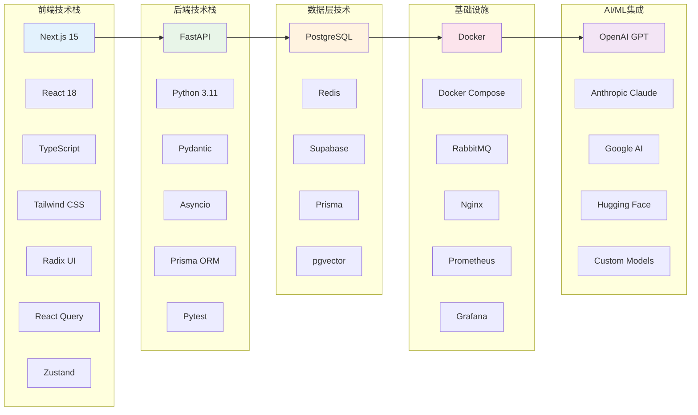

**图表说明**：技术栈展示了AutoGPT使用的现代化技术组合，前端采用Next.js + React生态，后端使用FastAPI + Python异步框架，数据层集成多种存储方案，基础设施全面容器化，深度集成主流AI/ML服务。

## 📊 数据架构设计

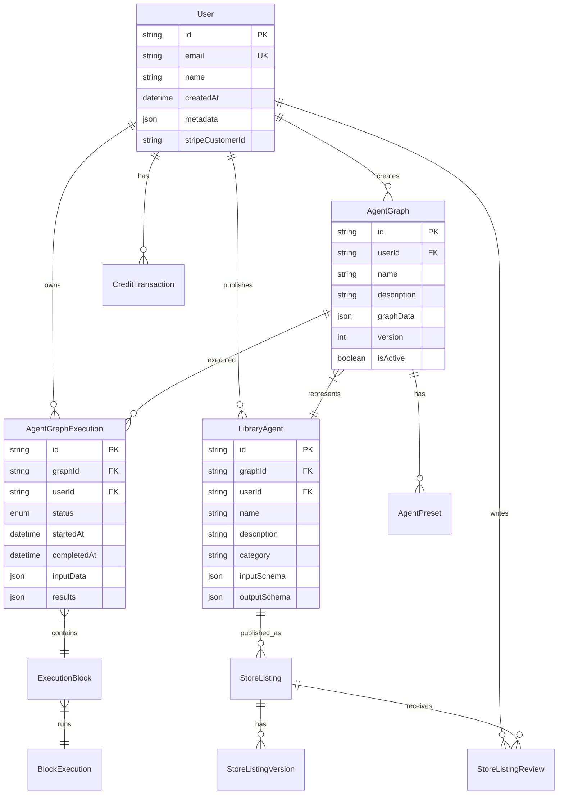

**图表说明**：数据模型展示了AutoGPT的核心实体关系，以User为中心，关联智能体图谱、执行记录、库中智能体、商店列表等实体，支持完整的用户生命周期管理和智能体生态运营。

## 🔄 服务交互流程

### 智能体执行流程

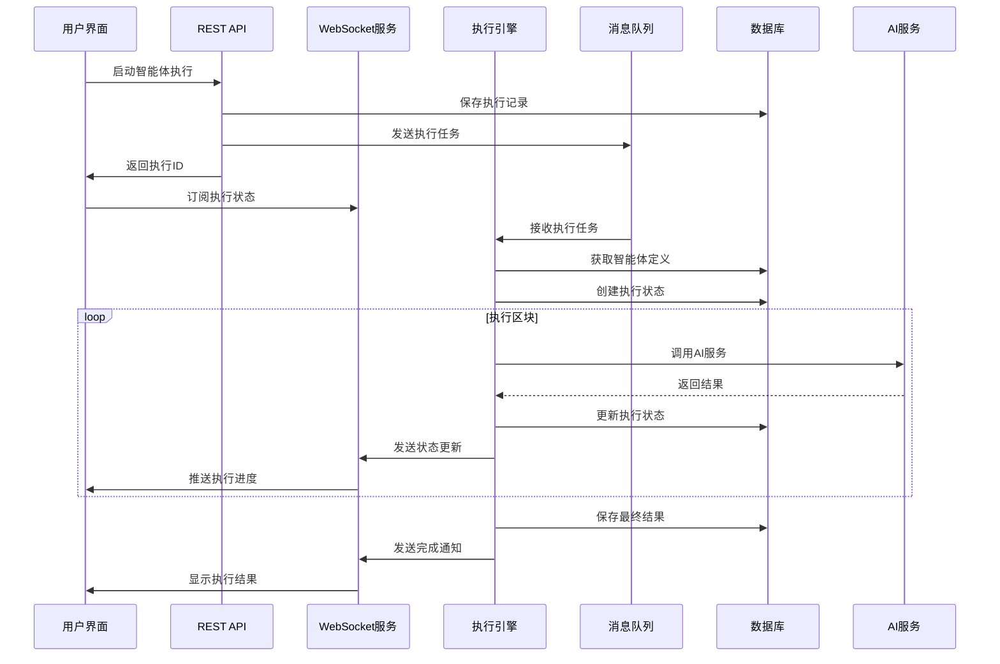

**图表说明**：智能体执行流程展示了从用户发起执行请求到获得结果的完整异步处理过程，通过消息队列实现任务分发，WebSocket提供实时状态更新，确保用户体验流畅。

### 智能体构建流程

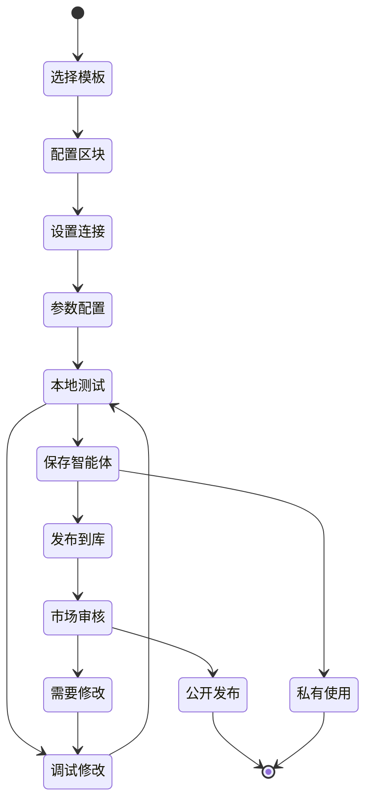

**图表说明**：智能体构建状态流程图显示了从模板选择到最终发布的完整状态转换过程，包括配置、测试、调试的迭代循环，以及发布路径的分支选择。

## 🏗️ 微服务组件架构

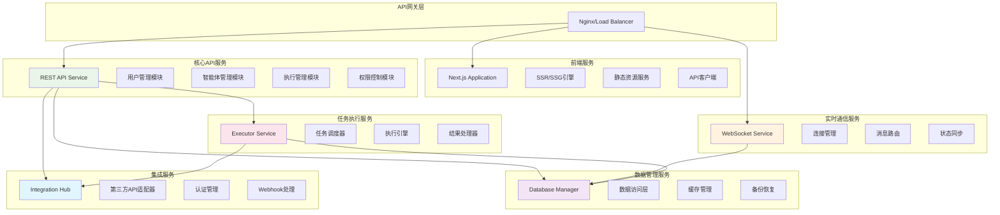

**图表说明**：微服务组件架构展示了AutoGPT平台的服务拆分策略，每个服务都有明确的职责边界，通过API网关统一入口，服务间通过异步消息和REST API进行通信。

## 🔐 安全架构设计

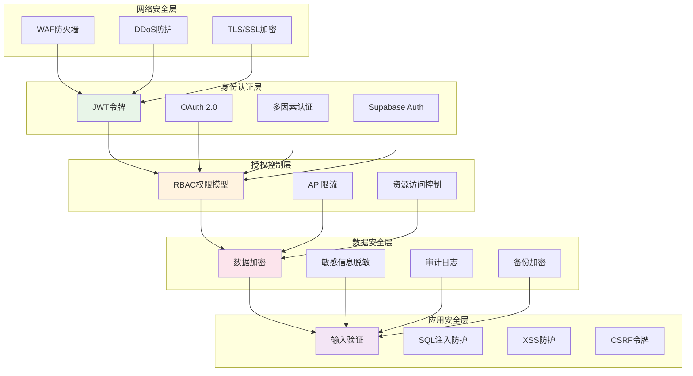

**图表说明**：安全架构采用多层防护策略，从网络层到应用层全面保护系统安全，包括防火墙、身份认证、权限控制、数据加密和应用安全等多个维度。

## 📈 性能优化架构

### 缓存策略

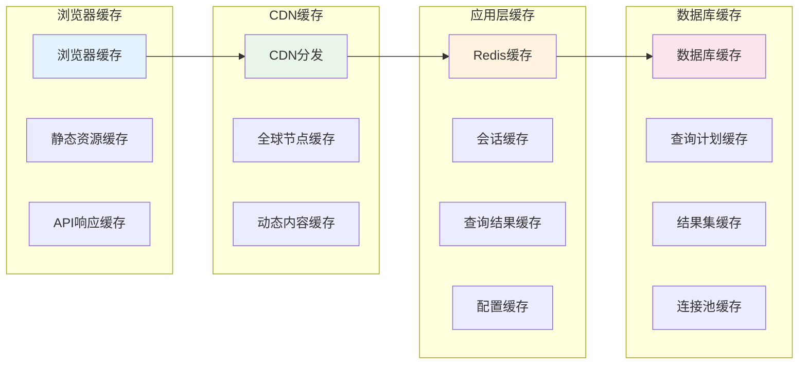

**图表说明**：多级缓存架构从浏览器到数据库全链路优化，通过静态资源缓存、CDN分发、Redis缓存和数据库缓存等手段，大幅提升系统响应速度和用户体验。

### 扩展策略

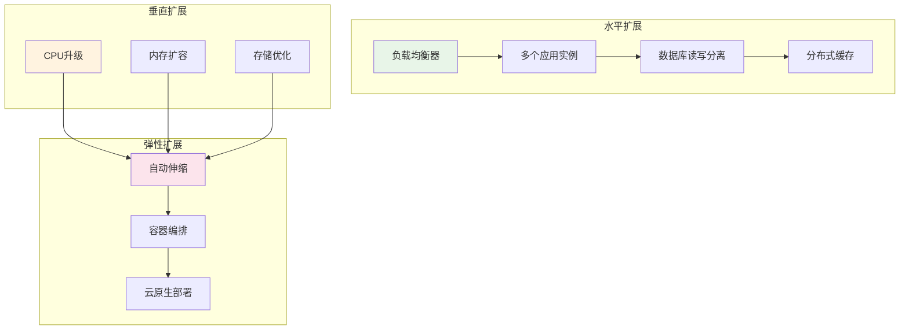

**图表说明**：扩展策略结合水平扩展、垂直扩展和弹性扩展三种方式，通过负载均衡、多实例部署、资源升级和自动伸缩等手段，确保系统能够应对不同规模的负载需求。

## 🔍 监控与可观测性

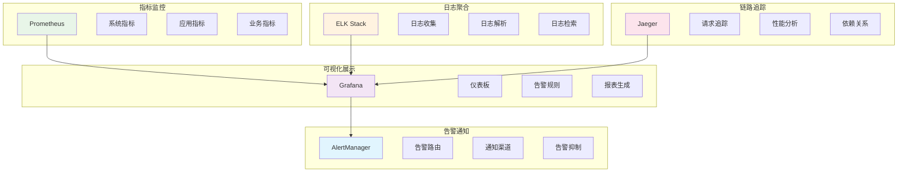

**图表说明**：监控体系包括指标监控、日志聚合、链路追踪、可视化展示和告警通知五个核心组件，形成完整的可观测性解决方案，帮助运维团队及时发现和解决问题。

## 🚀 部署架构

### 容器化部署

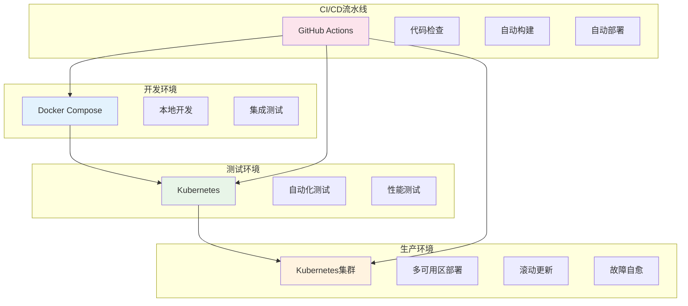

**图表说明**：容器化部署架构从开发到生产环境全面采用容器技术，通过Docker Compose支持本地开发，Kubernetes管理测试和生产环境，GitHub Actions提供完整的CI/CD流水线。

## 🔧 技术债务与重构计划

### 系统优化路线图

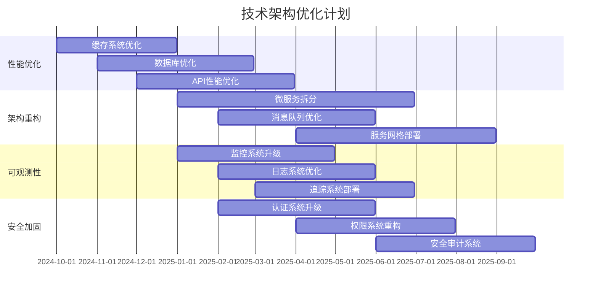

**图表说明**：技术优化路线图涵盖性能优化、架构重构、可观测性提升和安全加固四个方面，分阶段实施，确保系统持续演进和技术债务的有效管理。

## 📝 架构决策记录

### 关键技术选型决策

| 决策项 | 选择方案 | 替代方案 | 决策理由 |
|--------|----------|----------|----------|
| **前端框架** | Next.js | Nuxt.js, Vue.js | React生态成熟，SSR/SSG支持，开发体验优秀 |
| **后端框架** | FastAPI | Django, Flask | 异步性能优异，自动文档生成，类型安全 |
| **数据库** | PostgreSQL | MySQL, MongoDB | ACID特性完整，JSON支持，扩展性强 |
| **缓存方案** | Redis | Memcached | 数据结构丰富，持久化支持，集群功能 |
| **消息队列** | RabbitMQ | Apache Kafka | 易于使用，可靠性高，功能完整 |
| **容器编排** | Kubernetes | Docker Swarm | 生态成熟，社区活跃，企业级功能 |

### 架构约束与限制

1. **性能约束**
   - API响应时间 < 500ms (95分位)
   - 智能体执行延迟 < 10s
   - 系统可用性 > 99.9%

2. **扩展性约束**
   - 支持百万级用户并发
   - 单个智能体图谱节点数 < 1000
   - 智能体执行时长 < 30分钟

3. **安全约束**
   - 所有外部通信必须使用HTTPS
   - 敏感数据必须加密存储
   - 用户权限严格隔离

---

*本文档提供了AutoGPT平台的完整技术架构视图，为系统设计、开发和运维提供权威的技术指导。*