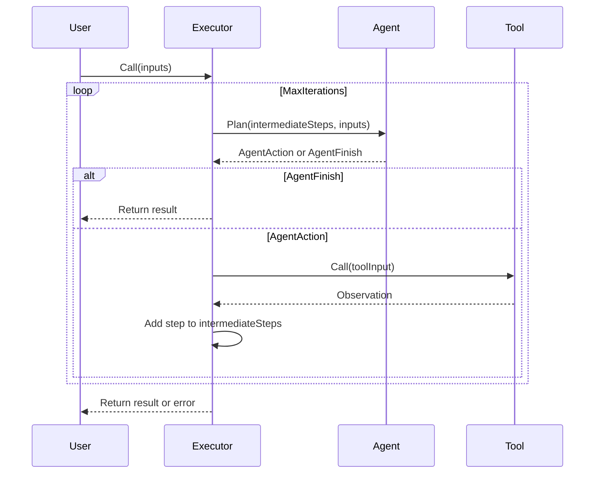
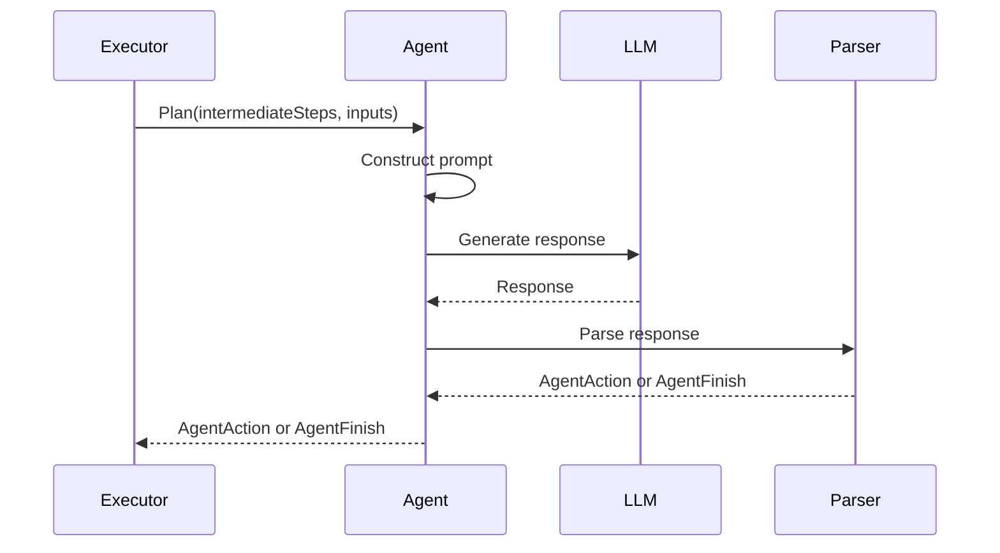
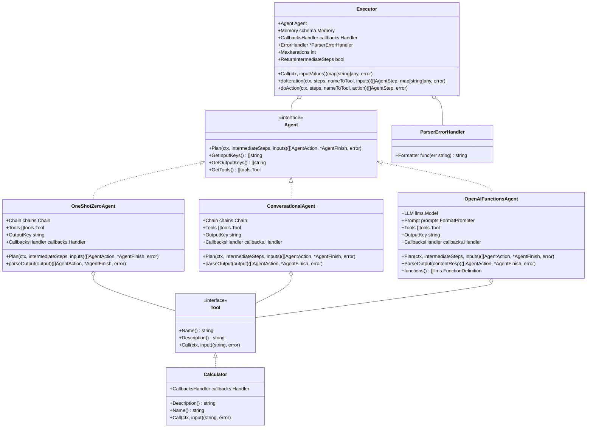
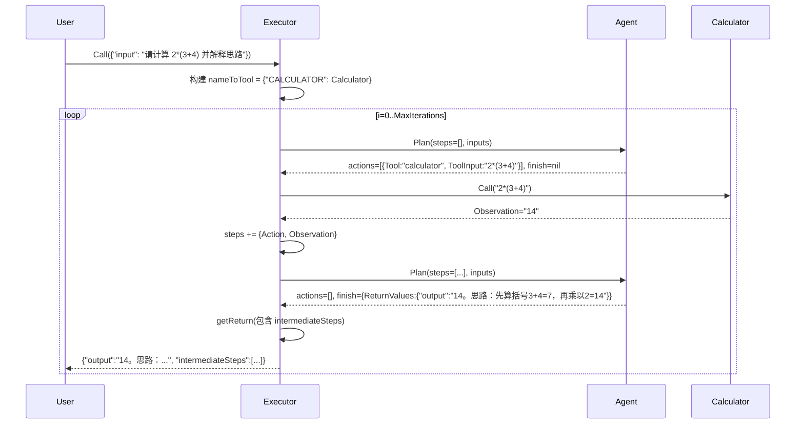
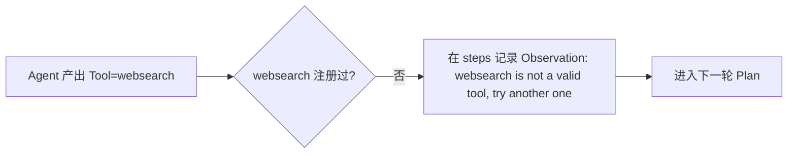
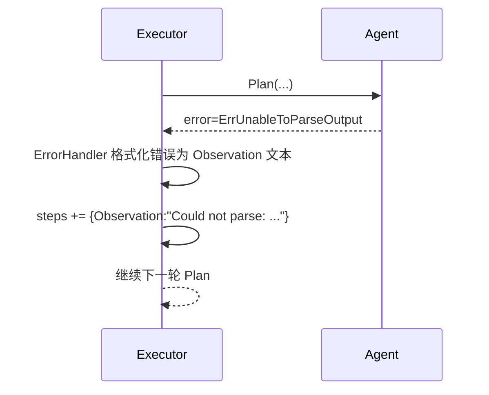

---
title: "LangChainGo Agents 包分析"
date: 2023-07-10
draft: false
tags: ["LangChain", "Go", "AI", "Agents"]
categories: ["langchaingo"]
---

# LangChainGo Agents 包分析

## 1. 概述

LangChainGo 的 `agents` 包定义了所有代理必须实现的标准接口、接口实现以及代理执行器。代理负责根据用户输入返回"动作"和"动作输入"或最终答案。该包提供了多种代理实现，包括 `OneShotZeroAgent`（使用 ReAct 框架决定动作）、`ConversationalAgent`（针对对话场景优化）和 `OpenAIFunctionsAgent`（基于 OpenAI 函数调用功能）。

`Executor` 是该包的核心组件，负责通过多次调用模型和工具来迭代地达到最终答案。它管理代理的执行流程，包括调用代理的 `Plan` 方法获取动作或最终结果，执行工具调用，并处理解析错误。

## 2. 核心接口与结构

### 2.1 Agent 接口

```go
type Agent interface {
	// Plan Given an input and previous steps decide what to do next. Returns
	// either actions or a finish.
	Plan(ctx context.Context, intermediateSteps []schema.AgentStep, inputs map[string]string) ([]schema.AgentAction, *schema.AgentFinish, error)
	GetInputKeys() []string
	GetOutputKeys() []string
	GetTools() []tools.Tool
}
```

`Agent` 接口是所有代理必须实现的核心接口，定义了以下方法：

- `Plan`：根据输入和历史步骤决定下一步操作，返回 `AgentAction` 或 `AgentFinish`
- `GetInputKeys`：获取代理需要的输入键
- `GetOutputKeys`：获取代理返回的输出键
- `GetTools`：获取代理可以使用的工具列表

### 2.2 Executor 结构体

```go
type Executor struct {
	Agent            Agent
	Memory           schema.Memory
	CallbacksHandler callbacks.Handler
	ErrorHandler     *ParserErrorHandler

	MaxIterations           int
	ReturnIntermediateSteps bool
}
```

`Executor` 是负责运行代理的核心组件，包含以下字段：

- `Agent`：要执行的代理
- `Memory`：用于存储对话历史的内存
- `CallbacksHandler`：回调处理器
- `ErrorHandler`：解析错误处理器
- `MaxIterations`：最大迭代次数
- `ReturnIntermediateSteps`：是否返回中间步骤

### 2.3 数据结构

在 `schema` 包中定义了以下与代理相关的数据结构：

```go
// AgentAction 是代理要执行的动作
type AgentAction struct {
	Tool      string
	ToolInput string
	Log       string
	ToolID    string
}

// AgentStep 是代理的一个步骤
type AgentStep struct {
	Action      AgentAction
	Observation string
}

// AgentFinish 是代理的返回值
type AgentFinish struct {
	ReturnValues map[string]any
	Log          string
}
```

### 2.4 工具接口

```go
type Tool interface {
	Name() string
	Description() string
	Call(ctx context.Context, input string) (string, error)
}
```

`Tool` 接口定义了代理可以使用的工具，包含以下方法：

- `Name`：获取工具名称
- `Description`：获取工具描述
- `Call`：调用工具执行操作

## 3. 代理实现

### 3.1 OneShotZeroAgent

```go
type OneShotZeroAgent struct {
	Chain            chains.Chain
	Tools            []tools.Tool
	OutputKey        string
	CallbacksHandler callbacks.Handler
}
```

`OneShotZeroAgent` 是一个基于 ReAct 框架的代理实现，它通过 `Chain` 字段调用 LLM，并使用 `Tools` 字段中定义的工具。其 `Plan` 方法负责根据中间步骤和输入生成代理动作或最终结果，`parseOutput` 方法则用于解析 LLM 的输出，判断是工具调用还是最终答案。

### 3.2 ConversationalAgent

```go
type ConversationalAgent struct {
	Chain            chains.Chain
	Tools            []tools.Tool
	OutputKey        string
	CallbacksHandler callbacks.Handler
}
```

`ConversationalAgent` 是一个针对对话场景优化的代理实现，它与 `OneShotZeroAgent` 类似，但提示模板和解析逻辑有所不同，更适合对话场景。

### 3.3 OpenAIFunctionsAgent

```go
type OpenAIFunctionsAgent struct {
	LLM              llms.Model
	Prompt           prompts.FormatPrompter
	Tools            []tools.Tool
	OutputKey        string
	CallbacksHandler callbacks.Handler
}
```

`OpenAIFunctionsAgent` 是一个基于 OpenAI 函数调用功能的代理实现，它直接使用 `LLM` 字段调用 OpenAI 模型，并通过 `functions` 方法将工具转换为 OpenAI 函数定义。其 `Plan` 方法负责根据中间步骤和输入生成代理动作或最终结果，`ParseOutput` 方法则用于解析 OpenAI 的响应，判断是工具调用还是最终答案。

## 4. 执行流程

### 4.1 Executor 执行流程



1. 用户调用 `Executor` 的 `Call` 方法，传入输入值
2. `Executor` 循环执行以下步骤，直到达到最大迭代次数或获得最终结果：
   - 调用 `Agent` 的 `Plan` 方法，传入中间步骤和输入
   - 如果 `Agent` 返回 `AgentFinish`，则返回结果
   - 如果 `Agent` 返回 `AgentAction`，则调用相应的工具，获取观察结果，并将步骤添加到中间步骤中
3. 如果达到最大迭代次数仍未获得最终结果，则返回错误

### 4.2 Agent 执行流程



1. `Executor` 调用 `Agent` 的 `Plan` 方法，传入中间步骤和输入
2. `Agent` 构建提示，包括输入和中间步骤
3. `Agent` 调用 LLM 生成响应
4. `Agent` 解析 LLM 的响应，判断是工具调用还是最终答案
5. `Agent` 返回 `AgentAction` 或 `AgentFinish` 给 `Executor`

## 5. 类图



## 6. 设计模式与最佳实践

### 6.1 设计模式

1. **策略模式**：`Agent` 接口定义了代理的行为，不同的代理实现（`OneShotZeroAgent`、`ConversationalAgent`、`OpenAIFunctionsAgent`）提供了不同的策略。

2. **组合模式**：`Executor` 组合了 `Agent`、`Memory`、`CallbacksHandler` 等组件，形成了一个完整的执行系统。

3. **模板方法模式**：各种代理实现都遵循相同的 `Plan` 方法模板，但内部实现不同。

4. **命令模式**：`AgentAction` 封装了要执行的命令（工具调用），`Executor` 负责执行这些命令。

### 6.2 最佳实践

1. **接口分离**：通过 `Agent` 接口将代理的行为与实现分离，使得可以轻松添加新的代理类型。

2. **错误处理**：使用 `ParserErrorHandler` 处理解析错误，使得代理可以从错误中恢复。

3. **选项模式**：使用 `Option` 函数类型和 `WithXXX` 函数来配置代理和执行器，提供了灵活的配置方式。

4. **上下文传递**：使用 `context.Context` 在整个调用链中传递上下文信息，支持取消和超时。

## 7. 总结

LangChainGo 的 `agents` 包提供了一个灵活、可扩展的代理系统，支持多种代理类型和工具。通过 `Agent` 接口和 `Executor` 结构体，该包实现了一个通用的代理执行框架，可以根据用户输入和历史步骤决定下一步操作，并执行相应的工具调用，最终达到用户的目标。

该包的设计遵循了良好的软件工程实践，包括接口分离、错误处理、选项模式和上下文传递等，使得代码易于理解、维护和扩展。同时，该包还提供了多种代理实现，包括基于 ReAct 框架的 `OneShotZeroAgent`、针对对话场景优化的 `ConversationalAgent` 和基于 OpenAI 函数调用功能的 `OpenAIFunctionsAgent`，满足了不同场景的需求。

## 8. 端到端示例：Executor + Agent + Tool 调用

下面以一个可落地的例子串起完整流程，覆盖正常路径与常见边界。

### 8.1 场景与参与者

- 输入：{"input": "请计算 2*(3+4) 并解释思路"}
- 工具：Calculator（Name: "CALCULATOR"，输入为表达式字符串，输出为结果字符串，如 "14"）
- Agent：ReAct 风格，能基于历史步骤决定下一步（调用工具或直接给答案）
- Executor 配置：MaxIterations=5，ReturnIntermediateSteps=true，配置了回调与解析错误处理器

### 8.2 时序图（两轮完成）



### 8.3 关键状态与数据快照

- 第0轮前
    - inputs: map[string]string{"input": "请计算 2*(3+4) 并解释思路"}
    - nameToTool: {"CALCULATOR": Calculator}
    - steps: []

- 第0轮 Plan → Action
    - actions: [{Tool:"calculator", ToolInput:"2*(3+4)", Log:"..."}]
    - finish: nil

- 第0轮 doAction → Observation
    - 调用工具：tool.Call(ctx, "2*(3+4)") → "14"
    - steps 追加：
        - {Action:{Tool:"calculator", ToolInput:"2*(3+4)"}, Observation:"14"}

- 第1轮 Plan → Finish
    - actions: []
    - finish: {ReturnValues:{"output":"14。思路：先算括号..."}}

- 最终返回（ReturnIntermediateSteps=true）：
    - {
            "output": "14。思路：先算括号3+4=7，再乘以2=14",
            "intermediateSteps": [
                {
                    "Action": {"Tool": "calculator", "ToolInput": "2*(3+4)"},
                    "Observation": "14"
                }
            ]
        }

### 8.4 常见分支与边界

1) 工具名不匹配



- 行为：不报错，追加一个包含该 Action 和“无效工具”提示的步骤，交还给 Agent 自我纠偏。

2) 解析错误可恢复（ErrUnableToParseOutput）



- 行为：若配置了 ErrorHandler，会把解析错误转为步骤中的 Observation，允许下一轮继续；否则直接返回错误。

3) 工具调用失败

- tool.Call 返回 error → 立刻失败向上返回（不中断追加 steps）。

4) 达到最大迭代上限

- 跑满 MaxIterations 仍无 finish：触发 HandleAgentFinish 回调，返回值中 output=ErrNotFinished，函数返回 ErrNotFinished。

### 8.5 小示例：无中间步骤返回

- 若 ReturnIntermediateSteps=false：
    - 返回仅包含最终键：{"output":"14。思路：..."}

### 8.6 执行器回调触发点

- HandleAgentAction：每次 doAction 前触发，便于记录 action 与输入
- HandleAgentFinish：出现 finish 或未完成超限时触发，便于统一收尾日志

### 8.7 迷你对照清单

- 输入必须是字符串（inputsToString），否则报错并终止
- 工具查找使用大写名匹配（strings.ToUpper）
- ToolInput 会去掉末尾的 "\nObservation:" 再传给工具
- steps 元素是 {Action, Observation}，Agent 下一轮可基于其再规划