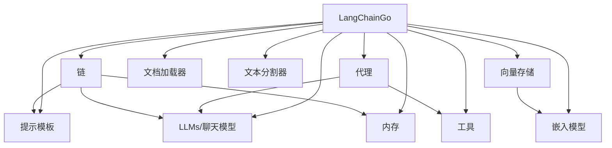
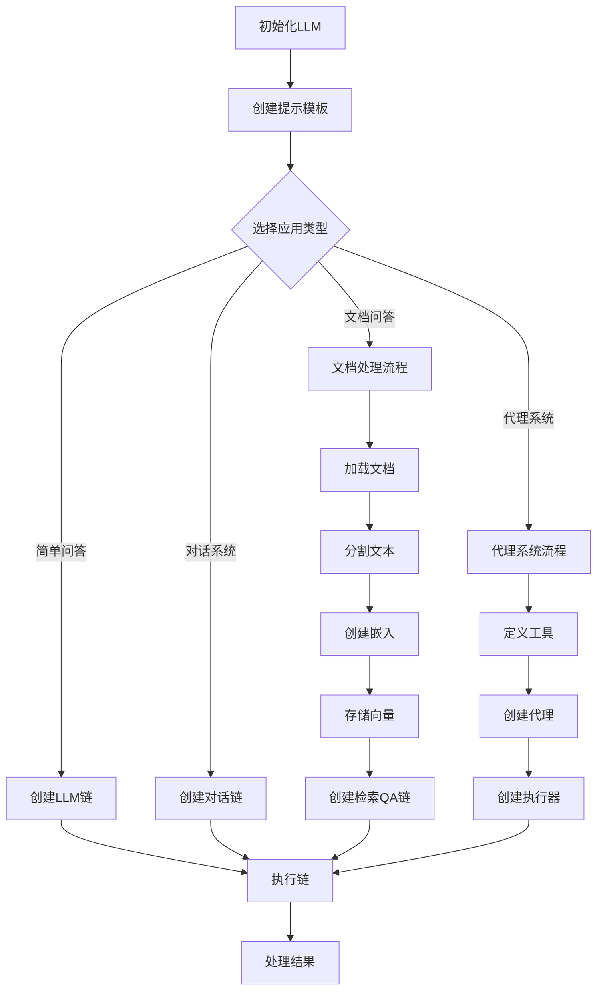
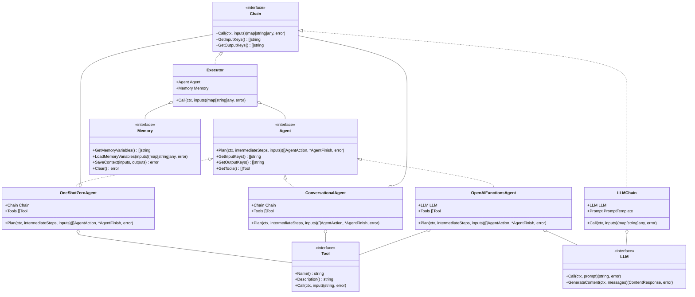

---
title: "LangChainGo 使用指南"
date: 2023-07-10
draft: false
tags: ["LangChain", "Go", "AI", "使用指南"]
categories: ["langchaingo"]
showInHome: true
---

# LangChainGo 使用指南

## 1. 简介

LangChainGo 是 LangChain 的 Go 语言实现，它提供了一套用于构建基于大型语言模型（LLM）应用的框架。该框架简化了与各种 LLM 的集成，并提供了丰富的组件来构建复杂的 AI 应用程序。

## 2. 安装

使用 Go 模块安装 LangChainGo：

```bash
go get github.com/tmc/langchaingo
```

## 3. 核心概念

LangChainGo 的架构围绕以下核心概念展开：



### 3.1 LLM 和聊天模型

LangChainGo 支持多种 LLM 提供商，包括 OpenAI、Anthropic、Google 等。使用这些模型的基本流程是：

1. 初始化模型客户端
2. 配置模型参数
3. 发送请求并处理响应

### 3.2 提示模板（Prompts）

提示模板允许您创建结构化的提示，可以根据输入动态生成。这对于创建一致的 LLM 交互至关重要。

### 3.3 链（Chains）

链将多个组件（如 LLM、提示模板、输出解析器等）连接在一起，形成一个端到端的流程。

### 3.4 代理（Agents）

代理使用 LLM 来确定要采取的操作序列，可以访问各种工具来完成复杂任务。

### 3.5 内存（Memory）

内存组件允许链和代理保持对话历史，实现有状态的交互。

### 3.6 工具（Tools）

工具是代理可以使用的函数，允许它们与外部系统交互或执行特定操作。

## 4. 典型使用流程

以下流程图展示了使用 LangChainGo 构建应用的典型步骤：



## 5. 使用示例

### 5.1 基本 LLM 调用

```go
package main

import (
	"context"
	"fmt"
	"os"

	"github.com/tmc/langchaingo/llms/openai"
)

func main() {
	// 初始化 OpenAI LLM
	llm, err := openai.New(
		openai.WithAPIKey(os.Getenv("OPENAI_API_KEY")),
	)
	if err != nil {
		fmt.Printf("初始化 LLM 失败: %v\n", err)
		return
	}

	// 生成文本
	ctx := context.Background()
	response, err := llm.Call(ctx, "用 Go 语言解释什么是闭包？")
	if err != nil {
		fmt.Printf("调用 LLM 失败: %v\n", err)
		return
	}

	fmt.Println(response)
}
```

### 5.2 使用提示模板

```go
package main

import (
	"context"
	"fmt"
	"os"

	"github.com/tmc/langchaingo/llms/openai"
	"github.com/tmc/langchaingo/prompts"
	"github.com/tmc/langchaingo/chains"
)

func main() {
	// 初始化 OpenAI LLM
	llm, err := openai.New(
		openai.WithAPIKey(os.Getenv("OPENAI_API_KEY")),
	)
	if err != nil {
		fmt.Printf("初始化 LLM 失败: %v\n", err)
		return
	}

	// 创建提示模板
	tmpl := prompts.NewPromptTemplate(
		"请用{{.Language}}语言解释什么是{{.Concept}}？",
		[]string{"Language", "Concept"},
	)

	// 创建 LLM 链
	chain := chains.NewLLMChain(llm, tmpl)

	// 执行链
	ctx := context.Background()
	result, err := chains.Call(ctx, chain, map[string]any{
		"Language": "Go",
		"Concept": "闭包",
	})
	if err != nil {
		fmt.Printf("执行链失败: %v\n", err)
		return
	}

	fmt.Println(result["text"])
}
```

### 5.3 使用代理和工具

```go
package main

import (
	"context"
	"fmt"
	"os"

	"github.com/tmc/langchaingo/agents"
	"github.com/tmc/langchaingo/chains"
	"github.com/tmc/langchaingo/llms/openai"
	"github.com/tmc/langchaingo/tools"
)

func main() {
	// 初始化 OpenAI LLM
	llm, err := openai.New(
		openai.WithAPIKey(os.Getenv("OPENAI_API_KEY")),
	)
	if err != nil {
		fmt.Printf("初始化 LLM 失败: %v\n", err)
		return
	}

	// 创建工具
	calculator := tools.Calculator{}

	// 创建代理
	agent, err := agents.NewOpenAIFunctionsAgent(llm, []tools.Tool{calculator})
	if err != nil {
		fmt.Printf("创建代理失败: %v\n", err)
		return
	}

	// 创建执行器
	executor, err := agents.NewExecutor(agent)
	if err != nil {
		fmt.Printf("创建执行器失败: %v\n", err)
		return
	}

	// 执行代理
	ctx := context.Background()
	result, err := chains.Call(ctx, executor, map[string]any{
		"input": "计算 (123 * 456) / 7 的结果",
	})
	if err != nil {
		fmt.Printf("执行代理失败: %v\n", err)
		return
	}

	fmt.Println(result["output"])
}
```

### 5.4 使用内存组件

```go
package main

import (
	"context"
	"fmt"
	"os"

	"github.com/tmc/langchaingo/chains"
	"github.com/tmc/langchaingo/llms/openai"
	"github.com/tmc/langchaingo/memory"
)

func main() {
	// 初始化 OpenAI LLM
	llm, err := openai.New(
		openai.WithAPIKey(os.Getenv("OPENAI_API_KEY")),
	)
	if err != nil {
		fmt.Printf("初始化 LLM 失败: %v\n", err)
		return
	}

	// 创建对话链
	chain := chains.NewConversationChain(llm)

	// 添加内存
	chain.Memory = memory.NewConversationBuffer()

	// 执行对话
	ctx := context.Background()
	result1, err := chains.Call(ctx, chain, map[string]any{
		"input": "我的名字是张三",
	})
	if err != nil {
		fmt.Printf("执行对话失败: %v\n", err)
		return
	}

	fmt.Println("回复1:", result1["response"])

	result2, err := chains.Call(ctx, chain, map[string]any{
		"input": "我的名字是什么？",
	})
	if err != nil {
		fmt.Printf("执行对话失败: %v\n", err)
		return
	}

	fmt.Println("回复2:", result2["response"])
}
```

### 5.5 使用向量存储和检索

```go
package main

import (
	"context"
	"fmt"
	"os"

	"github.com/tmc/langchaingo/chains"
	"github.com/tmc/langchaingo/documentloaders"
	"github.com/tmc/langchaingo/embeddings/openai"
	"github.com/tmc/langchaingo/llms"
	"github.com/tmc/langchaingo/llms/openai"
	"github.com/tmc/langchaingo/textsplitter"
	"github.com/tmc/langchaingo/vectorstores/chroma"
)

func main() {
	// 初始化 OpenAI 嵌入模型
	embedder, err := openai.NewEmbedder(
		openai.WithAPIKey(os.Getenv("OPENAI_API_KEY")),
	)
	if err != nil {
		fmt.Printf("初始化嵌入模型失败: %v\n", err)
		return
	}

	// 初始化 OpenAI LLM
	llm, err := openai.New(
		openai.WithAPIKey(os.Getenv("OPENAI_API_KEY")),
		openai.WithModel(llms.GPT3Dot5Turbo),
	)
	if err != nil {
		fmt.Printf("初始化 LLM 失败: %v\n", err)
		return
	}

	// 加载文档
	loader := documentloaders.NewTextLoader("./documents/sample.txt")
	docs, err := loader.Load(context.Background())
	if err != nil {
		fmt.Printf("加载文档失败: %v\n", err)
		return
	}

	// 分割文档
	splitter := textsplitter.NewRecursiveCharacter()
	splitDocs, err := splitter.SplitDocuments(docs)
	if err != nil {
		fmt.Printf("分割文档失败: %v\n", err)
		return
	}

	// 创建向量存储
	ctx := context.Background()
	vectorStore, err := chroma.New(
		ctx,
		chroma.WithChromaURL("http://localhost:8000"),
		chroma.WithEmbedder(embedder),
		chroma.WithDistanceFunction("cosine"),
	)
	if err != nil {
		fmt.Printf("创建向量存储失败: %v\n", err)
		return
	}

	// 添加文档到向量存储
	err = vectorStore.AddDocuments(ctx, splitDocs)
	if err != nil {
		fmt.Printf("添加文档到向量存储失败: %v\n", err)
		return
	}

	// 创建检索 QA 链
	chain := chains.NewRetrievalQA(llm, vectorStore.AsRetriever())

	// 执行查询
	result, err := chains.Call(ctx, chain, map[string]any{
		"query": "文档中讨论了什么主题？",
	})
	if err != nil {
		fmt.Printf("执行查询失败: %v\n", err)
		return
	}

	fmt.Println(result["result"])
}
```

## 6. 最佳实践

### 6.1 错误处理

在使用 LangChainGo 时，务必妥善处理错误。API 调用、模型生成和工具执行都可能失败，应该实现适当的错误处理和重试机制。

### 6.2 上下文管理

使用 `context.Context` 来管理请求的生命周期，设置超时和取消机制，特别是在处理长时间运行的代理任务时。

### 6.3 模型参数调优

根据任务需求调整模型参数（如温度、最大令牌数等）以获得最佳结果：

```go
llm, err := openai.New(
	openai.WithAPIKey(os.Getenv("OPENAI_API_KEY")),
	openai.WithModel(llms.GPT4),
	openai.WithTemperature(0.7),
	openai.WithMaxTokens(2000),
)
```

### 6.4 提示工程

精心设计提示模板对获得高质量的 LLM 输出至关重要。考虑以下因素：

- 提供清晰的指令
- 包含相关上下文
- 使用示例（少样本学习）
- 结构化输出格式

### 6.5 代理设计

在设计代理时，考虑以下几点：

- 选择合适的代理类型（如 `OneShotZeroAgent`、`ConversationalAgent` 或 `OpenAIFunctionsAgent`）
- 提供有用的工具集
- 设置合理的最大迭代次数
- 实现适当的错误处理策略

## 7. 常见问题解决

### 7.1 API 限制和速率限制

当使用外部 API（如 OpenAI）时，可能会遇到速率限制。实现指数退避重试策略：

```go
func callWithRetry(ctx context.Context, llm *openai.LLM, prompt string) (string, error) {
	var result string
	var err error
	backoff := 1 * time.Second
	max_retries := 5

	for i := 0; i < max_retries; i++ {
		result, err = llm.Call(ctx, prompt)
		if err == nil {
			return result, nil
		}

		// 检查是否是速率限制错误
		if strings.Contains(err.Error(), "rate limit") {
			fmt.Printf("遇到速率限制，等待 %v 后重试\n", backoff)
			time.Sleep(backoff)
			backoff *= 2 // 指数退避
			continue
		}

		// 其他错误直接返回
		return "", err
	}

	return "", fmt.Errorf("达到最大重试次数: %w", err)
}
```

### 7.2 处理长文本

当处理长文本时，可能会超出模型的上下文窗口。使用文本分割器和检索策略：

```go
// 分割长文本
splitter := textsplitter.NewRecursiveCharacter(
	textsplitter.WithChunkSize(1000),
	textsplitter.WithChunkOverlap(200),
)
splitDocs, err := splitter.SplitDocuments(docs)
```

### 7.3 调试代理

使用回调处理器来调试代理的执行过程：

```go
// 创建日志回调处理器
logHandler := callbacks.NewLogHandler()

// 创建代理并设置回调处理器
agent, err := agents.NewOpenAIFunctionsAgent(
	llm,
	[]tools.Tool{calculator},
	agents.WithCallbacksHandler(logHandler),
)
```

## 8. 高级用例

### 8.1 自定义工具

创建自定义工具以扩展代理的能力：

```go
type WeatherTool struct {
	APIKey string
}

func (w WeatherTool) Name() string {
	return "weather"
}

func (w WeatherTool) Description() string {
	return "获取指定城市的天气信息"
}

func (w WeatherTool) Call(ctx context.Context, input string) (string, error) {
	// 实现调用天气 API 的逻辑
	// ...
	return "北京: 晴, 25°C", nil
}
```

### 8.2 自定义代理

实现自定义代理以满足特定需求：

```go
type CustomAgent struct {
	LLM              llms.Model
	Tools            []tools.Tool
	OutputKey        string
	CallbacksHandler callbacks.Handler
}

func (a *CustomAgent) Plan(ctx context.Context, intermediateSteps []schema.AgentStep, inputs map[string]string) ([]schema.AgentAction, *schema.AgentFinish, error) {
	// 实现自定义规划逻辑
	// ...
}

func (a *CustomAgent) GetInputKeys() []string {
	return []string{"input"}
}

func (a *CustomAgent) GetOutputKeys() []string {
	return []string{a.OutputKey}
}

func (a *CustomAgent) GetTools() []tools.Tool {
	return a.Tools
}
```

### 8.3 与其他系统集成

将 LangChainGo 与数据库、API 或其他系统集成：

```go
// 创建 SQL 数据库工具
db, err := sql.Open("mysql", "user:password@tcp(127.0.0.1:3306)/dbname")
if err != nil {
	// 处理错误
}
defer db.Close()

sqlTool, err := tools.NewSQLDatabaseTool(db, "mysql")
if err != nil {
	// 处理错误
}

// 将工具添加到代理
agent, err := agents.NewOpenAIFunctionsAgent(llm, []tools.Tool{sqlTool})
```

## 9. 架构设计

以下类图展示了 LangChainGo 的主要接口和类之间的关系：



## 10. 总结

LangChainGo 提供了一个强大而灵活的框架，用于构建基于 LLM 的应用程序。通过组合其核心组件（LLM、提示模板、链、代理、内存和工具），可以创建复杂的 AI 系统来解决各种问题。

该框架的模块化设计允许您根据需要选择和组合组件，同时其接口抽象使您可以轻松切换底层模型提供商或实现自定义组件。

通过遵循本指南中的最佳实践和示例，您可以有效地利用 LangChainGo 构建强大的 AI 应用程序。