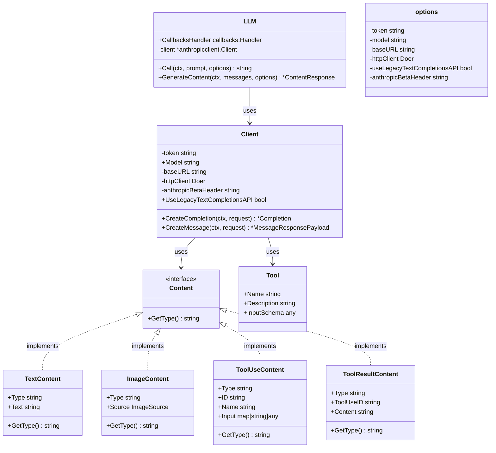
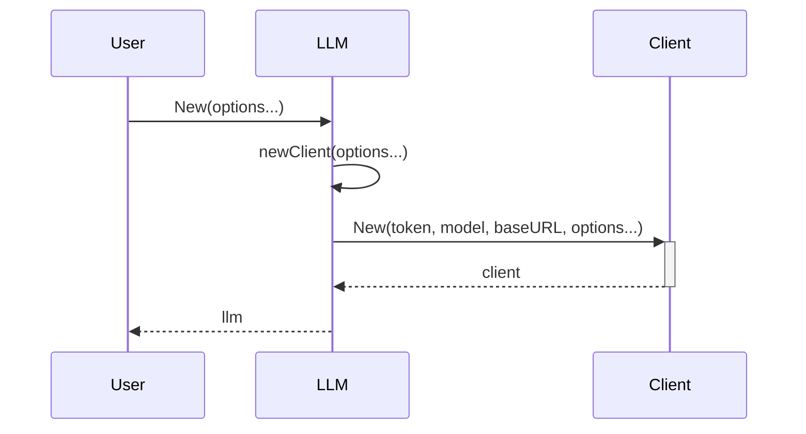
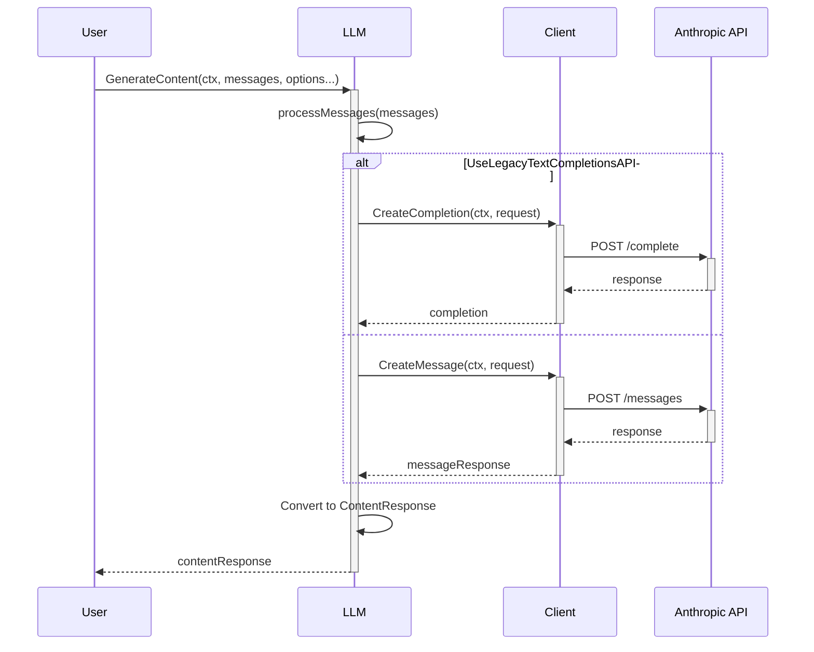
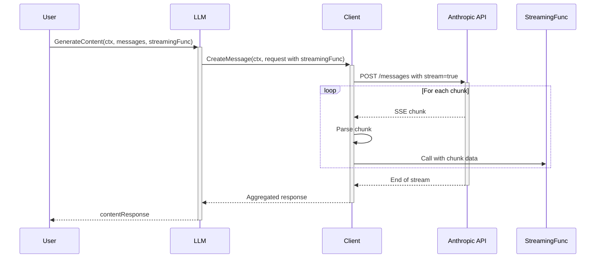

---
title: "LangChainGo Anthropic 集成分析"
date: 2023-07-15T10:30:00+08:00
author: "AI 分析师"
description: "深入分析 LangChainGo 中的 Anthropic LLM 集成实现"
tags: ["LangChainGo", "Anthropic", "Claude", "LLM", "API 集成"]
categories: ["代码分析", "AI 框架"]
series: ["LangChainGo 源码分析"]
featured_image: ""
toc: true
---

# LangChainGo Anthropic 集成分析

## 1. 概述

LangChainGo 的 Anthropic 集成提供了与 Anthropic 的 Claude 系列大语言模型交互的能力。该集成位于 `llms/anthropic` 包中，实现了 LangChainGo 的 `llms.Model` 接口，使开发者能够以统一的方式使用 Anthropic 的模型。

该集成支持：

- 文本完成 API（传统 API）
- 消息 API（新版 API）
- 流式响应
- 工具调用
- 系统提示
- 多模态输入（文本和图像）

## 2. 包结构

```
/llms/anthropic/
├── anthropicllm.go         # 主要实现文件
├── anthropicllm_option.go  # 配置选项
├── errors.go              # 错误处理
└── internal/
    └── anthropicclient/   # 内部 API 客户端
        ├── anthropicclient.go  # 客户端核心
        ├── completions.go      # 完成 API 实现
        └── messages.go         # 消息 API 实现
```

## 3. 核心组件

### 3.1 LLM 结构体

```go
type LLM struct {
	CallbacksHandler callbacks.Handler
	client           *anthropicclient.Client
}
```

`LLM` 结构体是 Anthropic 集成的主要入口点，它实现了 `llms.Model` 接口，提供了与 Anthropic API 交互的方法。

### 3.2 配置选项

```go
type options struct {
	token      string
	model      string
	baseURL    string
	httpClient anthropicclient.Doer

	useLegacyTextCompletionsAPI bool
	anthropicBetaHeader string
}
```

配置选项通过函数选项模式实现，支持：

- `WithToken`: 设置 API 密钥
- `WithModel`: 设置模型名称
- `WithBaseURL`: 设置 API 基础 URL
- `WithHTTPClient`: 设置自定义 HTTP 客户端
- `WithLegacyTextCompletionsAPI`: 启用传统文本完成 API
- `WithAnthropicBetaHeader`: 设置 Anthropic Beta 头部，用于访问预览功能

### 3.3 内部客户端

内部客户端 `anthropicclient.Client` 负责直接与 Anthropic API 通信，处理请求和响应的序列化/反序列化。

```go
type Client struct {
	token   string
	Model   string
	baseURL string

	httpClient Doer

	anthropicBetaHeader string

	// UseLegacyTextCompletionsAPI is a flag to use the legacy text completions API.
	UseLegacyTextCompletionsAPI bool
}
```

## 4. 主要功能

### 4.1 初始化

```go
func New(opts ...Option) (*LLM, error) {
	c, err := newClient(opts...)
	if err != nil {
		return nil, fmt.Errorf("anthropic: failed to create client: %w", err)
	}
	return &LLM{
		client: c,
	}, nil
}
```

初始化过程使用函数选项模式，允许灵活配置。默认从环境变量 `ANTHROPIC_API_KEY` 获取 API 密钥。

### 4.2 文本生成

AnthropicLLM 实现了两种主要的文本生成方法：

1. **Call**: 简单的文本到文本接口
   ```go
   func (o *LLM) Call(ctx context.Context, prompt string, options ...llms.CallOption) (string, error)
   ```

2. **GenerateContent**: 支持更复杂的消息交互
   ```go
   func (o *LLM) GenerateContent(ctx context.Context, messages []llms.MessageContent, options ...llms.CallOption) (*llms.ContentResponse, error)
   ```

### 4.3 消息处理

```go
func processMessages(messages []llms.MessageContent) ([]anthropicclient.ChatMessage, string, error) {
	chatMessages := make([]anthropicclient.ChatMessage, 0, len(messages))
	systemPrompt := ""
	for _, msg := range messages {
		switch msg.Role {
		case llms.ChatMessageTypeSystem:
			content, err := handleSystemMessage(msg)
			// ...
		case llms.ChatMessageTypeHuman:
			chatMessage, err := handleHumanMessage(msg)
			// ...
		case llms.ChatMessageTypeAI:
			chatMessage, err := handleAIMessage(msg)
			// ...
		case llms.ChatMessageTypeTool:
			chatMessage, err := handleToolMessage(msg)
			// ...
		// ...
		}
	}
	return chatMessages, systemPrompt, nil
}
```

消息处理函数将 LangChainGo 的消息格式转换为 Anthropic API 所需的格式，支持：

- 系统消息（System）
- 人类消息（Human）
- AI 消息（Assistant）
- 工具消息（Tool）

### 4.4 多模态支持

```go
func handleHumanMessage(msg llms.MessageContent) (anthropicclient.ChatMessage, error) {
	var contents []anthropicclient.Content

	for _, part := range msg.Parts {
		switch p := part.(type) {
		case llms.TextContent:
			contents = append(contents, &anthropicclient.TextContent{
				Type: "text",
				Text: p.Text,
			})
		case llms.BinaryContent:
			contents = append(contents, &anthropicclient.ImageContent{
				Type: "image",
				Source: anthropicclient.ImageSource{
					Type:      "base64",
					MediaType: p.MIMEType,
					Data:      base64.StdEncoding.EncodeToString(p.Data),
				},
			})
		// ...
		}
	}
	// ...
}
```

支持多模态输入，包括文本和图像（通过 base64 编码）。

### 4.5 工具调用

```go
func toolsToTools(tools []llms.Tool) []anthropicclient.Tool {
	toolReq := make([]anthropicclient.Tool, len(tools))
	for i, tool := range tools {
		toolReq[i] = anthropicclient.Tool{
			Name:        tool.Function.Name,
			Description: tool.Function.Description,
			InputSchema: tool.Function.Parameters,
		}
	}
	return toolReq
}
```

支持工具调用功能，将 LangChainGo 的工具定义转换为 Anthropic API 所需的格式。

### 4.6 流式响应

```go
StreamingFunc func(ctx context.Context, chunk []byte) error `json:"-"`
```

通过回调函数支持流式响应，允许实时处理生成的文本片段。

### 4.7 错误处理

```go
func MapError(err error) error {
	if err == nil {
		return nil
	}

	errStr := strings.ToLower(err.Error())

	// Check each error mapping
	for _, mapping := range anthropicErrorMappings {
		for _, pattern := range mapping.patterns {
			if strings.Contains(errStr, pattern) {
				return llms.NewError(mapping.code, "anthropic", mapping.message).WithCause(err)
			}
		}
	}

	// Use the generic error mapper for unrecognized errors
	mapper := llms.NewErrorMapper("anthropic")
	return mapper.Map(err)
}
```

实现了详细的错误映射，将 Anthropic API 的错误转换为 LangChainGo 标准错误类型。

## 5. 内部 API 客户端

### 5.1 完成 API

```go
func (c *Client) CreateCompletion(ctx context.Context, r *CompletionRequest) (*Completion, error) {
	resp, err := c.createCompletion(ctx, &completionPayload{
		Model:         r.Model,
		Prompt:        r.Prompt,
		Temperature:   r.Temperature,
		MaxTokens:     r.MaxTokens,
		StopWords:     r.StopWords,
		TopP:          r.TopP,
		Stream:        r.Stream,
		StreamingFunc: r.StreamingFunc,
	})
	if err != nil {
		return nil, err
	}
	return &Completion{
		Text: resp.Completion,
	}, nil
}
```

完成 API 是传统的文本到文本接口，使用 `/complete` 端点。

### 5.2 消息 API

```go
func (c *Client) CreateMessage(ctx context.Context, r *MessageRequest) (*MessageResponsePayload, error) {
	resp, err := c.createMessage(ctx, &messagePayload{
		Model:         r.Model,
		Messages:      r.Messages,
		System:        r.System,
		Temperature:   r.Temperature,
		MaxTokens:     r.MaxTokens,
		StopWords:     r.StopWords,
		TopP:          r.TopP,
		Tools:         r.Tools,
		Stream:        r.Stream,
		StreamingFunc: r.StreamingFunc,
	})
	if err != nil {
		return nil, err
	}
	return resp, nil
}
```

消息 API 是更现代的接口，支持更复杂的交互，使用 `/messages` 端点。

### 5.3 流式处理

```go
func parseStreamingMessageResponse(ctx context.Context, r *http.Response, payload *messagePayload) (*MessageResponsePayload, error) {
	scanner := bufio.NewScanner(r.Body)
	eventChan := make(chan MessageEvent)

	go func() {
		defer close(eventChan)
		var response MessageResponsePayload
		for scanner.Scan() {
			line := scanner.Text()
			if line == "" || !strings.HasPrefix(line, "data:") {
				continue
			}
			data := strings.TrimPrefix(line, "data: ")
			event, err := parseStreamEvent(data)
			// ...
		}
		// ...
	}()
	// ...
}
```

流式处理使用 Server-Sent Events (SSE) 格式解析响应流，支持实时处理生成的内容。

## 6. 类图



## 7. 流程图

### 7.1 初始化流程



### 7.2 文本生成流程



### 7.3 流式响应流程



## 8. 设计模式与最佳实践

### 8.1 函数选项模式

AnthropicLLM 使用函数选项模式进行配置，提供了灵活且类型安全的配置方式：

```go
func New(opts ...Option) (*LLM, error)
```

这种模式允许：
- 默认值的简单使用
- 选择性覆盖特定选项
- 未来扩展不破坏向后兼容性

### 8.2 接口隔离

代码通过接口隔离实现了良好的模块化：

```go
type Doer interface {
	Do(req *http.Request) (*http.Response, error)
}
```

这使得测试和扩展变得更加容易，例如可以轻松替换 HTTP 客户端。

### 8.3 错误处理

实现了详细的错误映射系统，将 API 特定错误转换为标准错误类型：

```go
func MapError(err error) error {
	// ...
}
```

这提供了一致的错误处理体验，无论使用哪个 LLM 提供商。

### 8.4 内部包封装

将 API 客户端实现放在 `internal/anthropicclient` 包中，确保了实现细节的封装，只暴露必要的接口给外部使用。

## 9. 使用示例

### 9.1 基本使用

```go
package main

import (
	"context"
	"fmt"
	"log"

	"github.com/tmc/langchaingo/llms"
	"github.com/tmc/langchaingo/llms/anthropic"
)

func main() {
	llm, err := anthropic.New(
		anthropic.WithModel("claude-3-opus-20240229"),
	)
	if err != nil {
		log.Fatal(err)
	}

	resp, err := llm.Call(context.Background(), "Hello, how are you?")
	if err != nil {
		log.Fatal(err)
	}

	fmt.Println(resp)
}
```

### 9.2 使用消息 API

```go
package main

import (
	"context"
	"fmt"
	"log"

	"github.com/tmc/langchaingo/llms"
	"github.com/tmc/langchaingo/llms/anthropic"
)

func main() {
	llm, err := anthropic.New(
		anthropic.WithModel("claude-3-opus-20240229"),
	)
	if err != nil {
		log.Fatal(err)
	}

	messages := []llms.MessageContent{
		{
			Role: llms.ChatMessageTypeSystem,
			Parts: []llms.ContentPart{
				llms.TextContent{Text: "You are a helpful assistant."},
			},
		},
		{
			Role: llms.ChatMessageTypeHuman,
			Parts: []llms.ContentPart{
				llms.TextContent{Text: "Hello, how are you?"},
			},
		},
	}

	resp, err := llm.GenerateContent(context.Background(), messages)
	if err != nil {
		log.Fatal(err)
	}

	fmt.Println(resp.Choices[0].Content)
}
```

### 9.3 使用工具调用

```go
package main

import (
	"context"
	"encoding/json"
	"fmt"
	"log"

	"github.com/tmc/langchaingo/llms"
	"github.com/tmc/langchaingo/llms/anthropic"
)

func main() {
	llm, err := anthropic.New(
		anthropic.WithModel("claude-3-opus-20240229"),
		anthropic.WithAnthropicBetaHeader("tools-2024-05-16"),
	)
	if err != nil {
		log.Fatal(err)
	}

	weatherTool := llms.Tool{
		Type: "function",
		Function: &llms.FunctionDefinition{
			Name:        "get_weather",
			Description: "Get the weather for a location",
			Parameters: map[string]any{
				"type": "object",
				"properties": map[string]any{
					"location": map[string]any{
						"type":        "string",
						"description": "The location to get weather for",
					},
				},
				"required": []string{"location"},
			},
		},
	}

	messages := []llms.MessageContent{
		{
			Role: llms.ChatMessageTypeHuman,
			Parts: []llms.ContentPart{
				llms.TextContent{Text: "What's the weather like in San Francisco?"},
			},
		},
	}

	resp, err := llm.GenerateContent(context.Background(), messages, 
		llms.WithTools([]llms.Tool{weatherTool}),
	)
	if err != nil {
		log.Fatal(err)
	}

	// 处理工具调用
	if len(resp.Choices) > 0 && len(resp.Choices[0].ToolCalls) > 0 {
		toolCall := resp.Choices[0].ToolCalls[0]
		fmt.Printf("Tool: %s\n", toolCall.FunctionCall.Name)
		fmt.Printf("Arguments: %s\n", toolCall.FunctionCall.Arguments)

		// 模拟工具执行
		var args map[string]string
		json.Unmarshal([]byte(toolCall.FunctionCall.Arguments), &args)
		
		// 返回工具结果
		toolResult := fmt.Sprintf("The weather in %s is sunny and 72°F", args["location"])
		
		// 继续对话
		messages = append(messages, 
			llms.MessageContent{
				Role: llms.ChatMessageTypeAI,
				Parts: []llms.ContentPart{
					llms.ToolCall{
						ID: toolCall.ID,
						FunctionCall: toolCall.FunctionCall,
					},
				},
			},
			llms.MessageContent{
				Role: llms.ChatMessageTypeTool,
				Parts: []llms.ContentPart{
					llms.ToolCallResponse{
						ToolCallID: toolCall.ID,
						Content:    toolResult,
					},
				},
			},
		)
		
		// 获取最终回复
		finalResp, err := llm.GenerateContent(context.Background(), messages)
		if err != nil {
			log.Fatal(err)
		}
		
		fmt.Println(finalResp.Choices[0].Content)
	}
}
```

## 10. 总结

LangChainGo 的 Anthropic 集成提供了一个全面且灵活的接口，用于与 Anthropic 的 Claude 系列模型交互。该实现：

1. **完整支持 Anthropic API**：包括传统完成 API 和现代消息 API
2. **多模态支持**：能够处理文本和图像输入
3. **工具调用**：支持函数调用功能
4. **流式响应**：实时处理生成内容
5. **良好的错误处理**：详细的错误映射和标准化
6. **灵活配置**：通过函数选项模式提供多种配置选项
7. **模块化设计**：通过接口隔离和内部包封装实现良好的模块化

该集成为开发者提供了一个简单而强大的方式，将 Anthropic 的 Claude 模型集成到他们的 Go 应用程序中。