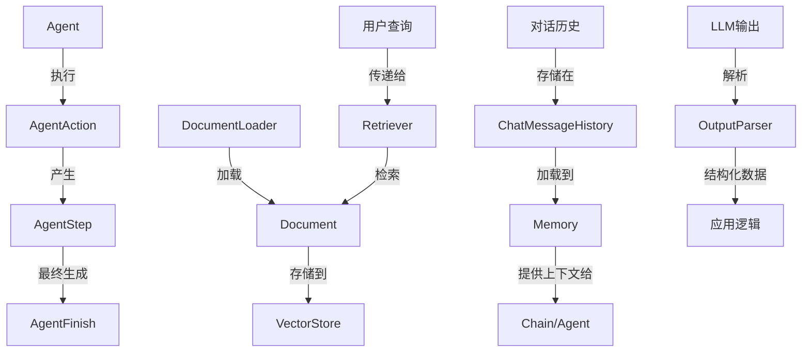

---
title: "LangChainGo Schema 包分析"
date: 2023-11-15T10:00:00+08:00
draft: false
authors: ["AI助手"]
description: "LangChainGo中schema包的详细分析与架构设计"
tags: ["LangChainGo", "Go", "Schema", "架构分析"]
categories: ["技术文档"]
series: ["LangChainGo源码分析"]
featuredImage: ""
toc: true
---

# LangChainGo Schema 包分析

## 概述

`schema` 包是 LangChainGo 中实现共享核心数据类型的包。它定义了框架中使用的基本接口和数据结构，为整个 LangChainGo 生态系统提供了统一的数据模型。这些接口和数据结构被其他包广泛使用，确保了组件之间的互操作性和一致性。

## 核心接口和数据结构

### Agent 相关

#### AgentAction

```go
type AgentAction struct {
	Tool      string
	ToolInput string
	Log       string
	ToolID    string
}
```

`AgentAction` 表示代理要执行的动作，包含以下字段：
- `Tool`：要使用的工具名称
- `ToolInput`：传递给工具的输入
- `Log`：动作的日志信息
- `ToolID`：工具的唯一标识符

#### AgentStep

```go
type AgentStep struct {
	Action      AgentAction
	Observation string
}
```

`AgentStep` 表示代理执行的一个步骤，包含以下字段：
- `Action`：执行的动作
- `Observation`：执行动作后的观察结果

#### AgentFinish

```go
type AgentFinish struct {
	ReturnValues map[string]any
	Log          string
}
```

`AgentFinish` 表示代理执行完成后的返回值，包含以下字段：
- `ReturnValues`：返回的键值对
- `Log`：完成的日志信息

### Document

```go
type Document struct {
	PageContent string
	Metadata    map[string]any
	Score       float32
}
```

`Document` 是与文档交互的接口，包含以下字段：
- `PageContent`：文档的内容
- `Metadata`：文档的元数据
- `Score`：文档的相关性分数

### Memory 接口

```go
type Memory interface {
	// GetMemoryKey getter for memory key.
	GetMemoryKey(ctx context.Context) string
	// MemoryVariables Input keys this memory class will load dynamically.
	MemoryVariables(ctx context.Context) []string
	// LoadMemoryVariables Return key-value pairs given the text input to the chain.
	// If None, return all memories
	LoadMemoryVariables(ctx context.Context, inputs map[string]any) (map[string]any, error)
	// SaveContext Save the context of this model run to memory.
	SaveContext(ctx context.Context, inputs map[string]any, outputs map[string]any) error
	// Clear memory contents.
	Clear(ctx context.Context) error
}
```

`Memory` 接口定义了链中内存的行为，包含以下方法：
- `GetMemoryKey`：获取内存键
- `MemoryVariables`：获取此内存类将动态加载的输入键
- `LoadMemoryVariables`：根据链的文本输入返回键值对
- `SaveContext`：将此模型运行的上下文保存到内存中
- `Clear`：清除内存内容

### ChatMessageHistory 接口

```go
type ChatMessageHistory interface {
	// AddMessage adds a message to the store.
	AddMessage(ctx context.Context, message llms.ChatMessage) error

	// AddUserMessage is a convenience method for adding a human message string
	// to the store.
	AddUserMessage(ctx context.Context, message string) error

	// AddAIMessage is a convenience method for adding an AI message string to
	// the store.
	AddAIMessage(ctx context.Context, message string) error

	// Clear removes all messages from the store.
	Clear(ctx context.Context) error

	// Messages retrieves all messages from the store
	Messages(ctx context.Context) ([]llms.ChatMessage, error)

	// SetMessages replaces existing messages in the store
	SetMessages(ctx context.Context, messages []llms.ChatMessage) error
}
```

`ChatMessageHistory` 接口定义了内存/存储中聊天历史的行为，包含以下方法：
- `AddMessage`：向存储添加消息
- `AddUserMessage`：向存储添加人类消息字符串的便捷方法
- `AddAIMessage`：向存储添加 AI 消息字符串的便捷方法
- `Clear`：从存储中删除所有消息
- `Messages`：从存储中检索所有消息
- `SetMessages`：替换存储中的现有消息

### OutputParser 接口

```go
type OutputParser[T any] interface {
	// Parse parses the output of an LLM call.
	Parse(text string) (T, error)
	// ParseWithPrompt parses the output of an LLM call with the prompt used.
	ParseWithPrompt(text string, prompt llms.PromptValue) (T, error)
	// GetFormatInstructions returns a string describing the format of the output.
	GetFormatInstructions() string
	// Type returns the string type key uniquely identifying this class of parser
	Type() string
}
```

`OutputParser` 接口定义了解析 LLM 调用输出的行为，是一个泛型接口，包含以下方法：
- `Parse`：解析 LLM 调用的输出
- `ParseWithPrompt`：使用提示解析 LLM 调用的输出
- `GetFormatInstructions`：返回描述输出格式的字符串
- `Type`：返回唯一标识此解析器类的字符串类型键

### Retriever 接口

```go
type Retriever interface {
	GetRelevantDocuments(ctx context.Context, query string) ([]Document, error)
}
```

`Retriever` 接口定义了检索器的行为，包含以下方法：
- `GetRelevantDocuments`：根据查询获取相关文档

## 类图

以下是 LangChainGo `schema` 包的类图，展示了各个接口和数据结构之间的关系：

```mermaid
classDiagram
    class AgentAction {
        +string Tool
        +string ToolInput
        +string Log
        +string ToolID
    }
    
    class AgentStep {
        +AgentAction Action
        +string Observation
    }
    
    class AgentFinish {
        +map[string]any ReturnValues
        +string Log
    }
    
    class Document {
        +string PageContent
        +map[string]any Metadata
        +float32 Score
    }
    
    class Memory {
        <<interface>>
        +GetMemoryKey(ctx context.Context) string
        +MemoryVariables(ctx context.Context) []string
        +LoadMemoryVariables(ctx context.Context, inputs map[string]any) (map[string]any, error)
        +SaveContext(ctx context.Context, inputs map[string]any, outputs map[string]any) error
        +Clear(ctx context.Context) error
    }
    
    class ChatMessageHistory {
        <<interface>>
        +AddMessage(ctx context.Context, message llms.ChatMessage) error
        +AddUserMessage(ctx context.Context, message string) error
        +AddAIMessage(ctx context.Context, message string) error
        +Clear(ctx context.Context) error
        +Messages(ctx context.Context) ([]llms.ChatMessage, error)
        +SetMessages(ctx context.Context, messages []llms.ChatMessage) error
    }
    
    class OutputParser~T~ {
        <<interface>>
        +Parse(text string) (T, error)
        +ParseWithPrompt(text string, prompt llms.PromptValue) (T, error)
        +GetFormatInstructions() string
        +Type() string
    }
    
    class Retriever {
        <<interface>>
        +GetRelevantDocuments(ctx context.Context, query string) ([]Document, error)
    }
    
    Retriever ..> Document : returns
    AgentStep o-- AgentAction : contains
```



## 数据流图

以下是 LangChainGo 中涉及 `schema` 包的主要数据流：



## 设计模式与最佳实践

### 接口设计

`schema` 包中的接口设计遵循了以下原则：

1. **单一职责原则**：每个接口都有明确的职责，如 `Memory` 负责管理内存，`Retriever` 负责检索文档。

2. **接口隔离原则**：接口定义了最小的方法集，客户端只需依赖它们需要的方法。

3. **依赖倒置原则**：高层模块通过接口依赖低层模块，而不是具体实现。

### 泛型的使用

`OutputParser` 接口使用了 Go 的泛型特性，允许解析器返回任意类型的结果，增加了代码的灵活性和类型安全性。

### 上下文传递

所有接口方法都接受 `context.Context` 作为第一个参数，这是 Go 中的最佳实践，允许传递请求范围的值、取消信号和截止时间。

## 使用示例

### 使用 Memory 接口

```go
func useMemory(memory schema.Memory, ctx context.Context) error {
    // 获取内存变量
    vars := memory.MemoryVariables(ctx)
    fmt.Println("Memory variables:", vars)
    
    // 加载内存变量
    inputs := map[string]any{"input": "Hello, world!"}
    memoryVars, err := memory.LoadMemoryVariables(ctx, inputs)
    if err != nil {
        return err
    }
    fmt.Println("Loaded memory variables:", memoryVars)
    
    // 保存上下文
    outputs := map[string]any{"output": "Hi there!"}
    if err := memory.SaveContext(ctx, inputs, outputs); err != nil {
        return err
    }
    
    return nil
}
```

### 使用 Retriever 接口

```go
func retrieveDocuments(retriever schema.Retriever, ctx context.Context, query string) error {
    // 获取相关文档
    docs, err := retriever.GetRelevantDocuments(ctx, query)
    if err != nil {
        return err
    }
    
    // 处理文档
    for i, doc := range docs {
        fmt.Printf("Document %d:\n", i+1)
        fmt.Printf("Content: %s\n", doc.PageContent)
        fmt.Printf("Metadata: %v\n", doc.Metadata)
        fmt.Printf("Score: %f\n\n", doc.Score)
    }
    
    return nil
}
```

### 使用 OutputParser 接口

```go
func parseOutput[T any](parser schema.OutputParser[T], text string) error {
    // 解析输出
    result, err := parser.Parse(text)
    if err != nil {
        return err
    }
    
    fmt.Printf("Parsed result: %v\n", result)
    fmt.Printf("Parser type: %s\n", parser.Type())
    fmt.Printf("Format instructions: %s\n", parser.GetFormatInstructions())
    
    return nil
}
```

## 总结

`schema` 包是 LangChainGo 的核心基础，它定义了框架中使用的关键接口和数据结构。通过提供统一的数据模型，它确保了不同组件之间的互操作性和一致性。该包的设计遵循了良好的软件工程原则，如单一职责、接口隔离和依赖倒置。

主要组件包括：

- Agent 相关的数据结构（`AgentAction`、`AgentStep`、`AgentFinish`）
- 文档表示（`Document`）
- 内存管理接口（`Memory`、`ChatMessageHistory`）
- 输出解析接口（`OutputParser`）
- 文档检索接口（`Retriever`）

这些接口和数据结构为构建复杂的 LLM 应用提供了坚实的基础，使开发者能够轻松地组合和扩展 LangChainGo 的功能。