# Embeddings Package UML

## Embedder 接口及其实现

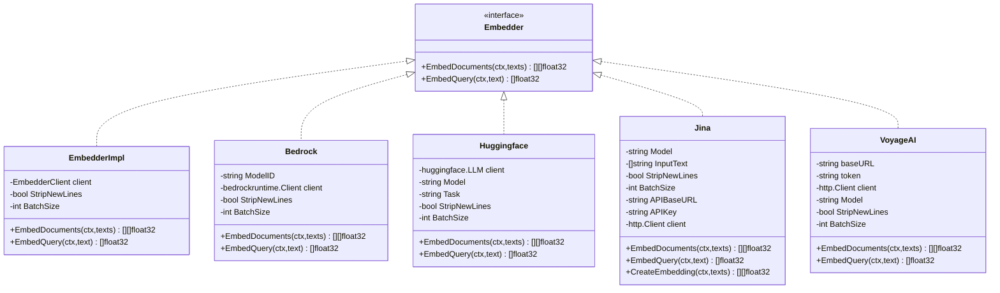

## EmbedderClient 接口及其实现

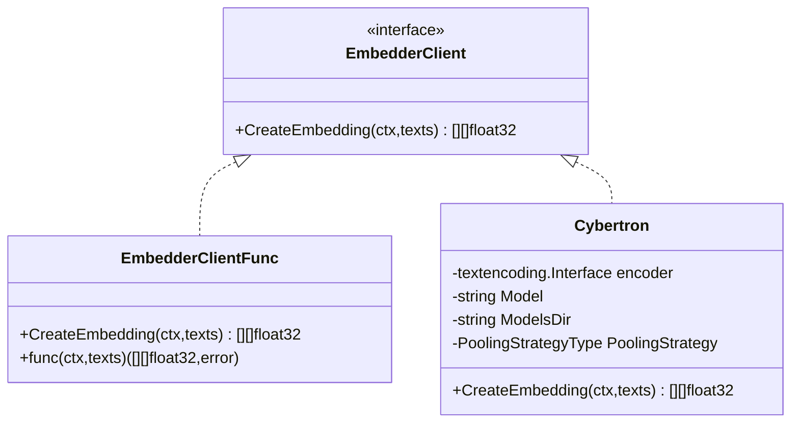

说明:
- **Embedder**: 对外统一接口，各云/本地实现嵌入逻辑
- **EmbedderClient**: 更底层的批量向量接口
- **EmbedderImpl**: 通过组合 EmbedderClient 适配任意底层实现
- **具体实现**: Bedrock/Huggingface/Jina/VoyageAI 直接实现 Embedder
- **Cybertron**: 仅实现 EmbedderClient，可被 EmbedderImpl 包装

---

# LLMs Package UML

## Model 接口及其实现

```mermaid
classDiagram
    direction TB

    class Model {
        <<interface>>
        +GenerateContent(ctx,messages,options) *ContentResponse
        +Call(ctx,prompt,options) string
    }

    class OpenAI {
        -string token
        -string model
        -string baseURL
        -string organization
        -APIType apiType
        -string apiVersion
        -http.Client httpClient
        -string embeddingModel
        -string responseFormat
        -int embeddingDimensions
        -callbacks.Handler CallbacksHandler
        +GenerateContent(ctx,messages,options) *ContentResponse
        +Call(ctx,prompt,options) string
        +CreateEmbedding(ctx,texts) [][]float32
    }

    class Anthropic {
        -string token
        -string model
        -string baseURL
        -http.Client httpClient
        -bool useLegacyTextCompletionsAPI
        -string anthropicBetaHeader
        -callbacks.Handler CallbacksHandler
        -anthropicclient.Client client
        +GenerateContent(ctx,messages,options) *ContentResponse
        +Call(ctx,prompt,options) string
    }

    class Bedrock {
        -string modelProvider
        -string modelID
        -bedrockclient.Client client
        -bedrockruntime.Client awsClient
        -callbacks.Handler CallbacksHandler
        +GenerateContent(ctx,messages,options) *ContentResponse
        +Call(ctx,prompt,options) string
    }

    class GoogleAI {
        -genai.Client client
        -string apiKey
        -string defaultModel
        -int defaultCandidateCount
        -int defaultMaxTokens
        -float64 defaultTemperature
        -float64 defaultTopP
        -int defaultTopK
        -int harmThreshold
        -callbacks.Handler CallbacksHandler
        +GenerateContent(ctx,messages,options) *ContentResponse
        +Call(ctx,prompt,options) string
        +CreateEmbedding(ctx,texts) [][]float32
    }

    class Ollama {
        -ollamaclient.Client client
        -string model
        -string ollamaServerURL
        -http.Client httpClient
        -bool pullModel
        -callbacks.Handler CallbacksHandler
        +GenerateContent(ctx,messages,options) *ContentResponse
        +Call(ctx,prompt,options) string
        +CreateEmbedding(ctx,texts) [][]float32
    }

    class HuggingFace {
        -huggingfaceclient.Client client
        -string token
        -string model
        -string url
        -string provider
        -http.Client httpClient
        -callbacks.Handler CallbacksHandler
        +GenerateContent(ctx,messages,options) *ContentResponse
        +Call(ctx,prompt,options) string
        +CreateEmbedding(ctx,texts) [][]float32
    }

    class Cohere {
        -cohereclient.Client client
        -string token
        -string baseURL
        -string model
        -callbacks.Handler CallbacksHandler
        +GenerateContent(ctx,messages,options) *ContentResponse
        +Call(ctx,prompt,options) string
    }

    class Cloudflare {
        -string token
        -string baseURL
        -string accountID
        -string model
        -http.Client httpClient
        -callbacks.Handler CallbacksHandler
        +GenerateContent(ctx,messages,options) *ContentResponse
        +Call(ctx,prompt,options) string
    }

    class DeepSeek {
        -string token
        -string baseURL
        -string model
        -http.Client httpClient
        -callbacks.Handler CallbacksHandler
        +GenerateContent(ctx,messages,options) *ContentResponse
        +Call(ctx,prompt,options) string
    }

    class Ernie {
        -string accessToken
        -string clientID
        -string clientSecret
        -string baseURL
        -string model
        -http.Client httpClient
        -callbacks.Handler CallbacksHandler
        +GenerateContent(ctx,messages,options) *ContentResponse
        +Call(ctx,prompt,options) string
    }

    class Kimi {
        -string token
        -string baseURL
        -string model
        -http.Client httpClient
        -callbacks.Handler CallbacksHandler
        +GenerateContent(ctx,messages,options) *ContentResponse
        +Call(ctx,prompt,options) string
    }

    class LlamaFile {
        -string baseURL
        -string model
        -http.Client httpClient
        -callbacks.Handler CallbacksHandler
        +GenerateContent(ctx,messages,options) *ContentResponse
        +Call(ctx,prompt,options) string
    }

    class Local {
        -string binPath
        -string model
        -[]string globalAsArgs
        -callbacks.Handler CallbacksHandler
        +GenerateContent(ctx,messages,options) *ContentResponse
        +Call(ctx,prompt,options) string
    }

    class Maritaca {
        -string token
        -string baseURL
        -string model
        -http.Client httpClient
        -callbacks.Handler CallbacksHandler
        +GenerateContent(ctx,messages,options) *ContentResponse
        +Call(ctx,prompt,options) string
    }

    class Mistral {
        -string token
        -string baseURL
        -string model
        -http.Client httpClient
        -callbacks.Handler CallbacksHandler
        +GenerateContent(ctx,messages,options) *ContentResponse
        +Call(ctx,prompt,options) string
        +CreateEmbedding(ctx,texts) [][]float32
    }

    class Qwen {
        -string token
        -string baseURL
        -string model
        -http.Client httpClient
        -callbacks.Handler CallbacksHandler
        +GenerateContent(ctx,messages,options) *ContentResponse
        +Call(ctx,prompt,options) string
    }

    class WatsonX {
        -string token
        -string baseURL
        -string projectID
        -string model
        -http.Client httpClient
        -callbacks.Handler CallbacksHandler
        +GenerateContent(ctx,messages,options) *ContentResponse
        +Call(ctx,prompt,options) string
    }

    class Fake {
        -[]string responses
        -int currentIndex
        -callbacks.Handler CallbacksHandler
        +GenerateContent(ctx,messages,options) *ContentResponse
        +Call(ctx,prompt,options) string
    }

    %% Interface implementations
    Model <|.. OpenAI
    Model <|.. Anthropic
    Model <|.. Bedrock
    Model <|.. GoogleAI
    Model <|.. Ollama
    Model <|.. HuggingFace
    Model <|.. Cohere
    Model <|.. Cloudflare
    Model <|.. DeepSeek
    Model <|.. Ernie
    Model <|.. Kimi
    Model <|.. LlamaFile
    Model <|.. Local
    Model <|.. Maritaca
    Model <|.. Mistral
    Model <|.. Qwen
    Model <|.. WatsonX
    Model <|.. Fake
```

## ChatMessage 接口及其实现

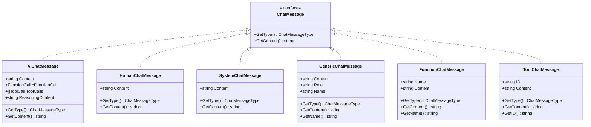

## ContentPart 接口及其实现

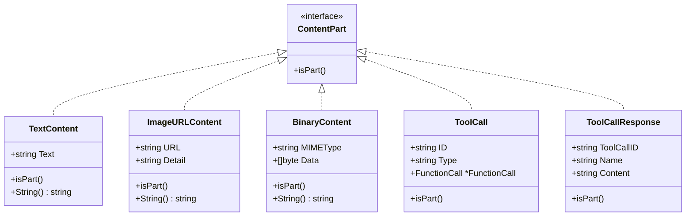

## Named 接口及其实现

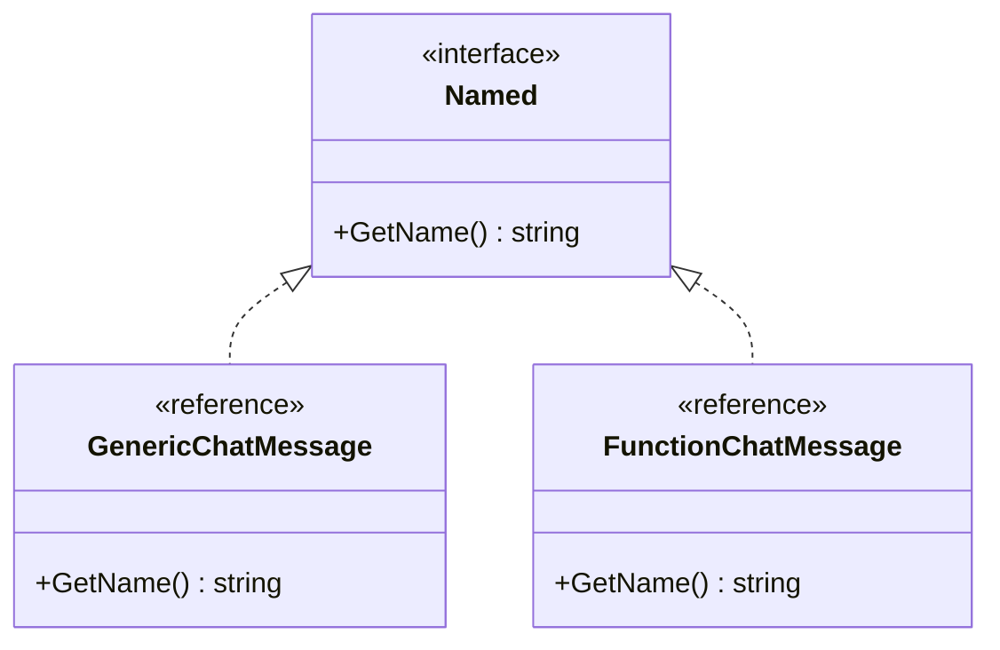

说明:
- **Model**: 统一多模态接口，`GenerateContent` 是核心方法，`Call` 为兼容旧接口
- **ChatMessage**: 抽象不同来源角色；工具和函数调用通过 FunctionCall/ToolCall 结合
- **ContentPart**: 支持文本/图片URL/二进制/工具调用及响应等多种内容类型
- **Named**: 为有名称的消息类型提供统一的名称获取接口

更新时间: 2025-09-04

---

# OutputParser Package UML

## OutputParser 接口及其实现

```mermaid
classDiagram
    direction TB

    class OutputParser {
        <<interface>>
        +GetFormatInstructions() string
        +Parse(text) any,error
        +ParseWithPrompt(text,prompt) any,error
        +Type() string
    }

    class Simple {
        +GetFormatInstructions() string
        +Parse(text) any,error
        +ParseWithPrompt(text,prompt) any,error
        +Type() string
    }

    class BooleanParser {
        +[]string TrueStrings
        +[]string FalseStrings
        +GetFormatInstructions() string
        +Parse(text) any,error
        +ParseWithPrompt(text,prompt) any,error
        +Type() string
        -parse(text) bool,error
    }

    class Structured {
        +[]ResponseSchema ResponseSchemas
        +GetFormatInstructions() string
        +Parse(text) any,error
        +ParseWithPrompt(text,prompt) any,error
        +Type() string
        -parse(text) map~string,string~,error
    }

    class Combining {
        +[]OutputParser Parsers
        +GetFormatInstructions() string
        +Parse(text) any,error
        +ParseWithPrompt(text,prompt) any,error
        +Type() string
        -parse(text) map~string,any~,error
    }

    class CommaSeparatedList {
        +GetFormatInstructions() string
        +Parse(text) any,error
        +ParseWithPrompt(text,prompt) any,error
        +Type() string
    }

    class Defined {
        +reflect.Type StructType
        +GetFormatInstructions() string
        +Parse(text) any,error
        +ParseWithPrompt(text,prompt) any,error
        +Type() string
    }

    class RegexParser {
        +string Regex
        +[]string OutputKeys
        +GetFormatInstructions() string
        +Parse(text) any,error
        +ParseWithPrompt(text,prompt) any,error
        +Type() string
    }

    class RegexDict {
        +map~string,string~ RegexDict
        +GetFormatInstructions() string
        +Parse(text) any,error
        +ParseWithPrompt(text,prompt) any,error
        +Type() string
    }

    %% Interface implementations
    OutputParser <|.. Simple
    OutputParser <|.. BooleanParser
    OutputParser <|.. Structured
    OutputParser <|.. Combining
    OutputParser <|.. CommaSeparatedList
    OutputParser <|.. Defined
    OutputParser <|.. RegexParser
    OutputParser <|.. RegexDict

    %% Composition relationships
    Combining --> OutputParser : *Parsers
```

---

# Prompts Package UML

## Formatter 接口及其实现

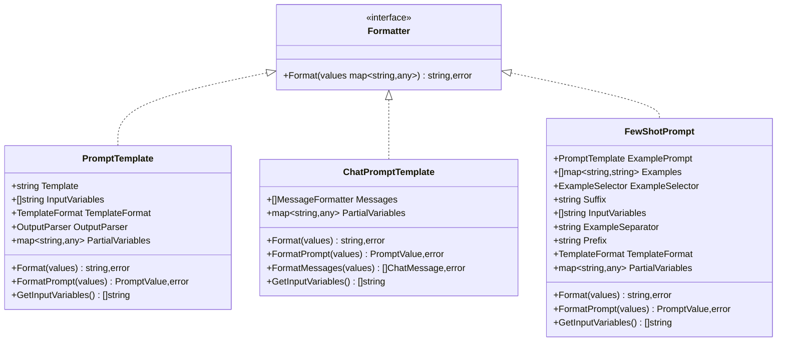

## MessageFormatter 接口及其实现

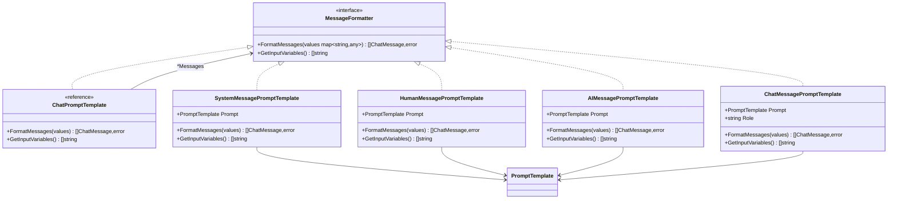

## FormatPrompter 接口及其实现

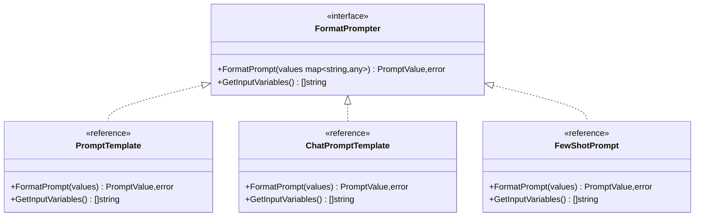

说明:
- **OutputParser**: 解析 LLM 输出的统一接口，支持多种格式转换
- **Formatter**: 将值映射格式化为字符串的基础接口
- **MessageFormatter**: 专门用于聊天消息格式化的接口
- **FormatPrompter**: 生成 PromptValue 的高级格式化接口
- **组合模式**: Combining 解析器可组合多个解析器，ChatPromptTemplate 可组合多个消息格式器

更新时间: 2025-09-04

# LangChain Go UML Documentation

This document contains UML class diagrams for the LangChain Go packages, organized by interfaces and their implementations.

## Embeddings Package

The Embeddings package defines core interfaces for creating embeddings from documents and queries:

```mermaid
classDiagram
    class Embedder {
        <<interface>>
        +EmbedDocuments(ctx context.Context, texts []string) ([][]float32, error)
        +EmbedQuery(ctx context.Context, text string) ([]float32, error)
    }
    
    class EmbedderClient {
        <<interface>>
        +CreateEmbedding(ctx context.Context, r *EmbeddingRequest) (*EmbeddingResponse, error)
    }
    
    class OpenAI
    class AzureOpenAI
    class Cohere
    class OllamaEmbeddings
    class GoogleGenAI
    class BGESmallEn
    class E5SmallV2
    class AllMiniLML6V2
    class MultiLingualE5Large
    class VertexAI
    class Ernie
    class QianFan
    class GoogleGenAIClient
    class VertexAIClient
    class ErnieClient
    class QianFanClient
    
    Embedder <|.. OpenAI
    Embedder <|.. AzureOpenAI  
    Embedder <|.. Cohere
    Embedder <|.. OllamaEmbeddings
    Embedder <|.. GoogleGenAI
    Embedder <|.. BGESmallEn
    Embedder <|.. E5SmallV2
    Embedder <|.. AllMiniLML6V2
    Embedder <|.. MultiLingualE5Large
    Embedder <|.. VertexAI
    Embedder <|.. Ernie
    Embedder <|.. QianFan
    
    EmbedderClient <|.. GoogleGenAIClient
    EmbedderClient <|.. VertexAIClient
    EmbedderClient <|.. ErnieClient
    EmbedderClient <|.. QianFanClient
```

## LLMs Package

The LLMs package defines core interfaces for language model interactions:

```mermaid
classDiagram
    class Model {
        <<interface>>
        +GenerateContent(ctx context.Context, messages []ChatMessage, options ...CallOption) (*ContentResponse, error)
        +Call(ctx context.Context, prompt string, options ...CallOption) (string, error)
    }
    
    class ChatMessage {
        <<interface>>
        +GetType() ChatMessageType
        +GetContent() string
    }
    
    class ContentPart {
        <<interface>>
        +Type() ContentPartType
    }
    
    class Named {
        <<interface>>
        +GetName() string
    }
    
    class OpenAI
    class Azure  
    class Anthropic
    class Bedrock
    class Cohere
    class Ernie
    class GoogleGenAI
    class VertexAI
    class HuggingFaceInference
    class OllamaLLM
    class QianFan
    class YandexGPT
    class HumanMessage
    class AIMessage
    class SystemMessage
    class GenericMessage
    class ToolMessage
    class ImagePart
    class TextPart
    class BlobPart
    class ToolCall
    class ToolCallFunction
    
    Model <|.. OpenAI
    Model <|.. Azure
    Model <|.. Anthropic
    Model <|.. Bedrock
    Model <|.. Cohere
    Model <|.. Ernie
    Model <|.. GoogleGenAI
    Model <|.. VertexAI
    Model <|.. HuggingFaceInference
    Model <|.. OllamaLLM
    Model <|.. QianFan
    Model <|.. YandexGPT
    
    ChatMessage <|.. HumanMessage
    ChatMessage <|.. AIMessage
    ChatMessage <|.. SystemMessage
    ChatMessage <|.. GenericMessage
    ChatMessage <|.. ToolMessage
    
    ContentPart <|.. ImagePart
    ContentPart <|.. TextPart
    ContentPart <|.. BlobPart
    
    Named <|.. ToolCall
    Named <|.. ToolCallFunction
```

## OutputParser Package

The OutputParser package defines interfaces for parsing LLM outputs into structured formats:

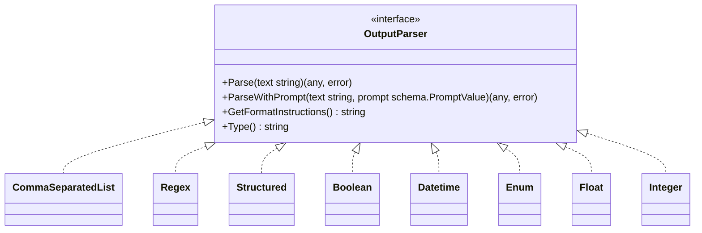

## Prompts Package

The Prompts package defines interfaces and implementations for various prompt formatting strategies:

```mermaid
classDiagram
    class Formatter {
        <<interface>>
        +Format(args map[string]any) (string, error)
    }
    
    class MessageFormatter {
        <<interface>>
        +FormatMessages(args map[string]any) ([]schema.ChatMessage, error)
    }
    
    class FormatPrompter {
        <<interface>>
        +FormatPrompt(args map[string]any) (schema.PromptValue, error)
    }
    
    class PromptTemplate
    class ChatPromptTemplate
    class MessagesPlaceholder
    class PipelinePromptTemplate
    class ConditionalPromptSelector
    class LengthBasedExampleSelector
    class SemanticSimilarityExampleSelector
    class MaxMarginalRelevanceExampleSelector
    class FewShotPromptTemplate
    class FewShotChatMessagePromptTemplate
    
    Formatter <|.. PromptTemplate
    FormatPrompter <|.. PromptTemplate
    MessageFormatter <|.. ChatPromptTemplate  
    FormatPrompter <|.. ChatPromptTemplate
    MessageFormatter <|.. MessagesPlaceholder
    FormatPrompter <|.. PipelinePromptTemplate
    FormatPrompter <|.. FewShotPromptTemplate
    MessageFormatter <|.. FewShotChatMessagePromptTemplate
    FormatPrompter <|.. FewShotChatMessagePromptTemplate
```

## VectorStores Package

The VectorStores package defines the core interface for vector storage and retrieval operations:

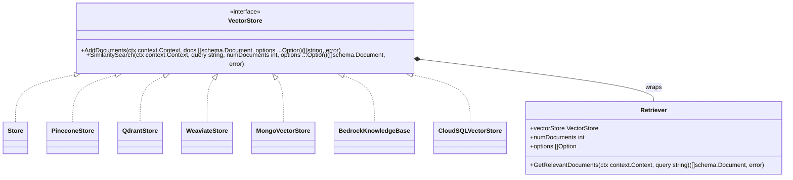

