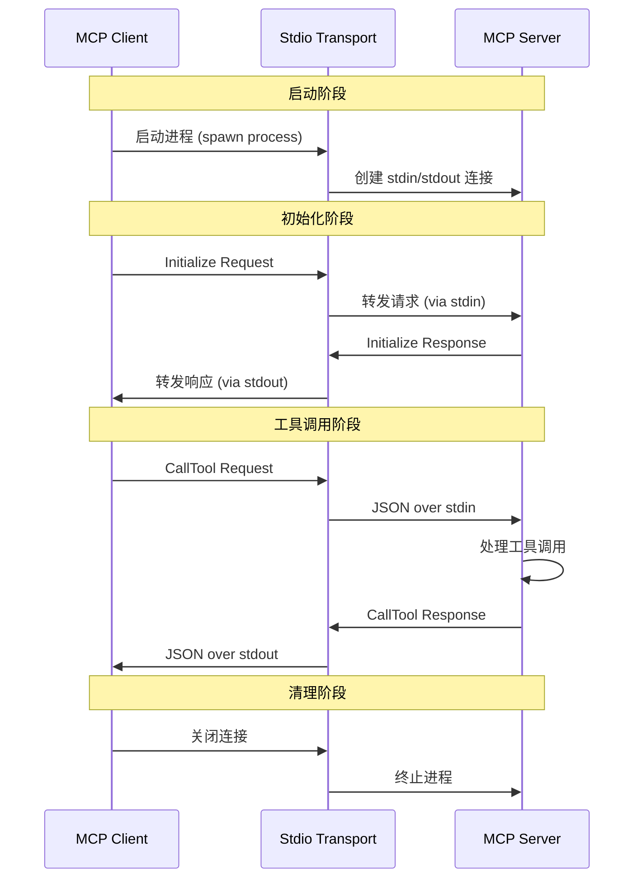
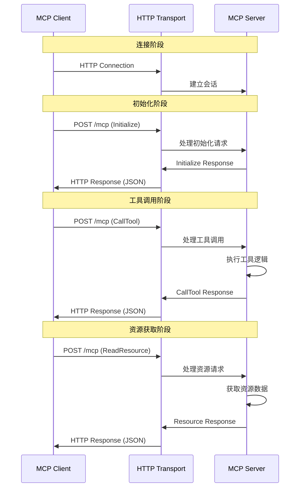
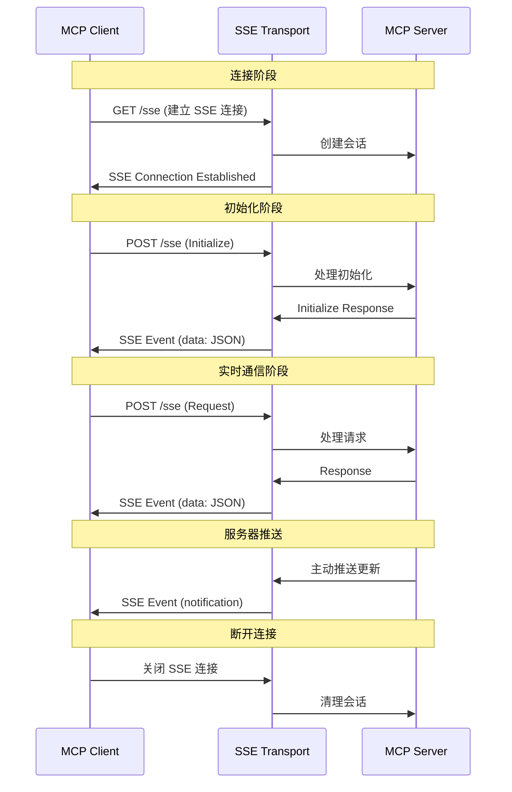
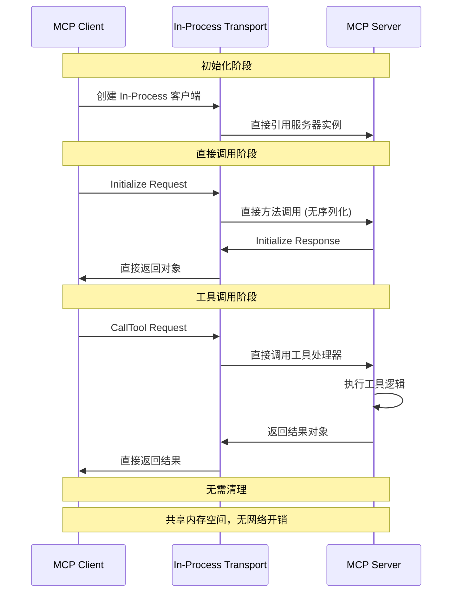
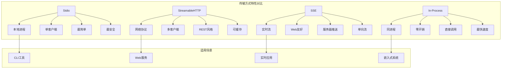
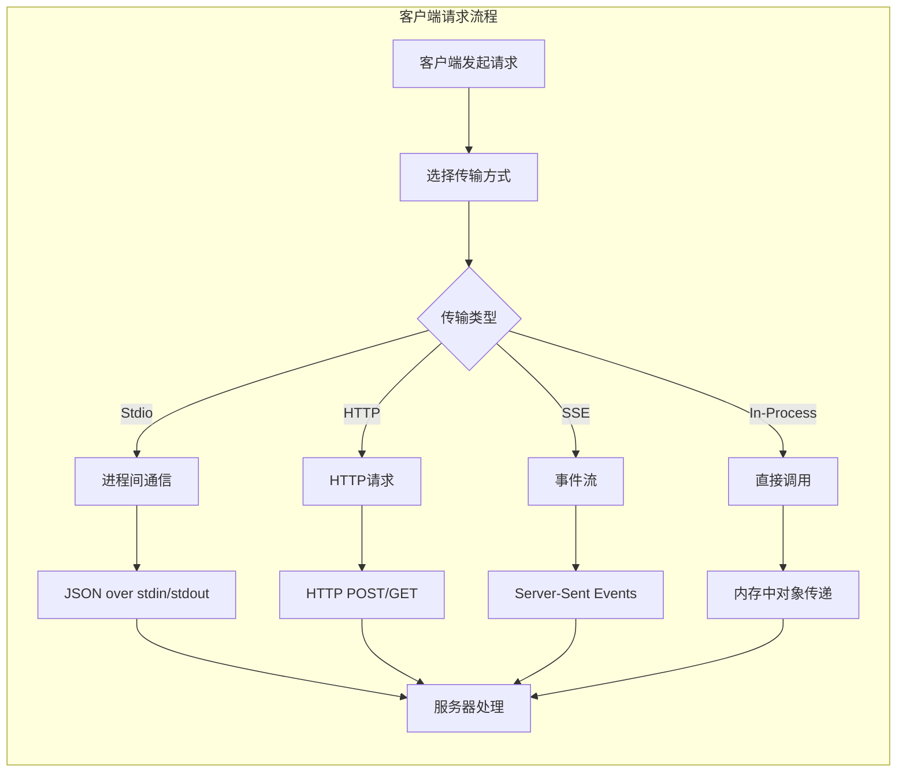
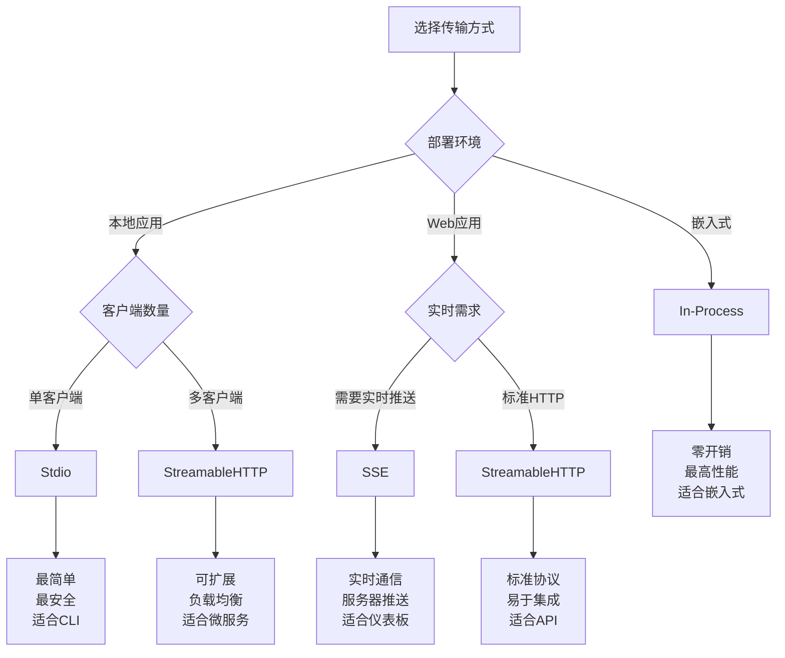

# MCP-Go 文档总结

## 概述

MCP-Go 是 Model Context Protocol (MCP) 的 Go 语言实现，为 AI 应用程序与外部数据源和工具之间提供安全、可控的连接。它是一个开放标准，使大型语言模型 (LLM) 能够以标准化的方式访问和与外部系统交互，同时保持安全性和用户控制。

## 核心特性

- **高性能**: 基于 Go 的高效实现，最小化开销
- **简单易用**: 清晰直观的 API，最少的样板代码
- **功能完整**: 完全支持 MCP 规范，包括工具、资源和提示
- **类型安全**: 利用 Go 的类型系统构建健壮的 MCP 服务器
- **多种传输方式**: 支持 Stdio、StreamableHTTP、Server-Sent Events 和 In-Process

## 传输方式架构图

### 1. Stdio 传输方式



### 2. StreamableHTTP 传输方式



### 3. Server-Sent Events (SSE) 传输方式



### 4. In-Process 传输方式



### 传输方式对比图



## 安装

```bash
go get github.com/mark3labs/mcp-go
```

## 核心概念

### 1. 资源 (Resources)

资源类似于 GET 端点，以只读方式向 LLM 公开数据。

**主要特征**:
- **只读**: LLM 可以获取但不能修改资源
- **基于 URI**: 每个资源都有唯一标识符
- **类型化内容**: 资源指定其 MIME 类型（文本、JSON、二进制等）
- **动态或静态**: 可以是预定义的或按需生成的

**示例用例**:
- 文件系统访问 (`file:///path/to/document.txt`)
- 数据库记录 (`db://users/123`)
- API 数据 (`api://weather/current`)
- 配置文件 (`config://app.json`)

```go
// 静态资源
resource := mcp.NewResource(
    "docs://readme",
    "Project README",
    mcp.WithResourceDescription("项目的主要文档"),
    mcp.WithMIMEType("text/markdown"),
)

// 带模板的动态资源
userResource := mcp.NewResource(
    "users://{user_id}",
    "User Profile",
    mcp.WithResourceDescription("用户配置文件信息"),
    mcp.WithMIMEType("application/json"),
)
```

### 2. 工具 (Tools)

工具类似于 POST 端点，提供 LLM 可以调用以执行操作或进行计算的功能。

**主要特征**:
- **面向操作**: 工具执行任务而不仅仅是返回数据
- **参数化**: 接受结构化输入参数
- **类型化模式**: 定义预期的参数类型和约束
- **返回结果**: 向 LLM 提供结构化输出

**示例用例**:
- 计算 (`calculate`, `convert_units`)
- 文件操作 (`create_file`, `search_files`)
- API 调用 (`send_email`, `create_ticket`)
- 系统命令 (`run_command`, `check_status`)

```go
// 简单计算工具
calcTool := mcp.NewTool("calculate",
    mcp.WithDescription("执行算术运算"),
    mcp.WithString("operation", 
        mcp.Required(),
        mcp.Enum("add", "subtract", "multiply", "divide"),
    ),
    mcp.WithNumber("x", mcp.Required()),
    mcp.WithNumber("y", mcp.Required()),
)

// 文件创建工具
fileTool := mcp.NewTool("create_file",
    mcp.WithDescription("创建包含内容的新文件"),
    mcp.WithString("path", mcp.Required()),
    mcp.WithString("content", mcp.Required()),
    mcp.WithString("encoding", mcp.Default("utf-8")),
)
```

### 3. 提示 (Prompts)

提示是可重用的交互模板，帮助构建用户和 LLM 之间的对话。

**主要特征**:
- **基于模板**: 使用占位符动态内容
- **可重用**: 可以使用不同参数多次调用
- **结构化**: 定义清晰的输入参数和预期输出
- **上下文感知**: 可以包含相关资源或工具建议

**示例用例**:
- 代码审查模板
- 文档生成
- 数据分析工作流
- 创意写作提示

```go
// 代码审查提示
reviewPrompt := mcp.NewPrompt("code_review",
    mcp.WithPromptDescription("审查代码的最佳实践和问题"),
    mcp.WithPromptArgument("code", 
        mcp.Required(),
        mcp.Description("要审查的代码"),
    ),
    mcp.WithPromptArgument("language",
        mcp.Description("编程语言"),
    ),
)
```

### 4. 传输方式 (Transports)

传输定义了 MCP 客户端和服务器如何通信。MCP-Go 支持多种传输方法以适应不同的部署场景。

#### 传输方式实现流程



#### 各传输方式详细特性

**1. Stdio 传输**
- **通信机制**: 标准输入/输出流
- **数据格式**: JSON-RPC over stdin/stdout
- **连接模式**: 单一进程，单一客户端
- **适用场景**: 命令行工具、桌面应用集成

```go
// Stdio 服务器实现
func main() {
    s := server.NewMCPServer("Stdio Server", "1.0.0")
    // 添加工具和资源...
    server.ServeStdio(s) // 阻塞式运行
}

// Stdio 客户端实现
transport := transport.NewStdio("go", nil, "run", "server/main.go")
client := client.NewClient(transport)
```

**2. StreamableHTTP 传输**
- **通信机制**: HTTP POST 请求
- **数据格式**: JSON over HTTP
- **连接模式**: 多客户端，无状态
- **适用场景**: Web 服务、微服务架构

```go
// HTTP 服务器实现
func main() {
    s := server.NewMCPServer("HTTP Server", "1.0.0")
    // 添加工具和资源...
    httpServer := server.NewStreamableHTTPServer(s)
    httpServer.Start(":8080") // 启动 HTTP 服务器
}

// HTTP 客户端实现
transport, _ := transport.NewStreamableHTTP("http://localhost:8080/mcp")
client := client.NewClient(transport)
```

**3. Server-Sent Events (SSE) 传输**
- **通信机制**: HTTP SSE + POST 请求
- **数据格式**: Event-Stream + JSON
- **连接模式**: 长连接，实时推送
- **适用场景**: 实时 Web 应用、仪表板

```go
// SSE 服务器实现
func main() {
    s := server.NewMCPServer("SSE Server", "1.0.0")
    // 添加工具和资源...
    server.ServeSSE(s, ":8080") // 启动 SSE 服务器
}

// SSE 客户端（通常是 Web 前端）
const eventSource = new EventSource('/sse');
eventSource.onmessage = function(event) {
    const data = JSON.parse(event.data);
    // 处理服务器推送的数据
};
```

**4. In-Process 传输**
- **通信机制**: 直接方法调用
- **数据格式**: Go 对象（无序列化）
- **连接模式**: 同进程内存共享
- **适用场景**: 嵌入式系统、高性能应用

```go
// In-Process 实现
func main() {
    s := server.NewMCPServer("In-Process Server", "1.0.0")
    // 添加工具和资源...
    
    // 创建 in-process 客户端
    client := client.NewInProcessClient(s)
    
    // 直接调用，无网络开销
    result, err := client.CallTool(ctx, request)
}
```

#### 传输方式选择指南



## 快速开始

### Hello World 服务器

创建一个简单的 MCP 服务器：

```go
package main

import (
    "context"
    "fmt"

    "github.com/mark3labs/mcp-go/mcp"
    "github.com/mark3labs/mcp-go/server"
)

func main() {
    // 创建新的 MCP 服务器
    s := server.NewMCPServer(
        "Demo 🚀",
        "1.0.0",
        server.WithToolCapabilities(false),
    )

    // 添加工具
    tool := mcp.NewTool("hello_world",
        mcp.WithDescription("向某人问好"),
        mcp.WithString("name",
            mcp.Required(),
            mcp.Description("要问候的人的姓名"),
        ),
    )

    // 添加工具处理器
    s.AddTool(tool, helloHandler)

    // 启动 stdio 服务器
    if err := server.ServeStdio(s); err != nil {
        fmt.Printf("服务器错误: %v\n", err)
    }
}

func helloHandler(ctx context.Context, request mcp.CallToolRequest) (*mcp.CallToolResult, error) {
    name, err := request.RequireString("name")
    if err != nil {
        return mcp.NewToolResultError(err.Error()), nil
    }

    return mcp.NewToolResultText(fmt.Sprintf("你好, %s!", name)), nil
}
```

### 运行服务器

1. 保存代码到文件（例如 `main.go`）
2. 运行：
   ```bash
   go run main.go
   ```

### 客户端示例

创建 MCP 客户端连接到其他服务器：

```go
package main

import (
    "context"
    "fmt"
    "log"
    "time"

    "github.com/mark3labs/mcp-go/client"
    "github.com/mark3labs/mcp-go/client/transport"
    "github.com/mark3labs/mcp-go/mcp"
)

func main() {
    ctx, cancel := context.WithTimeout(context.Background(), 30*time.Second)
    defer cancel()

    // 创建 stdio 传输
    stdioTransport := transport.NewStdio("go", nil, "run", "path/to/server/main.go")

    // 使用传输创建客户端
    c := client.NewClient(stdioTransport)

    // 启动客户端
    if err := c.Start(ctx); err != nil {
        log.Fatalf("启动客户端失败: %v", err)
    }
    defer c.Close()

    // 初始化客户端
    initRequest := mcp.InitializeRequest{}
    initRequest.Params.ProtocolVersion = mcp.LATEST_PROTOCOL_VERSION
    initRequest.Params.ClientInfo = mcp.Implementation{
        Name:    "Hello World Client",
        Version: "1.0.0",
    }

    serverInfo, err := c.Initialize(ctx, initRequest)
    if err != nil {
        log.Fatalf("初始化失败: %v", err)
    }

    fmt.Printf("连接到服务器: %s (版本 %s)\n",
        serverInfo.ServerInfo.Name,
        serverInfo.ServerInfo.Version)
}
```

## 架构设计

### 服务器 vs 客户端

**MCP 服务器**:
- **目的**: 向 LLM 公开工具、资源和提示
- **用例**: 数据库访问层、文件系统工具、API 集成、自定义业务逻辑
- **特征**: 被动、响应请求、有状态

**MCP 客户端**:
- **目的**: 连接并使用 MCP 服务器
- **用例**: LLM 应用程序、编排工具、测试和调试、服务器组合
- **特征**: 主动、发出请求、协调多个服务器

### 会话管理

MCP-Go 自动处理会话管理，支持适当隔离的多个并发客户端。

**功能**:
- **多客户端支持**: 多个 LLM 可以同时连接
- **会话隔离**: 每个客户端具有独立状态
- **资源清理**: 客户端断开连接时自动清理
- **并发安全**: 所有会话中的线程安全操作

## 测试和调试

### 使用 Claude Desktop 测试

1. 安装 Claude Desktop
2. 配置服务器（编辑 Claude 的配置文件）：
   ```json
   {
     "mcpServers": {
       "hello-world": {
         "command": "go",
         "args": ["run", "/path/to/your/hello-server/main.go"]
       }
     }
   }
   ```
3. 重启 Claude Desktop
4. 寻找 🔌 图标表示 MCP 连接

### 使用 MCP Inspector

```bash
# 安装 MCP Inspector
npm install -g @modelcontextprotocol/inspector

# 使用 inspector 运行服务器
mcp-inspector go run main.go
```

## 常见问题

### 服务器无法启动
- 检查端口是否已被占用
- 验证 Go 模块依赖项已安装
- 确保适当的文件权限

### 客户端连接失败
- 验证服务器正在运行且可访问
- 检查 StreamableHTTP 客户端的网络连接
- 验证 stdio 客户端的 stdio 命令路径

### 工具调用失败
- 验证工具参数类型与模式匹配
- 检查工具函数中的错误处理
- 使用 MCP Inspector 进行调试

## 总结

MCP-Go 提供了一个强大而简洁的框架来构建 Model Context Protocol 服务器和客户端。通过其高级接口、最小样板代码和完整的 MCP 规范支持，开发者可以快速创建强大的 AI 工具集成。无论是构建简单的工具还是复杂的数据访问层，MCP-Go 都提供了必要的抽象和功能来实现目标。