---
title: "MCP-Go Server 包架构分析"
date: 2023-08-15T10:00:00+08:00
lastmod: 2023-08-20T15:30:00+08:00
description: "Model Context Protocol (MCP) Go 服务器端实现的架构分析和设计模式解析"
summary: "深入分析 MCP-Go Server 包的架构设计、核心组件、功能模块和设计模式，并提供架构层面的改进建议。"
keywords: ["MCP", "Go", "架构设计", "设计模式", "服务器架构", "LLM", "API设计"]
categories: ["架构设计", "Go", "MCP"]
tags: ["架构", "设计模式", "Go", "MCP", "服务器", "API", "LLM"]
author: "架构师"
toc: true
mathjax: false
comment: true
weight: 1
hideHeaderAndFooter: false
showtoc: true
tocopen: true
cover:
    image: "images/mcp-go-architecture.png"
    alt: "MCP-Go 架构图"
    caption: "MCP-Go Server 包架构概览"
    relative: false
draft: false
---

# MCP-Go Server 包架构分析

## 概述

MCP-Go Server 包实现了 Model Context Protocol (MCP) 的服务器端功能。MCP 是一个用于 LLM 驱动的应用程序与其支持服务之间通信的协议。该包提供了多种传输层实现（HTTP、SSE、标准输入输出），以及资源、提示和工具的管理功能。

## MCP 协议核心类型

```mermaid
classDiagram
    class JSONRPCMessage {
        <<interface>>
    }
    
    class JSONRPCRequest {
        +JSONRPC string
        +ID RequestId
        +Params any
        +Method string
    }
    
    class JSONRPCNotification {
        +JSONRPC string
        +Method string
        +Params NotificationParams
    }
    
    class JSONRPCResponse {
        +JSONRPC string
        +ID RequestId
        +Result any
    }
    
    class JSONRPCError {
        +JSONRPC string
        +ID RequestId
        +Error struct
    }
    
    class Resource {
        +URI string
        +Name string
        +Description string
        +MIMEType string
        +Annotations *Annotations
    }
    
    class ResourceTemplate {
        +URITemplate *URITemplate
        +Name string
        +Description string
        +MIMEType string
        +Annotations *Annotations
    }
    
    class Prompt {
        +Name string
        +Description string
        +Arguments []PromptArgument
    }
    
    class PromptArgument {
        +Name string
        +Description string
        +Required bool
    }
    
    class Tool {
        +Name string
        +Description string
        +InputSchema ToolInputSchema
        +Annotations ToolAnnotation
    }
    
    class ToolInputSchema {
        +Type string
        +Properties map[string]any
        +Required []string
    }
    
    class ToolAnnotation {
        +Title string
        +ReadOnlyHint *bool
        +DestructiveHint *bool
        +IdempotentHint *bool
        +OpenWorldHint *bool
    }
    
    class Content {
        <<interface>>
        +isContent()
    }
    
    class TextContent {
        +Type string
        +Text string
        +Annotations *Annotations
    }
    
    class ImageContent {
        +Type string
        +Data string
        +MIMEType string
        +Annotations *Annotations
    }
    
    class AudioContent {
        +Type string
        +Data string
        +MIMEType string
        +Annotations *Annotations
    }
    
    class ResourceContents {
        <<interface>>
        +isResourceContents()
    }
    
    class TextResourceContents {
        +URI string
        +MIMEType string
        +Text string
    }
    
    class BlobResourceContents {
        +URI string
        +MIMEType string
        +Blob string
    }
    
    JSONRPCMessage <|.. JSONRPCRequest
    JSONRPCMessage <|.. JSONRPCNotification
    JSONRPCMessage <|.. JSONRPCResponse
    JSONRPCMessage <|.. JSONRPCError
    
    Content <|.. TextContent
    Content <|.. ImageContent
    Content <|.. AudioContent
    
    ResourceContents <|.. TextResourceContents
    ResourceContents <|.. BlobResourceContents
```

## 核心组件

### MCPServer

MCPServer 是 MCP 协议服务器的核心实现，负责处理客户端请求、管理资源、提示和工具，以及维护客户端会话。

```mermaid
classDiagram
    class MCPServer {
        -name string
        -version string
        -resources map[string]mcp.Resource
        -resourceTemplates map[string]mcp.ResourceTemplate
        -prompts map[string]mcp.Prompt
        -tools map[string]mcp.Tool
        -sessions map[string]ClientSession
        -notificationHandlers []NotificationHandler
        -hooks *Hooks
        -toolHandlerMiddleware []ToolHandlerMiddleware
        -toolFilter ToolFilter
        -recovery RecoveryFunc
        -capabilities ServerCapabilities
        -instructions string
        +NewMCPServer(name, version string, opts ...ServerOption) *MCPServer
        +AddResources(resources []mcp.Resource)
        +AddResource(resource mcp.Resource)
        +RemoveResource(uri string)
        +AddResourceTemplate(template mcp.ResourceTemplate)
        +AddPrompts(prompts []mcp.Prompt)
        +AddPrompt(prompt mcp.Prompt)
        +DeletePrompts(names []string)
        +AddTool(tool mcp.Tool)
        +AddTools(tools []mcp.Tool)
        +SetTools(tools []mcp.Tool)
        +DeleteTools(names []string)
        +AddNotificationHandler(handler NotificationHandler)
        +RegisterSession(ctx context.Context, session ClientSession)
        +UnregisterSession(ctx context.Context, sessionID string)
        +NotifyAll(ctx context.Context, notification mcp.JSONRPCNotification)
        +NotifySession(ctx context.Context, sessionID string, notification mcp.JSONRPCNotification)
        +HandleMessage(ctx context.Context, session ClientSession, message []byte) ([]byte, error)
    }

    class ClientSession {
        <<interface>>
        +GetID() string
        +SendNotification(ctx context.Context, notification mcp.JSONRPCNotification) error
    }

    class SessionWithLogging {
        <<interface>>
        +GetLogLevel() mcp.LoggingLevel
        +SetLogLevel(level mcp.LoggingLevel)
    }

    class SessionWithTools {
        <<interface>>
        +GetTools() map[string]mcp.Tool
        +SetTools(tools map[string]mcp.Tool)
    }

    class SessionWithClientInfo {
        <<interface>>
        +GetClientInfo() mcp.Implementation
    }

    class SessionWithStreamableHTTPConfig {
        <<interface>>
        +GetStreamableHTTPConfig() StreamableHTTPConfig
    }

    class Hooks {
        +OnRegisterSession []OnRegisterSessionHookFunc
        +OnUnregisterSession []OnUnregisterSessionHookFunc
        +OnBeforeAny []BeforeAnyHookFunc
        +OnSuccess []OnSuccessHookFunc
        +OnError []OnErrorHookFunc
        +OnRequestInitialization []OnRequestInitializationFunc
        +OnBeforeInitialize []OnBeforeInitializeFunc
        +OnAfterInitialize []OnAfterInitializeFunc
        +OnBeforePing []OnBeforePingFunc
        +OnAfterPing []OnAfterPingFunc
        +OnBeforeSetLevel []OnBeforeSetLevelFunc
        +OnAfterSetLevel []OnAfterSetLevelFunc
        +OnBeforeListResources []OnBeforeListResourcesFunc
        +OnAfterListResources []OnAfterListResourcesFunc
        +OnBeforeListResourceTemplates []OnBeforeListResourceTemplatesFunc
        +OnAfterListResourceTemplates []OnAfterListResourceTemplatesFunc
        +OnBeforeReadResource []OnBeforeReadResourceFunc
        +OnAfterReadResource []OnAfterReadResourceFunc
        +OnBeforeListPrompts []OnBeforeListPromptsFunc
        +OnAfterListPrompts []OnAfterListPromptsFunc
        +OnBeforeGetPrompt []OnBeforeGetPromptFunc
        +OnAfterGetPrompt []OnAfterGetPromptFunc
        +OnBeforeListTools []OnBeforeListToolsFunc
        +OnAfterListTools []OnAfterListToolsFunc
        +OnBeforeCallTool []OnBeforeCallToolFunc
        +OnAfterCallTool []OnAfterCallToolFunc
    }

    class NotificationHandler {
        <<interface>>
        +HandleNotification(ctx context.Context, notification mcp.JSONRPCNotification)
    }

    class ToolHandlerMiddleware {
        <<function>>
        ToolHandlerMiddleware(next ToolHandlerFunc) ToolHandlerFunc
    }

    class ToolHandlerFunc {
        <<function>>
        ToolHandlerFunc(ctx context.Context, request mcp.CallToolRequest) *mcp.CallToolResult
    }

    class ToolFilter {
        <<function>>
        ToolFilter(tool mcp.Tool) bool
    }

    class RecoveryFunc {
        <<function>>
        RecoveryFunc(ctx context.Context, request mcp.CallToolRequest, err any) *mcp.CallToolResult
    }

    class ServerCapabilities {
        +Resources *struct
        +Prompts *struct
        +Tools *struct
        +Experimental map[string]any
    }

    ClientSession <|-- SessionWithLogging
    ClientSession <|-- SessionWithTools
    ClientSession <|-- SessionWithClientInfo
    ClientSession <|-- SessionWithStreamableHTTPConfig
    MCPServer o-- ClientSession : manages
    MCPServer o-- Hooks : uses
    MCPServer o-- NotificationHandler : uses
    MCPServer o-- ToolHandlerMiddleware : uses
    MCPServer o-- ToolFilter : uses
    MCPServer o-- RecoveryFunc : uses
    MCPServer o-- ServerCapabilities : has
```

### 传输层实现

```mermaid
classDiagram
    class MCPServer {
        +HandleMessage(ctx context.Context, session ClientSession, message []byte) ([]byte, error)
    }

    class SSEServer {
        -server *MCPServer
        -baseURL string
        -staticBasePath string
        -dynamicBasePath string
        -messageEndpoint string
        -sseEndpoint string
        -httpServer *http.Server
        -sessions map[string]*sseSession
        +NewSSEServer(server *MCPServer, opts ...SSEOption) *SSEServer
        +Start(addr string) error
        +Shutdown(ctx context.Context) error
        -handleSSE(w http.ResponseWriter, r *http.Request)
        -handleMessage(w http.ResponseWriter, r *http.Request)
    }

    class StreamableHTTPServer {
        -server *MCPServer
        -endpointPath string
        -stateless bool
        -sessionIdManager SessionIdManager
        -heartbeatInterval time.Duration
        -httpContextFunc HTTPContextFunc
        -httpServer *http.Server
        -logger Logger
        -sessionTools *sessionToolsStore
        +NewStreamableHTTPServer(server *MCPServer, opts ...StreamableHTTPOption) *StreamableHTTPServer
        +ServeHTTP(w http.ResponseWriter, r *http.Request)
        +Start(addr string) error
        +Shutdown(ctx context.Context) error
    }

    class StdioServer {
        -server *MCPServer
        -session *stdioSession
        -errorLogger ErrorLogger
        -contextFunc StdioContextFunc
        +NewStdioServer(server *MCPServer, opts ...StdioOption) *StdioServer
        +SetErrorLogger(logger ErrorLogger)
        +SetContextFunc(fn StdioContextFunc)
        -handleNotifications(ctx context.Context, notification mcp.JSONRPCNotification)
        -processInputStream(ctx context.Context, reader *bufio.Reader) error
        -readNextLine(reader *bufio.Reader) ([]byte, error)
        +Listen(ctx context.Context) error
        -processMessage(ctx context.Context, message []byte) ([]byte, error)
        -writeResponse(response []byte) error
    }

    class sseSession {
        -id string
        -notificationChan chan mcp.JSONRPCNotification
        -logLevel mcp.LoggingLevel
        -tools map[string]mcp.Tool
        -clientInfo mcp.Implementation
    }

    class streamableHttpSession {
        -id string
        -logLevel mcp.LoggingLevel
        -clientInfo mcp.Implementation
        -config StreamableHTTPConfig
    }

    class stdioSession {
        -id string
        -logLevel mcp.LoggingLevel
        -tools map[string]mcp.Tool
        -clientInfo mcp.Implementation
    }

    class SessionIdManager {
        <<interface>>
        +GenerateSessionId(r *http.Request) (string, error)
        +ValidateSessionId(r *http.Request) (string, error)
    }

    MCPServer <-- SSEServer : uses
    MCPServer <-- StreamableHTTPServer : uses
    MCPServer <-- StdioServer : uses
    ClientSession <|.. sseSession : implements
    ClientSession <|.. streamableHttpSession : implements
    ClientSession <|.. stdioSession : implements
    StreamableHTTPServer o-- SessionIdManager : uses
```

## 主要功能模块

### 请求处理

MCPServer 通过 `HandleMessage` 方法处理传入的 JSON-RPC 消息，该方法解析消息、验证 JSON-RPC 版本、区分请求和通知，并根据方法名分派到相应的处理函数。

### 会话管理

MCPServer 管理客户端会话，提供注册、注销和通知功能。会话接口 `ClientSession` 定义了基本的会话功能，而扩展接口如 `SessionWithLogging`、`SessionWithTools` 等提供了额外的功能。

### 工具管理

MCPServer 支持添加、设置和删除工具，并提供中间件、过滤器和恢复机制来增强工具处理功能。

### 提示管理

MCPServer 支持添加和删除提示，提示可以是静态的或模板化的，后者需要在使用时提供参数。

### 资源管理

MCPServer 支持添加、删除资源和资源模板，资源可以是文本或二进制数据。

### 能力协商

MCPServer 通过 `handleInitialize` 方法与客户端协商协议能力，包括资源、提示、工具和日志级别。

### 传输层集成

MCP-Go 提供了多种传输层实现：
- `SSEServer`：基于服务器发送事件（SSE）的实现，支持实时通信。
- `StreamableHTTPServer`：基于 HTTP 的实现，支持直接 HTTP 响应和 SSE 流。
- `StdioServer`：基于标准输入输出的实现，适用于命令行工具。

## 错误处理

MCP-Go 定义了多种错误类型，包括通用错误、会话相关错误和通知相关错误，并提供了钩子机制来处理这些错误。

## 钩子机制

MCP-Go 提供了丰富的钩子机制，允许在服务器生命周期和请求处理过程中插入自定义逻辑，包括会话注册/注销钩子、请求前/后钩子、成功/错误钩子等。

## 架构特点

1. **模块化设计**：核心服务器与传输层分离，允许使用不同的传输机制。
2. **扩展性**：通过接口和钩子机制提供了良好的扩展性。
3. **灵活配置**：使用函数选项模式进行服务器配置。
4. **完整的协议支持**：实现了 MCP 协议的所有核心功能。
5. **错误处理**：提供了全面的错误类型和处理机制。
6. **会话管理**：支持多种会话类型和会话特定的功能。

## MCP 协议请求和响应类型

```mermaid
classDiagram
    class ClientRequest {
        <<interface>>
    }
    
    class ServerRequest {
        <<interface>>
    }
    
    class ClientResult {
        <<interface>>
    }
    
    class ServerResult {
        <<interface>>
    }
    
    class ClientNotification {
        <<interface>>
    }
    
    class ServerNotification {
        <<interface>>
    }
    
    class InitializeRequest {
        +ProtocolVersion string
        +Capabilities ClientCapabilities
        +ClientInfo Implementation
    }
    
    class InitializeResult {
        +ProtocolVersion string
        +Capabilities ServerCapabilities
        +ServerInfo Implementation
        +Instructions string
    }
    
    class PingRequest {
    }
    
    class ListResourcesRequest {
    }
    
    class ListResourcesResult {
        +Resources []Resource
        +NextCursor Cursor
    }
    
    class ReadResourceRequest {
        +URI string
        +Arguments map[string]any
    }
    
    class ReadResourceResult {
        +Contents []ResourceContents
    }
    
    class ListPromptsRequest {
    }
    
    class ListPromptsResult {
        +Prompts []Prompt
        +NextCursor Cursor
    }
    
    class GetPromptRequest {
        +Name string
        +Arguments map[string]string
    }
    
    class GetPromptResult {
        +Description string
        +Messages []PromptMessage
    }
    
    class ListToolsRequest {
    }
    
    class ListToolsResult {
        +Tools []Tool
        +NextCursor Cursor
    }
    
    class CallToolRequest {
        +Name string
        +Arguments any
    }
    
    class CallToolResult {
        +Content []Content
        +IsError bool
    }
    
    class ResourceListChangedNotification {
    }
    
    class PromptListChangedNotification {
    }
    
    class ToolListChangedNotification {
    }
    
    class LoggingMessageNotification {
        +Level LoggingLevel
        +Logger string
        +Data any
    }
    
    ClientRequest <|.. InitializeRequest
    ClientRequest <|.. PingRequest
    ClientRequest <|.. ListResourcesRequest
    ClientRequest <|.. ReadResourceRequest
    ClientRequest <|.. ListPromptsRequest
    ClientRequest <|.. GetPromptRequest
    ClientRequest <|.. ListToolsRequest
    ClientRequest <|.. CallToolRequest
    
    ServerResult <|.. InitializeResult
    ServerResult <|.. ListResourcesResult
    ServerResult <|.. ReadResourceResult
    ServerResult <|.. ListPromptsResult
    ServerResult <|.. GetPromptResult
    ServerResult <|.. ListToolsResult
    ServerResult <|.. CallToolResult
    
    ServerNotification <|.. ResourceListChangedNotification
    ServerNotification <|.. PromptListChangedNotification
    ServerNotification <|.. ToolListChangedNotification
    ServerNotification <|.. LoggingMessageNotification
```

## 会话管理和传输层实现

```mermaid
classDiagram
    class ClientSession {
        <<interface>>
        +GetID() string
        +SendNotification(ctx context.Context, notification mcp.JSONRPCNotification) error
    }
    
    class SessionWithLogging {
        <<interface>>
        +SetLogLevel(level mcp.LoggingLevel)
        +GetLogLevel() mcp.LoggingLevel
    }
    
    class SessionWithTools {
        <<interface>>
        +GetTools() map[string]mcp.Tool
        +SetTools(tools map[string]mcp.Tool)
    }
    
    class SessionWithClientInfo {
        <<interface>>
        +GetClientInfo() mcp.Implementation
    }
    
    class SessionWithStreamableHTTPConfig {
        <<interface>>
        +GetStreamableHTTPConfig() StreamableHTTPConfig
    }
    
    class sseSession {
        -id string
        -notificationChan chan mcp.JSONRPCNotification
        -logLevel mcp.LoggingLevel
        -tools map[string]mcp.Tool
        -clientInfo mcp.Implementation
        +GetID() string
        +SendNotification(ctx context.Context, notification mcp.JSONRPCNotification) error
        +GetLogLevel() mcp.LoggingLevel
        +SetLogLevel(level mcp.LoggingLevel)
        +GetTools() map[string]mcp.Tool
        +SetTools(tools map[string]mcp.Tool)
        +GetClientInfo() mcp.Implementation
    }
    
    class stdioSession {
        -id string
        -logLevel mcp.LoggingLevel
        -tools map[string]mcp.Tool
        -clientInfo mcp.Implementation
        +GetID() string
        +SendNotification(ctx context.Context, notification mcp.JSONRPCNotification) error
        +GetLogLevel() mcp.LoggingLevel
        +SetLogLevel(level mcp.LoggingLevel)
        +GetTools() map[string]mcp.Tool
        +SetTools(tools map[string]mcp.Tool)
        +GetClientInfo() mcp.Implementation
    }
    
    class streamableHttpSession {
        -id string
        -logLevel mcp.LoggingLevel
        -clientInfo mcp.Implementation
        -config StreamableHTTPConfig
        +GetID() string
        +SendNotification(ctx context.Context, notification mcp.JSONRPCNotification) error
        +GetLogLevel() mcp.LoggingLevel
        +SetLogLevel(level mcp.LoggingLevel)
        +GetTools() map[string]mcp.Tool
        +SetTools(tools map[string]mcp.Tool)
        +GetClientInfo() mcp.Implementation
        +GetStreamableHTTPConfig() StreamableHTTPConfig
    }
    
    class SSEServer {
        -server *MCPServer
        -baseURL string
        -staticBasePath string
        -dynamicBasePath DynamicBasePathFunc
        -messageEndpoint string
        -sseEndpoint string
        -httpServer *http.Server
        -sessions map[string]*sseSession
        -contextFunc SSEContextFunc
        -keepAlive bool
        -keepAliveInterval time.Duration
        +NewSSEServer(server *MCPServer, opts ...SSEOption) *SSEServer
        +Start(addr string) error
        +Shutdown(ctx context.Context) error
        -handleSSE(w http.ResponseWriter, r *http.Request)
        -handleMessage(w http.ResponseWriter, r *http.Request)
        +SendEventToSession(sessionID string, event string) error
    }
    
    class StreamableHTTPServer {
        -server *MCPServer
        -endpointPath string
        -stateless bool
        -sessionIdManager SessionIdManager
        -heartbeatInterval time.Duration
        -httpContextFunc HTTPContextFunc
        -httpServer *http.Server
        -logger Logger
        -sessionTools *sessionToolsStore
        +NewStreamableHTTPServer(server *MCPServer, opts ...StreamableHTTPOption) *StreamableHTTPServer
        +Start(addr string) error
        +Shutdown(ctx context.Context) error
        +ServeHTTP(w http.ResponseWriter, r *http.Request)
        -handlePost(w http.ResponseWriter, r *http.Request)
        -handleGet(w http.ResponseWriter, r *http.Request)
        -handleDelete(w http.ResponseWriter, r *http.Request)
    }
    
    class StdioServer {
        -server *MCPServer
        -session *stdioSession
        -errorLogger ErrorLogger
        -contextFunc StdioContextFunc
        +NewStdioServer(server *MCPServer, opts ...StdioOption) *StdioServer
        +Listen(ctx context.Context) error
        -processMessage(ctx context.Context, message []byte) ([]byte, error)
        -writeResponse(response []byte) error
    }
    
    ClientSession <|-- SessionWithLogging
    ClientSession <|-- SessionWithTools
    ClientSession <|-- SessionWithClientInfo
    ClientSession <|-- SessionWithStreamableHTTPConfig
    
    ClientSession <|.. sseSession
    ClientSession <|.. stdioSession
    ClientSession <|.. streamableHttpSession
    
    SessionWithLogging <|.. sseSession
    SessionWithLogging <|.. stdioSession
    SessionWithLogging <|.. streamableHttpSession
    
    SessionWithTools <|.. sseSession
    SessionWithTools <|.. stdioSession
    SessionWithTools <|.. streamableHttpSession
    
    SessionWithClientInfo <|.. sseSession
    SessionWithClientInfo <|.. stdioSession
    SessionWithClientInfo <|.. streamableHttpSession
    
    SessionWithStreamableHTTPConfig <|.. streamableHttpSession
    
    MCPServer o-- SSEServer : uses
    MCPServer o-- StreamableHTTPServer : uses
    MCPServer o-- StdioServer : uses
    
    SSEServer o-- sseSession : manages
    StreamableHTTPServer o-- streamableHttpSession : manages
    StdioServer o-- stdioSession : manages
```

## 架构分析

### 设计模式

MCP-Go Server 包中使用了多种设计模式：

1. **策略模式**：通过不同的传输层实现（SSE、HTTP、Stdio）提供了不同的通信策略，客户端可以根据需要选择合适的通信方式。

2. **观察者模式**：通过通知机制实现了服务器与客户端之间的松耦合通信，服务器可以向客户端推送资源、提示和工具列表变更等通知。

3. **中介者模式**：MCPServer 作为中介者，协调资源、提示、工具和会话之间的交互，简化了组件之间的通信。

4. **装饰器模式**：通过 SessionWithLogging、SessionWithTools 等接口扩展了基本的 ClientSession 接口，提供了额外的功能。

5. **工厂方法模式**：通过 NewMCPServer、NewSSEServer 等工厂方法创建不同类型的服务器实例。

6. **选项模式**：使用函数选项模式（ServerOption、SSEOption 等）进行服务器配置，提供了灵活的配置方式。

### 架构优势

1. **高度模块化**：核心服务器与传输层分离，允许使用不同的传输机制，便于扩展和维护。

2. **接口驱动设计**：通过定义清晰的接口（如 ClientSession、NotificationHandler 等），实现了组件之间的松耦合。

3. **可扩展性**：通过钩子机制和中间件，提供了在不修改核心代码的情况下扩展功能的能力。

4. **灵活配置**：使用函数选项模式进行服务器配置，使配置过程更加灵活和可读。

5. **完整的错误处理**：提供了全面的错误类型和处理机制，增强了系统的健壮性。

### 潜在改进点

从架构层面看，MCP-Go Server 包存在以下潜在改进点：

1. **依赖注入**：考虑引入依赖注入框架，进一步降低组件之间的耦合度，提高测试性。

2. **上下文管理**：增强上下文（Context）的使用，确保在所有异步操作中正确传播上下文，特别是在处理取消和超时时。

3. **并发控制**：优化并发控制机制，减少锁竞争，提高高并发场景下的性能。

4. **资源池化**：对于频繁创建和销毁的资源（如会话），考虑使用对象池模式，减少 GC 压力。

5. **监控和指标**：集成更完善的监控和指标收集机制，便于运行时监控和性能分析。

6. **配置管理**：引入更结构化的配置管理机制，支持从文件、环境变量或配置服务加载配置。

7. **插件系统**：考虑实现更完善的插件系统，允许通过插件扩展服务器功能，而不仅仅是通过钩子。

## 总结

MCP-Go Server 包提供了一个功能完整、灵活可扩展的 MCP 协议服务器实现，支持多种传输层，并提供了丰富的钩子机制和错误处理能力。该包采用了多种设计模式，实现了高度模块化和可扩展的架构，适用于构建各种 LLM 驱动的应用程序与其支持服务之间的通信。

通过进一步优化依赖管理、并发控制、资源池化和监控机制，该包可以在保持当前架构优势的基础上，进一步提高性能、可维护性和可扩展性。