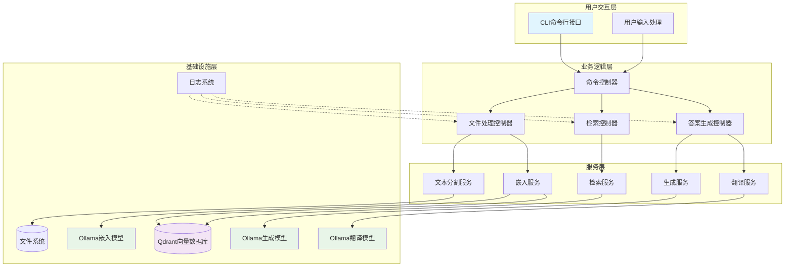
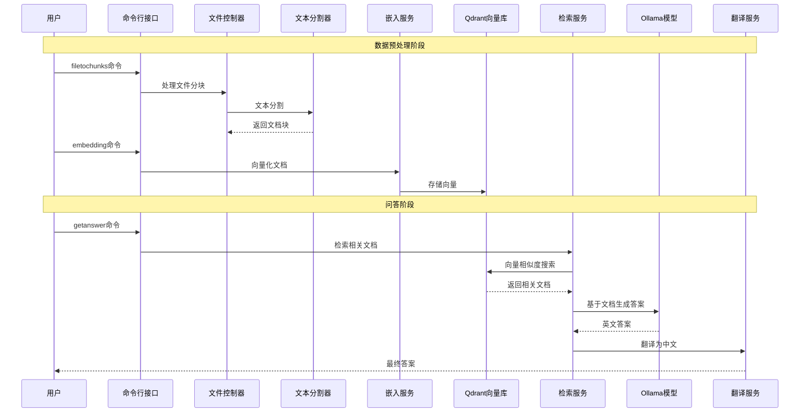
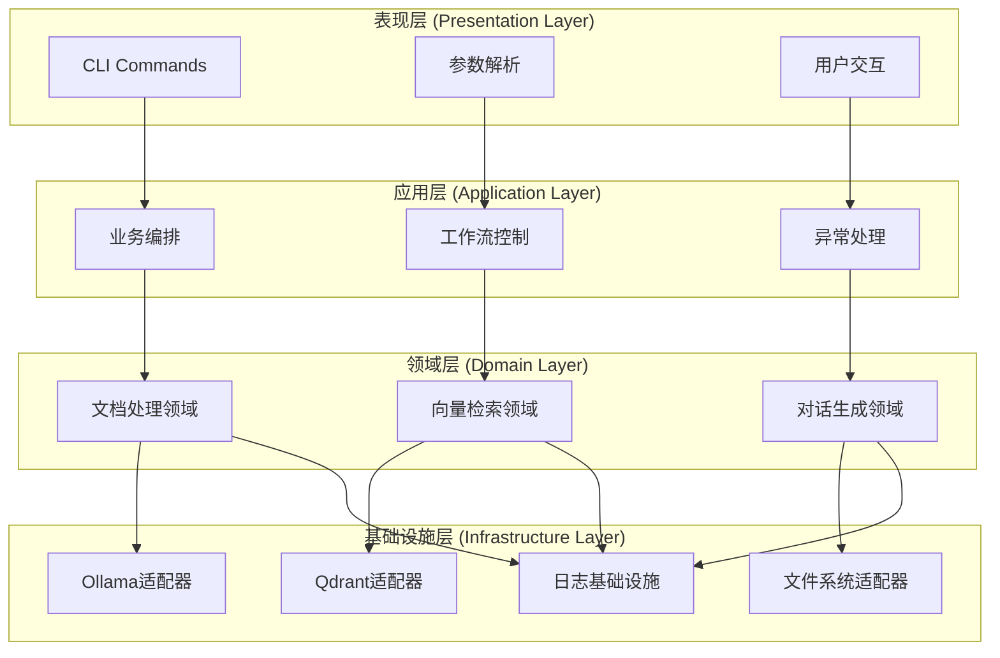
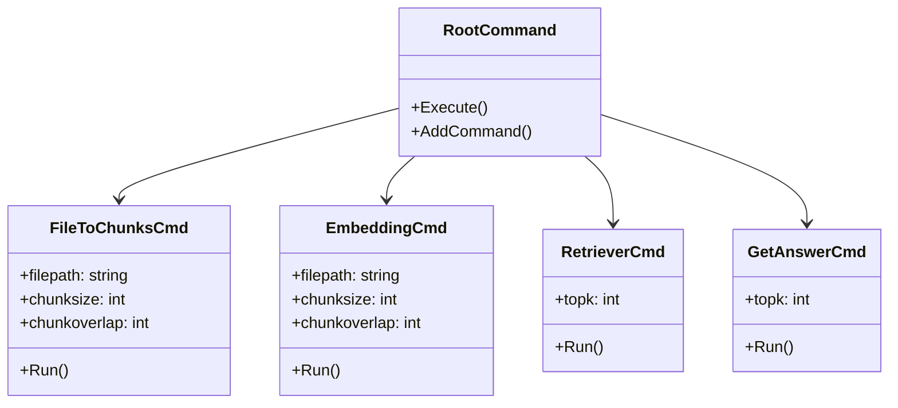
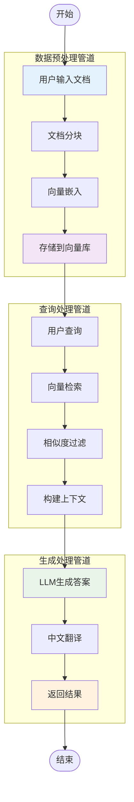
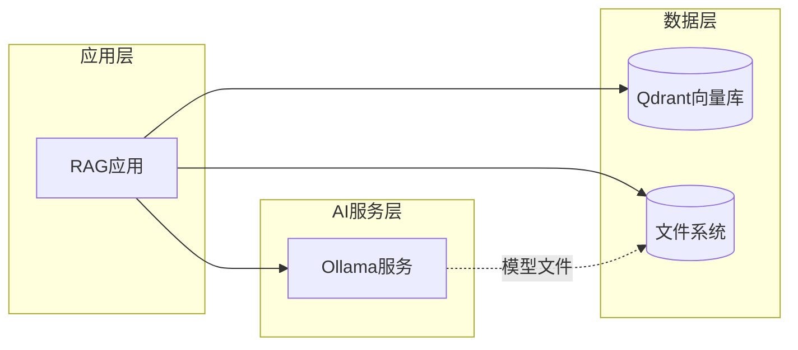

# langchaingo-ollama-rag 架构深度解析

## 架构概览

从架构师的角度来看，这是一个**经典的企业级RAG（Retrieval-Augmented Generation）系统**，采用了**微服务化、模块化**的设计理念。该系统展现了现代AI应用的**标准架构模式**：数据预处理 → 向量化存储 → 智能检索 → 生成式AI。

### 架构设计特点

1. **分层架构**：清晰的业务逻辑分层，符合DDD（领域驱动设计）理念
2. **依赖注入**：通过工厂模式管理各类模型和存储组件
3. **命令模式**：基于Cobra的CLI设计，支持插件化扩展
4. **单例模式**：日志系统采用`sync.Once`确保线程安全
5. **适配器模式**：统一的向量存储和模型接口

## 系统架构图



## 数据流架构

## 数据流架构



## 核心技术选型分析

### 1. 编程语言：Go
**选型理由**：
- **并发性能**：原生goroutine支持，适合AI应用的并发处理
- **内存效率**：低内存占用，适合向量计算密集型应用
- **部署简便**：单二进制文件，容器化友好
- **生态成熟**：langchaingo提供完整的AI工具链

### 2. AI框架：LangChain Go
**架构优势**：
- **抽象层**：统一的LLM、向量存储、文档处理接口
- **可扩展性**：支持多种模型和存储后端
- **生产就绪**：内置重试、错误处理、链式调用

### 3. 向量数据库：Qdrant
**技术特点**：
- **高性能**：Rust实现，毫秒级查询响应
- **可扩展**：支持分布式部署
- **精确搜索**：支持混合搜索和过滤条件

### 4. 模型服务：Ollama
**架构价值**：
- **本地化**：无外部依赖，数据隐私安全
- **多模型**：统一API管理多个开源模型
- **资源优化**：模型并发加载和内存管理

## 设计模式分析

### 1. 工厂模式 (Factory Pattern)
```go
// 模型工厂
func getOllamaMistral() *ollama.LLM
func getOllamaLlama2() *ollama.LLM  
func getollamaEmbedder() *embeddings.EmbedderImpl
```
**价值**：解耦模型创建逻辑，支持运行时模型切换

### 2. 单例模式 (Singleton Pattern)
```go
var once sync.Once
func InitLogger(level string) {
    once.Do(func() { /* 初始化 */ })
}
```
**价值**：保证日志系统全局唯一，避免资源竞争

### 3. 适配器模式 (Adapter Pattern)
```go
// 统一的向量存储接口
store := qdrant.New(/* 配置 */)
retriever := vectorstores.ToRetriever(store, topk, options...)
```
**价值**：屏蔽底层存储差异，支持多种向量数据库

### 4. 命令模式 (Command Pattern)
```go
var FileToChunksCmd = &cobra.Command{/* 命令定义 */}
var EmbeddingCmd = &cobra.Command{/* 命令定义 */}
```
**价值**：解耦命令定义和执行，支持插件化扩展

## 系统分层架构



## 核心组件架构

## 核心组件架构

### 1. 命令控制器 (`rag/rag.go`)
**架构职责**：应用层的业务编排器
- **命令路由**：基于Cobra的命令分发机制
- **参数验证**：输入参数的校验和标准化
- **工作流编排**：协调各个服务组件完成业务流程

**核心命令架构**：


### 2. AI模型抽象层 (`rag/ollama.go`)
**架构职责**：基础设施层的模型适配器

**模型管理策略**：
- **职责分离**：不同模型负责不同任务
  - `nomic-embed-text:latest`：专业文本嵌入
  - `mistral`：主要问答推理
  - `llama2-chinese:13b`：中文本地化处理

**连接池管理**：
```go
// 单例模式管理模型连接
var ollamaServer = "http://localhost:11434"
```

### 3. 向量存储抽象层
**架构设计**：
- **配置集中化**：统一的连接参数管理
- **错误处理**：完善的异常恢复机制
- **性能优化**：相似度阈值和Top-K检索

### 4. 工具服务层 (`rag/utils.go`)
**架构职责**：领域层的工具服务
- **文档处理**：`TextToChunks()` - 实现可配置的文本分割策略
- **用户交互**：`GetUserInput()` - 标准化的输入处理

### 5. 日志基础设施 (`rag/logger/logger.go`)
**架构特点**：
- **线程安全**：基于`sync.Once`的单例实现
- **级别控制**：支持运行时日志级别调整
- **统一接口**：封装底层日志库，便于替换

## RAG工作流架构



## 配置管理架构

### 环境配置
```go
var (
    collectionName = "langchaingo-ollama-rag"
    qdrantUrl      = "http://localhost:6333"
    ollamaServer   = "http://localhost:11434"
)
```

### 运行时参数
- **文档块大小**: 200字符（平衡语义完整性和检索精度）
- **块重叠**: 50字符（防止语义断裂）
- **检索数量**: Top-5（平衡相关性和响应速度）
- **相似度阈值**: 0.80（确保检索质量）

## 部署架构

### 容器化部署
```dockerfile
# 多阶段构建优化
FROM golang:1.22.2-alpine AS builder
# 应用压缩优化
RUN upx -9 lor
# 最小化运行时镜像
FROM alpine:3.19
```

### 依赖服务拓扑


## 性能与扩展性分析

### 性能特征
1. **内存效率**：Go的垃圾回收和向量计算优化
2. **并发处理**：Goroutine支持的异步文档处理
3. **缓存策略**：向量存储的本地缓存机制

### 扩展性设计
1. **水平扩展**：支持Qdrant集群部署
2. **模型扩展**：统一的LLM接口支持模型热插拔
3. **存储扩展**：向量存储抽象支持多种后端

### 监控与可观测性
- **结构化日志**：支持日志聚合和分析
- **错误追踪**：完整的错误堆栈信息
- **性能指标**：检索延迟和生成耗时统计

## 架构优势与最佳实践

### 技术优势
1. **本地化部署**：完全自主可控，数据隐私安全
2. **模块化设计**：高内聚低耦合，易于维护扩展
3. **生产就绪**：完善的错误处理和日志系统
4. **资源优化**：高效的内存使用和并发处理

### 企业级特性
1. **可维护性**：清晰的分层架构和设计模式
2. **可测试性**：依赖注入和接口抽象
3. **可扩展性**：插件化的命令和模型管理
4. **可观测性**：完善的日志和监控机制

这个RAG系统展现了现代AI应用架构的最佳实践，是企业级知识管理系统的优秀参考实现。通过合理的技术选型和架构设计，实现了高性能、高可用、高可维护的智能问答系统。