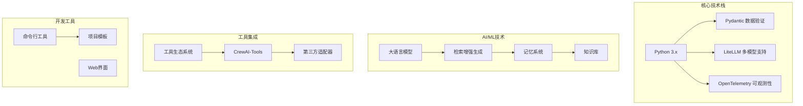
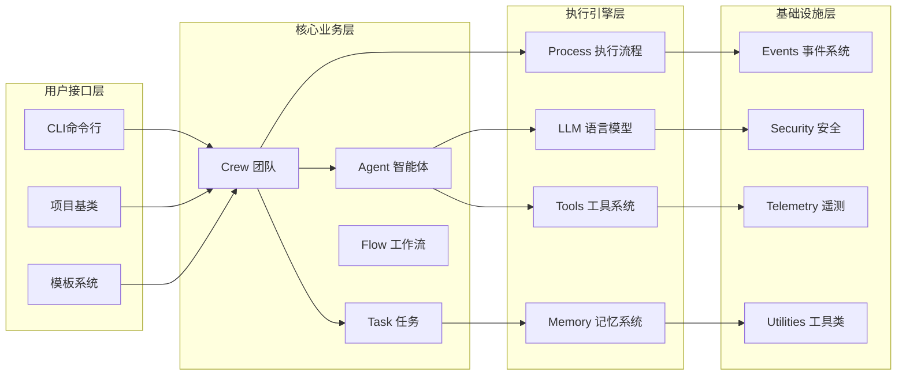
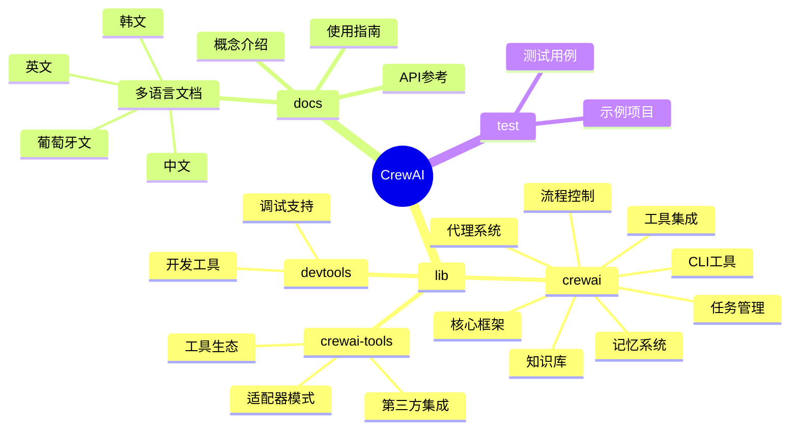

# CrewAI 项目架构总览

## 项目简介

CrewAI 是一个基于多智能体协作的AI框架，允许创建由多个AI代理组成的团队来协作完成复杂任务。该框架采用角色驱动的设计理念，每个智能体都有特定的角色、目标和背景故事。

## 项目技术栈

## 核心模块架构

**架构说明：**
- **用户接口层**：提供CLI、项目基类和模板系统，方便用户创建和管理CrewAI项目
- **核心业务层**：包含Crew（团队）、Agent（智能体）、Task（任务）和Flow（工作流）等核心概念
- **执行引擎层**：处理具体的执行逻辑，包括流程控制、LLM调用、工具使用和记忆管理
- **基础设施层**：提供事件系统、安全机制、遥测和各种工具类支持

## 项目结构分析

**项目特点：**

1. **模块化设计**：核心框架与工具系统分离，便于扩展和维护
2. **多语言支持**：文档支持多种语言，体现了国际化视野
3. **工具生态丰富**：提供大量现成的工具和第三方集成
4. **开发体验友好**：CLI工具和模板系统简化项目创建流程
5. **企业级特性**：包含安全、监控、评估等企业应用必需功能

该架构设计体现了现代AI应用框架的最佳实践，既保证了系统的灵活性和可扩展性，又提供了良好的开发者体验和企业级特性支持。
