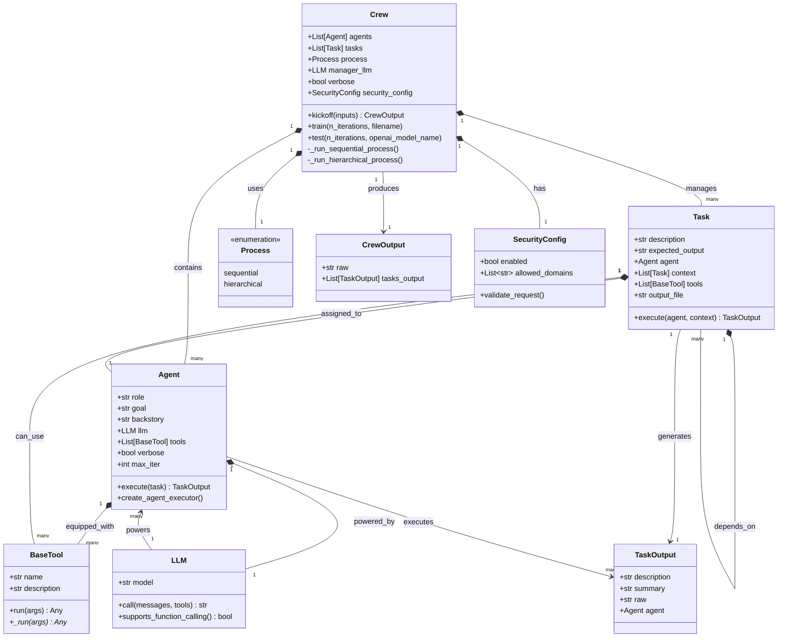
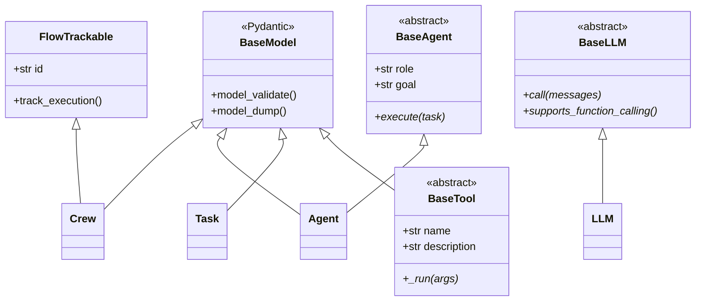
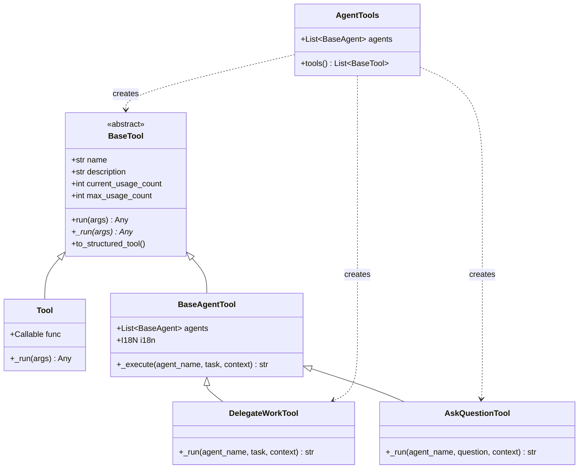
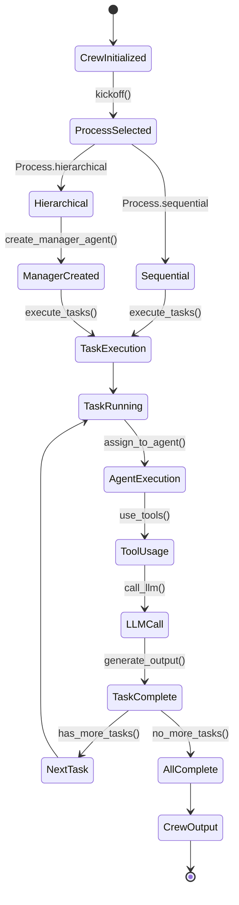

# CrewAI 核心类关系图

## 核心类设计

CrewAI的核心设计围绕四个主要实体：Crew（团队）、Agent（智能体）、Task（任务）和Tool（工具）。以下是它们的关系和交互模式。

## 核心类关系图

## 继承层次结构

## 工具系统层次结构

## 流程执行模式

**类关系说明：**

1. **组合关系**：Crew包含多个Agent和Task，体现了团队管理的概念
2. **依赖关系**：Task依赖于Agent执行，Agent依赖于LLM提供智能能力
3. **继承关系**：所有核心类都继承自Pydantic的BaseModel，确保数据验证和序列化
4. **工具系统**：采用策略模式设计，BaseTool定义接口，具体工具实现特定功能
5. **流程控制**：通过Process枚举和状态机模式控制任务执行流程

这种设计模式确保了系统的可扩展性、类型安全性和代码复用性，同时提供了清晰的抽象层次和职责分离。
