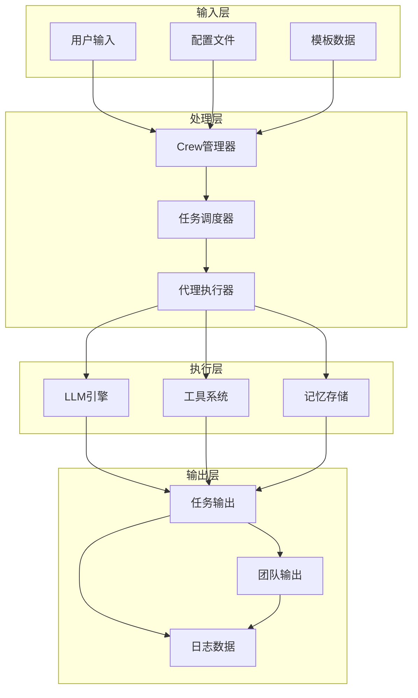
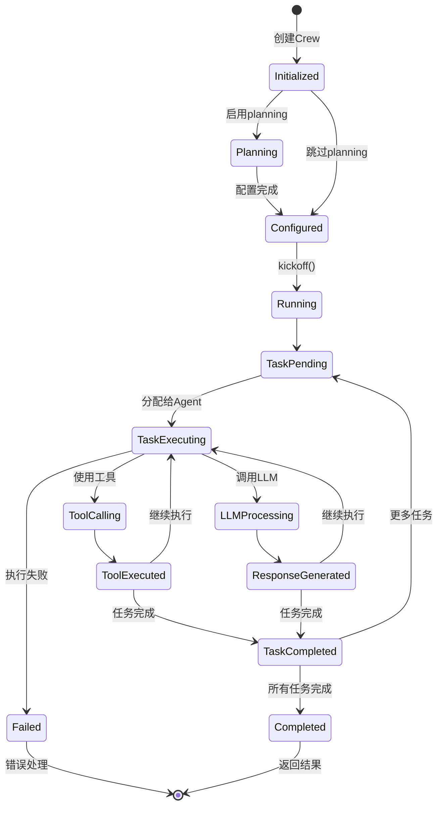
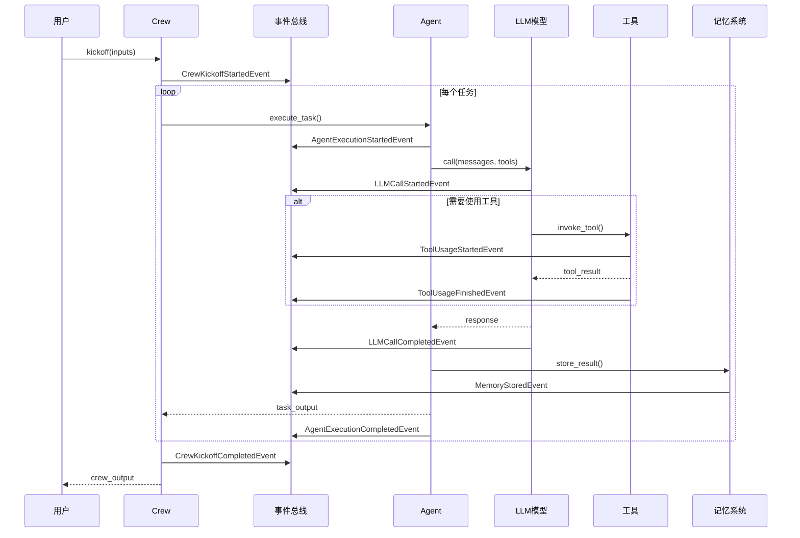
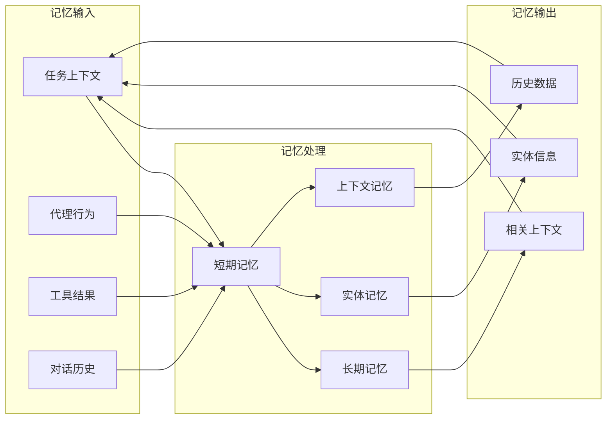
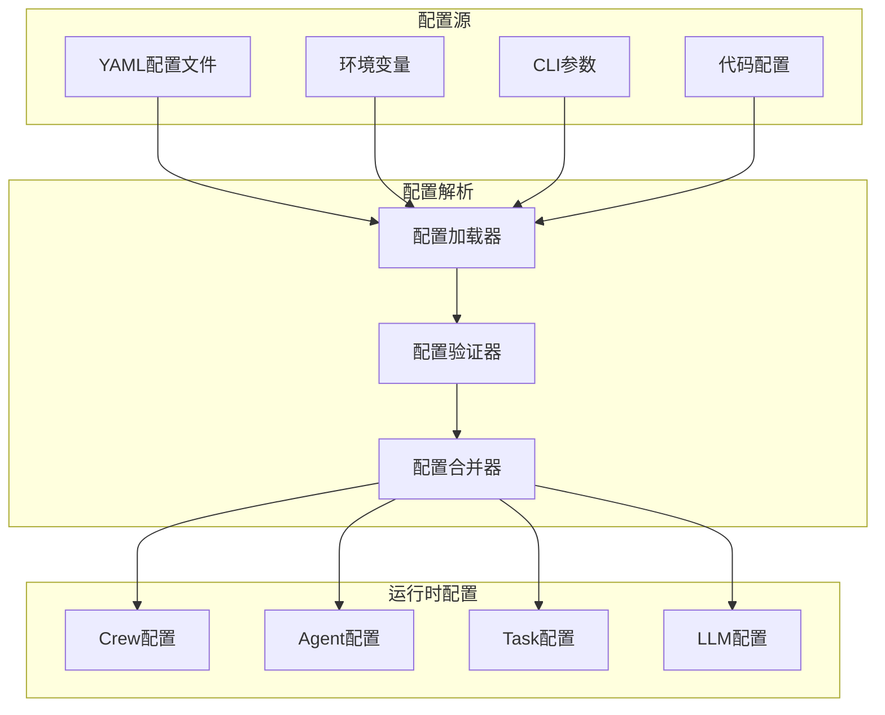

# CrewAI 数据流与状态管理

## 数据流架构

CrewAI采用事件驱动和状态管理相结合的方式来处理数据流，确保任务执行的可追踪性和系统的可观测性。

## 核心数据流图

## 状态管理模型

## 事件系统架构

## 记忆系统数据流

## 配置数据流

**数据流特点说明：**

1. **事件驱动**：所有关键操作都通过事件总线发布事件，实现松耦合和可观测性
2. **状态持久化**：任务执行状态可以持久化，支持断点续传和错误恢复
3. **记忆系统**：多层次记忆系统提供上下文感知和历史信息检索
4. **配置层次化**：支持多种配置源和优先级管理
5. **类型安全**：基于Pydantic的数据验证确保数据类型安全

这种数据流设计确保了系统的可靠性、可扩展性和可维护性，同时提供了丰富的监控和调试能力。
