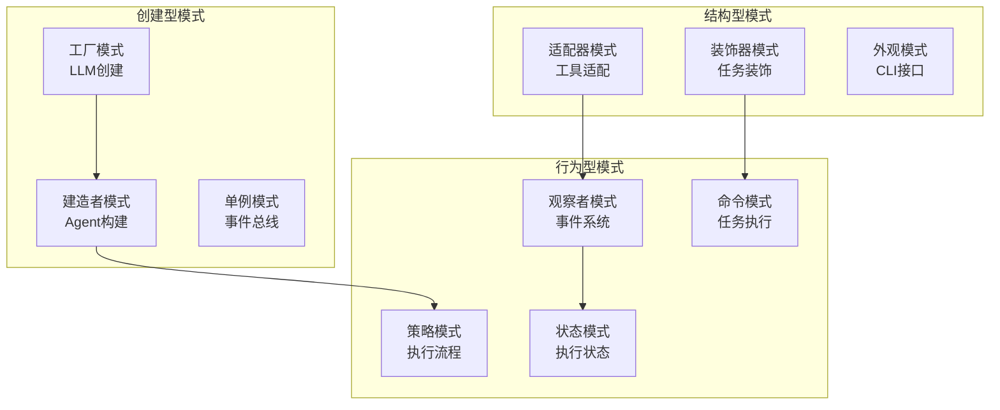
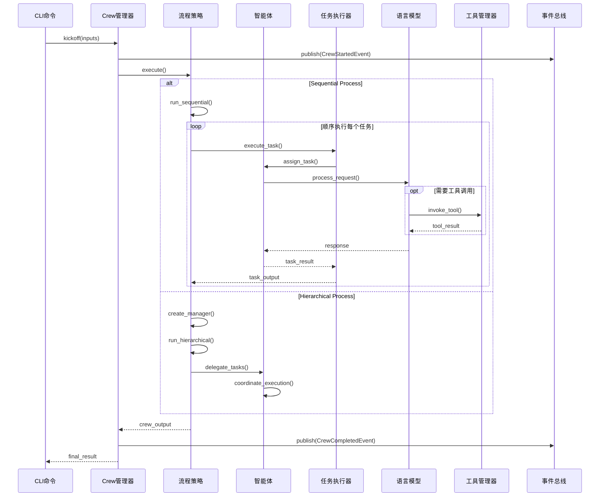
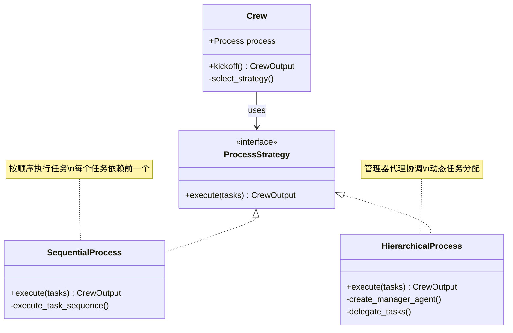
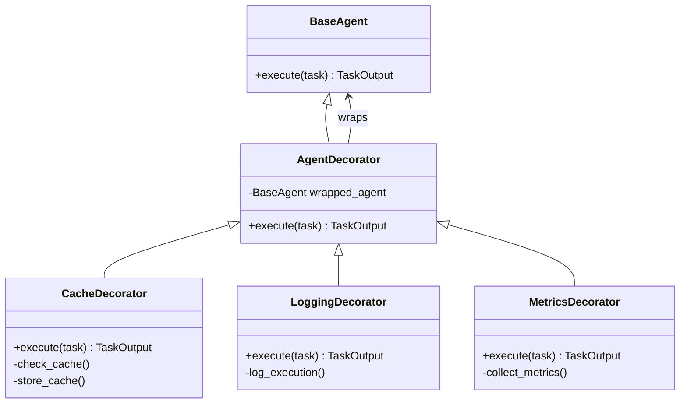
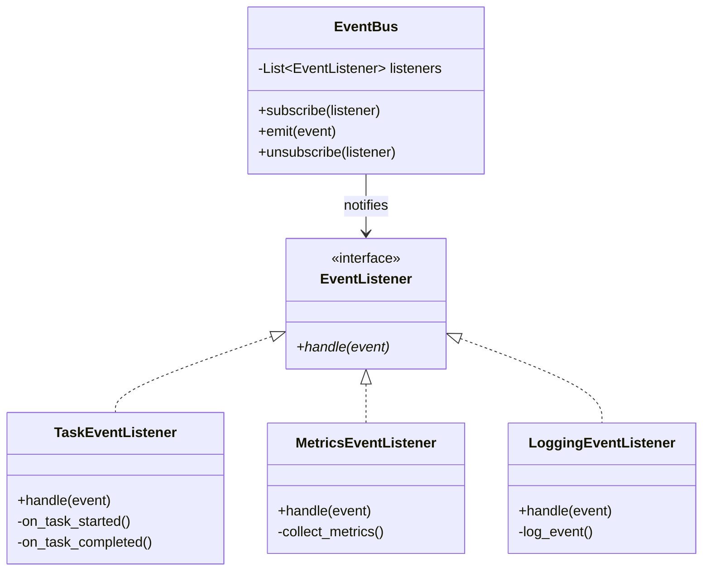
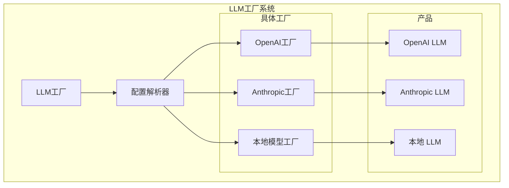
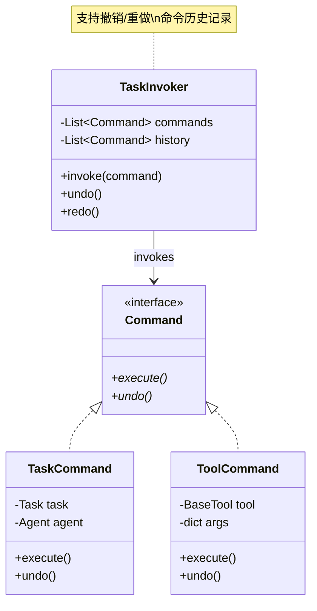
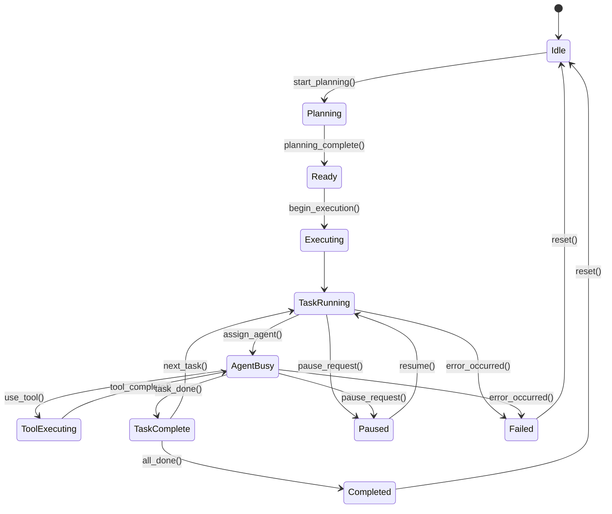

# CrewAI 执行流程与设计模式

## 核心设计模式

CrewAI采用了多种经典设计模式来确保代码的可维护性、可扩展性和模块化。

## 主要设计模式应用

## 任务执行流程图

## 策略模式 - 执行流程

## 装饰器模式 - 功能增强

## 观察者模式 - 事件系统

## 工厂模式 - LLM创建

## 命令模式 - 任务执行

## 状态模式 - 执行状态管理

**设计模式优势说明：**

1. **策略模式**：支持多种执行流程（顺序、层次），便于扩展新的执行策略
2. **装饰器模式**：为代理添加缓存、日志、监控等功能，不修改核心逻辑
3. **观察者模式**：事件系统实现松耦合，便于监控和扩展
4. **工厂模式**：统一LLM创建接口，支持多种模型提供商
5. **命令模式**：任务执行支持撤销/重做，提供更好的错误恢复能力
6. **状态模式**：清晰的状态转换逻辑，便于状态管理和调试

这些设计模式的组合使用，确保了CrewAI框架的高度模块化、可扩展性和可维护性。
