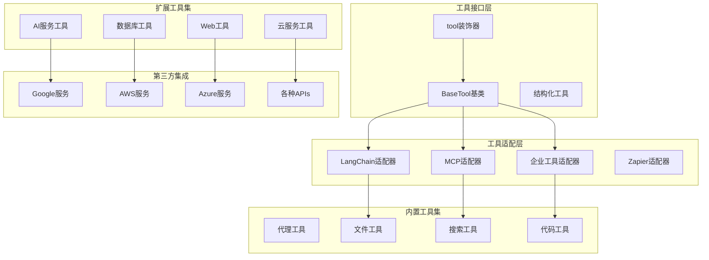
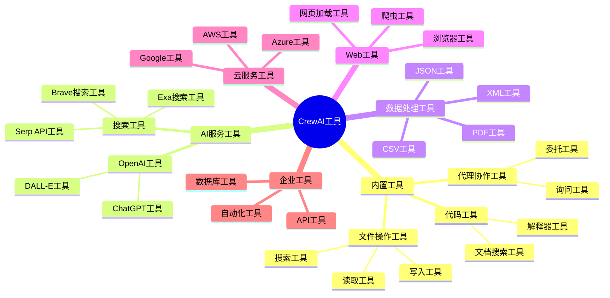
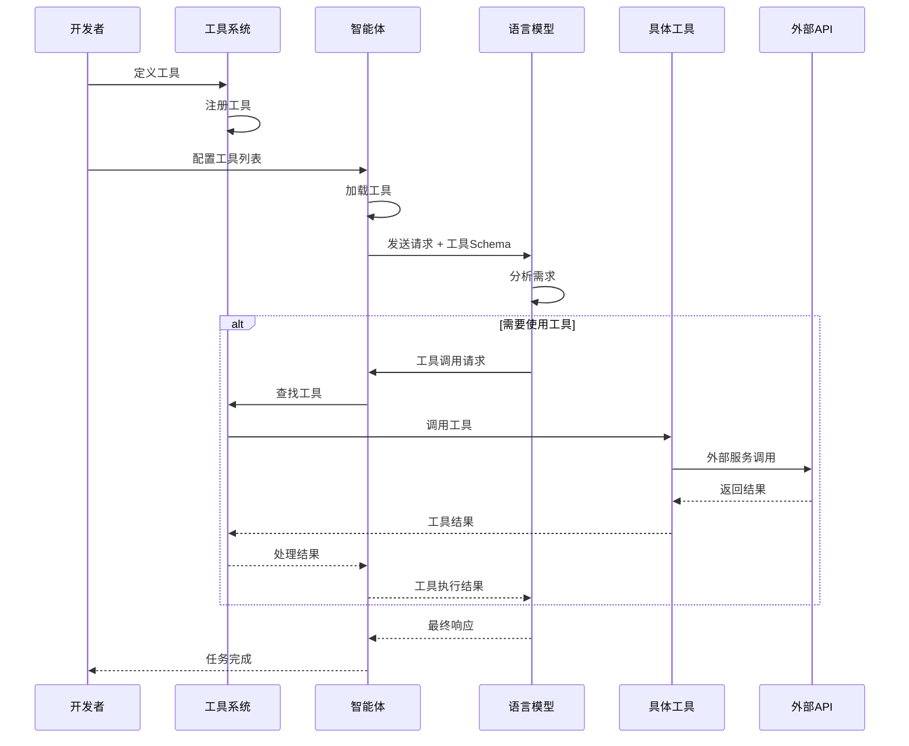
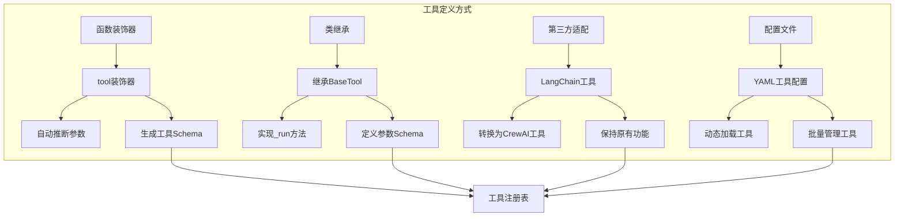
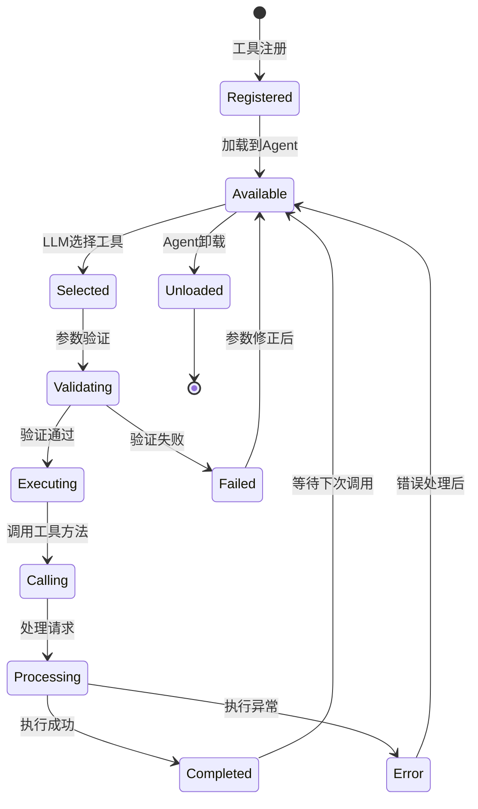
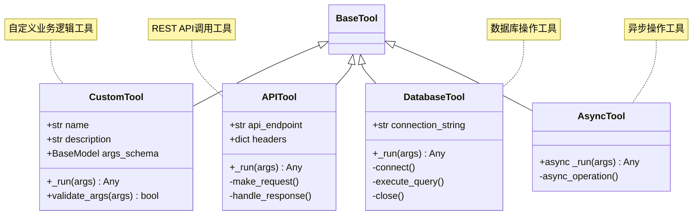
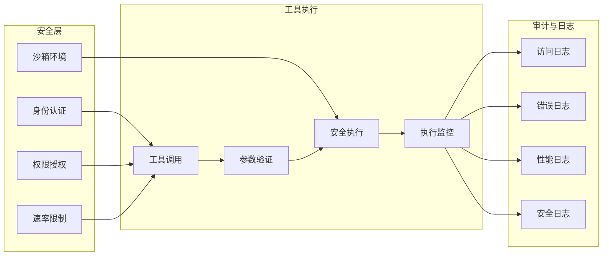
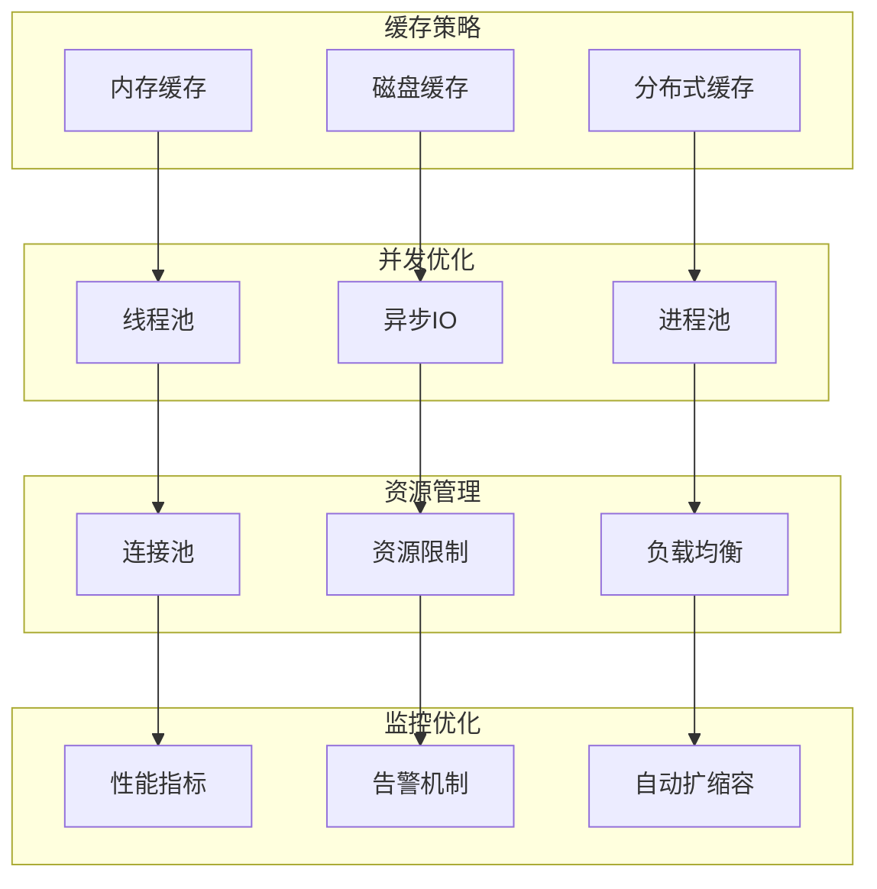

# CrewAI 工具生态与扩展机制

## 工具系统架构

CrewAI提供了丰富的工具生态系统，支持多种类型的工具集成，从简单的函数包装到复杂的第三方服务适配。

## 工具系统总体架构

**工具系统架构说明：**
- **工具接口层**：提供统一的工具定义接口，支持装饰器模式和结构化工具
- **工具适配层**：兼容多种工具生态，包括LangChain、MCP和企业级工具
- **内置工具集**：CrewAI核心工具库，覆盖代理协作、文件操作、搜索和代码处理
- **扩展工具集**：丰富的第三方工具支持，涵盖AI服务、数据库、网络和云服务
- **第三方集成**：与主流云服务商和API提供商的深度集成

## 工具类型分类

**工具分类说明：**
- **内置工具**：CrewAI核心功能工具，包括代理协作、文件操作和代码处理工具
- **AI服务工具**：集成主流AI服务，如OpenAI的DALL-E和ChatGPT，以及多种搜索引擎API
- **数据处理工具**：支持多种数据格式处理，包括CSV、JSON、XML和PDF文件操作
- **Web工具**：提供网页爬取、浏览器自动化和网页内容处理能力
- **云服务工具**：深度集成AWS、Google Cloud和Azure等主流云服务平台
- **企业工具**：面向企业场景的数据库连接、API调用和业务流程自动化工具

## 工具创建与使用流程

**工具使用流程说明：**
- **工具注册阶段**：开发者定义工具并注册到工具系统，系统自动生成工具Schema
- **智能体配置**：将工具列表配置给智能体，智能体加载并准备工具调用接口
- **任务执行阶段**：LLM分析任务需求，选择合适工具并生成调用请求
- **工具调用阶段**：系统查找并调用具体工具，处理外部API交互和结果返回
- **结果处理阶段**：将工具执行结果反馈给LLM，用于生成最终响应

## 工具定义方式

**工具定义方式说明：**
- **函数装饰器**：最简单的工具定义方式，使用@tool装饰器自动推断参数和生成Schema
- **类继承**：面向对象的工具定义，继承BaseTool类并实现_run方法，适合复杂工具逻辑
- **第三方适配**：兼容LangChain等第三方工具生态，保持原有功能的同时转换为CrewAI工具
- **配置文件**：支持YAML配置文件批量定义工具，便于工具的统一管理和动态加载

## 工具执行生命周期

**工具生命周期说明：**
- **注册阶段**：工具完成定义和注册，进入系统工具库
- **可用阶段**：工具被加载到智能体中，等待LLM选择和调用
- **验证阶段**：LLM选择工具后，系统对传入参数进行类型和格式验证
- **执行阶段**：验证通过后调用工具方法，处理具体的业务逻辑
- **结果阶段**：工具执行完成返回结果，或处理执行过程中的异常情况
- **循环阶段**：工具回到可用状态等待下次调用，或被卸载退出系统

## 扩展工具开发模式

**扩展工具开发模式说明：**
- **CustomTool**：自定义业务逻辑工具，适用于特定业务场景的功能封装
- **APITool**：REST API调用工具，封装HTTP请求和响应处理逻辑
- **DatabaseTool**：数据库操作工具，提供数据库连接、查询和事务管理功能
- **AsyncTool**：异步操作工具，支持高并发场景下的异步任务处理

## 工具安全与权限管理

**工具安全管理说明：**
- **安全层**：多重安全机制保障工具调用安全，包括身份认证、权限控制、速率限制和沙箱隔离
- **工具执行**：标准化的工具执行流程，确保参数验证、安全执行和实时监控
- **审计与日志**：完整的日志记录体系，支持访问追踪、错误分析、性能监控和安全审计

## 工具性能优化策略

**工具性能优化策略说明：**
- **缓存策略**：多级缓存机制提高工具调用效率，包括内存、磁盘和分布式缓存
- **并发优化**：通过线程池、异步IO和进程池实现高并发工具执行
- **资源管理**：连接池、资源限制和负载均衡确保系统稳定性和可扩展性
- **监控优化**：实时性能指标、智能告警机制和自动扩缩容保障系统高可用

**工具生态特点：**

1. **统一接口**：所有工具都继承自BaseTool，提供一致的调用接口
2. **多种集成方式**：支持装饰器、类继承、第三方适配等多种方式
3. **类型安全**：基于Pydantic的参数验证确保类型安全
4. **异步支持**：支持异步工具执行，提高并发性能
5. **安全机制**：提供沙箱环境、权限控制、速率限制等安全特性
6. **可观测性**：完整的日志、监控、告警体系
7. **生态丰富**：内置大量常用工具，支持主流服务集成

这种工具系统设计使得CrewAI具备了强大的扩展能力，可以轻松集成各种外部服务和自定义功能。
