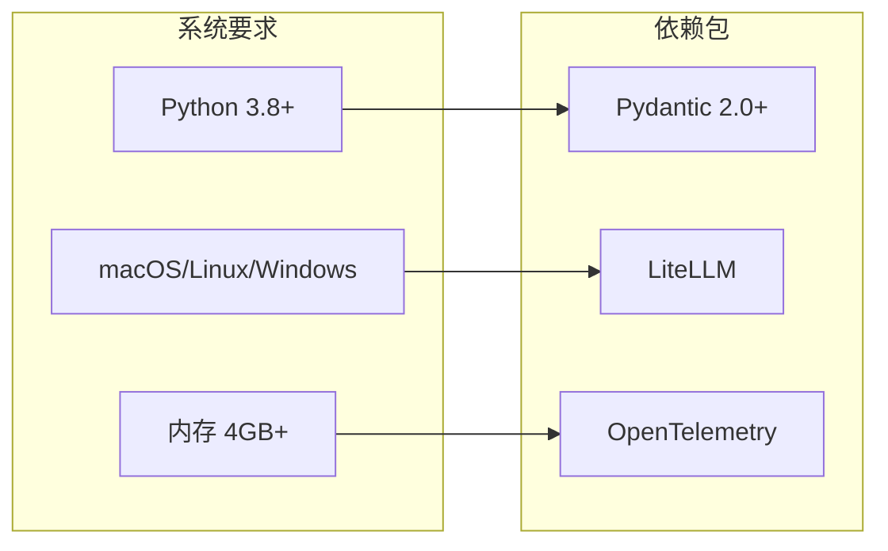
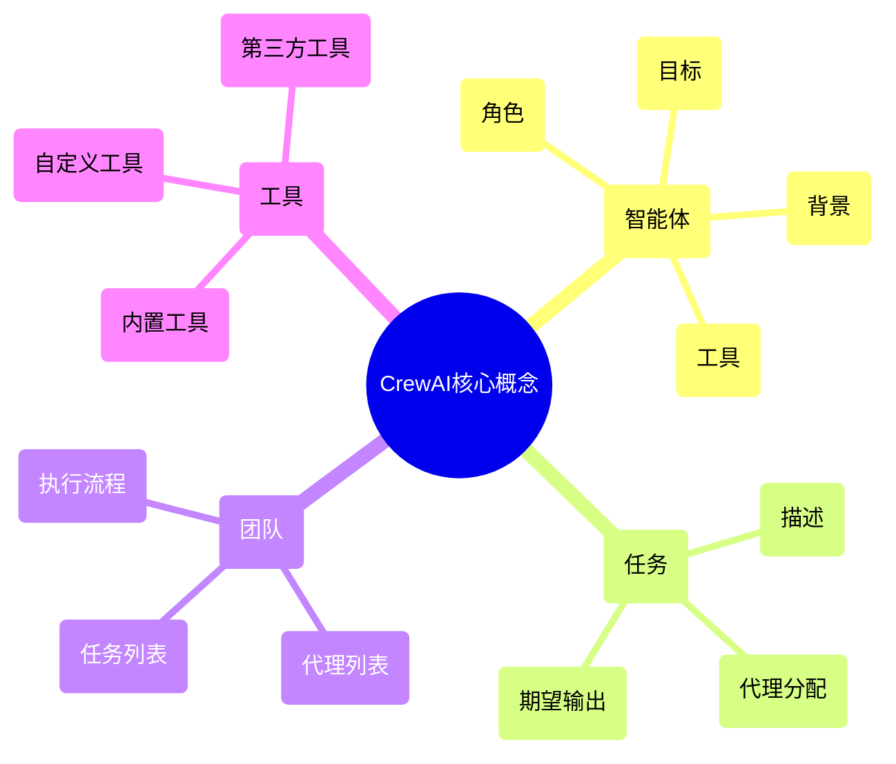
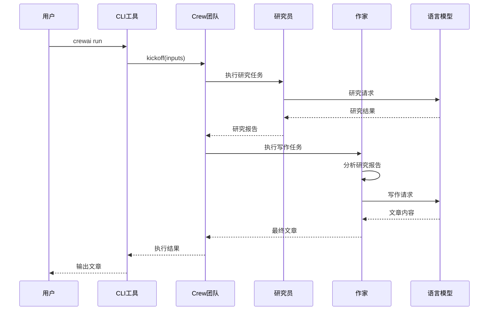
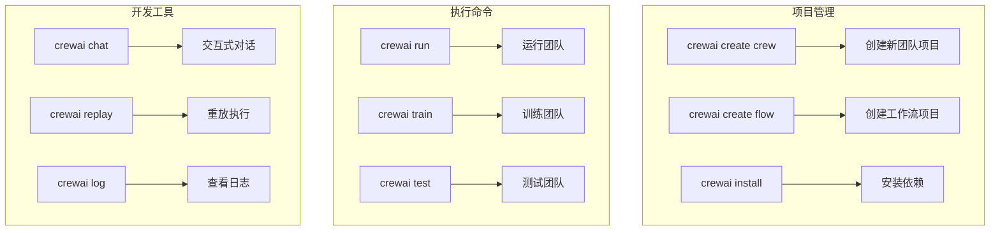
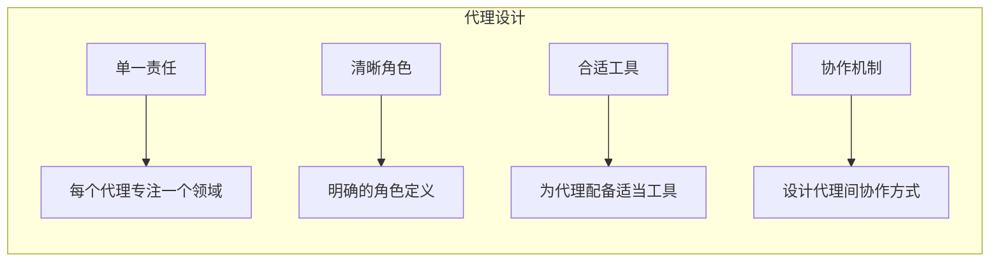

# CrewAI 快速上手指南

## 项目概述

CrewAI是一个基于多智能体协作的AI框架，让您可以创建由多个AI代理组成的团队来协作完成复杂任务。每个代理都有特定的角色、目标和技能，通过协作实现比单个AI更强大的能力。

## 安装与环境配置

### 环境要求



### 安装步骤

```bash
# 1. 安装CrewAI核心包
pip install crewai

# 2. 安装工具包（可选）
pip install crewai[tools]

# 3. 验证安装
crewai --version
```

## 核心概念速览



## 5分钟快速开始

### 1. 创建第一个项目

```bash
# 创建新项目
crewai create crew my_first_crew
cd my_first_crew

# 项目结构
tree .
```

项目结构说明：
```
my_first_crew/
├── pyproject.toml          # 项目配置
├── README.md              # 项目说明
└── src/
    └── my_first_crew/
        ├── __init__.py
        ├── main.py        # 入口文件
        ├── crew.py        # 团队定义
        ├── agents.yaml    # 代理配置
        └── tasks.yaml     # 任务配置
```

### 2. 配置环境变量

```bash
# 设置API密钥
export OPENAI_API_KEY="your-openai-api-key"
# 或者使用其他LLM
export ANTHROPIC_API_KEY="your-anthropic-api-key"
```

### 3. 定义智能体和任务

**agents.yaml:**
```yaml
researcher:
  role: >
    高级研究员
  goal: >
    进行深入的研究分析，收集和整理相关信息
  backstory: >
    你是一位经验丰富的研究员，擅长从多个来源收集信息，
    分析数据趋势，并提供准确可靠的研究报告。

writer:
  role: >
    专业作家
  goal: >
    将研究成果转化为清晰易懂的文章
  backstory: >
    你是一位专业的技术作家，能够将复杂的技术概念
    转化为普通读者易于理解的内容。
```

**tasks.yaml:**
```yaml
research_task:
  description: >
    研究{topic}的最新发展趋势，包括技术进展、市场动态、
    主要参与者等方面的信息。
  expected_output: >
    一份详细的研究报告，包含数据支撑的结论和趋势分析。
  agent: researcher

writing_task:
  description: >
    基于研究报告，撰写一篇关于{topic}的技术文章，
    要求内容准确、结构清晰、易于理解。
  expected_output: >
    一篇2000字左右的技术文章，包含引言、主体内容和结论。
  agent: writer
  context:
    - research_task
```

### 4. 运行团队

```bash
# 运行团队
crewai run

# 或者自定义输入
python src/my_first_crew/main.py
```

## 核心工作流程



## 进阶功能示例

### 1. 自定义工具

```python
from crewai.tools import BaseTool
from typing import Type
from pydantic import BaseModel, Field

class WebSearchToolInput(BaseModel):
    query: str = Field(..., description="搜索查询")

class WebSearchTool(BaseTool):
    name: str = "网页搜索"
    description: str = "搜索互联网上的相关信息"
    args_schema: Type[BaseModel] = WebSearchToolInput

    def _run(self, query: str) -> str:
        # 实现搜索逻辑
        return f"搜索结果：{query}"
```

### 2. 层次化流程

```python
from crewai import Crew, Process

crew = Crew(
    agents=[researcher, writer, reviewer],
    tasks=[research_task, writing_task, review_task],
    process=Process.hierarchical,  # 使用层次化流程
    manager_llm="gpt-4"  # 指定管理者LLM
)
```

### 3. 记忆系统

```python
crew = Crew(
    agents=[researcher, writer],
    tasks=[research_task, writing_task],
    memory=True,  # 启用记忆系统
    verbose=True
)
```

## 常用命令参考



## 最佳实践建议

### 1. 代理设计原则



### 2. 任务设计原则

- **具体明确**：任务描述要具体，避免模糊
- **可测量**：输出要求要可测量和验证
- **合理拆分**：复杂任务拆分为简单子任务
- **依赖清晰**：明确任务间的依赖关系

### 3. 性能优化

- **合理使用缓存**：启用适当的缓存机制
- **工具选择**：选择高效的工具和LLM
- **并发控制**：合理设置并发参数
- **资源监控**：监控资源使用情况

## 常见问题解决

### API配置问题
```bash
# 检查环境变量
echo $OPENAI_API_KEY

# 测试API连接
crewai test-connection
```

### 依赖问题
```bash
# 重新安装依赖
pip install --upgrade crewai

# 清理缓存
pip cache purge
```

### 性能问题
```python
# 启用详细日志
crew = Crew(
    agents=agents,
    tasks=tasks,
    verbose=True,
    memory=True
)
```

通过这个快速上手指南，您可以在30分钟内创建并运行您的第一个CrewAI项目。随着对框架的深入了解，您可以探索更多高级功能，构建更复杂的多智能体系统。
