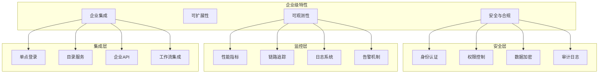
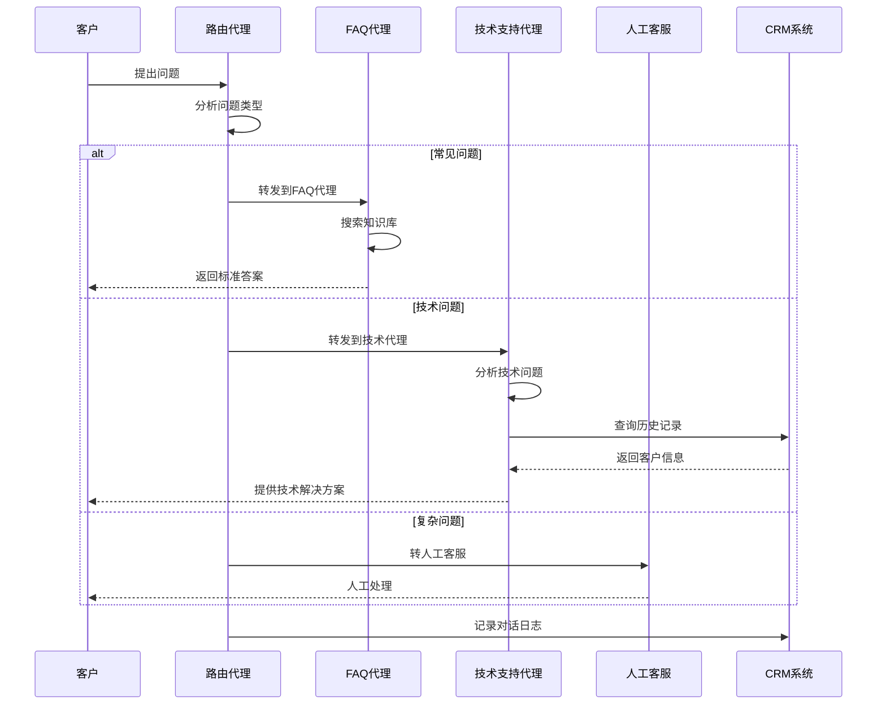
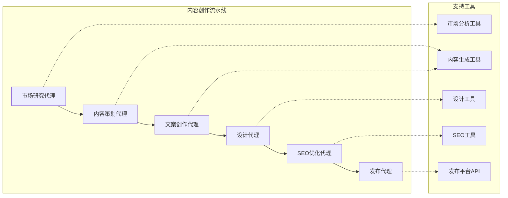
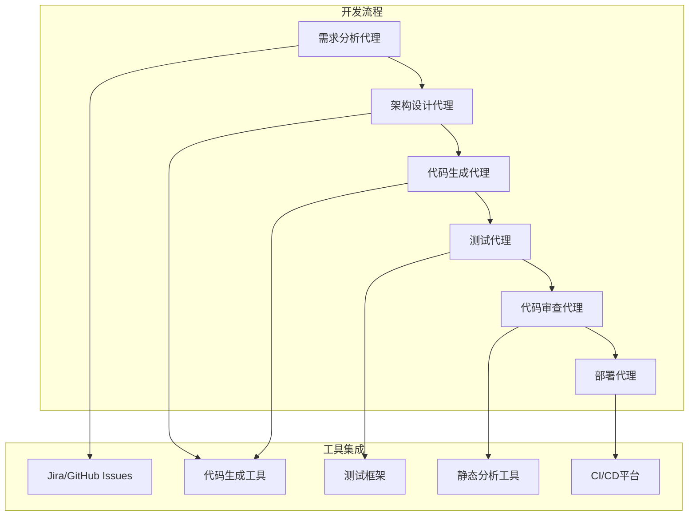
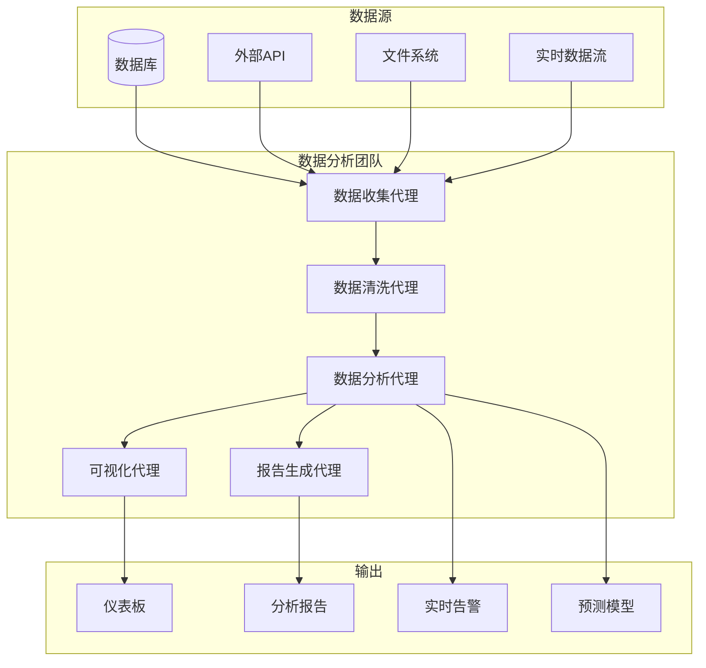
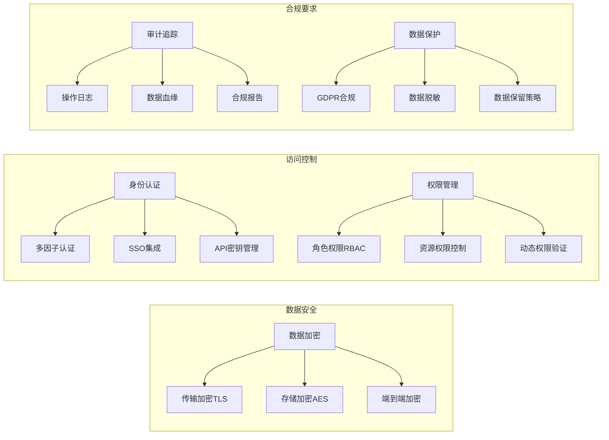
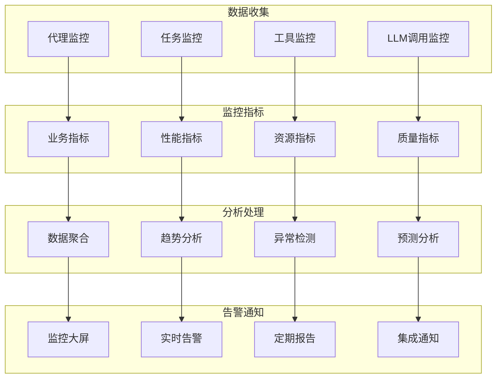
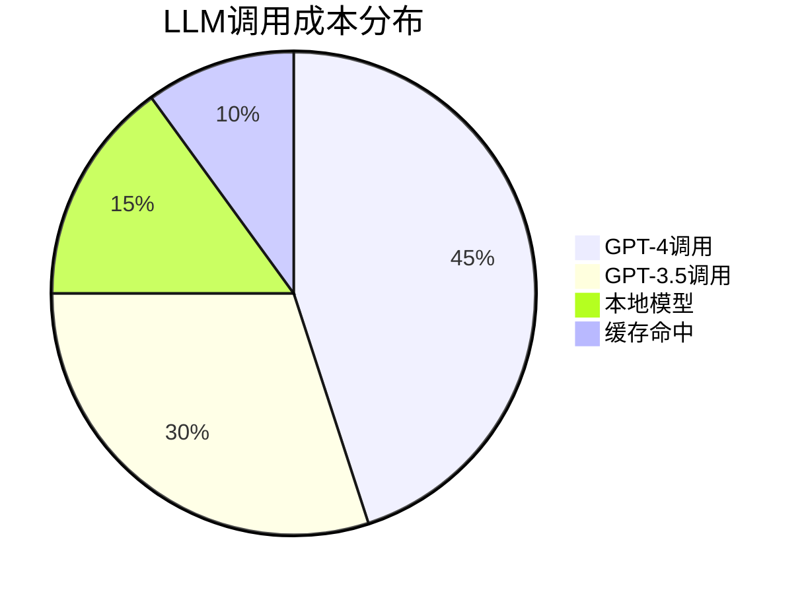
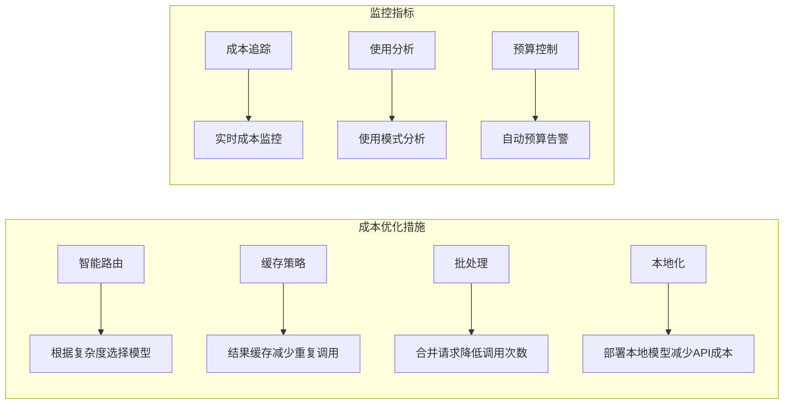
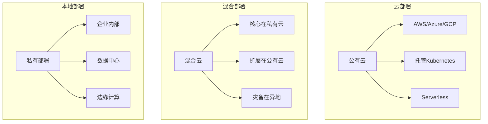

# CrewAI 企业级特性与应用场景

## 企业级特性概览

CrewAI不仅是一个开源的多智能体框架，还提供了丰富的企业级特性，满足大型组织在安全性、可扩展性、可观测性等方面的需求。

## 企业级架构

## 主要应用场景

### 1. 智能客服系统

### 2. 内容创作与营销

### 3. 代码开发与DevOps

### 4. 数据分析与商业智能

## 安全与合规特性

## 可观测性与监控

## 扩展性架构

## 成本优化策略

## 部署模式

**企业级应用优势：**

1. **安全可控**：完整的安全框架和合规支持
2. **高可用性**：支持集群部署和故障自动恢复
3. **可观测性**：全方位的监控、日志和追踪能力
4. **成本可控**：智能资源调度和成本优化
5. **易于集成**：与现有企业系统无缝集成
6. **扩展灵活**：支持水平扩展和垂直扩展

CrewAI的企业级特性使其能够满足大型组织对AI系统在安全性、可靠性、可扩展性等方面的严格要求，为企业数字化转型提供强有力的技术支撑。
