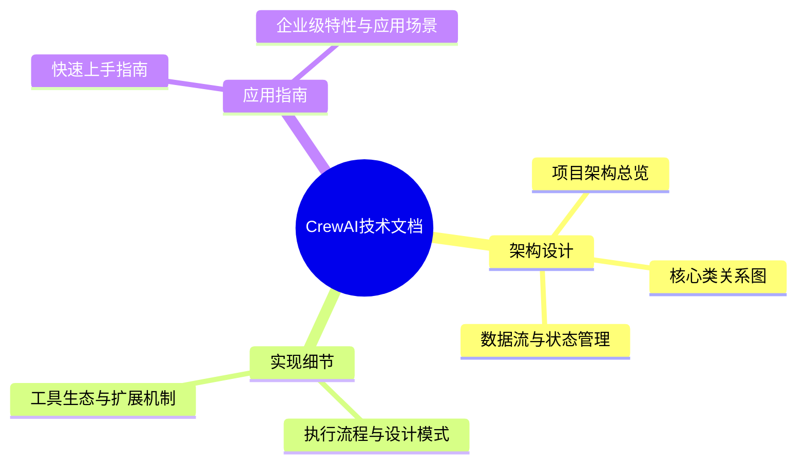
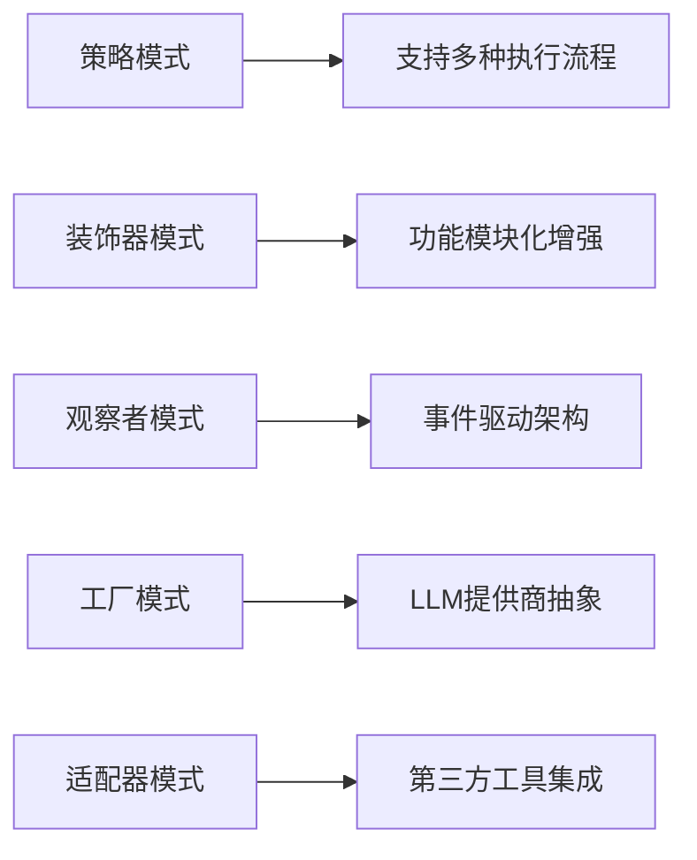
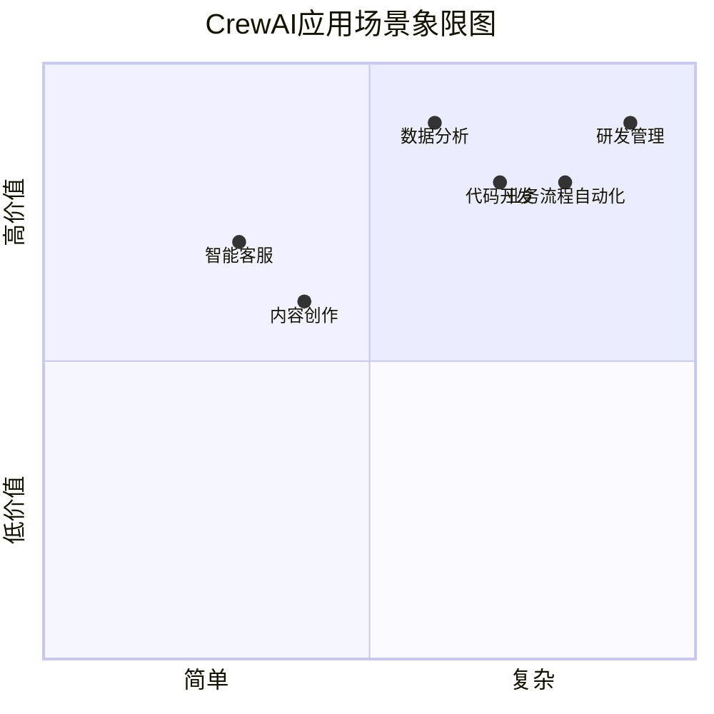
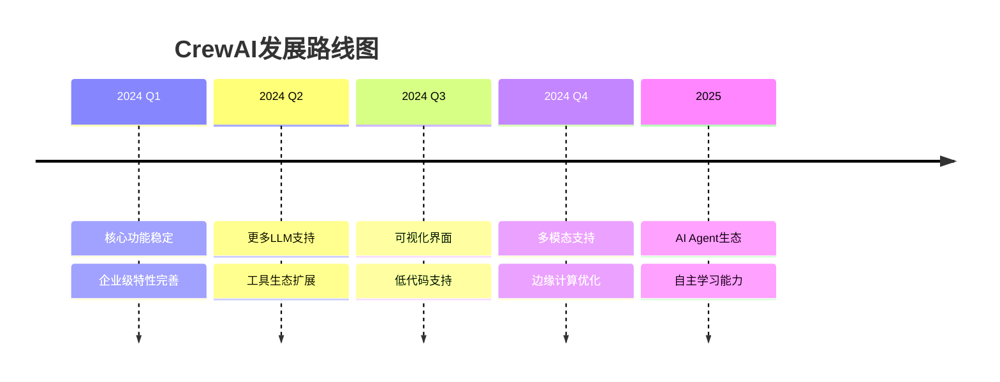

# CrewAI 技术文档总结

## 文档导航

本文档集从多个角度深入分析了CrewAI项目，为开发者、架构师和企业决策者提供全面的技术参考。



## 核心技术特点总结

| 特性类别 | 核心能力 | 技术实现 | 企业价值 |
|---------|---------|---------|---------|
| **多智能体协作** | 角色驱动的AI团队 | Agent+Task+Tool架构 | 复杂任务自动化 |
| **流程控制** | 顺序/层次化执行 | 策略模式+状态机 | 灵活的业务流程 |
| **工具生态** | 丰富的集成能力 | 适配器模式+插件系统 | 快速业务集成 |
| **可观测性** | 全链路监控 | 事件驱动+OpenTelemetry | 生产环境可控 |
| **安全合规** | 企业级安全 | 权限控制+审计日志 | 满足合规要求 |
| **扩展性** | 云原生架构 | 微服务+容器化 | 支持大规模部署 |

## 技术架构亮点

### 1. 设计模式应用精妙



### 2. 数据流设计合理

- **输入标准化**：统一的配置和参数管理
- **处理模块化**：清晰的职责分离和接口定义
- **输出结构化**：类型安全的结果输出
- **状态可追踪**：完整的执行状态管理

### 3. 扩展机制灵活

- **工具系统**：统一接口，多种实现方式
- **LLM集成**：支持主流模型提供商
- **企业集成**：丰富的API和适配器
- **部署模式**：支持云原生和本地部署

## 应用场景适用性



**适用场景特点：**
- **高度适合**：需要多角色协作的复杂任务
- **中等适合**：单一角色但需要工具集成的任务
- **不太适合**：简单的单轮对话或纯计算任务

## 技术选型建议

### 何时选择CrewAI

✅ **推荐使用的场景：**
- 需要多个AI角色协作完成复杂任务
- 要求可观测性和生产级监控
- 需要丰富的工具和第三方集成
- 企业级应用，对安全性要求较高
- 希望代码结构清晰，便于维护

❌ **不推荐使用的场景：**
- 简单的单轮对话应用
- 对响应延迟要求极高的实时应用
- 资源受限的边缘计算环境
- 纯粹的模型推理任务

### 与其他框架对比

| 对比维度 | CrewAI | LangChain | AutoGen | 自研方案 |
|---------|--------|-----------|---------|----------|
| **多智能体** | ⭐⭐⭐⭐⭐ | ⭐⭐⭐ | ⭐⭐⭐⭐ | ⭐⭐ |
| **工具生态** | ⭐⭐⭐⭐⭐ | ⭐⭐⭐⭐⭐ | ⭐⭐⭐ | ⭐ |
| **企业特性** | ⭐⭐⭐⭐⭐ | ⭐⭐⭐ | ⭐⭐ | ⭐⭐⭐⭐ |
| **学习成本** | ⭐⭐⭐ | ⭐⭐ | ⭐⭐⭐⭐ | ⭐⭐⭐⭐⭐ |
| **文档质量** | ⭐⭐⭐⭐ | ⭐⭐⭐⭐⭐ | ⭐⭐⭐ | ⭐ |

## 部署建议

### 开发环境
```bash
# 快速开始
pip install crewai[tools]
crewai create crew my_project
```

### 生产环境
```yaml
# docker-compose.yml
version: '3.8'
services:
  crewai:
    image: crewai:latest
    environment:
      - OPENAI_API_KEY=${OPENAI_API_KEY}
      - REDIS_URL=redis://redis:6379
    depends_on:
      - redis
      - postgres

  redis:
    image: redis:7

  postgres:
    image: postgres:15
```

### 企业环境
```yaml
# kubernetes部署
apiVersion: apps/v1
kind: Deployment
metadata:
  name: crewai-deployment
spec:
  replicas: 3
  selector:
    matchLabels:
      app: crewai
  template:
    spec:
      containers:
      - name: crewai
        image: crewai:enterprise
        resources:
          requests:
            memory: "512Mi"
            cpu: "250m"
          limits:
            memory: "2Gi"
            cpu: "1000m"
```

## 性能优化建议

1. **LLM调用优化**
   - 启用缓存机制
   - 合理选择模型规格
   - 实施请求去重

2. **工具执行优化**
   - 使用连接池
   - 实施超时控制
   - 异步执行长时间任务

3. **内存管理**
   - 定期清理会话历史
   - 合理配置记忆系统
   - 监控内存使用情况

## 未来发展趋势



## 结论

CrewAI作为一个成熟的多智能体协作框架，在以下方面表现突出：

1. **架构设计**：采用经典设计模式，代码结构清晰，易于维护
2. **功能完整**：从基础的多智能体协作到企业级特性，功能全面
3. **生态丰富**：提供大量工具和集成选项，开发效率高
4. **企业友好**：具备生产级部署所需的监控、安全、扩展能力

对于需要构建复杂AI协作系统的团队，CrewAI是一个值得考虑的优秀选择。通过合理的架构设计和丰富的功能特性，它能够显著降低多智能体系统的开发复杂度，加速AI应用的落地实施。

---

*本文档集基于CrewAI v1.2.0版本分析，随着项目持续发展，部分内容可能需要更新。建议结合官方文档和源码进行深入学习。*
