# Flowise Agent Flow 节点使用指南

> **文档类型**: Agent Flow 节点功能和使用说明  
> **适用版本**: Flowise v1.x  
> **更新日期**: 2025年10月12日

## 📋 目录

1. [Agent Flow 概述](#agent-flow-概述)
2. [核心节点](#核心节点)
3. [流程控制节点](#流程控制节点)
4. [工具节点](#工具节点)
5. [输入输出节点](#输入输出节点)
6. [辅助节点](#辅助节点)
7. [使用场景和选择指南](#使用场景和选择指南)
8. [最佳实践](#最佳实践)

## Agent Flow 概述

Agent Flow 是 Flowise 中用于构建复杂 AI 代理工作流的节点系统。它提供了丰富的节点类型，让您可以创建具有条件判断、循环控制、工具调用等高级功能的智能代理。

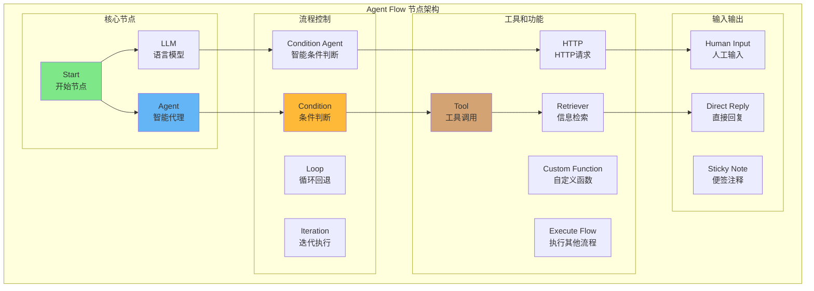

上图展示了 Agent Flow 中各类节点的关系和典型的流程结构。每个节点都有特定的功能和适用场景，通过合理组合可以构建出功能强大的 AI 工作流。

## 核心节点

### 1. Start (开始节点)
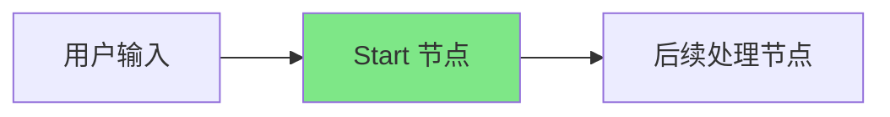

**功能说明**: 每个 Agent Flow 的起始点，定义了工作流的入口和输入类型。

**主要配置**:
- **输入类型**: 
  - `Chat Input`: 聊天输入模式，适合对话场景
  - `Form Input`: 表单输入模式，适合结构化数据收集
- **表单配置**: 当选择表单输入时，可配置表单标题、描述和输入字段

**使用场景**:
- ✅ 对话型聊天机器人
- ✅ 数据收集和处理流程
- ✅ 多步骤交互式应用

**配置示例**:
```javascript
// 聊天输入模式
{
  startInputType: "chatInput"
}

// 表单输入模式
{
  startInputType: "formInput",
  formTitle: "客户信息收集",
  formDescription: "请填写以下信息",
  formInputs: [
    { inputLabel: "姓名", inputKey: "name", inputType: "text" },
    { inputLabel: "邮箱", inputKey: "email", inputType: "email" }
  ]
}
```

### 2. Agent (智能代理)
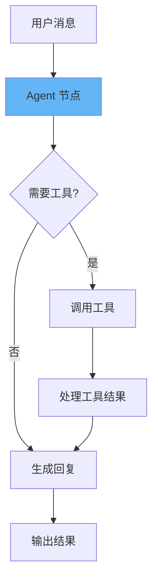

**功能说明**: 核心的智能代理节点，能够理解用户意图，调用工具，并生成智能回复。

**主要配置**:
- **模型选择**: 支持各种 LLM 模型
- **系统提示**: 定义代理的行为和角色
- **工具配置**: 绑定可用的工具
- **知识库**: 集成向量数据库进行信息检索
- **记忆管理**: 保持对话上下文

**使用场景**:
- ✅ 智能客服系统
- ✅ 个人助理应用
- ✅ 专业领域顾问
- ✅ 复杂任务处理

**配置示例**:
```javascript
{
  agentModel: "gpt-4",
  agentSystemPrompt: "你是一个专业的客服代理，能够帮助用户解决问题并调用相关工具。",
  agentTools: ["calculator", "weather-api", "database-query"],
  agentMemory: "enabled",
  agentKnowledgeBase: ["product-docs", "faq-database"]
}
```

### 3. LLM (语言模型)
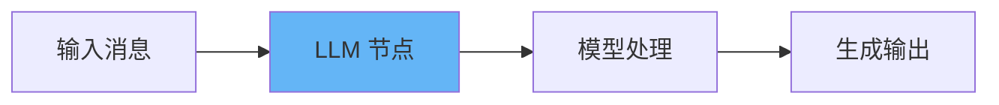

**功能说明**: 直接调用语言模型进行文本生成，适合简单的文本处理任务。

**主要配置**:
- **模型选择**: 选择合适的语言模型
- **消息配置**: 设置系统消息和用户消息
- **输出格式**: 支持结构化输出
- **温度设置**: 控制输出的随机性

**使用场景**:
- ✅ 文本生成和改写
- ✅ 内容总结和分析
- ✅ 翻译和语言转换
- ✅ 结构化数据提取

**配置示例**:
```javascript
{
  llmModel: "gpt-3.5-turbo",
  llmMessages: [
    {
      role: "system",
      content: "你是一个专业的文本编辑器，负责改写和优化文本内容。"
    },
    {
      role: "user", 
      content: "请将以下文本改写得更加专业：{input}"
    }
  ],
  temperature: 0.7
}
```

## 流程控制节点

### 4. Condition (条件判断)
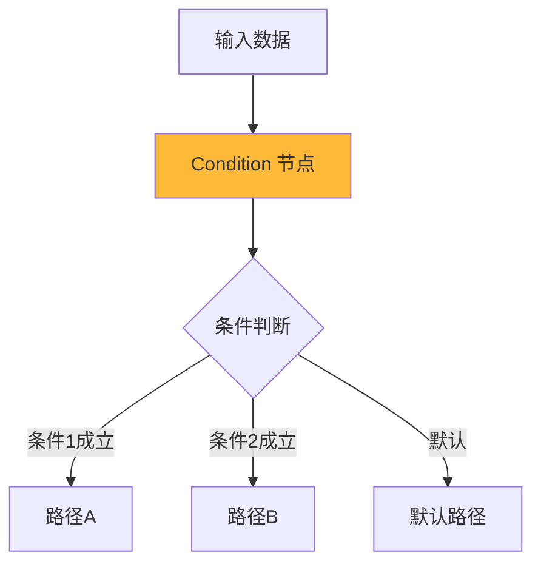

**功能说明**: 基于预定义条件进行流程分支，支持多种数据类型的比较。

**主要配置**:
- **条件类型**: string, number, boolean, array
- **比较操作**: 等于、不等于、包含、大于、小于等
- **多条件组合**: 支持 AND/OR 逻辑

**使用场景**:
- ✅ 用户权限验证
- ✅ 数据有效性检查
- ✅ 业务规则判断
- ✅ 多分支流程控制

**配置示例**:
```javascript
{
  conditions: [
    {
      type: "string",
      value1: "{userRole}",
      operation: "equal",
      value2: "admin"
    },
    {
      type: "number", 
      value1: "{userAge}",
      operation: "greaterThan", 
      value2: "18"
    }
  ],
  conditionLogic: "AND"
}
```

### 5. Condition Agent (智能条件判断)
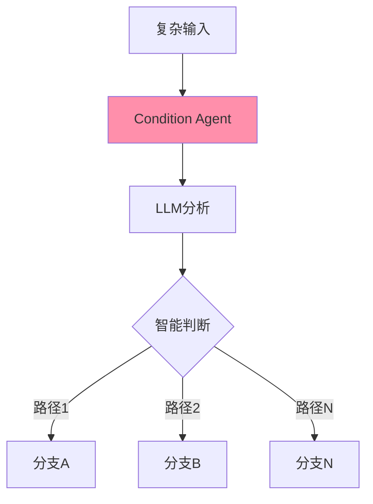

**功能说明**: 使用 AI 模型进行复杂的条件判断，适合需要语义理解的分支控制。

**主要配置**:
- **模型选择**: 选择用于判断的 LLM 模型
- **判断指令**: 描述判断逻辑和条件
- **输出路径**: 定义可能的分支路径

**使用场景**:
- ✅ 情感分析后的流程分支
- ✅ 内容分类和路由
- ✅ 复杂业务逻辑判断
- ✅ 自然语言意图识别

**配置示例**:
```javascript
{
  conditionAgentModel: "gpt-4",
  conditionAgentInstructions: "分析用户消息的情感倾向，如果是投诉选择'complaint'，如果是咨询选择'inquiry'，如果是赞扬选择'praise'",
  conditionAgentOutputs: ["complaint", "inquiry", "praise", "other"]
}
```

### 6. Loop (循环回退)
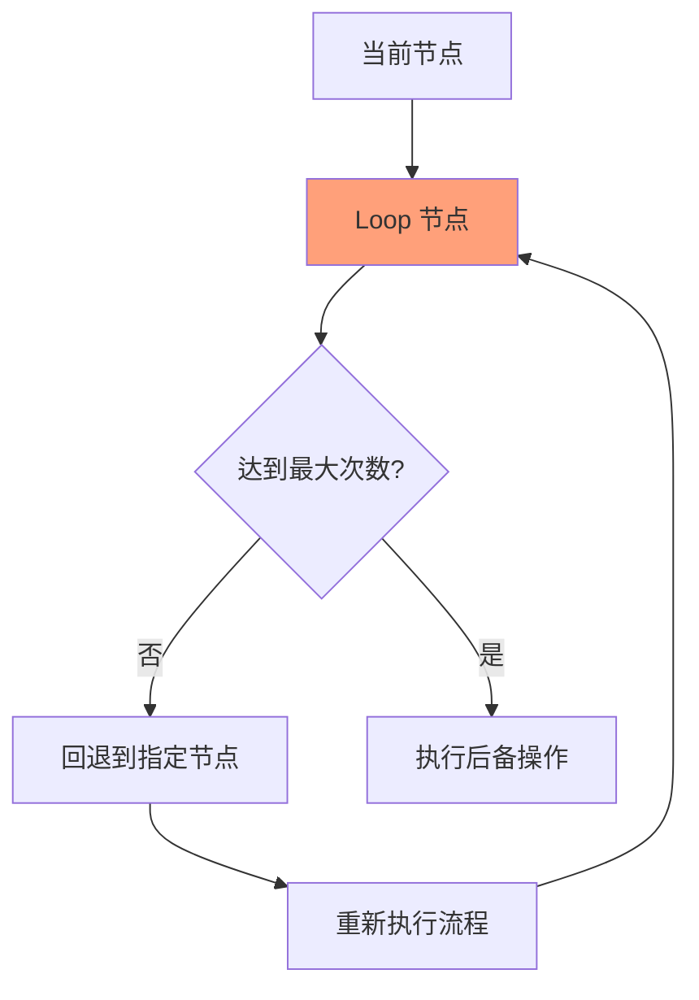

**功能说明**: 将流程回退到之前的节点重新执行，适合需要重试或迭代处理的场景。

**主要配置**:
- **回退目标**: 选择要回退到的节点
- **最大循环次数**: 防止无限循环
- **后备消息**: 超过循环次数时的处理

**使用场景**:
- ✅ 任务重试机制
- ✅ 用户确认流程
- ✅ 迭代优化处理
- ✅ 错误恢复机制

**配置示例**:
```javascript
{
  loopBackToNode: "userInputNode",
  maxLoopCount: 3,
  fallbackMessage: "抱歉，已达到最大重试次数，请联系客服。"
}
```

### 7. Iteration (迭代执行)
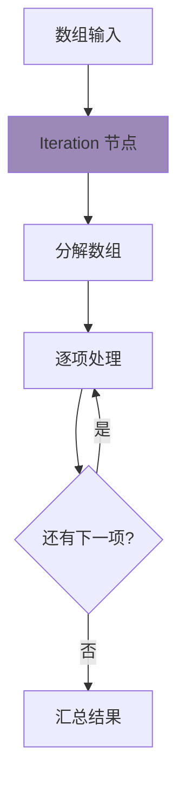

**功能说明**: 对数组中的每个元素执行相同的处理流程。

**主要配置**:
- **数组输入**: 要迭代处理的数组数据
- **处理逻辑**: 在迭代块内定义的处理节点

**使用场景**:
- ✅ 批量数据处理
- ✅ 多文档分析
- ✅ 列表项目处理
- ✅ 批量API调用

**配置示例**:
```javascript
{
  iterationInput: '["item1", "item2", "item3"]'
}
```

## 工具节点

### 8. Tool (工具调用)
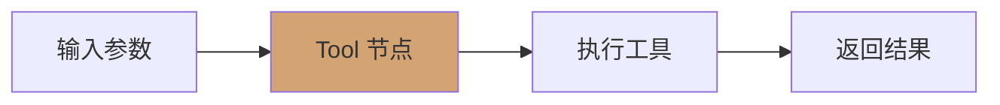

**功能说明**: 调用预定义的工具执行特定任务，如计算、API调用、数据库查询等。

**主要配置**:
- **工具选择**: 从可用工具列表中选择
- **输入参数**: 配置工具所需的参数
- **输出处理**: 处理工具返回的结果

**使用场景**:
- ✅ 数学计算
- ✅ 数据库查询
- ✅ 文件处理
- ✅ 第三方API集成

**配置示例**:
```javascript
{
  toolAgentflowSelectedTool: "calculator",
  toolInputArgs: [
    { inputArgName: "expression", inputArgValue: "10 + 20 * 3" }
  ]
}
```

### 9. HTTP (HTTP请求)
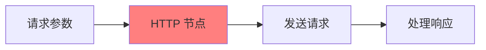

**功能说明**: 发送HTTP请求到外部API或服务。

**主要配置**:
- **请求方法**: GET, POST, PUT, DELETE等
- **URL**: 目标API地址
- **请求头**: 认证信息和其他头部
- **请求体**: POST/PUT请求的数据

**使用场景**:
- ✅ 调用REST API
- ✅ 数据同步
- ✅ 外部服务集成
- ✅ Webhook触发

**配置示例**:
```javascript
{
  method: "POST",
  url: "https://api.example.com/data",
  headers: {
    "Content-Type": "application/json",
    "Authorization": "Bearer {token}"
  },
  body: {
    "key": "value"
  }
}
```

### 10. Retriever (信息检索)
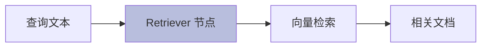

**功能说明**: 从向量数据库中检索相关信息，支持语义搜索。

**主要配置**:
- **知识库选择**: 选择要检索的文档存储
- **检索数量**: 返回的相关文档数量
- **相似度阈值**: 过滤低相关性结果

**使用场景**:
- ✅ 知识库问答
- ✅ 文档搜索
- ✅ 信息查找
- ✅ 上下文增强

**配置示例**:
```javascript
{
  retrieverKnowledgeDocumentStores: ["company-docs", "product-manual"],
  retrieverQuery: "{userQuestion}",
  retrieverTopK: 5
}
```

### 11. Custom Function (自定义函数)
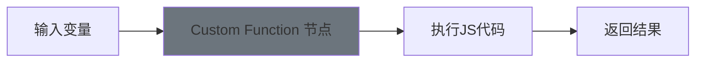

**功能说明**: 执行自定义的JavaScript代码，实现特定的业务逻辑。

**主要配置**:
- **输入变量**: 定义函数可用的变量
- **JavaScript代码**: 自定义的处理逻辑
- **返回值**: 函数的输出结果

**使用场景**:
- ✅ 数据格式转换
- ✅ 复杂计算逻辑
- ✅ 第三方库调用
- ✅ 自定义业务规则

**配置示例**:
```javascript
{
  customFunctionInputVariables: [
    { variableName: "temperature", variableValue: "{temp}" },
    { variableName: "city", variableValue: "{cityName}" }
  ],
  javascriptFunction: `
    const fetch = require('node-fetch');
    const url = \`https://api.weather.com/v1/current?city=\${$city}&temp=\${$temperature}\`;
    const response = await fetch(url);
    const data = await response.json();
    return JSON.stringify(data);
  `
}
```

### 12. Execute Flow (执行其他流程)
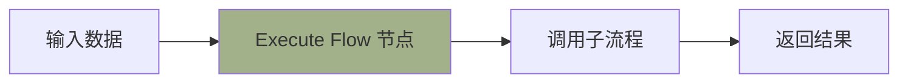

**功能说明**: 调用其他的Flowise流程，实现流程的模块化和复用。

**主要配置**:
- **目标流程**: 选择要执行的流程
- **输入映射**: 将当前流程的数据传递给子流程
- **输出处理**: 处理子流程的返回结果

**使用场景**:
- ✅ 流程模块化
- ✅ 复杂流程分解
- ✅ 流程复用
- ✅ 分布式处理

**配置示例**:
```javascript
{
  executeFlowSelectedFlow: "data-processing-flow",
  executeFlowInputs: [
    { inputKey: "data", inputValue: "{processedData}" }
  ]
}
```

## 输入输出节点

### 13. Human Input (人工输入)
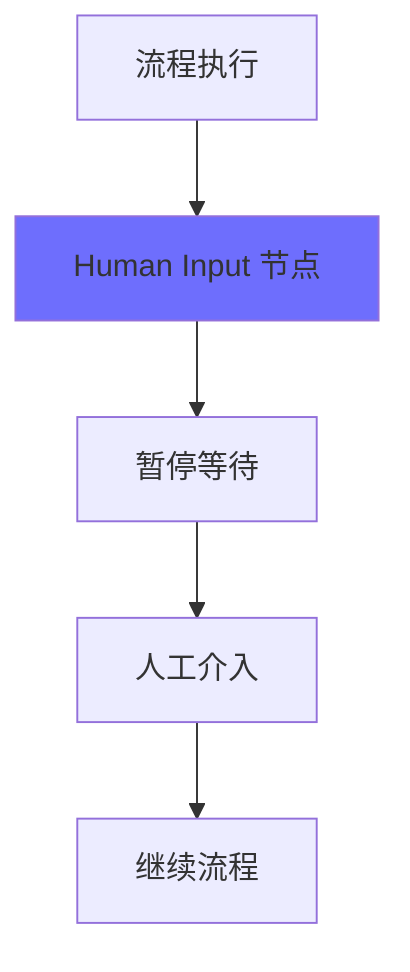

**功能说明**: 在流程执行中暂停，等待人工输入或确认。

**主要配置**:
- **描述类型**: 固定描述或动态生成
- **输入类型**: 文本、确认、选择等
- **等待超时**: 设置等待时间限制

**使用场景**:
- ✅ 人工审核流程
- ✅ 重要决策确认
- ✅ 数据补充输入
- ✅ 质量控制检查

**配置示例**:
```javascript
{
  humanInputDescriptionType: "fixed",
  humanInputDescription: "请确认是否要继续处理这个订单？",
  humanInputType: "approval",
  humanInputTimeout: 3600 // 1小时超时
}
```

### 14. Direct Reply (直接回复)
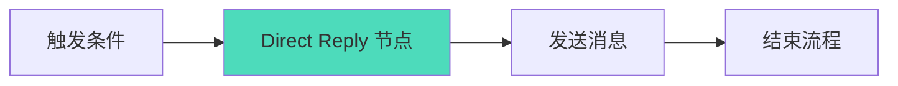

**功能说明**: 直接向用户发送预定义的消息，通常作为流程的终点。

**主要配置**:
- **回复消息**: 要发送给用户的文本内容
- **支持变量**: 可以包含动态变量

**使用场景**:
- ✅ 确认消息发送
- ✅ 错误信息通知
- ✅ 流程完成提示
- ✅ 状态更新通知

**配置示例**:
```javascript
{
  directReplyMessage: "您的订单 {orderId} 已经成功提交，预计 {deliveryTime} 送达。"
}
```

## 辅助节点

### 15. Sticky Note (便签注释)
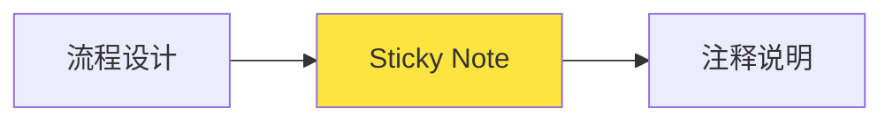

**功能说明**: 在流程中添加注释和说明，不影响实际执行。

**主要配置**:
- **注释内容**: 自由文本说明

**使用场景**:
- ✅ 流程文档化
- ✅ 设计思路记录
- ✅ 团队协作说明
- ✅ 维护提醒

**配置示例**:
```javascript
{
  note: "这里处理用户支付逻辑，需要验证支付状态"
}
```

## 使用场景和选择指南

### 场景1: 智能客服系统
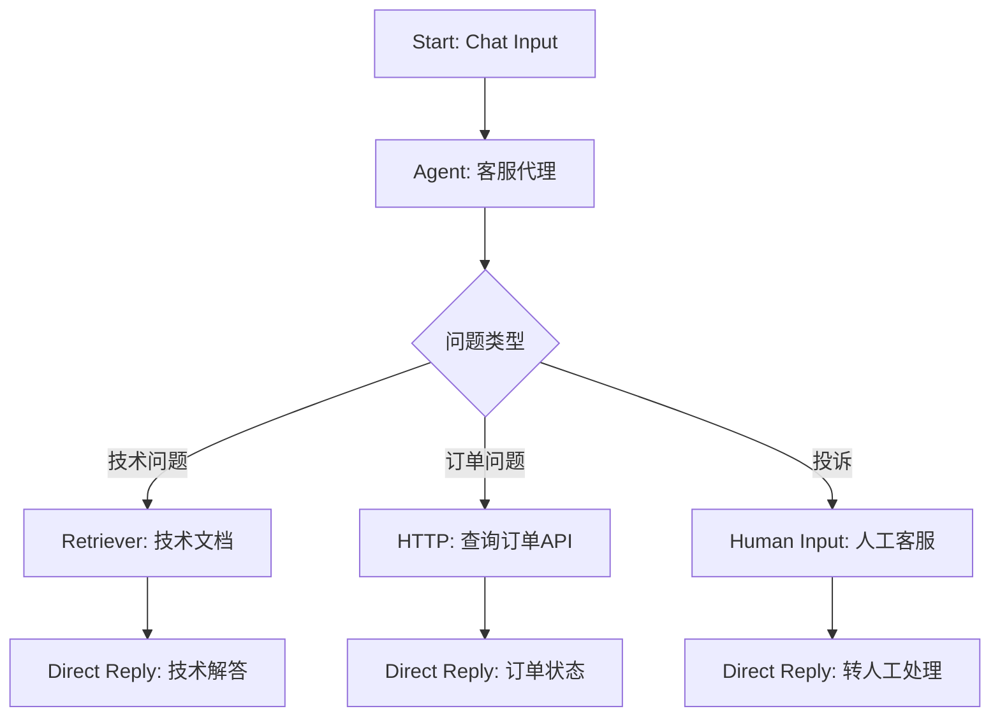

**节点选择建议**:
- **Start**: 选择 Chat Input 模式
- **Agent**: 配置客服角色，绑定必要工具
- **Condition**: 基于问题类型进行分流
- **Retriever**: 检索技术文档和FAQ
- **HTTP**: 调用订单管理系统API
- **Human Input**: 复杂问题转人工处理

### 场景2: 数据处理流水线
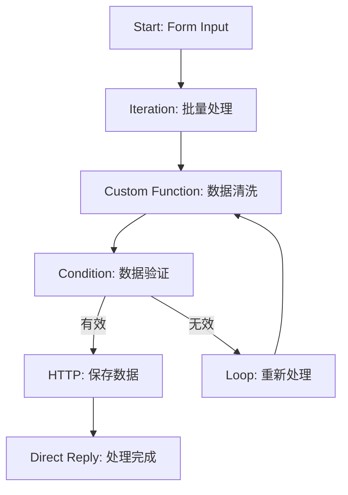

**节点选择建议**:
- **Start**: 选择 Form Input 收集数据
- **Iteration**: 批量处理多条记录
- **Custom Function**: 实现数据清洗逻辑
- **Condition**: 验证数据有效性
- **HTTP**: 调用数据存储API
- **Loop**: 错误数据重新处理

### 场景3: 内容审核工作流
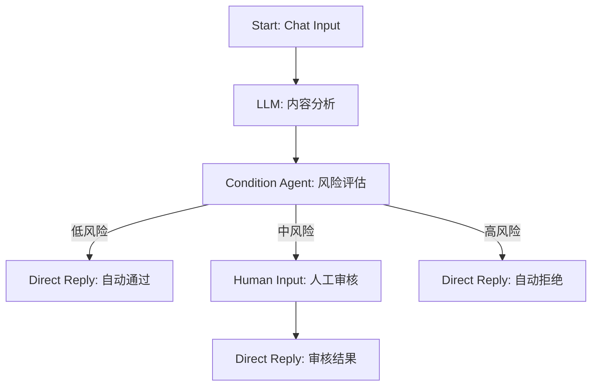

**节点选择建议**:
- **Start**: Chat Input 接收待审核内容
- **LLM**: 分析内容特征和风险点
- **Condition Agent**: 基于AI判断风险级别
- **Human Input**: 中风险内容人工确认
- **Direct Reply**: 不同情况的结果通知

### 选择指南矩阵

| 需求类型 | 推荐节点 | 替代方案 | 适用场景 |
|---------|---------|---------|---------|
| 流程入口 | Start | - | 所有场景 |
| AI对话 | Agent | LLM | 复杂交互 |
| 文本处理 | LLM | Agent | 简单生成 |
| 条件分支 | Condition | Condition Agent | 简单规则 |
| 智能分支 | Condition Agent | LLM + Condition | 复杂判断 |
| 工具调用 | Tool | Custom Function | 标准工具 |
| API请求 | HTTP | Custom Function | REST API |
| 信息检索 | Retriever | HTTP + 搜索API | 向量搜索 |
| 自定义逻辑 | Custom Function | - | 特殊需求 |
| 子流程调用 | Execute Flow | - | 模块化 |
| 人工介入 | Human Input | - | 审核确认 |
| 流程结束 | Direct Reply | - | 消息发送 |
| 批量处理 | Iteration | Loop | 数组处理 |
| 重试机制 | Loop | Condition + 计数 | 错误恢复 |

## 最佳实践

### 1. 节点选择原则

**简单优先原则**:
- 能用 Condition 就不用 Condition Agent
- 能用 LLM 就不用 Agent（如果不需要工具调用）
- 能用标准 Tool 就不用 Custom Function

**性能考虑**:
- LLM 调用有成本，合理规划调用次数
- 使用 Retriever 前确保向量数据库已建立索引
- HTTP 请求添加超时和错误处理

### 2. 流程设计建议

**错误处理**:
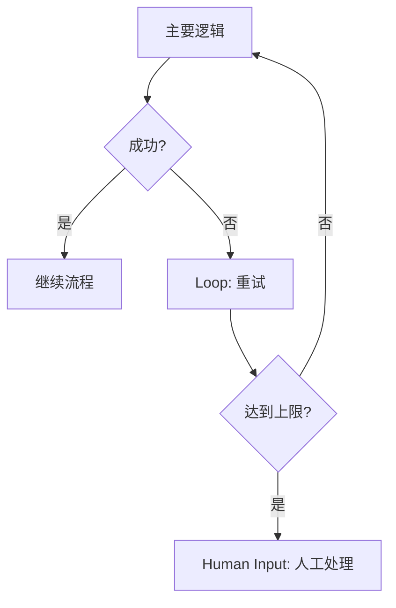

**状态管理**:
- 使用变量在节点间传递状态
- 重要状态信息使用 Custom Function 持久化
- 利用 Agent 的记忆功能保持上下文

**模块化设计**:
- 复杂流程拆分为多个子流程
- 使用 Execute Flow 实现流程复用
- 公共逻辑封装为独立工具

### 3. 调试和维护

**调试技巧**:
- 使用 Sticky Note 记录关键逻辑
- 在关键节点添加 Direct Reply 输出中间结果
- 利用 Custom Function 打印调试信息

**性能优化**:
- 合并相似的 LLM 调用
- 使用缓存减少重复的 HTTP 请求
- 优化 Retriever 的查询策略

**监控和日志**:
- 记录关键业务指标
- 监控 Agent 的工具调用成功率
- 跟踪 Human Input 的响应时间

### 4. 常见问题解决

**流程卡住**:
- 检查 Human Input 节点的超时设置
- 确认 Loop 节点有正确的退出条件
- 验证 HTTP 请求的响应处理

**性能问题**:
- 减少不必要的 LLM 调用
- 优化 Custom Function 中的复杂计算
- 使用批处理减少 API 调用次数

**结果不准确**:
- 优化 Agent 和 LLM 的 prompt
- 调整 Retriever 的相似度阈值
- 增加更多的条件判断分支

## 总结

Agent Flow 提供了构建复杂 AI 工作流的完整工具集。通过合理选择和组合这些节点，您可以创建出功能强大、逻辑清晰的智能代理系统。

### 🎯 **关键要点**
- **选择合适的节点**: 根据具体需求选择最适合的节点类型
- **合理设计流程**: 考虑错误处理、性能优化和用户体验
- **充分测试**: 验证各种场景下的流程表现
- **持续优化**: 根据使用情况不断改进流程设计

### 🚀 **进阶使用**
- 学习复杂流程的设计模式
- 掌握节点间的数据传递技巧
- 深入了解各种工具的配置选项
- 实践大规模流程的架构设计

通过这份指南，您应该能够理解每个 Agent Flow 节点的功能特点，并根据具体需求选择合适的节点来构建您的 AI 工作流。