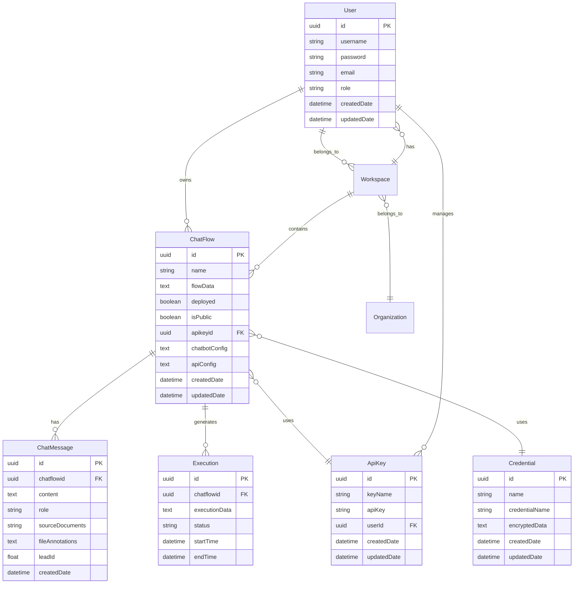
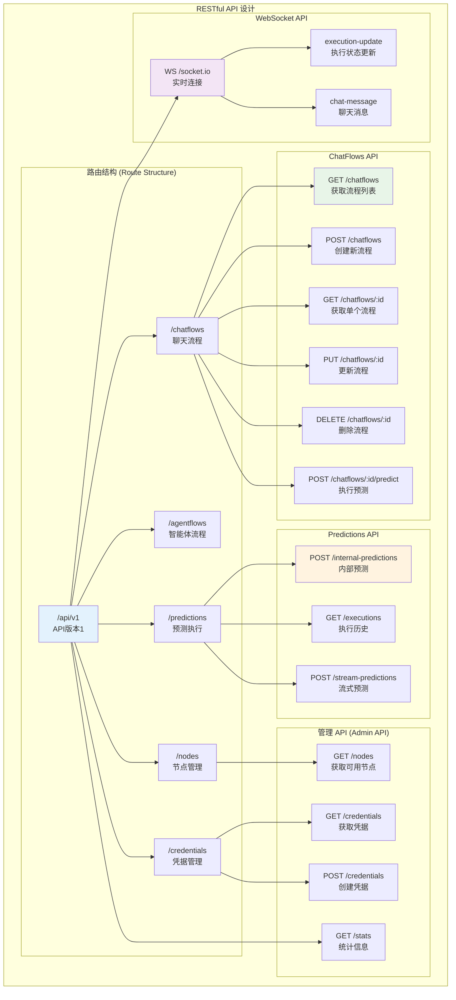
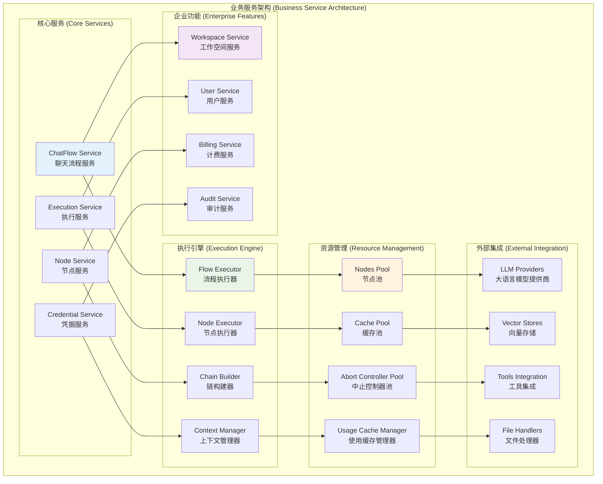
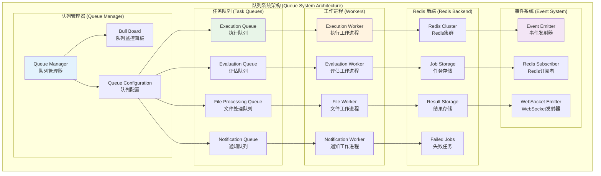

# Flowise 后端开发者指南

> **文档类型**: 后端开发者视角分析  
> **技术栈**: Node.js + Express + TypeScript + TypeORM  
> **更新日期**: 2025年10月11日

## 📋 目录

1. [后端架构概览](#后端架构概览)
2. [Express 服务器架构](#express-服务器架构)
3. [数据库设计和ORM](#数据库设计和orm)
4. [API设计和路由系统](#api设计和路由系统)
5. [业务逻辑层设计](#业务逻辑层设计)
6. [中间件和安全机制](#中间件和安全机制)
7. [队列和异步处理](#队列和异步处理)
8. [监控和日志系统](#监控和日志系统)

## 后端架构概览

```mermaid
graph TB
    subgraph "Express Server 架构"
        subgraph "应用入口层 (Application Layer)"
            APP_CLASS[App Class<br/>应用主类]
            EXPRESS_APP[Express App<br/>Express实例]
            SERVER_INIT[Server Initialization<br/>服务器初始化]
        end
        
        subgraph "中间件层 (Middleware Layer)"
            CORS[CORS<br/>跨域处理]
            AUTH_MW[Authentication<br/>身份认证]
            RATE_LIMIT[Rate Limiting<br/>频率限制]
            SECURITY[Security<br/>安全中间件]
            LOGGER_MW[Logger<br/>日志中间件]
        end
        
        subgraph "路由层 (Route Layer)"
            API_ROUTER[API Router<br/>API路由]
            CHATFLOWS_ROUTES[ChatFlows Routes<br/>聊天流程路由]
            AGENTS_ROUTES[Agents Routes<br/>智能体路由]
            AUTH_ROUTES[Auth Routes<br/>认证路由]
            ADMIN_ROUTES[Admin Routes<br/>管理路由]
        end
        
        subgraph "控制器层 (Controller Layer)"
            CHATFLOW_CTRL[ChatFlow Controller<br/>聊天流程控制器]
            PREDICTION_CTRL[Prediction Controller<br/>预测控制器]
            NODE_CTRL[Node Controller<br/>节点控制器]
            USER_CTRL[User Controller<br/>用户控制器]
        end
        
        subgraph "服务层 (Service Layer)"
            CHATFLOW_SVC[ChatFlow Service<br/>聊天流程服务]
            EXECUTION_SVC[Execution Service<br/>执行服务]
            API_KEY_SVC[API Key Service<br/>API密钥服务]
            FILE_SVC[File Service<br/>文件服务]
        end
        
        subgraph "数据访问层 (Data Access Layer)"
            TYPEORM[TypeORM<br/>ORM框架]
            ENTITIES[Database Entities<br/>数据库实体]
            REPOSITORIES[Repositories<br/>数据仓库]
            MIGRATIONS[Migrations<br/>数据库迁移]
        end
    end
    
    APP_CLASS --> EXPRESS_APP
    EXPRESS_APP --> SERVER_INIT
    
    SERVER_INIT --> CORS
    CORS --> AUTH_MW
    AUTH_MW --> RATE_LIMIT
    RATE_LIMIT --> SECURITY
    SECURITY --> LOGGER_MW
    
    LOGGER_MW --> API_ROUTER
    API_ROUTER --> CHATFLOWS_ROUTES
    API_ROUTER --> AGENTS_ROUTES
    API_ROUTER --> AUTH_ROUTES
    API_ROUTER --> ADMIN_ROUTES
    
    CHATFLOWS_ROUTES --> CHATFLOW_CTRL
    AGENTS_ROUTES --> PREDICTION_CTRL
    AUTH_ROUTES --> NODE_CTRL
    ADMIN_ROUTES --> USER_CTRL
    
    CHATFLOW_CTRL --> CHATFLOW_SVC
    PREDICTION_CTRL --> EXECUTION_SVC
    NODE_CTRL --> API_KEY_SVC
    USER_CTRL --> FILE_SVC
    
    CHATFLOW_SVC --> TYPEORM
    EXECUTION_SVC --> ENTITIES
    API_KEY_SVC --> REPOSITORIES
    FILE_SVC --> MIGRATIONS
    
    style APP_CLASS fill:#e3f2fd
    style CHATFLOW_CTRL fill:#e8f5e8
    style CHATFLOW_SVC fill:#fff3e0
    style TYPEORM fill:#f3e5f5
```



**架构特点**:
- **分层架构**: 清晰的分层设计，职责分离明确
- **企业级特性**: 完整的认证、授权、监控体系
- **插件化设计**: 支持动态加载和扩展
- **异步处理**: 队列系统支持长时间运行任务

## Express 服务器架构

```mermaid
graph TB
    subgraph "Express 应用初始化流程"
        subgraph "启动阶段 (Startup Phase)"
            CONSTRUCTOR[Constructor<br/>构造函数]
            INIT_DB[initDatabase<br/>数据库初始化]
            INIT_POOLS[initPools<br/>资源池初始化]
            CONFIG_APP[configureApp<br/>应用配置]
        end
        
        subgraph "数据库初始化 (Database Init)"
            DATASOURCE[DataSource.initialize<br/>数据源初始化]
            MIGRATIONS[runMigrations<br/>运行迁移]
            IDENTITY_MGR[IdentityManager.getInstance<br/>身份管理器]
        end
        
        subgraph "资源池初始化 (Pools Init)"
            NODES_POOL[NodesPool<br/>节点池]
            CACHE_POOL[CachePool<br/>缓存池]
            ABORT_POOL[AbortControllerPool<br/>中止控制器池]
            QUEUE_MGR[QueueManager<br/>队列管理器]
        end
        
        subgraph "中间件配置 (Middleware Config)"
            BASIC_MW[基础中间件<br/>CORS, Body Parser, Cookie]
            SECURITY_MW[安全中间件<br/>Helmet, Rate Limit, XSS]
            AUTH_MW[认证中间件<br/>JWT, Passport]
            LOGGING_MW[日志中间件<br/>Request Logger]
        end
        
        subgraph "路由注册 (Route Registration)"
            API_V1[API v1 Routes<br/>主要API路由]
            STATIC_ROUTES[Static Routes<br/>静态文件路由]
            ERROR_HANDLER[Error Handler<br/>错误处理中间件]
        end
        
        subgraph "服务器启动 (Server Start)"
            HTTP_SERVER[HTTP Server<br/>HTTP服务器]
            WEBSOCKET[WebSocket Server<br/>WebSocket服务器]
            HEALTH_CHECK[Health Check<br/>健康检查]
        end
    end
    
    CONSTRUCTOR --> INIT_DB
    INIT_DB --> INIT_POOLS
    INIT_POOLS --> CONFIG_APP
    
    INIT_DB --> DATASOURCE
    DATASOURCE --> MIGRATIONS
    MIGRATIONS --> IDENTITY_MGR
    
    INIT_POOLS --> NODES_POOL
    NODES_POOL --> CACHE_POOL
    CACHE_POOL --> ABORT_POOL
    ABORT_POOL --> QUEUE_MGR
    
    CONFIG_APP --> BASIC_MW
    BASIC_MW --> SECURITY_MW
    SECURITY_MW --> AUTH_MW
    AUTH_MW --> LOGGING_MW
    
    LOGGING_MW --> API_V1
    API_V1 --> STATIC_ROUTES
    STATIC_ROUTES --> ERROR_HANDLER
    
    ERROR_HANDLER --> HTTP_SERVER
    HTTP_SERVER --> WEBSOCKET
    WEBSOCKET --> HEALTH_CHECK
    
    style CONSTRUCTOR fill:#e3f2fd
    style DATASOURCE fill:#e8f5e8
    style NODES_POOL fill:#fff3e0
    style HTTP_SERVER fill:#f3e5f5
```



**初始化代码示例**:
```typescript
export class App {
    app: express.Application
    nodesPool: NodesPool
    AppDataSource: DataSource = getDataSource()
    
    constructor() {
        this.app = express()
    }
    
    async initDatabase() {
        await this.AppDataSource.initialize()
        await this.AppDataSource.runMigrations({ transaction: 'each' })
        this.identityManager = await IdentityManager.getInstance()
        logger.info('📦 Database initialized successfully')
    }
    
    async initPools() {
        this.nodesPool = new NodesPool()
        await this.nodesPool.initialize()
        
        this.cachePool = new CachePool()
        this.abortControllerPool = new AbortControllerPool()
        logger.info('🔧 Resource pools initialized')
    }
}
```

## 数据库设计和ORM



**TypeORM 实体设计**:

### 1. ChatFlow 实体
```typescript
@Entity()
export class ChatFlow implements IChatFlow {
    @PrimaryGeneratedColumn('uuid')
    id: string

    @Column()
    name: string

    @Column({ type: 'text' })
    flowData: string

    @Column({ nullable: true })
    deployed?: boolean

    @Column({ nullable: true })
    isPublic?: boolean

    @Column({ nullable: true })
    apikeyid?: string

    @Column({ nullable: true, type: 'text' })
    chatbotConfig?: string

    @CreateDateColumn()
    createdDate: Date

    @UpdateDateColumn()
    updatedDate: Date
}
```

### 2. Repository 模式
```typescript
// ChatFlow Repository
export class ChatFlowRepository {
    private repository: Repository<ChatFlow>
    
    constructor(dataSource: DataSource) {
        this.repository = dataSource.getRepository(ChatFlow)
    }
    
    async findById(id: string): Promise<ChatFlow | null> {
        return await this.repository.findOne({ where: { id } })
    }
    
    async create(chatflowData: Partial<ChatFlow>): Promise<ChatFlow> {
        const chatflow = this.repository.create(chatflowData)
        return await this.repository.save(chatflow)
    }
    
    async update(id: string, updateData: Partial<ChatFlow>): Promise<ChatFlow> {
        await this.repository.update(id, updateData)
        return await this.findById(id)
    }
}
```

### 3. 数据库迁移
```typescript
// Migration 示例
export class CreateChatFlowTable1234567890 implements MigrationInterface {
    public async up(queryRunner: QueryRunner): Promise<void> {
        await queryRunner.createTable(
            new Table({
                name: 'chat_flow',
                columns: [
                    {
                        name: 'id',
                        type: 'uuid',
                        isPrimary: true,
                        generationStrategy: 'uuid',
                        default: 'uuid_generate_v4()'
                    },
                    {
                        name: 'name',
                        type: 'varchar',
                        isNullable: false
                    },
                    {
                        name: 'flowData',
                        type: 'text',
                        isNullable: false
                    }
                ]
            })
        )
    }
    
    public async down(queryRunner: QueryRunner): Promise<void> {
        await queryRunner.dropTable('chat_flow')
    }
}
```

## API设计和路由系统



**API 实现示例**:

### 1. 控制器设计
```typescript
// ChatFlow Controller
export class ChatFlowController {
    async getAllChatflows(req: Request, res: Response, next: NextFunction) {
        try {
            const { page, limit } = getPageAndLimitParams(req.query)
            const chatflows = await chatflowsService.getAllChatflows(page, limit)
            return res.json(chatflows)
        } catch (error) {
            next(error)
        }
    }
    
    async createChatflow(req: Request, res: Response, next: NextFunction) {
        try {
            const chatflowData = req.body
            const newChatflow = await chatflowsService.createChatflow(chatflowData)
            return res.status(StatusCodes.CREATED).json(newChatflow)
        } catch (error) {
            next(error)
        }
    }
    
    async predictChatflow(req: Request, res: Response, next: NextFunction) {
        try {
            const { id } = req.params
            const { question, history, overrideConfig } = req.body
            
            const result = await chatflowsService.predictChatflow(
                id, 
                question, 
                history, 
                overrideConfig
            )
            
            return res.json(result)
        } catch (error) {
            next(error)
        }
    }
}
```

### 2. 路由定义
```typescript
// ChatFlows Routes
const router = express.Router()

// CRUD operations
router.get('/', ChatFlowController.getAllChatflows)
router.post('/', ChatFlowController.createChatflow)
router.get('/:id', ChatFlowController.getChatflowById)
router.put('/:id', ChatFlowController.updateChatflow)
router.delete('/:id', ChatFlowController.deleteChatflow)

// Execution
router.post('/:id/predict', 
    rateLimiter,
    validateApiKey,
    ChatFlowController.predictChatflow
)

// Streaming
router.post('/:id/stream-predict',
    rateLimiter,
    validateApiKey,
    ChatFlowController.streamPredictChatflow
)

export default router
```

### 3. 中间件集成
```typescript
// API验证中间件
export const validateApiKey = async (req: Request, res: Response, next: NextFunction) => {
    try {
        const apiKey = req.headers.authorization?.replace('Bearer ', '')
        
        if (!apiKey) {
            throw new UnauthorizedError('API key required')
        }
        
        const isValid = await apiKeyService.validateKey(apiKey)
        if (!isValid) {
            throw new UnauthorizedError('Invalid API key')
        }
        
        next()
    } catch (error) {
        next(error)
    }
}
```

## 业务逻辑层设计



**业务服务实现**:

### 1. ChatFlow Service
```typescript
export class ChatFlowService {
    private chatflowRepository: Repository<ChatFlow>
    private nodesPool: NodesPool
    private executionService: ExecutionService
    
    async createChatflow(data: CreateChatFlowDto): Promise<ChatFlow> {
        // 验证流程数据
        this.validateFlowData(data.flowData)
        
        // 创建新的聊天流程
        const chatflow = this.chatflowRepository.create({
            name: data.name,
            flowData: JSON.stringify(data.flowData),
            deployed: false,
            isPublic: data.isPublic || false
        })
        
        // 保存到数据库
        const savedChatflow = await this.chatflowRepository.save(chatflow)
        
        // 初始化流程节点
        await this.initializeFlowNodes(savedChatflow)
        
        return savedChatflow
    }
    
    async predictChatflow(
        chatflowId: string, 
        question: string, 
        history: IChatMessage[] = [],
        overrideConfig?: any
    ): Promise<any> {
        // 获取聊天流程
        const chatflow = await this.getChatflowById(chatflowId)
        
        // 解析流程数据
        const flowData = JSON.parse(chatflow.flowData)
        
        // 执行流程
        return await this.executionService.executeFlow(
            flowData,
            question,
            history,
            overrideConfig
        )
    }
    
    private validateFlowData(flowData: any): void {
        if (!flowData.nodes || !Array.isArray(flowData.nodes)) {
            throw new ValidationError('Invalid flow data: nodes array required')
        }
        
        if (!flowData.edges || !Array.isArray(flowData.edges)) {
            throw new ValidationError('Invalid flow data: edges array required')
        }
        
        // 验证节点连接的完整性
        this.validateNodeConnections(flowData.nodes, flowData.edges)
    }
}
```

### 2. Execution Service
```typescript
export class ExecutionService {
    private nodesPool: NodesPool
    private cachePool: CachePool
    
    async executeFlow(
        flowData: IFlowData,
        input: string,
        history: IChatMessage[],
        overrideConfig?: any
    ): Promise<IExecutionResult> {
        const executionId = uuidv4()
        
        try {
            // 创建执行上下文
            const context = this.createExecutionContext(
                executionId,
                flowData,
                input,
                history,
                overrideConfig
            )
            
            // 构建执行图
            const executionGraph = await this.buildExecutionGraph(flowData)
            
            // 执行流程
            const result = await this.executeGraph(executionGraph, context)
            
            // 保存执行结果
            await this.saveExecutionResult(executionId, result)
            
            return result
        } catch (error) {
            // 记录执行错误
            await this.logExecutionError(executionId, error)
            throw error
        }
    }
    
    private async buildExecutionGraph(flowData: IFlowData): Promise<ExecutionGraph> {
        const graph = new ExecutionGraph()
        
        // 添加节点
        for (const nodeData of flowData.nodes) {
            const node = await this.nodesPool.createNode(nodeData)
            graph.addNode(node)
        }
        
        // 添加边
        for (const edge of flowData.edges) {
            graph.addEdge(edge.source, edge.target, edge.sourceHandle, edge.targetHandle)
        }
        
        return graph
    }
}
```

## 中间件和安全机制


**安全实现示例**:

### 1. JWT 认证中间件
```typescript
export const jwtAuth = (req: Request, res: Response, next: NextFunction) => {
    try {
        const token = req.headers.authorization?.replace('Bearer ', '')
        
        if (!token) {
            throw new UnauthorizedError('Token required')
        }
        
        const decoded = jwt.verify(token, process.env.JWT_SECRET!) as JwtPayload
        req.user = decoded
        
        next()
    } catch (error) {
        if (error instanceof JsonWebTokenError) {
            throw new UnauthorizedError('Invalid token')
        }
        next(error)
    }
}
```

### 2. Rate Limiting
```typescript
export class RateLimiterManager {
    private limiters: Map<string, RateLimiterRedis> = new Map()
    
    constructor(private redisClient: Redis) {
        this.initializeLimiters()
    }
    
    private initializeLimiters() {
        // API调用限制
        this.limiters.set('api', new RateLimiterRedis({
            storeClient: this.redisClient,
            keyPrefix: 'rate_limit_api',
            points: 100, // 请求数
            duration: 60, // 时间窗口(秒)
        }))
        
        // 预测执行限制
        this.limiters.set('prediction', new RateLimiterRedis({
            storeClient: this.redisClient,
            keyPrefix: 'rate_limit_prediction',
            points: 10,
            duration: 60,
        }))
    }
    
    async checkLimit(key: string, identifier: string): Promise<void> {
        const limiter = this.limiters.get(key)
        if (!limiter) return
        
        try {
            await limiter.consume(identifier)
        } catch (rateLimiterRes) {
            throw new TooManyRequestsError(
                `Rate limit exceeded. Try again in ${rateLimiterRes.msBeforeNext}ms`
            )
        }
    }
}
```

### 3. 数据加密
```typescript
export class EncryptionService {
    private readonly algorithm = 'aes-256-gcm'
    private readonly keyLength = 32
    
    encrypt(text: string, key?: Buffer): EncryptedData {
        const encryptionKey = key || this.generateKey()
        const iv = crypto.randomBytes(16)
        
        const cipher = crypto.createCipher(this.algorithm, encryptionKey, iv)
        
        let encrypted = cipher.update(text, 'utf8', 'hex')
        encrypted += cipher.final('hex')
        
        const authTag = cipher.getAuthTag()
        
        return {
            encryptedData: encrypted,
            iv: iv.toString('hex'),
            authTag: authTag.toString('hex'),
            key: encryptionKey.toString('hex')
        }
    }
    
    decrypt(encryptedData: EncryptedData): string {
        const key = Buffer.from(encryptedData.key, 'hex')
        const iv = Buffer.from(encryptedData.iv, 'hex')
        const authTag = Buffer.from(encryptedData.authTag, 'hex')
        
        const decipher = crypto.createDecipher(this.algorithm, key, iv)
        decipher.setAuthTag(authTag)
        
        let decrypted = decipher.update(encryptedData.encryptedData, 'hex', 'utf8')
        decrypted += decipher.final('utf8')
        
        return decrypted
    }
}
```

## 队列和异步处理



**队列实现示例**:

### 1. 队列管理器
```typescript
export class QueueManager {
    private queues: Map<string, Queue> = new Map()
    private workers: Map<string, Worker> = new Map()
    private redisConnection: ConnectionOptions
    
    constructor() {
        this.redisConnection = {
            host: process.env.REDIS_HOST || 'localhost',
            port: parseInt(process.env.REDIS_PORT || '6379'),
            password: process.env.REDIS_PASSWORD
        }
        
        this.initializeQueues()
        this.initializeWorkers()
    }
    
    private initializeQueues() {
        // 执行队列
        const executionQueue = new Queue('execution', {
            connection: this.redisConnection,
            defaultJobOptions: {
                removeOnComplete: 10,
                removeOnFail: 5,
                attempts: 3,
                backoff: {
                    type: 'exponential',
                    delay: 2000
                }
            }
        })
        
        this.queues.set('execution', executionQueue)
        
        // 评估队列
        const evaluationQueue = new Queue('evaluation', {
            connection: this.redisConnection,
            defaultJobOptions: {
                removeOnComplete: 50,
                removeOnFail: 10,
                attempts: 2
            }
        })
        
        this.queues.set('evaluation', evaluationQueue)
    }
    
    private initializeWorkers() {
        // 执行工作进程
        const executionWorker = new Worker('execution', async (job) => {
            return await this.processExecutionJob(job)
        }, {
            connection: this.redisConnection,
            concurrency: 5
        })
        
        this.workers.set('execution', executionWorker)
        
        // 设置事件监听
        executionWorker.on('completed', (job) => {
            logger.info(`Job ${job.id} completed successfully`)
            this.emitJobEvent('execution:completed', job)
        })
        
        executionWorker.on('failed', (job, err) => {
            logger.error(`Job ${job?.id} failed:`, err)
            this.emitJobEvent('execution:failed', { job, error: err })
        })
    }
    
    async addExecutionJob(data: ExecutionJobData): Promise<Job> {
        const queue = this.queues.get('execution')
        return await queue.add('execute-flow', data, {
            priority: data.priority || 0,
            delay: data.delay || 0
        })
    }
    
    private async processExecutionJob(job: Job<ExecutionJobData>): Promise<any> {
        const { chatflowId, input, history, overrideConfig } = job.data
        
        try {
            // 更新任务状态
            await job.updateProgress(10)
            
            // 执行聊天流程
            const executionService = new ExecutionService()
            const result = await executionService.executeFlow(
                chatflowId,
                input,
                history,
                overrideConfig
            )
            
            await job.updateProgress(100)
            return result
        } catch (error) {
            logger.error('Execution job failed:', error)
            throw error
        }
    }
}
```

### 2. 事件订阅系统
```typescript
export class RedisEventSubscriber {
    private subscriber: Redis
    private publisher: Redis
    private eventHandlers: Map<string, Function[]> = new Map()
    
    constructor() {
        this.subscriber = new Redis({
            host: process.env.REDIS_HOST,
            port: parseInt(process.env.REDIS_PORT || '6379')
        })
        
        this.publisher = new Redis({
            host: process.env.REDIS_HOST,
            port: parseInt(process.env.REDIS_PORT || '6379')
        })
        
        this.setupSubscriptions()
    }
    
    private setupSubscriptions() {
        this.subscriber.subscribe('execution:started')
        this.subscriber.subscribe('execution:progress')
        this.subscriber.subscribe('execution:completed')
        this.subscriber.subscribe('execution:failed')
        
        this.subscriber.on('message', (channel, message) => {
            this.handleEvent(channel, JSON.parse(message))
        })
    }
    
    private handleEvent(channel: string, data: any) {
        const handlers = this.eventHandlers.get(channel) || []
        handlers.forEach(handler => {
            try {
                handler(data)
            } catch (error) {
                logger.error(`Event handler error for ${channel}:`, error)
            }
        })
    }
    
    on(event: string, handler: Function) {
        if (!this.eventHandlers.has(event)) {
            this.eventHandlers.set(event, [])
        }
        this.eventHandlers.get(event)!.push(handler)
    }
    
    emit(event: string, data: any) {
        this.publisher.publish(event, JSON.stringify(data))
    }
}
```

## 监控和日志系统


**监控实现示例**:

### 1. Winston 日志配置
```typescript
import winston from 'winston'
import DailyRotateFile from 'winston-daily-rotate-file'

const logFormat = winston.format.combine(
    winston.format.timestamp(),
    winston.format.errors({ stack: true }),
    winston.format.json(),
    winston.format.prettyPrint()
)

const logger = winston.createLogger({
    level: process.env.LOG_LEVEL || 'info',
    format: logFormat,
    transports: [
        // 控制台输出
        new winston.transports.Console({
            format: winston.format.combine(
                winston.format.colorize(),
                winston.format.simple()
            )
        }),
        
        // 错误日志文件
        new DailyRotateFile({
            filename: 'logs/error-%DATE%.log',
            datePattern: 'YYYY-MM-DD',
            level: 'error',
            maxSize: '20m',
            maxFiles: '14d'
        }),
        
        // 所有日志文件
        new DailyRotateFile({
            filename: 'logs/application-%DATE%.log',
            datePattern: 'YYYY-MM-DD',
            maxSize: '20m',
            maxFiles: '14d'
        })
    ]
})

export default logger
```

### 2. Prometheus 指标
```typescript
import { Counter, Histogram, Gauge, register } from 'prom-client'

export class PrometheusMetrics {
    private httpRequestsTotal: Counter<string>
    private httpRequestDuration: Histogram<string>
    private activeConnections: Gauge<string>
    private executionCount: Counter<string>
    
    constructor() {
        // HTTP请求计数器
        this.httpRequestsTotal = new Counter({
            name: 'flowise_http_requests_total',
            help: 'Total number of HTTP requests',
            labelNames: ['method', 'route', 'status_code']
        })
        
        // HTTP请求持续时间
        this.httpRequestDuration = new Histogram({
            name: 'flowise_http_request_duration_seconds',
            help: 'Duration of HTTP requests in seconds',
            labelNames: ['method', 'route'],
            buckets: [0.1, 0.5, 1, 2, 5, 10]
        })
        
        // 活跃连接数
        this.activeConnections = new Gauge({
            name: 'flowise_active_connections',
            help: 'Number of active connections'
        })
        
        // 执行计数器
        this.executionCount = new Counter({
            name: 'flowise_executions_total',
            help: 'Total number of flow executions',
            labelNames: ['chatflow_id', 'status']
        })
        
        register.registerMetric(this.httpRequestsTotal)
        register.registerMetric(this.httpRequestDuration)
        register.registerMetric(this.activeConnections)
        register.registerMetric(this.executionCount)
    }
    
    incrementHttpRequests(method: string, route: string, statusCode: number) {
        this.httpRequestsTotal.inc({
            method,
            route,
            status_code: statusCode.toString()
        })
    }
    
    observeHttpDuration(method: string, route: string, duration: number) {
        this.httpRequestDuration.observe({ method, route }, duration)
    }
    
    setActiveConnections(count: number) {
        this.activeConnections.set(count)
    }
    
    incrementExecutions(chatflowId: string, status: 'success' | 'error') {
        this.executionCount.inc({ chatflow_id: chatflowId, status })
    }
}
```

### 3. 健康检查
```typescript
export class HealthCheckService {
    private checks: Map<string, HealthCheck> = new Map()
    
    constructor() {
        this.registerChecks()
    }
    
    private registerChecks() {
        // 数据库健康检查
        this.checks.set('database', {
            name: 'Database Connection',
            check: async () => {
                try {
                    const dataSource = getDataSource()
                    await dataSource.query('SELECT 1')
                    return { status: 'healthy', message: 'Database connection OK' }
                } catch (error) {
                    return { status: 'unhealthy', message: error.message }
                }
            }
        })
        
        // Redis健康检查
        this.checks.set('redis', {
            name: 'Redis Connection',
            check: async () => {
                try {
                    const redis = new Redis(process.env.REDIS_URL)
                    await redis.ping()
                    return { status: 'healthy', message: 'Redis connection OK' }
                } catch (error) {
                    return { status: 'unhealthy', message: error.message }
                }
            }
        })
        
        // 内存使用检查
        this.checks.set('memory', {
            name: 'Memory Usage',
            check: async () => {
                const usage = process.memoryUsage()
                const heapUsedMB = usage.heapUsed / 1024 / 1024
                const heapTotalMB = usage.heapTotal / 1024 / 1024
                const percentage = (heapUsedMB / heapTotalMB) * 100
                
                if (percentage > 90) {
                    return { 
                        status: 'unhealthy', 
                        message: `High memory usage: ${percentage.toFixed(2)}%` 
                    }
                }
                
                return { 
                    status: 'healthy', 
                    message: `Memory usage: ${percentage.toFixed(2)}%` 
                }
            }
        })
    }
    
    async runAllChecks(): Promise<HealthCheckResult> {
        const results: Record<string, any> = {}
        let overallStatus = 'healthy'
        
        for (const [name, check] of this.checks) {
            try {
                results[name] = await check.check()
                if (results[name].status === 'unhealthy') {
                    overallStatus = 'unhealthy'
                }
            } catch (error) {
                results[name] = {
                    status: 'unhealthy',
                    message: error.message
                }
                overallStatus = 'unhealthy'
            }
        }
        
        return {
            status: overallStatus,
            timestamp: new Date().toISOString(),
            checks: results
        }
    }
}
```

## 总结

Flowise的后端架构展现了现代Node.js应用的企业级设计：

### 🎯 **核心优势**
- **技术栈现代化**: Node.js + Express + TypeScript + TypeORM
- **分层架构清晰**: 控制器、服务、数据访问层职责分明
- **企业级安全**: 完整的认证、授权、加密体系
- **高可扩展性**: 插件化设计和队列系统支持

### 🚀 **适合场景**
- 需要复杂业务逻辑的AI应用后端
- 企业级的SaaS平台开发
- 需要高并发处理的API服务
- 多租户架构的应用系统

### 💡 **学习价值**
- Express.js的企业级应用模式
- TypeORM的高级使用技巧
- 队列系统的设计和实现
- 完整的监控和日志系统

对于后端开发者来说，Flowise项目提供了丰富的企业级开发实践，特别是在API设计、安全防护、异步处理和系统监控方面的完整解决方案。