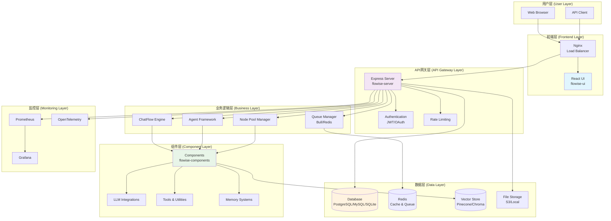
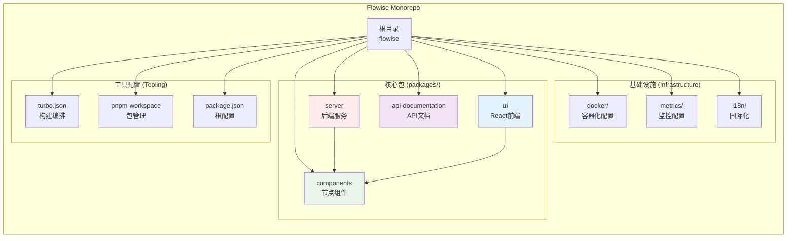
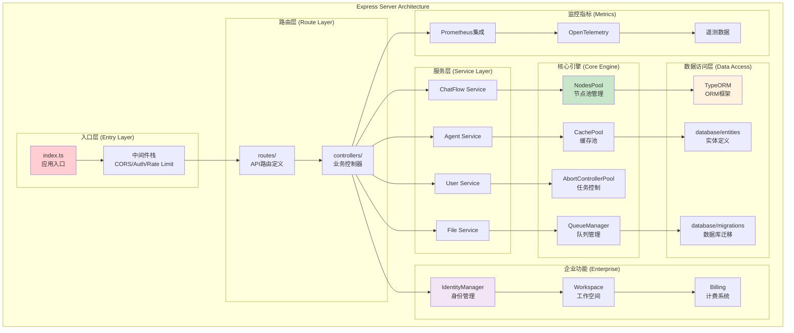
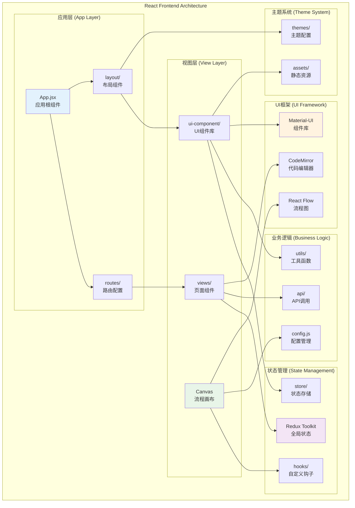
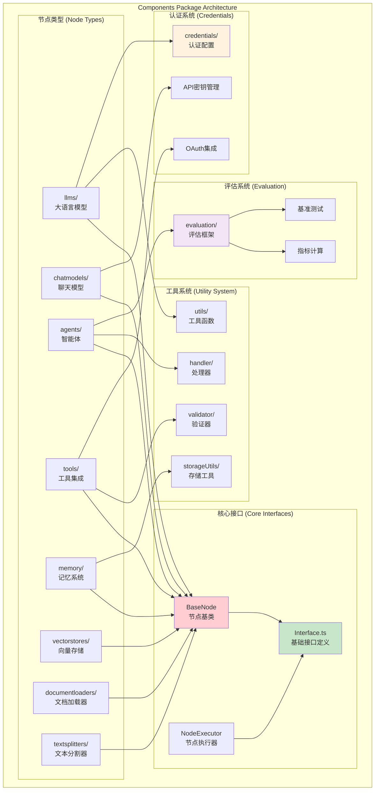
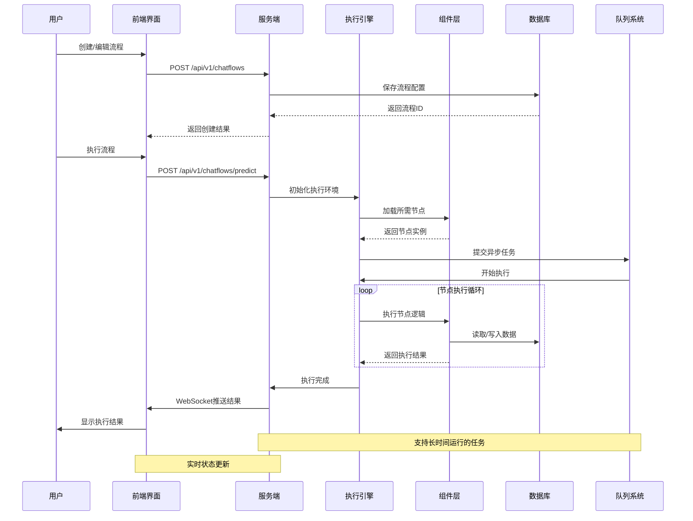
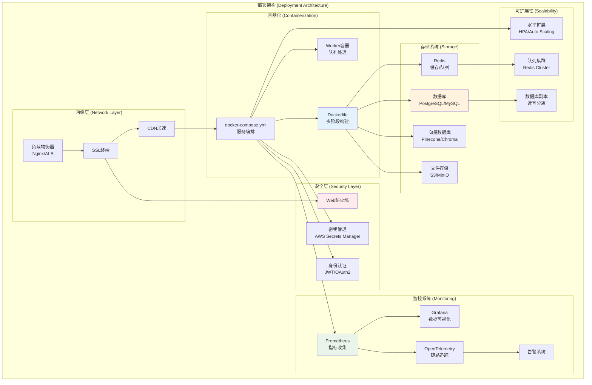

# Flowise 项目架构分析报告

> **分析日期**: 2025年10月11日  
> **分析人员**: 软件开发架构师  
> **项目版本**: v3.0.8

## 项目概述

Flowise 是一个开源的低代码 AI 智能体构建平台，允许用户通过可视化界面构建 LangChain 流程和 AI 智能体。该项目采用现代化的微服务架构设计，基于 TypeScript 和 Node.js 技术栈。

### 核心特性
- 可视化 AI 流程构建
- 支持多种 LLM 模型集成
- 企业级安全和权限管理
- 可扩展的组件插件系统
- 完整的监控和指标收集

## 1. 整体系统架构

**架构说明**:
- **分层架构**: 采用经典的分层架构模式，职责清晰分离
- **插件化设计**: 组件层支持热插拔，易于扩展
- **异步处理**: 使用队列系统处理长时间运行的任务
- **微服务倾向**: 虽然是单体应用，但模块化程度高，易于拆分

## 2. Monorepo 项目结构

**设计优势**:
- **统一管理**: 使用 PNPM workspace 管理多包依赖
- **增量构建**: Turbo 提供高效的增量构建和缓存
- **依赖共享**: 减少重复依赖，降低维护成本
- **代码重用**: 组件包被其他包共享使用

## 3. 服务端架构设计

**架构特点**:
- **分层清晰**: 严格的分层架构，依赖方向单一
- **池化管理**: 节点池、缓存池等资源池化管理
- **异步处理**: 队列系统支持异步任务处理
- **企业特性**: 完整的多租户和权限管理

## 4. 前端架构设计

**前端特色**:
- **组件化设计**: 高度组件化，便于维护和复用
- **可视化编辑**: 基于 React Flow 的拖拽式流程编辑器
- **响应式布局**: Material-UI 提供的响应式设计
- **实时协作**: WebSocket 连接支持实时更新

## 5. 组件系统架构

**组件设计原则**:
- **插件化架构**: 每个节点都是独立的插件
- **标准化接口**: 统一的节点接口规范
- **可扩展性**: 支持第三方节点开发
- **类型安全**: 完整的 TypeScript 类型定义

## 6. 数据流和状态管理

**数据流特点**:
- **异步处理**: 长时间任务通过队列异步执行
- **实时反馈**: WebSocket 提供实时状态更新
- **状态持久化**: 完整的执行状态保存
- **错误恢复**: 支持任务中断和恢复

## 7. 部署和运维架构

**运维特色**:
- **云原生**: 完整的容器化和微服务支持
- **可观测性**: 全方位的监控和追踪系统
- **高可用**: 多副本和故障转移机制
- **安全优先**: 多层次的安全防护

## 8. 技术栈总结

### 后端技术栈
- **运行时**: Node.js 20+
- **框架**: Express.js
- **语言**: TypeScript
- **数据库**: TypeORM + PostgreSQL/MySQL/SQLite
- **缓存**: Redis
- **队列**: Bull.js + Redis
- **监控**: Prometheus + OpenTelemetry

### 前端技术栈
- **框架**: React 18
- **状态管理**: Redux Toolkit
- **UI库**: Material-UI
- **流程图**: React Flow
- **编辑器**: CodeMirror
- **构建工具**: Vite

### 基础设施
- **包管理**: PNPM
- **构建工具**: Turbo
- **容器化**: Docker + Docker Compose
- **监控**: Grafana + Prometheus
- **追踪**: OpenTelemetry

## 9. 架构优势与挑战

### 架构优势
1. **模块化设计**: 高度模块化，便于维护和扩展
2. **插件生态**: 丰富的组件生态系统
3. **企业就绪**: 完整的多租户和权限管理
4. **可观测性**: 全面的监控和追踪能力
5. **云原生**: 原生支持容器化部署

### 潜在挑战
1. **复杂性管理**: 随着功能增长，系统复杂性不断提高
2. **性能优化**: 大规模流程执行的性能瓶颈
3. **状态一致性**: 分布式环境下的状态同步
4. **版本兼容**: 组件版本兼容性管理

## 10. 改进建议

### 短期优化
1. **缓存策略**: 优化组件加载和执行缓存
2. **连接池**: 数据库连接池优化
3. **批处理**: 支持批量操作和流水线执行

### 长期规划
1. **微服务拆分**: 考虑将核心模块拆分为独立服务
2. **事件驱动**: 引入事件驱动架构提高解耦度
3. **多云支持**: 支持多云部署和混合云架构
4. **AI优化**: 利用AI技术优化流程编排和执行

---

## 结论

Flowise 项目展现了优秀的软件架构设计，采用现代化的技术栈和最佳实践。其模块化的设计、完善的监控体系和企业级特性使其具备了良好的可扩展性和可维护性。随着 AI 技术的快速发展，该架构为未来的扩展和优化提供了坚实的基础。

**关键成功因素**:
- 清晰的架构分层和职责分离
- 完善的开发工具链和自动化流程
- 丰富的组件生态和插件机制
- 企业级的安全和监控能力

该项目在 AI 应用开发领域具有重要的参考价值，其架构设计理念值得在类似项目中借鉴和应用。