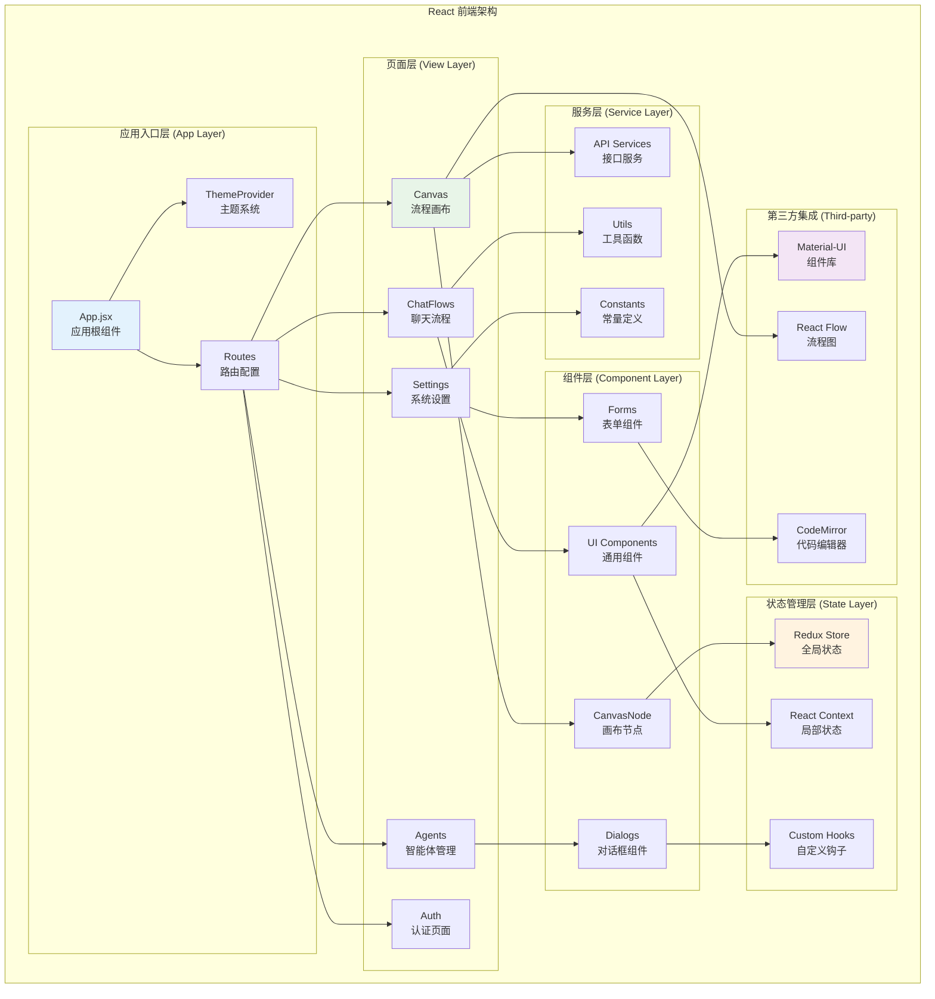
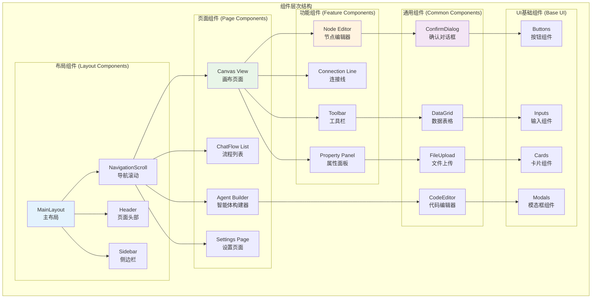
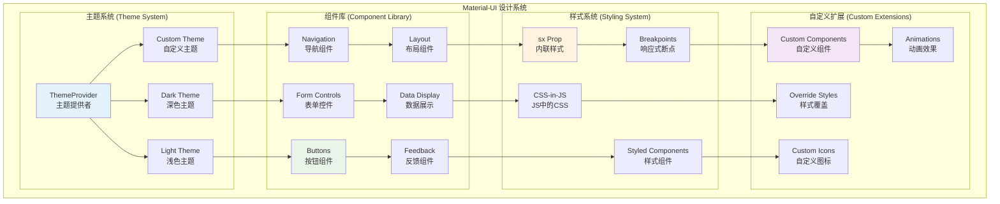
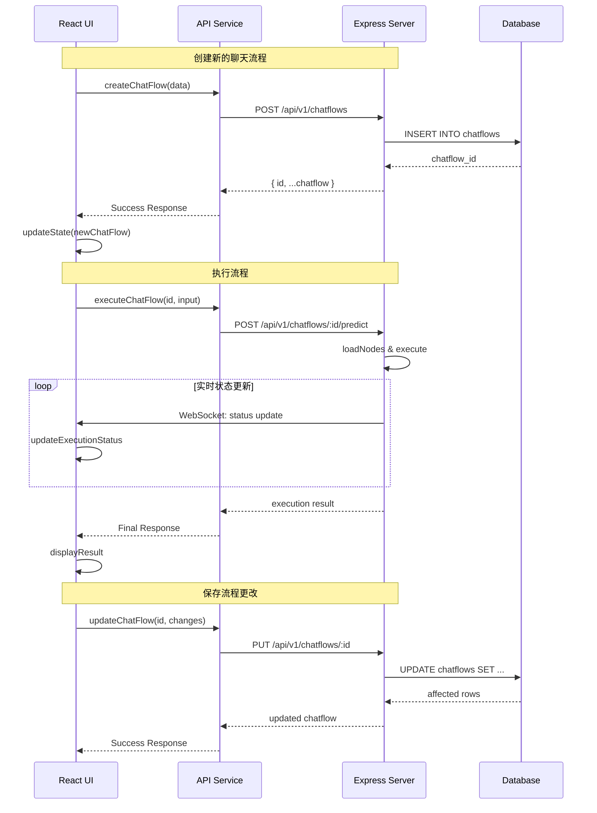

# Flowise 前端开发者指南

> **文档类型**: 前端开发者视角分析  
> **技术栈**: React 18 + Material-UI + Redux + React Flow  
> **更新日期**: 2025年10月11日

## 📋 目录

1. [前端架构概览](#前端架构概览)
2. [组件系统设计](#组件系统设计)
3. [状态管理机制](#状态管理机制)
4. [路由和导航](#路由和导航)
5. [UI/UX 设计系统](#uiux-设计系统)
6. [可视化画布实现](#可视化画布实现)
7. [API 交互模式](#api-交互模式)
8. [开发工具和流程](#开发工具和流程)

## 前端架构概览



**架构特点**:
- **组件化设计**: 高度模块化的React组件架构
- **单向数据流**: Redux管理全局状态，Context处理局部状态
- **响应式设计**: Material-UI提供一致的视觉体验
- **插件化视图**: 可视化画布支持动态节点渲染

## 组件系统设计



**组件设计原则**:
- **单一职责**: 每个组件专注于特定功能
- **可复用性**: 通用组件支持多场景使用
- **组合优于继承**: 通过组合构建复杂组件
- **Props接口标准化**: 统一的Props设计模式

## 状态管理机制

```mermaid
graph TB
    subgraph "状态管理架构"
        subgraph "全局状态 (Redux)"
            STORE[Redux Store<br/>中央状态存储]
            REDUCER[Reducers<br/>状态变更器]
            ACTIONS[Actions<br/>动作定义]
            MIDDLEWARE[Middleware<br/>中间件]
        end
        
        subgraph "局部状态 (Context)"
            FLOW_CONTEXT[FlowContext<br/>流程上下文]
            AUTH_CONTEXT[AuthContext<br/>认证上下文]
            THEME_CONTEXT[ThemeContext<br/>主题上下文]
        end
        
        subgraph "组件状态 (Component State)"
            USESTATE[useState<br/>本地状态]
            USEEFFECT[useEffect<br/>副作用处理]
            USEREDUCER[useReducer<br/>复杂状态]
            CUSTOM_HOOKS[Custom Hooks<br/>自定义钩子]
        end
        
        subgraph "持久化 (Persistence)"
            LOCAL_STORAGE[LocalStorage<br/>本地存储]
            SESSION_STORAGE[SessionStorage<br/>会话存储]
            INDEXEDDB[IndexedDB<br/>客户端数据库]
        end
        
        subgraph "状态同步 (Synchronization)"
            WEBSOCKET[WebSocket<br/>实时通信]
            POLLING[Polling<br/>轮询更新]
            SSE[Server-Sent Events<br/>服务器推送]
        end
    end
    
    STORE --> REDUCER
    REDUCER --> ACTIONS
    ACTIONS --> MIDDLEWARE
    
    MIDDLEWARE --> FLOW_CONTEXT
    FLOW_CONTEXT --> AUTH_CONTEXT
    AUTH_CONTEXT --> THEME_CONTEXT
    
    THEME_CONTEXT --> USESTATE
    USESTATE --> USEEFFECT
    USEEFFECT --> USEREDUCER
    USEREDUCER --> CUSTOM_HOOKS
    
    CUSTOM_HOOKS --> LOCAL_STORAGE
    LOCAL_STORAGE --> SESSION_STORAGE
    SESSION_STORAGE --> INDEXEDDB
    
    INDEXEDDB --> WEBSOCKET
    WEBSOCKET --> POLLING
    POLLING --> SSE
    
    style STORE fill:#e3f2fd
    style FLOW_CONTEXT fill:#e8f5e8
    style USESTATE fill:#fff3e0
    style WEBSOCKET fill:#f3e5f5
```



**状态管理策略**:

### Redux 全局状态
```javascript
// 典型的状态结构
{
  customization: {
    theme: 'light',
    fontFamily: 'Roboto',
    borderRadius: 12
  },
  canvas: {
    nodes: [],
    edges: [],
    isDirty: false
  },
  auth: {
    user: null,
    token: null,
    isAuthenticated: false
  }
}
```

### Context 局部状态
- **FlowContext**: 管理画布流程相关状态
- **AuthContext**: 处理用户认证状态
- **ThemeContext**: 控制主题和UI定制

## 路由和导航

```mermaid
graph TB
    subgraph "路由架构"
        subgraph "主路由 (Main Routes)"
            ROOT[/ Root<br/>根路由]
            AUTH_ROUTE[/auth/*<br/>认证路由]
            MAIN_ROUTE[/main/*<br/>主应用路由]
        end
        
        subgraph "认证路由 (Auth Routes)"
            LOGIN[/auth/login<br/>登录页面]
            REGISTER[/auth/register<br/>注册页面]
            FORGOT[/auth/forgot<br/>忘记密码]
        end
        
        subgraph "功能路由 (Feature Routes)"
            CHATFLOWS[/chatflows<br/>聊天流程]
            AGENTFLOWS[/agentflows<br/>智能体流程]
            CANVAS[/canvas/:id<br/>画布编辑器]
            MARKETPLACES[/marketplaces<br/>模板市场]
            TOOLS[/tools<br/>工具管理]
            CREDENTIALS[/credentials<br/>凭据管理]
        end
        
        subgraph "管理路由 (Admin Routes)"
            USERS[/users<br/>用户管理]
            ROLES[/roles<br/>角色管理]
            SETTINGS[/settings<br/>系统设置]
            LOGS[/logs<br/>系统日志]
        end
        
        subgraph "路由守卫 (Route Guards)"
            AUTH_GUARD[AuthGuard<br/>认证守卫]
            ROLE_GUARD[RoleGuard<br/>角色守卫]
            PERMISSION_GUARD[PermissionGuard<br/>权限守卫]
        end
    end
    
    ROOT --> AUTH_ROUTE
    ROOT --> MAIN_ROUTE
    
    AUTH_ROUTE --> LOGIN
    AUTH_ROUTE --> REGISTER
    AUTH_ROUTE --> FORGOT
    
    MAIN_ROUTE --> CHATFLOWS
    MAIN_ROUTE --> AGENTFLOWS
    MAIN_ROUTE --> CANVAS
    MAIN_ROUTE --> MARKETPLACES
    MAIN_ROUTE --> TOOLS
    MAIN_ROUTE --> CREDENTIALS
    
    MAIN_ROUTE --> USERS
    MAIN_ROUTE --> ROLES
    MAIN_ROUTE --> SETTINGS
    MAIN_ROUTE --> LOGS
    
    MAIN_ROUTE --> AUTH_GUARD
    USERS --> ROLE_GUARD
    SETTINGS --> PERMISSION_GUARD
    
    style ROOT fill:#e3f2fd
    style CANVAS fill:#e8f5e8
    style AUTH_GUARD fill:#fff3e0
```

**路由特性**:
- **嵌套路由**: 支持多层级路由结构
- **动态路由**: 支持参数化路由匹配
- **路由守卫**: 基于角色和权限的访问控制
- **懒加载**: 按需加载页面组件优化性能

## UI/UX 设计系统



**设计系统特点**:
- **一致性**: 统一的视觉风格和交互模式
- **可定制**: 支持主题定制和品牌适配
- **响应式**: 适配不同屏幕尺寸和设备
- **可访问性**: 遵循WCAG无障碍设计标准

## 可视化画布实现

```mermaid
graph TB
    subgraph "React Flow 画布架构"
        subgraph "画布核心 (Canvas Core)"
            REACTFLOW[ReactFlow<br/>流程图核心]
            NODES_STATE[useNodesState<br/>节点状态]
            EDGES_STATE[useEdgesState<br/>边状态]
            VIEWPORT[Viewport<br/>视窗控制]
        end
        
        subgraph "节点系统 (Node System)"
            CANVAS_NODE[CanvasNode<br/>画布节点组件]
            NODE_TYPES[Node Types<br/>节点类型定义]
            NODE_DATA[Node Data<br/>节点数据结构]
            NODE_HANDLES[Node Handles<br/>连接点]
        end
        
        subgraph "连接系统 (Edge System)"
            BUTTON_EDGE[ButtonEdge<br/>按钮边组件]
            EDGE_TYPES[Edge Types<br/>边类型定义]
            CONNECTION_LINE[ConnectionLine<br/>连接线]
            EDGE_VALIDATION[Edge Validation<br/>连接验证]
        end
        
        subgraph "交互控制 (Interaction Controls)"
            DRAG_DROP[Drag & Drop<br/>拖拽功能]
            SELECTION[Selection<br/>选择功能]
            ZOOM_PAN[Zoom & Pan<br/>缩放平移]
            MINIMAP[MiniMap<br/>缩略图]
        end
        
        subgraph "工具面板 (Tool Panels)"
            ADD_NODES[AddNodes<br/>添加节点面板]
            PROPERTY_PANEL[Property Panel<br/>属性编辑面板]
            TOOLBAR[Toolbar<br/>工具栏]
            CONTEXT_MENU[Context Menu<br/>右键菜单]
        end
        
        subgraph "状态同步 (State Sync)"
            FLOW_CONTEXT[Flow Context<br/>流程上下文]
            AUTO_SAVE[Auto Save<br/>自动保存]
            UNDO_REDO[Undo/Redo<br/>撤销重做]
            DIRTY_STATE[Dirty State<br/>脏数据状态]
        end
    end
    
    REACTFLOW --> NODES_STATE
    REACTFLOW --> EDGES_STATE
    REACTFLOW --> VIEWPORT
    
    NODES_STATE --> CANVAS_NODE
    CANVAS_NODE --> NODE_TYPES
    NODE_TYPES --> NODE_DATA
    NODE_DATA --> NODE_HANDLES
    
    EDGES_STATE --> BUTTON_EDGE
    BUTTON_EDGE --> EDGE_TYPES
    EDGE_TYPES --> CONNECTION_LINE
    CONNECTION_LINE --> EDGE_VALIDATION
    
    VIEWPORT --> DRAG_DROP
    DRAG_DROP --> SELECTION
    SELECTION --> ZOOM_PAN
    ZOOM_PAN --> MINIMAP
    
    MINIMAP --> ADD_NODES
    ADD_NODES --> PROPERTY_PANEL
    PROPERTY_PANEL --> TOOLBAR
    TOOLBAR --> CONTEXT_MENU
    
    CONTEXT_MENU --> FLOW_CONTEXT
    FLOW_CONTEXT --> AUTO_SAVE
    AUTO_SAVE --> UNDO_REDO
    UNDO_REDO --> DIRTY_STATE
    
    style REACTFLOW fill:#e3f2fd
    style CANVAS_NODE fill:#e8f5e8
    style DRAG_DROP fill:#fff3e0
    style FLOW_CONTEXT fill:#f3e5f5
```



**画布实现要点**:

### 1. 节点渲染机制
```jsx
// 自定义节点组件
const CanvasNode = ({ data, selected }) => {
  return (
    <div className={`canvas-node ${selected ? 'selected' : ''}`}>
      <Handle type="target" position={Position.Left} />
      <div className="node-content">
        <NodeIcon type={data.type} />
        <span>{data.label}</span>
      </div>
      <Handle type="source" position={Position.Right} />
    </div>
  )
}
```

### 2. 连接验证逻辑
```jsx
// 连接验证函数
const isValidConnection = (connection) => {
  const sourceNode = getNode(connection.source)
  const targetNode = getNode(connection.target)
  
  // 检查类型兼容性
  return isCompatibleTypes(sourceNode.data.type, targetNode.data.type)
}
```

## API 交互模式



**API 交互特点**:
- **RESTful设计**: 标准的REST API接口
- **实时通信**: WebSocket支持状态实时更新
- **错误处理**: 统一的错误处理和用户反馈
- **缓存策略**: 客户端缓存优化性能

## 开发工具和流程

```mermaid
graph TB
    subgraph "前端开发工具链"
        subgraph "构建工具 (Build Tools)"
            VITE[Vite<br/>构建工具]
            CRACO[CRACO<br/>配置覆盖]
            BABEL[Babel<br/>代码转换]
            WEBPACK[Webpack<br/>模块打包]
        end
        
        subgraph "开发工具 (Dev Tools)"
            REACT_DEVTOOLS[React DevTools<br/>React调试]
            REDUX_DEVTOOLS[Redux DevTools<br/>状态调试]
            BROWSER_DEVTOOLS[Browser DevTools<br/>浏览器调试]
            HOT_RELOAD[Hot Reload<br/>热重载]
        end
        
        subgraph "代码质量 (Code Quality)"
            ESLINT[ESLint<br/>代码检查]
            PRETTIER[Prettier<br/>代码格式化]
            HUSKY[Husky<br/>Git钩子]
            LINT_STAGED[Lint Staged<br/>暂存区检查]
        end
        
        subgraph "测试工具 (Testing Tools)"
            JEST[Jest<br/>单元测试]
            RTL[React Testing Library<br/>组件测试]
            CYPRESS[Cypress<br/>E2E测试]
            STORYBOOK[Storybook<br/>组件文档]
        end
        
        subgraph "性能优化 (Performance)"
            LAZY_LOADING[Lazy Loading<br/>懒加载]
            CODE_SPLITTING[Code Splitting<br/>代码分割]
            BUNDLE_ANALYZER[Bundle Analyzer<br/>打包分析]
            PROFILER[React Profiler<br/>性能分析]
        end
    end
    
    VITE --> CRACO
    CRACO --> BABEL
    BABEL --> WEBPACK
    
    WEBPACK --> REACT_DEVTOOLS
    REACT_DEVTOOLS --> REDUX_DEVTOOLS
    REDUX_DEVTOOLS --> BROWSER_DEVTOOLS
    BROWSER_DEVTOOLS --> HOT_RELOAD
    
    HOT_RELOAD --> ESLINT
    ESLINT --> PRETTIER
    PRETTIER --> HUSKY
    HUSKY --> LINT_STAGED
    
    LINT_STAGED --> JEST
    JEST --> RTL
    RTL --> CYPRESS
    CYPRESS --> STORYBOOK
    
    STORYBOOK --> LAZY_LOADING
    LAZY_LOADING --> CODE_SPLITTING
    CODE_SPLITTING --> BUNDLE_ANALYZER
    BUNDLE_ANALYZER --> PROFILER
    
    style VITE fill:#e3f2fd
    style REACT_DEVTOOLS fill:#e8f5e8
    style ESLINT fill:#fff3e0
    style JEST fill:#f3e5f5
```



### 开发脚本
```json
{
  "scripts": {
    "dev": "vite",
    "build": "vite build",
    "preview": "vite preview",
    "lint": "eslint src --ext ts,tsx",
    "lint:fix": "eslint src --ext ts,tsx --fix",
    "test": "jest",
    "test:watch": "jest --watch",
    "storybook": "start-storybook -p 6006"
  }
}
```

### 开发最佳实践

#### 1. 组件开发规范
```jsx
// 组件模板
import React, { memo } from 'react'
import PropTypes from 'prop-types'
import { styled } from '@mui/material/styles'

const StyledComponent = styled('div')(({ theme }) => ({
  // 样式定义
}))

const MyComponent = memo(({ prop1, prop2, onAction }) => {
  // 组件逻辑
  return (
    <StyledComponent>
      {/* JSX */}
    </StyledComponent>
  )
})

MyComponent.propTypes = {
  prop1: PropTypes.string.isRequired,
  prop2: PropTypes.number,
  onAction: PropTypes.func
}

export default MyComponent
```

#### 2. Hooks 使用模式
```jsx
// 自定义Hook示例
const useCanvas = () => {
  const [nodes, setNodes, onNodesChange] = useNodesState([])
  const [edges, setEdges, onEdgesChange] = useEdgesState([])
  const [isDirty, setIsDirty] = useState(false)
  
  const addNode = useCallback((nodeData) => {
    const newNode = createNode(nodeData)
    setNodes(prev => [...prev, newNode])
    setIsDirty(true)
  }, [setNodes])
  
  return {
    nodes,
    edges,
    isDirty,
    onNodesChange,
    onEdgesChange,
    addNode
  }
}
```

#### 3. 错误边界处理
```jsx
class ErrorBoundary extends React.Component {
  constructor(props) {
    super(props)
    this.state = { hasError: false }
  }
  
  static getDerivedStateFromError(error) {
    return { hasError: true }
  }
  
  componentDidCatch(error, errorInfo) {
    console.error('Error caught by boundary:', error, errorInfo)
  }
  
  render() {
    if (this.state.hasError) {
      return <ErrorFallback />
    }
    
    return this.props.children
  }
}
```

## 性能优化策略

### 1. 渲染优化
- **React.memo**: 防止不必要的重新渲染
- **useMemo/useCallback**: 缓存计算结果和函数
- **虚拟化**: 长列表虚拟滚动
- **懒加载**: 按需加载组件和资源

### 2. 状态优化
- **状态分割**: 避免大型全局状态对象
- **选择性订阅**: 只订阅必要的状态片段
- **异步状态**: 使用React Query管理服务器状态
- **状态标准化**: 扁平化状态结构

### 3. 包大小优化
- **Tree Shaking**: 移除未使用的代码
- **动态导入**: 路由级别的代码分割
- **外部化依赖**: CDN加载大型依赖
- **压缩优化**: Gzip/Brotli压缩

## 调试和故障排除

### 常见问题解决

#### 1. 状态更新问题
```jsx
// ❌ 错误: 直接修改状态
const handleUpdate = () => {
  nodes[0].data.label = 'new label' // 错误!
  setNodes(nodes)
}

// ✅ 正确: 创建新的状态对象
const handleUpdate = () => {
  setNodes(prev => prev.map(node => 
    node.id === targetId 
      ? { ...node, data: { ...node.data, label: 'new label' } }
      : node
  ))
}
```

#### 2. 内存泄漏预防
```jsx
useEffect(() => {
  const subscription = someService.subscribe(data => {
    // 处理数据
  })
  
  // 清理订阅
  return () => {
    subscription.unsubscribe()
  }
}, [])
```

## 总结

Flowise的前端架构展现了现代React应用的最佳实践：

### 🎯 **核心优势**
- **技术栈现代化**: React 18 + Material-UI + Redux
- **组件化设计**: 高度模块化和可复用
- **用户体验优秀**: 流畅的拖拽式界面
- **开发效率高**: 完善的工具链和开发流程

### 🚀 **适合场景**
- 需要可视化流程编辑的AI应用
- 企业级的低代码平台开发
- 复杂的单页应用(SPA)项目
- 需要实时协作的在线工具

### 💡 **学习价值**
- React Flow的高级应用模式
- Material-UI的深度定制技巧
- 复杂状态管理的实践经验
- 现代前端工程化的完整方案

对于前端开发者来说，Flowise项目提供了丰富的学习素材和最佳实践参考，特别是在可视化编辑器和复杂交互界面的实现方面。