# Flowise Nodes 架构分析

本文档详细分析了 Flowise 项目中 nodes 目录的结构和组件架构。

## 总体架构概览

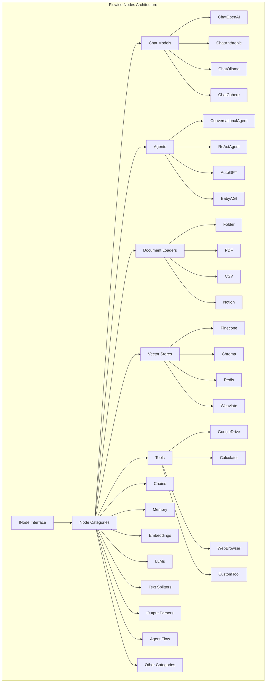

上图展示了 Flowise 节点系统的整体架构。系统以统一的 INode 接口为核心，下辖15个主要类别的节点。每个类别都包含多种具体实现，如聊天模型类别包含 OpenAI、Anthropic、Ollama 等不同供应商的模型，文档加载器支持多种文件格式和数据源。这种分层设计使得系统具有良好的可扩展性和模块化特性。

## 节点分类详细结构

### 1. Agent Flow (代理流程)
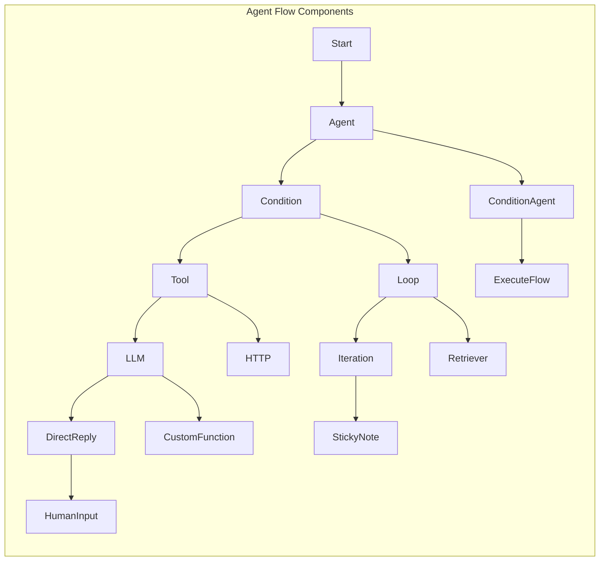

该图描述了 Agent Flow 的组件结构和执行流程。从 Start 节点开始，可以分支到不同的处理节点：Agent 进行智能决策，Condition 实现条件判断，Tool 执行具体工具调用，LLM 处理语言模型推理。系统支持循环(Loop)和迭代(Iteration)逻辑，可以进行 HTTP 调用、自定义函数执行、人工干预等复杂操作，为构建复杂的AI代理工作流提供了完整的基础组件。

### 2. Agents (智能代理)
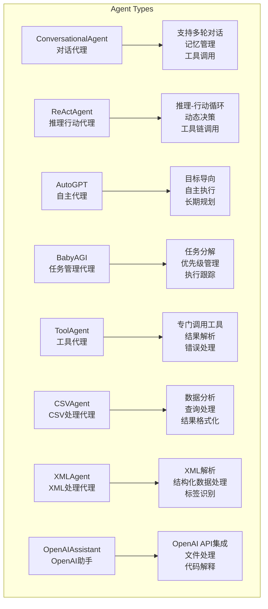

此图展示了 Flowise 中不同类型的智能代理及其核心能力。ConversationalAgent 专注于对话交互和记忆管理；ReActAgent 实现"推理-行动"循环，能够动态决策和调用工具链；AutoGPT 具备自主执行能力和长期规划；BabyAGI 专门进行任务分解和管理。还有专门处理特定数据格式的代理，如 CSVAgent 和 XMLAgent，以及集成外部服务的 OpenAIAssistant。每种代理都针对特定的使用场景进行了优化。

### 3. Chat Models (聊天模型)
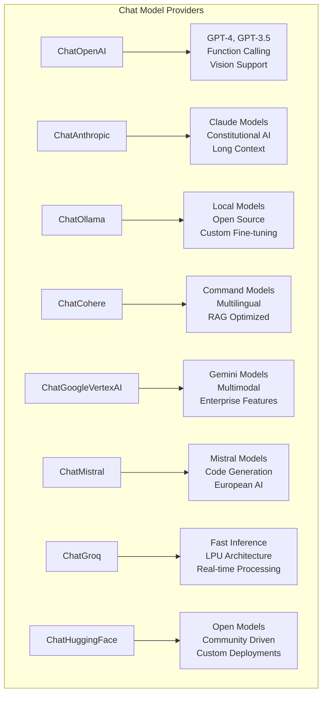

该图展示了 Flowise 支持的各种聊天模型提供商及其特色功能。OpenAI 提供 GPT 系列模型，支持函数调用和视觉能力；Anthropic 的 Claude 模型以安全性和长上下文著称；Ollama 专注于本地部署的开源模型；Cohere 在多语言和 RAG 应用方面表现优异。Google Vertex AI 提供多模态 Gemini 模型，Mistral 在代码生成方面有优势，Groq 以快速推理能力见长，HuggingFace 则提供开源社区驱动的模型选择。这种多供应商支持为用户提供了灵活的模型选择。

### 4. Document Loaders (文档加载器)
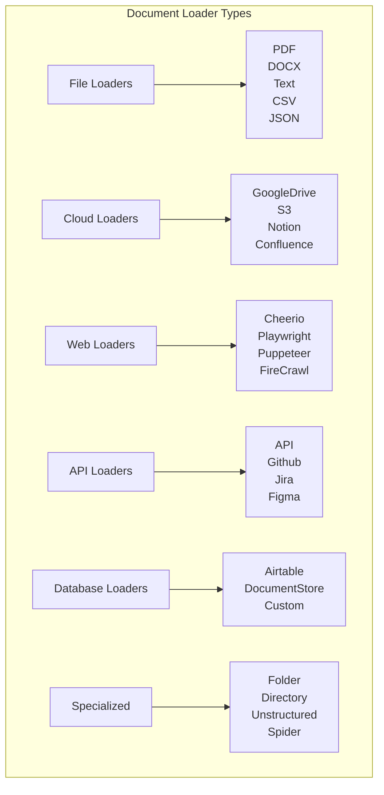

该分类图展示了 Flowise 强大的文档加载能力，涵盖了6大类数据源。File Loaders 处理常见文件格式如 PDF、Word 文档等；Cloud Loaders 连接云存储和协作平台；Web Loaders 使用不同的网页抓取技术获取在线内容；API Loaders 通过 API 接口获取结构化数据；Database Loaders 处理数据库和表格数据；Specialized 类别提供特殊场景的加载能力。这种全面的数据源支持使得 Flowise 能够处理企业中各种形式的知识和数据。

### 5. Vector Stores (向量存储)
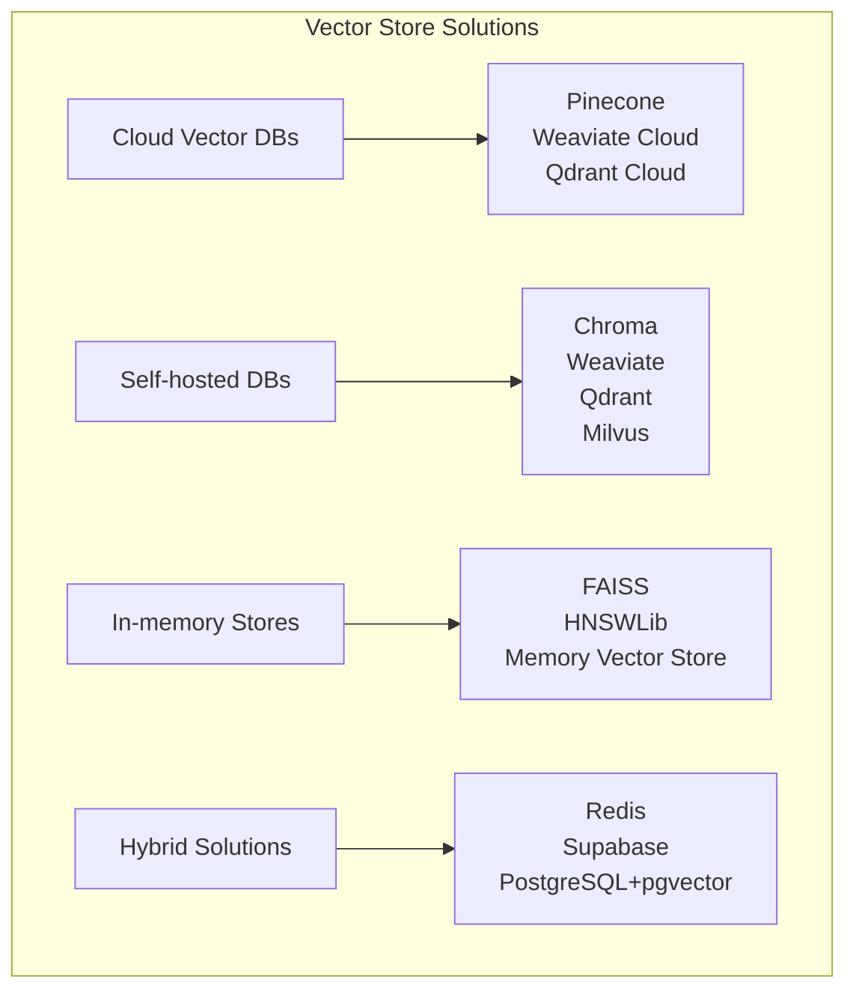

此图分类展示了 Flowise 支持的向量存储解决方案。Cloud Vector DBs 如 Pinecone 提供托管的向量数据库服务，无需维护基础设施；Self-hosted DBs 如 Chroma 和 Weaviate 可以在本地部署，提供更多控制权；In-memory Stores 如 FAISS 适合快速原型开发和小规模应用；Hybrid Solutions 结合了传统数据库和向量搜索能力，如支持 pgvector 扩展的 PostgreSQL。这种多样化的选择满足了从小规模实验到大规模生产部署的不同需求。

### 6. Tools (工具)
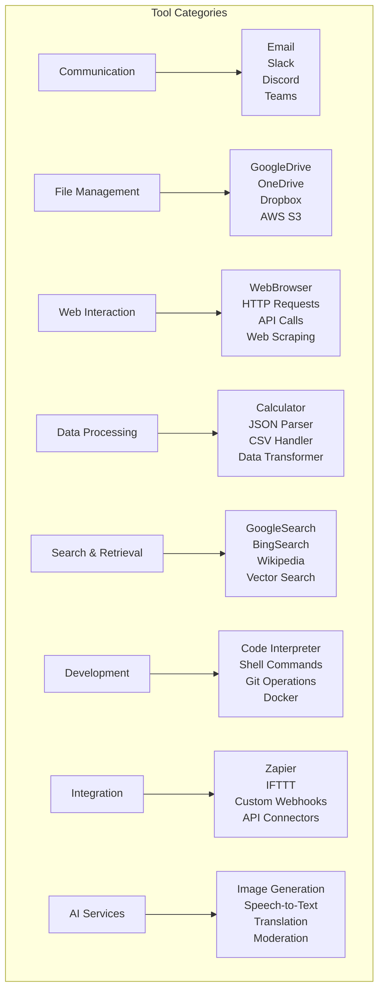

该工具分类图展示了 Flowise 丰富的工具生态系统，涵盖了8个主要类别。Communication 工具支持邮件和即时通讯集成；File Management 连接各种云存储服务；Web Interaction 提供网页交互和API调用能力；Data Processing 处理各种数据格式和计算任务；Search & Retrieval 集成多种搜索引擎和检索服务；Development 工具支持代码执行和开发操作；Integration 工具连接第三方自动化平台；AI Services 提供图像生成、语音识别等AI能力。这些工具使AI代理能够与外部世界进行丰富的交互。

## 核心接口结构

### INode 接口
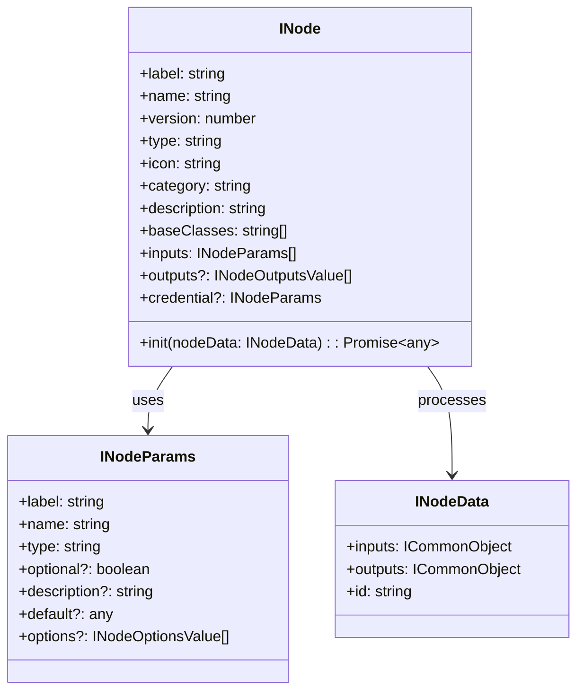

此类图展示了 Flowise 节点系统的核心接口设计。INode 是所有节点必须实现的标准接口，定义了节点的基本属性（标签、名称、版本、类型等）和行为（init 方法）。INodeParams 定义了节点的输入参数结构，支持类型检查、默认值和选项配置。INodeData 封装了节点的运行时数据，包括输入输出和节点ID。这种标准化的接口设计确保了所有节点的一致性，使得系统能够统一处理不同类型的节点。

## 节点生命周期

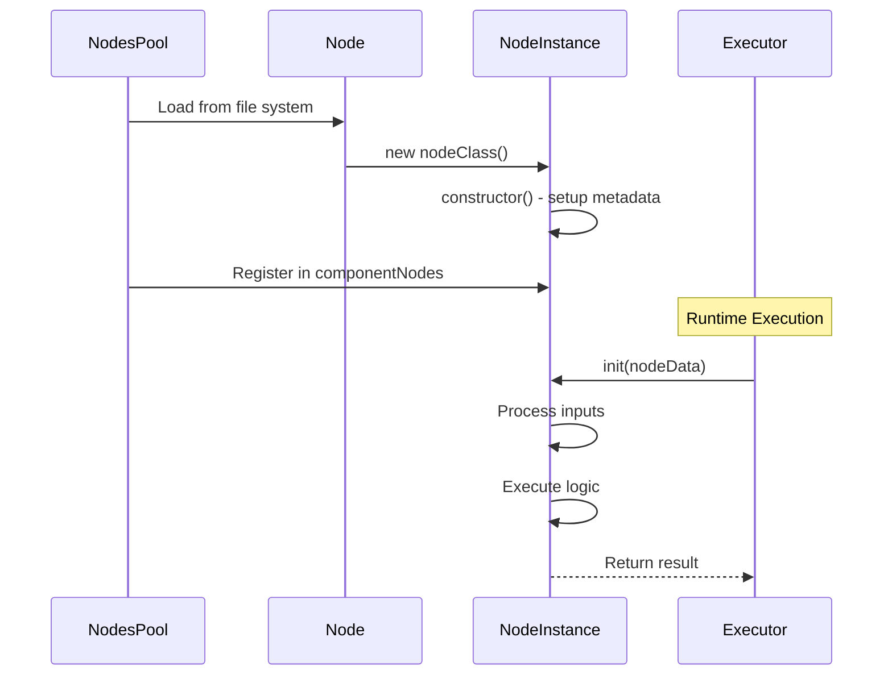

该时序图描述了节点的完整生命周期，从系统启动到运行时执行的全过程。首先，NodesPool 在系统启动时扫描文件系统并加载节点文件，创建节点实例并在构造函数中初始化元数据，然后将节点注册到组件池中。在运行时，当需要执行特定节点时，Executor 调用节点的 init 方法，节点处理输入数据、执行核心逻辑，最后返回结果。这种清晰的生命周期管理确保了节点的正确初始化和执行。

## 数据流架构

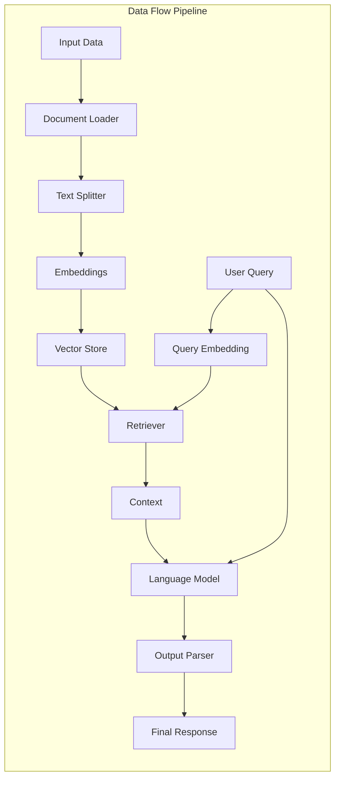

此数据流图展示了典型的 RAG（检索增强生成）应用的数据处理流水线。首先，原始输入数据通过文档加载器读取，经过文本分割器切分成合适的块，然后通过嵌入模型转换为向量并存储到向量数据库中。在查询阶段，用户查询同样被转换为向量，通过检索器在向量存储中查找相关内容作为上下文，与用户查询一起输入到语言模型中生成回答，最后通过输出解析器格式化响应。这个流程体现了 Flowise 如何通过节点组合构建复杂的AI应用。

## 扩展性设计

### 插件架构
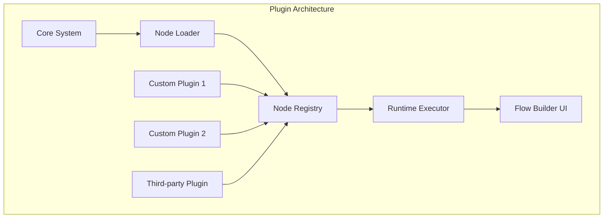

该插件架构图展示了 Flowise 的可扩展性设计。核心系统通过节点加载器扫描和加载各种节点，无论是内置节点还是自定义插件，都统一注册到节点注册表中。这种设计允许开发者轻松添加自定义节点和第三方插件，扩展系统功能。注册表中的所有节点都可以被运行时执行器调用，并在流程构建器UI中可视化展示。这种插件化架构使得 Flowise 具有强大的扩展能力，能够适应不同用户的特殊需求。

## 配置与部署

### 节点发现机制
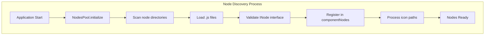

此流程图详细展示了 Flowise 的节点发现和初始化机制。当应用启动时，NodesPool 开始初始化过程，首先扫描指定的节点目录，找到所有的 JavaScript 文件。然后逐个加载这些文件，验证它们是否实现了 INode 接口。通过验证的节点会被注册到组件节点池中，同时处理节点图标的路径设置。整个过程完成后，所有节点就准备就绪，可以在系统中使用。这种自动化的发现机制简化了节点的部署和管理。

## 性能优化策略

1. **延迟加载**: 节点在首次使用时才实例化具体功能
2. **缓存机制**: 向量存储和模型调用结果缓存
3. **连接池**: 数据库和API连接复用
4. **批处理**: 文档处理和向量化批量操作
5. **异步处理**: 非阻塞的节点执行流程

## 监控与调试

### 执行追踪
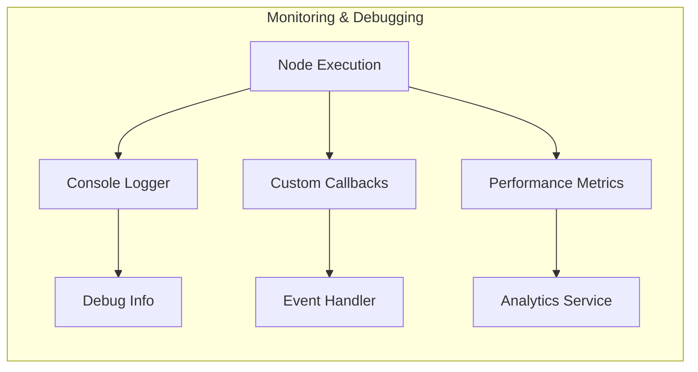

该监控调试图展示了 Flowise 的可观测性设计。当节点执行时，系统通过多个渠道收集信息：Console Logger 记录详细的调试信息，便于开发者排查问题；Custom Callbacks 允许用户自定义事件处理逻辑，实现个性化的监控需求；Performance Metrics 收集性能数据用于分析优化。这些信息分别流向调试信息展示、事件处理器和分析服务，为系统的监控、调试和性能优化提供全面的支持。

## 安全考虑

1. **输入验证**: 所有节点输入进行严格验证
2. **路径遍历防护**: 文件操作路径检查
3. **凭证管理**: 安全的API密钥存储和传递
4. **权限控制**: 节点执行权限限制
5. **内容审核**: 输入输出内容安全检查

## 总结

Flowise 的节点架构采用了高度模块化的设计，通过统一的 INode 接口实现了各种功能组件的标准化。这种设计提供了：

- **可扩展性**: 易于添加新的节点类型和功能
- **可维护性**: 清晰的分层架构和职责分离
- **可重用性**: 节点可以在不同的流程中重复使用
- **灵活性**: 支持复杂的AI工作流编排

该架构为构建复杂的AI应用提供了强大的基础设施支持。
d