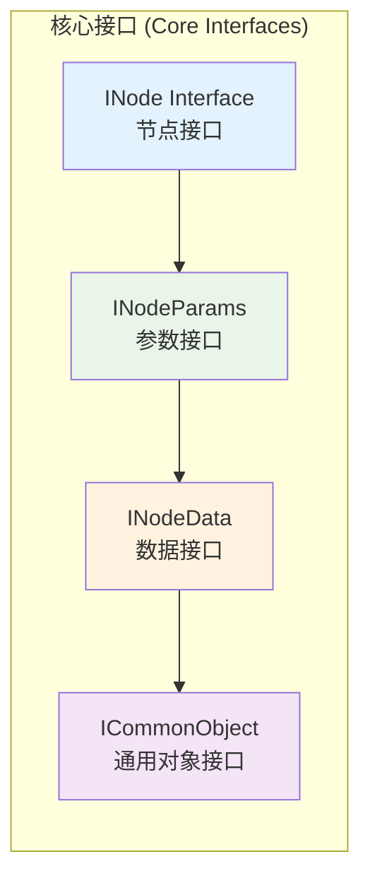
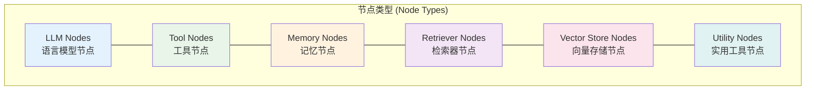
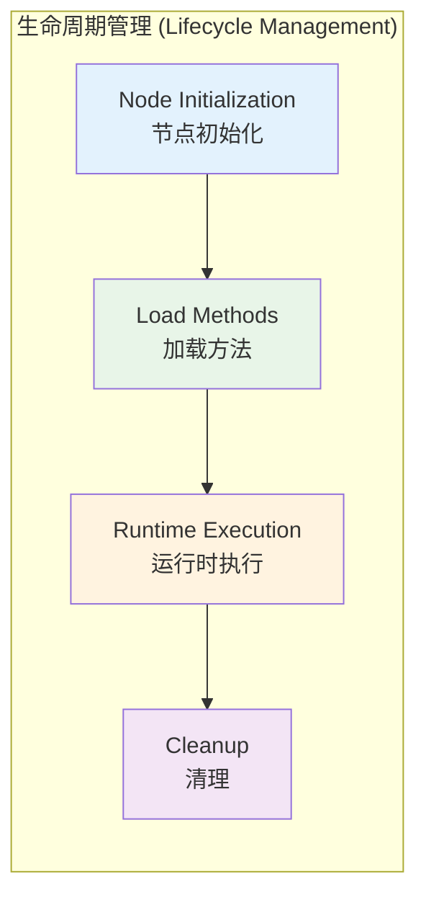
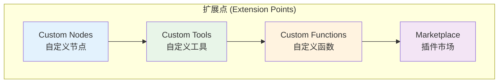

# Flowise 插件开发者指南

> **文档类型**: 插件开发者视角分析  
> **技术栈**: TypeScript + LangChain + 组件系统 + 插件架构  
> **更新日期**: 2025年10月11日

## 📋 目录

1. [插件系统架构](#插件系统架构)
2. [组件开发规范](#组件开发规范)
3. [插件开发流程](#插件开发流程)
4. [扩展机制设计](#扩展机制设计)
5. [自定义节点开发](#自定义节点开发)
6. [工具和连接器开发](#工具和连接器开发)
7. [测试与发布](#测试与发布)
8. [最佳实践](#最佳实践)

## 插件系统架构

### 核心接口层


核心接口层定义了插件系统的基础规范。INode 是所有节点的基础接口，定义了节点的基本属性和行为；INodeParams 规范了参数的结构和验证规则；INodeData 封装了节点的运行时数据；ICommonObject 提供了通用的对象类型定义。这种分层设计确保了系统的类型安全和接口一致性。

### 节点类型分类


节点类型分类展示了 Flowise 支持的六大类节点类型。每种类型都有其特定的功能和应用场景：LLM 节点处理语言模型调用，Tool 节点提供外部工具集成，Memory 节点管理会话记忆，Retriever 节点实现信息检索，Vector Store 节点处理向量存储，Utility 节点提供通用工具功能。

### 插件生命周期


插件生命周期管理确保了节点从初始化到清理的完整流程。节点初始化阶段设置基本属性和配置，加载方法阶段处理动态内容和依赖，运行时执行阶段处理实际的业务逻辑，清理阶段释放资源和关闭连接。这种标准化的生命周期管理保证了系统的稳定性和资源的有效利用。

### 扩展点架构


扩展点架构提供了多层次的系统扩展能力。自定义节点允许开发者创建全新的节点类型，自定义工具支持集成外部服务和API，自定义函数提供JavaScript代码执行能力，插件市场则为插件的分发和管理提供了统一平台。这种分层的扩展机制满足了不同复杂度的定制需求。

**插件系统特点**:
- **接口标准化**: 统一的INode接口规范
- **动态加载**: 运行时动态加载插件  
- **类型安全**: TypeScript强类型支持
- **扩展性强**: 多种扩展点支持不同类型的插件

## 组件开发规范


该组件开发规范图展示了构建高质量 Flowise 插件的完整标准体系。从文件结构的组织到接口实现的规范，从参数定义到类型系统的设计，从国际化支持到测试规范的制定，每个环节都有明确的要求。这种标准化的开发规范确保了插件的质量、可维护性和用户体验的一致性，为开发者提供了清晰的指导框架。

**组件开发标准实现**:

### 1. 基础组件模板
```typescript
// components/nodes/category/YourNode/YourNode.ts
import { ICommonObject, INode, INodeData, INodeParams, INodeOutputsValue } from '../../../src/Interface'
import { getBaseClasses, getCredentialData, getCredentialParam } from '../../../src/utils'

class YourNode_Category implements INode {
    // 基础属性
    label: string
    name: string
    version: number
    description: string
    type: string
    icon: string
    category: string
    baseClasses: string[]
    tags?: string[]
    
    // 可选属性
    credential?: INodeParams
    inputs?: INodeParams[]
    outputs?: INodeOutputsValue[]
    
    // 动态方法
    loadMethods?: {
        [key: string]: (nodeData: INodeData, options?: ICommonObject) => Promise<INodeOptionsValue[]>
    }

    constructor() {
        // 基础信息配置
        this.label = 'Your Node Name'
        this.name = 'yourNodeName'
        this.version = 1.0
        this.type = 'YourNodeType'
        this.icon = 'yournode.svg'
        this.category = 'Your Category'
        this.description = 'Describe what your node does'
        this.baseClasses = [this.type, 'BaseClass']
        this.tags = ['tag1', 'tag2']
        
        // 凭证配置
        this.credential = {
            label: 'API Credential',
            name: 'credential',
            type: 'string',
            credentialNames: ['yourApiCredential']
        }
        
        // 输入参数配置
        this.inputs = [
            {
                label: 'Input Parameter',
                name: 'inputParam',
                type: 'string',
                description: 'Description of the input parameter',
                optional: false,
                acceptVariable: true
            },
            {
                label: 'Optional Parameter',
                name: 'optionalParam',
                type: 'number',
                optional: true,
                default: 100
            },
            {
                label: 'Select Options',
                name: 'selectParam',
                type: 'options',
                options: [
                    { label: 'Option 1', name: 'option1' },
                    { label: 'Option 2', name: 'option2' }
                ]
            },
            {
                label: 'Dynamic Options',
                name: 'dynamicParam',
                type: 'asyncOptions',
                loadMethod: 'listDynamicOptions'
            }
        ]
        
        // 输出配置
        this.outputs = [
            {
                label: 'Output',
                name: 'output',
                baseClasses: ['string', 'json']
            }
        ]
    }

    // 动态加载方法
    loadMethods = {
        async listDynamicOptions(nodeData: INodeData, options: ICommonObject): Promise<INodeOptionsValue[]> {
            try {
                // 获取凭证信息
                const credential = await getCredentialData(nodeData.credential ?? '', options)
                const apiKey = getCredentialParam('apiKey', credential, nodeData)
                
                // 基于凭证获取动态选项
                const response = await fetch('https://api.example.com/options', {
                    headers: { 'Authorization': `Bearer ${apiKey}` }
                })
                const data = await response.json()
                
                return data.map((item: any) => ({
                    label: item.name,
                    name: item.id,
                    description: item.description
                }))
            } catch (error) {
                console.error('Error loading dynamic options:', error)
                return []
            }
        }
    }

    // 初始化方法
    async init(nodeData: INodeData, input: string, options: ICommonObject): Promise<any> {
        try {
            // 获取输入参数
            const inputParam = nodeData.inputs?.inputParam as string
            const optionalParam = nodeData.inputs?.optionalParam as number || 100
            const selectParam = nodeData.inputs?.selectParam as string
            
            // 获取凭证信息
            const credential = await getCredentialData(nodeData.credential ?? '', options)
            const apiKey = getCredentialParam('apiKey', credential, nodeData)
            
            // 初始化组件实例
            const instance = new YourNodeImplementation({
                apiKey,
                inputParam,
                optionalParam,
                selectParam
            })
            
            return instance
        } catch (error) {
            throw new Error(`Failed to initialize YourNode: ${error.message}`)
        }
    }

    // 运行方法（可选）
    async run(nodeData: INodeData, input: string, options: ICommonObject): Promise<string | ICommonObject> {
        try {
            const instance = await this.init(nodeData, input, options)
            const result = await instance.process(input)
            
            return {
                output: result,
                metadata: {
                    timestamp: new Date().toISOString(),
                    nodeId: nodeData.id
                }
            }
        } catch (error) {
            throw new Error(`Failed to run YourNode: ${error.message}`)
        }
    }
}

// 组件实现类
class YourNodeImplementation {
    private apiKey: string
    private config: any

    constructor(config: any) {
        this.apiKey = config.apiKey
        this.config = config
    }

    async process(input: string): Promise<any> {
        // 实现具体的处理逻辑
        const response = await fetch('https://api.example.com/process', {
            method: 'POST',
            headers: {
                'Authorization': `Bearer ${this.apiKey}`,
                'Content-Type': 'application/json'
            },
            body: JSON.stringify({
                input,
                config: this.config
            })
        })
        
        if (!response.ok) {
            throw new Error(`API request failed: ${response.statusText}`)
        }
        
        return await response.json()
    }
}

// 导出模块
module.exports = { nodeClass: YourNode_Category }
```

### 2. 凭证定义
```typescript
// credentials/YourApiCredential.credential.ts
import { INodeParams, INodeCredential } from '../Interface'

class YourApiCredential implements INodeCredential {
    label: string
    name: string
    version: number
    description: string
    inputs: INodeParams[]

    constructor() {
        this.label = 'Your API Credential'
        this.name = 'yourApiCredential'
        this.version = 1.0
        this.description = 'API credentials for Your Service'
        this.inputs = [
            {
                label: 'API Key',
                name: 'apiKey',
                type: 'password',
                description: 'API key from Your Service dashboard'
            },
            {
                label: 'Base URL',
                name: 'baseUrl',
                type: 'string',
                default: 'https://api.example.com',
                optional: true
            },
            {
                label: 'Timeout',
                name: 'timeout',
                type: 'number',
                default: 30000,
                optional: true,
                description: 'Request timeout in milliseconds'
            }
        ]
    }
}

module.exports = { credClass: YourApiCredential }
```

## 插件开发流程


该插件开发流程图展示了从概念到产品的完整开发周期，包含六个主要阶段。需求分析阶段确保对目标API和集成需求的充分理解；设计阶段制定技术方案和架构；实现阶段进行编码和文档编写；测试阶段确保质量和性能；发布阶段处理版本控制和部署；维护阶段提供持续的支持和更新。这种结构化的流程确保了插件开发的质量和效率。

## 扩展机制设计


该扩展机制设计图展示了 Flowise 插件系统的六大核心机制。插件加载机制负责发现、导入和管理插件生命周期；插件通信机制提供了事件驱动的交互方式；插件隔离机制确保插件之间的安全性和独立性；插件注册机制管理插件的元数据和版本兼容性；插件配置机制提供灵活的配置选项；插件监控机制确保系统的健康和性能。这种全面的扩展机制设计为插件生态系统提供了强大的基础支撑。

**扩展机制实现**:

### 1. 插件加载器
```typescript
// src/services/PluginLoader.ts
import { INode, INodeCredential } from '../Interface'
import { logger } from '../utils/logger'

export class PluginLoader {
    private loadedPlugins: Map<string, INode> = new Map()
    private pluginDependencies: Map<string, string[]> = new Map()

    async loadPlugin(pluginPath: string): Promise<INode> {
        try {
            // 动态导入插件
            const pluginModule = await import(pluginPath)
            const PluginClass = pluginModule.nodeClass
            
            if (!PluginClass) {
                throw new Error(`No nodeClass export found in ${pluginPath}`)
            }

            // 创建插件实例
            const pluginInstance = new PluginClass()
            
            // 验证插件接口
            this.validatePluginInterface(pluginInstance)
            
            // 解析依赖
            await this.resolveDependencies(pluginInstance)
            
            // 注册插件
            this.registerPlugin(pluginInstance)
            
            logger.info(`Plugin loaded successfully: ${pluginInstance.name}`)
            return pluginInstance
            
        } catch (error) {
            logger.error(`Failed to load plugin ${pluginPath}:`, error)
            throw error
        }
    }

    private validatePluginInterface(plugin: any): void {
        const requiredProperties = ['label', 'name', 'version', 'type', 'category']
        
        for (const prop of requiredProperties) {
            if (!plugin[prop]) {
                throw new Error(`Plugin missing required property: ${prop}`)
            }
        }

        if (typeof plugin.init !== 'function') {
            throw new Error('Plugin must implement init method')
        }
    }

    private async resolveDependencies(plugin: INode): Promise<void> {
        // 解析插件依赖
        const dependencies = plugin.baseClasses || []
        this.pluginDependencies.set(plugin.name, dependencies)
        
        // 检查循环依赖
        this.checkCircularDependencies(plugin.name)
    }

    private checkCircularDependencies(pluginName: string): void {
        const visited = new Set<string>()
        const recursionStack = new Set<string>()

        const hasCycle = (name: string): boolean => {
            if (recursionStack.has(name)) return true
            if (visited.has(name)) return false

            visited.add(name)
            recursionStack.add(name)

            const deps = this.pluginDependencies.get(name) || []
            for (const dep of deps) {
                if (hasCycle(dep)) return true
            }

            recursionStack.delete(name)
            return false
        }

        if (hasCycle(pluginName)) {
            throw new Error(`Circular dependency detected for plugin: ${pluginName}`)
        }
    }

    private registerPlugin(plugin: INode): void {
        this.loadedPlugins.set(plugin.name, plugin)
    }

    getPlugin(name: string): INode | undefined {
        return this.loadedPlugins.get(name)
    }

    getAllPlugins(): INode[] {
        return Array.from(this.loadedPlugins.values())
    }
}
```

### 2. 插件管理器
```typescript
// src/services/PluginManager.ts
import { EventEmitter } from 'events'
import { PluginLoader } from './PluginLoader'
import { INode, ICommonObject } from '../Interface'
import { logger } from '../utils/logger'

export class PluginManager extends EventEmitter {
    private pluginLoader: PluginLoader
    private activePlugins: Map<string, INode> = new Map()
    private pluginConfigs: Map<string, ICommonObject> = new Map()

    constructor() {
        super()
        this.pluginLoader = new PluginLoader()
    }

    async loadAllPlugins(pluginDirectories: string[]): Promise<void> {
        for (const directory of pluginDirectories) {
            await this.loadPluginsFromDirectory(directory)
        }
    }

    private async loadPluginsFromDirectory(directory: string): Promise<void> {
        try {
            const fs = await import('fs')
            const path = await import('path')
            
            const entries = await fs.promises.readdir(directory, { withFileTypes: true })
            
            for (const entry of entries) {
                if (entry.isDirectory()) {
                    const pluginPath = path.join(directory, entry.name, `${entry.name}.ts`)
                    
                    if (await this.fileExists(pluginPath)) {
                        try {
                            const plugin = await this.pluginLoader.loadPlugin(pluginPath)
                            this.activePlugins.set(plugin.name, plugin)
                            this.emit('pluginLoaded', plugin)
                        } catch (error) {
                            logger.error(`Failed to load plugin from ${pluginPath}:`, error)
                        }
                    }
                }
            }
        } catch (error) {
            logger.error(`Failed to scan plugin directory ${directory}:`, error)
        }
    }

    private async fileExists(path: string): Promise<boolean> {
        try {
            const fs = await import('fs')
            await fs.promises.access(path)
            return true
        } catch {
            return false
        }
    }

    async initializePlugin(pluginName: string, config: ICommonObject): Promise<void> {
        const plugin = this.activePlugins.get(pluginName)
        if (!plugin) {
            throw new Error(`Plugin not found: ${pluginName}`)
        }

        try {
            // 存储插件配置
            this.pluginConfigs.set(pluginName, config)
            
            // 如果插件有初始化方法，调用它
            if (typeof plugin.init === 'function') {
                await plugin.init({ 
                    id: pluginName, 
                    inputs: config,
                    ...plugin 
                } as any, '', { config })
            }

            this.emit('pluginInitialized', plugin)
            logger.info(`Plugin initialized: ${pluginName}`)
        } catch (error) {
            logger.error(`Failed to initialize plugin ${pluginName}:`, error)
            throw error
        }
    }

    getPluginConfig(pluginName: string): ICommonObject | undefined {
        return this.pluginConfigs.get(pluginName)
    }

    listActivePlugins(): string[] {
        return Array.from(this.activePlugins.keys())
    }

    getPlugin(name: string): INode | undefined {
        return this.activePlugins.get(name)
    }

    async unloadPlugin(pluginName: string): Promise<void> {
        const plugin = this.activePlugins.get(pluginName)
        if (!plugin) {
            return
        }

        try {
            // 清理插件资源
            if (typeof (plugin as any).cleanup === 'function') {
                await (plugin as any).cleanup()
            }

            this.activePlugins.delete(pluginName)
            this.pluginConfigs.delete(pluginName)
            
            this.emit('pluginUnloaded', plugin)
            logger.info(`Plugin unloaded: ${pluginName}`)
        } catch (error) {
            logger.error(`Failed to unload plugin ${pluginName}:`, error)
            throw error
        }
    }
}
```

## 自定义节点开发

### 1. 自定义函数节点示例
```typescript
// 基于实际的CustomFunction实现分析
class CustomFunction_Utilities implements INode {
    label = 'Custom JS Function'
    name = 'customFunction'
    version = 3.0
    type = 'CustomFunction'
    icon = 'customfunction.svg'
    category = 'Utilities'
    description = 'Execute custom javascript function'
    baseClasses = [this.type, 'Utilities']
    tags = ['Utilities']

    inputs: INodeParams[] = [
        {
            label: 'Input Variables',
            name: 'functionInputVariables',
            type: 'json',
            optional: true,
            acceptVariable: true,
            list: true
        },
        {
            label: 'Function Name',
            name: 'functionName',
            type: 'string',
            optional: true,
            placeholder: 'My Function'
        },
        {
            label: 'Additional Tools',
            name: 'tools',
            type: 'Tool',
            list: true,
            optional: true
        },
        {
            label: 'Javascript Function',
            name: 'javascriptFunction',
            type: 'code'
        }
    ]

    outputs: INodeOutputsValue[] = [
        {
            label: 'Output',
            name: 'output',
            baseClasses: ['string', 'number', 'boolean', 'json', 'array']
        }
    ]

    async init(nodeData: INodeData, input: string, options: ICommonObject): Promise<any> {
        const javascriptFunction = nodeData.inputs?.javascriptFunction as string
        const functionInputVariablesRaw = nodeData.inputs?.functionInputVariables
        const tools = nodeData.inputs?.tools

        try {
            // 处理输入变量
            let functionInputVariables = {}
            if (functionInputVariablesRaw) {
                functionInputVariables = typeof functionInputVariablesRaw === 'string' 
                    ? JSON.parse(functionInputVariablesRaw)
                    : functionInputVariablesRaw
            }

            // 创建执行环境
            const sandbox = createCodeExecutionSandbox(
                functionInputVariables,
                options,
                tools
            )

            // 执行JavaScript代码
            const result = await executeJavaScriptCode(
                javascriptFunction,
                sandbox
            )

            return result
        } catch (error) {
            throw new Error(`Custom function execution failed: ${error.message}`)
        }
    }

    async run(nodeData: INodeData, input: string, options: ICommonObject): Promise<string> {
        return await this.init(nodeData, input, { ...options, isRun: true })
    }
}
```

### 2. 自定义工具节点示例
```typescript
class CustomTool_Tools implements INode {
    label = 'Custom Tool'
    name = 'customTool'
    version = 3.0
    type = 'CustomTool'
    icon = 'customtool.svg'
    category = 'Tools'
    description = 'Use custom tool you\'ve created in Flowise within chatflow'

    inputs: INodeParams[] = [
        {
            label: 'Select Tool',
            name: 'selectedTool',
            type: 'asyncOptions',
            loadMethod: 'listTools'
        },
        {
            label: 'Return Direct',
            name: 'returnDirect',
            type: 'boolean',
            optional: true
        }
    ]

    loadMethods = {
        async listTools(nodeData: INodeData, options: ICommonObject): Promise<INodeOptionsValue[]> {
            const appDataSource = options.appDataSource as DataSource
            const databaseEntities = options.databaseEntities as IDatabaseEntity

            if (!appDataSource) return []

            try {
                const tools = await appDataSource
                    .getRepository(databaseEntities['Tool'])
                    .find()

                return tools.map(tool => ({
                    label: tool.name,
                    name: tool.id,
                    description: tool.description
                }))
            } catch (error) {
                logger.error('Error loading tools:', error)
                return []
            }
        }
    }

    async init(nodeData: INodeData, input: string, options: ICommonObject): Promise<any> {
        const selectedToolId = nodeData.inputs?.selectedTool as string
        const returnDirect = nodeData.inputs?.returnDirect as boolean

        if (!selectedToolId) {
            throw new Error('No tool selected')
        }

        try {
            const appDataSource = options.appDataSource as DataSource
            const tool = await appDataSource
                .getRepository(options.databaseEntities['Tool'])
                .findOne({ where: { id: selectedToolId } })

            if (!tool) {
                throw new Error(`Tool not found: ${selectedToolId}`)
            }

            // 创建动态结构化工具
            const dynamicTool = new DynamicStructuredTool({
                name: tool.name,
                description: tool.description,
                schema: JSON.parse(tool.schema),
                func: async (args: any) => {
                    return await executeCustomToolFunction(tool.func, args, options)
                }
            })

            dynamicTool.returnDirect = returnDirect || false
            return dynamicTool

        } catch (error) {
            throw new Error(`Failed to initialize custom tool: ${error.message}`)
        }
    }
}
```

## 工具和连接器开发

### 1. API连接器开发模式
```typescript
// API连接器基础模板
abstract class BaseApiConnector implements INode {
    protected apiClient: any
    protected rateLimiter: any

    abstract label: string
    abstract name: string
    abstract version: number

    constructor() {
        this.initializeRateLimiter()
    }

    protected initializeRateLimiter(): void {
        // 实现速率限制
        this.rateLimiter = new RateLimiter({
            tokensPerInterval: 100,
            interval: 'minute'
        })
    }

    protected async makeApiRequest(
        endpoint: string, 
        options: any,
        credential: any
    ): Promise<any> {
        // 检查速率限制
        await this.rateLimiter.removeTokens(1)

        try {
            const response = await this.apiClient.request({
                url: endpoint,
                headers: {
                    'Authorization': `Bearer ${credential.apiKey}`,
                    'Content-Type': 'application/json'
                },
                ...options
            })

            return this.processApiResponse(response)
        } catch (error) {
            throw this.handleApiError(error)
        }
    }

    protected processApiResponse(response: any): any {
        if (!response.ok) {
            throw new Error(`API request failed: ${response.statusText}`)
        }
        return response.data
    }

    protected handleApiError(error: any): Error {
        // 标准化错误处理
        if (error.code === 'RATE_LIMITED') {
            return new Error('API rate limit exceeded. Please try again later.')
        }
        if (error.code === 'UNAUTHORIZED') {
            return new Error('Invalid API credentials.')
        }
        return new Error(`API error: ${error.message}`)
    }
}
```

### 2. 数据库连接器示例
```typescript
class DatabaseConnector_Tools implements INode {
    label = 'Database Connector'
    name = 'databaseConnector'
    version = 1.0
    type = 'DatabaseConnector'
    category = 'Tools'

    inputs: INodeParams[] = [
        {
            label: 'Database Type',
            name: 'dbType',
            type: 'options',
            options: [
                { label: 'PostgreSQL', name: 'postgresql' },
                { label: 'MySQL', name: 'mysql' },
                { label: 'MongoDB', name: 'mongodb' }
            ]
        },
        {
            label: 'Query',
            name: 'query',
            type: 'string',
            acceptVariable: true
        },
        {
            label: 'Parameters',
            name: 'parameters',
            type: 'json',
            optional: true
        }
    ]

    credential = {
        label: 'Database Credential',
        name: 'credential',
        type: 'string',
        credentialNames: ['databaseCredential']
    }

    async init(nodeData: INodeData, input: string, options: ICommonObject): Promise<any> {
        const dbType = nodeData.inputs?.dbType as string
        const query = nodeData.inputs?.query as string
        const parameters = nodeData.inputs?.parameters

        const credential = await getCredentialData(nodeData.credential ?? '', options)
        
        // 创建数据库连接
        const connection = await this.createConnection(dbType, credential)
        
        return {
            execute: async () => {
                try {
                    const result = await connection.query(query, parameters)
                    return this.formatResult(result)
                } finally {
                    await connection.close()
                }
            }
        }
    }

    private async createConnection(dbType: string, credential: any): Promise<any> {
        switch (dbType) {
            case 'postgresql':
                return new PostgreSQLConnection(credential)
            case 'mysql':
                return new MySQLConnection(credential)
            case 'mongodb':
                return new MongoDBConnection(credential)
            default:
                throw new Error(`Unsupported database type: ${dbType}`)
        }
    }

    private formatResult(result: any): any {
        // 格式化查询结果
        return {
            rows: result.rows || result,
            rowCount: result.rowCount || result.length,
            fields: result.fields || []
        }
    }
}
```

## 测试与发布

### 1. 组件测试框架
```typescript
// tests/components/YourNode.test.ts
import { YourNode_Category } from '../../src/nodes/category/YourNode/YourNode'
import { INodeData, ICommonObject } from '../../src/Interface'

describe('YourNode_Category', () => {
    let node: YourNode_Category
    let mockNodeData: INodeData
    let mockOptions: ICommonObject

    beforeEach(() => {
        node = new YourNode_Category()
        mockNodeData = {
            id: 'test-node-id',
            inputs: {
                inputParam: 'test-input',
                optionalParam: 200
            },
            credential: 'test-credential-id',
            ...node
        }
        mockOptions = {
            appDataSource: mockDataSource,
            databaseEntities: mockEntities
        }
    })

    describe('constructor', () => {
        it('should initialize with correct properties', () => {
            expect(node.label).toBe('Your Node Name')
            expect(node.name).toBe('yourNodeName')
            expect(node.version).toBe(1.0)
            expect(node.category).toBe('Your Category')
        })

        it('should have required inputs', () => {
            expect(node.inputs).toBeDefined()
            expect(node.inputs?.length).toBeGreaterThan(0)
        })
    })

    describe('loadMethods', () => {
        it('should load dynamic options successfully', async () => {
            const options = await node.loadMethods?.listDynamicOptions(
                mockNodeData, 
                mockOptions
            )
            
            expect(options).toBeDefined()
            expect(Array.isArray(options)).toBe(true)
        })

        it('should handle API errors gracefully', async () => {
            // Mock API failure
            mockApiCall.mockRejectedValue(new Error('API Error'))
            
            const options = await node.loadMethods?.listDynamicOptions(
                mockNodeData, 
                mockOptions
            )
            
            expect(options).toEqual([])
        })
    })

    describe('init method', () => {
        it('should initialize successfully with valid inputs', async () => {
            const result = await node.init(mockNodeData, 'test-input', mockOptions)
            
            expect(result).toBeDefined()
            expect(typeof result.process).toBe('function')
        })

        it('should throw error with invalid credentials', async () => {
            mockNodeData.credential = 'invalid-credential'
            
            await expect(
                node.init(mockNodeData, 'test-input', mockOptions)
            ).rejects.toThrow('Invalid credentials')
        })

        it('should handle missing required parameters', async () => {
            delete mockNodeData.inputs?.inputParam
            
            await expect(
                node.init(mockNodeData, 'test-input', mockOptions)
            ).rejects.toThrow('Missing required parameter')
        })
    })

    describe('run method', () => {
        it('should execute and return expected result', async () => {
            const result = await node.run(mockNodeData, 'test-input', mockOptions)
            
            expect(result).toBeDefined()
            expect(result.output).toBeDefined()
            expect(result.metadata).toBeDefined()
        })

        it('should handle processing errors', async () => {
            // Mock processing failure
            mockApiCall.mockRejectedValue(new Error('Processing Error'))
            
            await expect(
                node.run(mockNodeData, 'test-input', mockOptions)
            ).rejects.toThrow('Processing Error')
        })
    })

    describe('integration tests', () => {
        it('should work with real API when credentials are valid', async () => {
            // 集成测试 - 需要真实的API凭证
            if (process.env.INTEGRATION_TEST === 'true') {
                const realCredential = process.env.TEST_API_KEY
                mockNodeData.credential = realCredential
                
                const result = await node.init(mockNodeData, 'test-input', mockOptions)
                expect(result).toBeDefined()
            }
        })
    })
})
```

### 2. 发布配置
```json
// package.json
{
  "name": "@flowise/your-plugin",
  "version": "1.0.0",
  "description": "Your Flowise Plugin Description",
  "main": "dist/index.js",
  "types": "dist/index.d.ts",
  "files": [
    "dist/**/*",
    "README.md",
    "LICENSE"
  ],
  "scripts": {
    "build": "tsc",
    "test": "jest",
    "test:integration": "INTEGRATION_TEST=true jest",
    "lint": "eslint src/**/*.ts",
    "prepare": "npm run build"
  },
  "keywords": [
    "flowise",
    "plugin",
    "ai",
    "langchain"
  ],
  "peerDependencies": {
    "flowise-components": ">=1.0.0"
  },
  "devDependencies": {
    "@types/node": "^18.0.0",
    "typescript": "^4.9.0",
    "jest": "^29.0.0",
    "eslint": "^8.0.0"
  },
  "flowise": {
    "components": [
      "dist/nodes/**/*.js"
    ],
    "credentials": [
      "dist/credentials/**/*.js"
    ]
  }
}
```

## 最佳实践

### 1. 性能优化
- **懒加载**: 按需加载组件和依赖
- **缓存机制**: 合理使用缓存减少API调用
- **资源管理**: 及时释放不用的资源
- **批处理**: 支持批量操作提高效率

### 2. 错误处理
- **明确的错误消息**: 提供有用的调试信息
- **优雅降级**: 在部分功能失败时保持基本可用
- **重试机制**: 对临时性错误实现自动重试
- **错误分类**: 区分用户错误和系统错误

### 3. 安全考虑
- **输入验证**: 严格验证所有用户输入
- **凭证保护**: 安全存储和传输API密钥
- **权限控制**: 最小权限原则
- **审计日志**: 记录敏感操作

### 4. 用户体验
- **直观的界面**: 清晰的参数标签和描述
- **实时反馈**: 提供操作进度和状态提示
- **文档完善**: 详细的使用说明和示例
- **国际化支持**: 多语言界面

## 总结

Flowise的插件系统展现了现代可扩展平台的完整设计：

### 🎯 **核心优势**
- **标准化接口**: 统一的INode接口规范
- **类型安全**: TypeScript强类型支持
- **动态扩展**: 运行时插件加载和管理
- **丰富生态**: 支持多种类型的扩展

### 🚀 **适合场景**
- AI应用的快速原型开发
- 企业级工作流集成
- 第三方服务连接器开发
- 自定义业务逻辑实现

### 💡 **学习价值**
- 插件系统架构设计
- TypeScript接口设计实践
- 动态模块加载机制
- 扩展性系统的最佳实践

对于插件开发者来说，Flowise提供了完整的开发框架和丰富的扩展点，是学习现代插件系统设计的优秀案例。