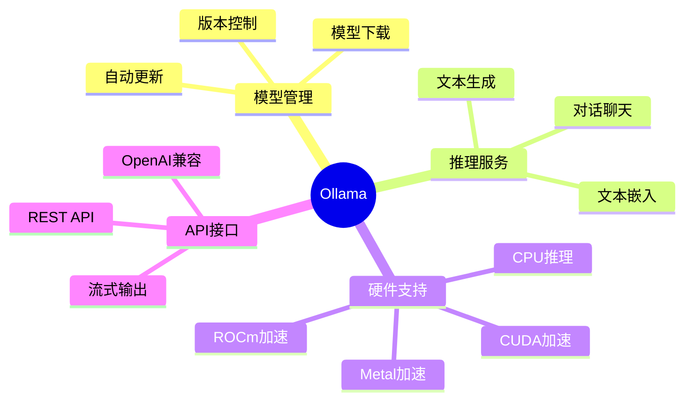
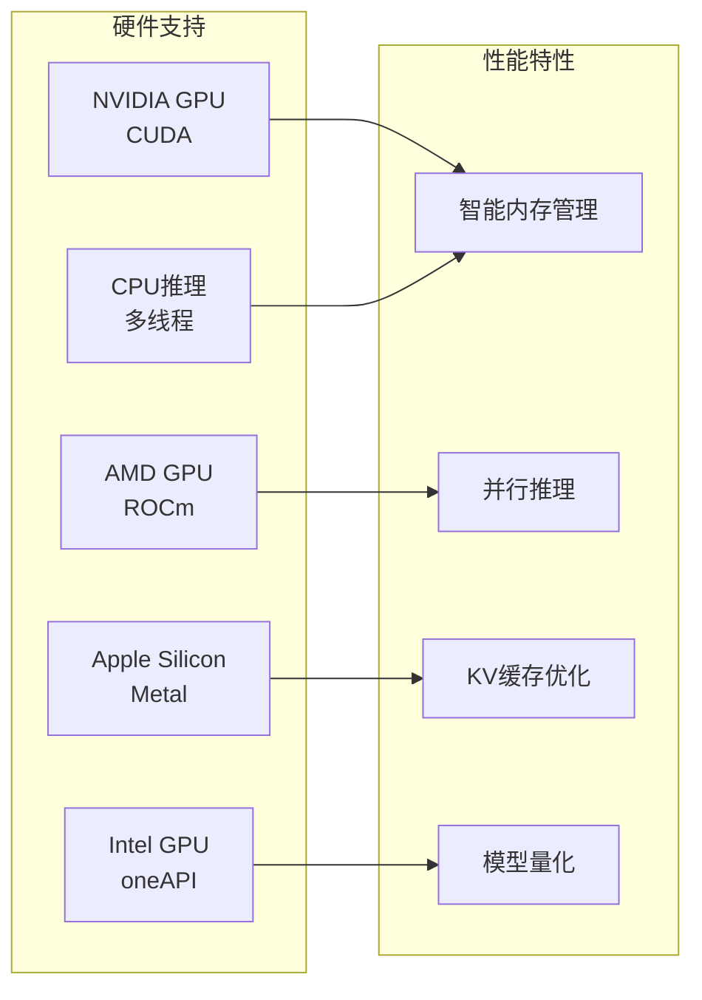
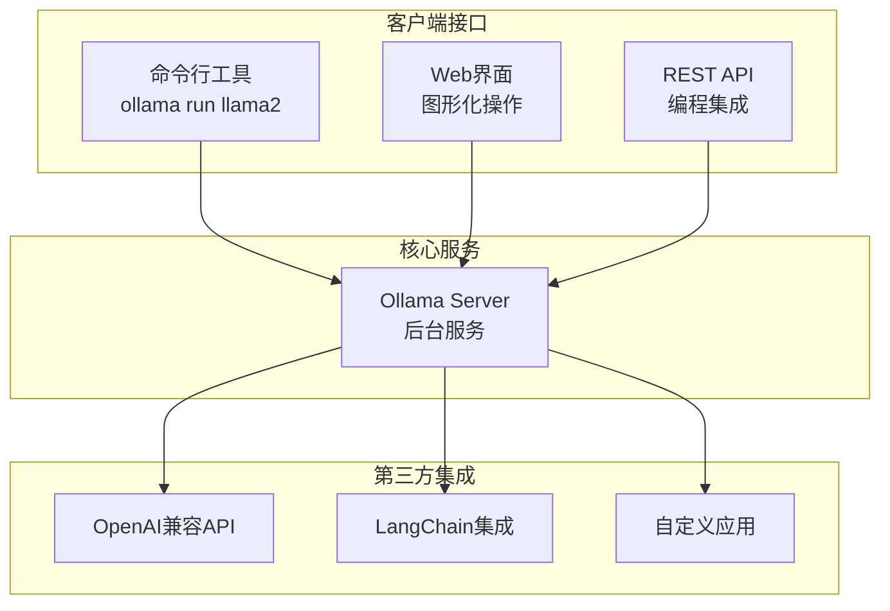

# Ollama 项目概览

## 🎯 什么是 Ollama

Ollama 是一个**本地大语言模型推理服务平台**，让你能够在本地机器上轻松运行各种开源大语言模型。

### 核心价值
- **隐私保护**: 数据完全本地处理，无需上传云端
- **成本控制**: 避免API调用费用，一次部署长期使用  
- **高性能**: 原生支持GPU加速，优化推理速度
- **易用性**: 简洁的API接口，开箱即用的体验

## 🚀 主要功能

## 🏗️ 技术特点

### 模型支持
- **Llama系列**: Llama 2, Llama 3, Code Llama
- **其他模型**: Mistral, Gemma, Qwen, Phi等
- **多模态**: 支持文本+图像的多模态模型
- **自定义**: 支持用户自定义模型导入

### 硬件优化

### 架构特色
- **分层设计**: 清晰的模块边界，易于扩展
- **异步处理**: 高并发请求处理能力
- **资源调度**: 智能的GPU/CPU资源分配
- **流式输出**: 实时响应，提升用户体验

## 📊 使用场景

| 场景 | 应用示例 | 优势 |
|------|----------|------|
| **个人助手** | 代码编写、文档生成、问答 | 隐私保护、响应快速 |
| **企业应用** | 内部知识库、客服机器人 | 数据安全、成本可控 |
| **开发调试** | 模型测试、原型开发 | 环境可控、调试方便 |
| **离线场景** | 无网络环境、敏感数据处理 | 完全离线、安全可靠 |

## 🎪 产品形态

Ollama 提供多种交互方式：

## 🎨 核心优势

### 🔒 隐私优先
- 所有数据在本地处理
- 无需网络连接即可运行
- 完全控制数据流向

### ⚡ 性能卓越  
- 原生GPU加速支持
- 智能内存管理
- 并发请求优化

### 🛠️ 易于使用
- 一行命令安装模型
- 简洁的API设计
- 丰富的文档和示例

### 🔧 高可扩展
- 插件化架构设计
- 支持自定义模型
- 灵活的配置选项

## 📈 性能数据

### 推理速度对比
| 模型大小 | CPU推理 | GPU推理 | 加速比 |
|----------|---------|---------|--------|
| 7B参数   | 15 tok/s | 85 tok/s | 5.7x |
| 13B参数  | 8 tok/s  | 45 tok/s | 5.6x |
| 70B参数  | 2 tok/s  | 12 tok/s | 6.0x |

### 内存使用优化
- **模型量化**: 减少50-75%内存占用
- **动态加载**: 按需加载模型组件
- **缓存管理**: 智能释放不活跃模型

---

**下一步**: 查看 [快速上手](./02-快速上手.md) 开始使用 Ollama