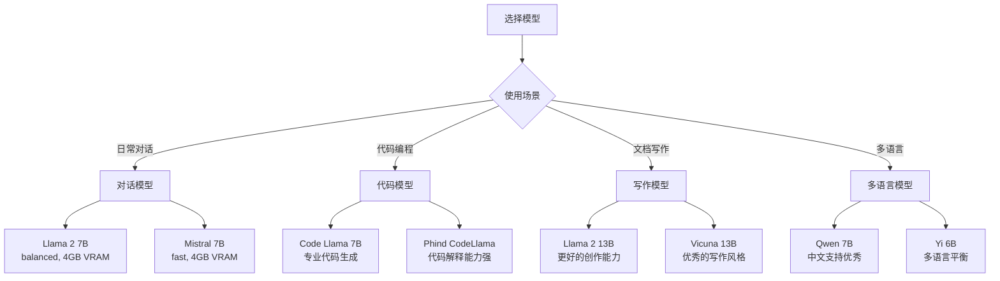

# 快速上手指南

## 🚀 安装与启动

### 一键安装
```bash
# macOS / Linux
curl -fsSL https://ollama.com/install.sh | sh

# Windows (PowerShell)
winget install Ollama.Ollama
```

### 验证安装
```bash
# 检查版本
ollama --version

# 启动服务器 (后台运行)
ollama serve &

# 检查服务状态
curl http://localhost:11434/api/version
```

## 🎯 5分钟快速体验

### 1. 下载并运行第一个模型
```bash
# 下载 Llama 2 7B 模型 (~3.8GB)
ollama pull llama2

# 开始对话
ollama run llama2
>>> Hello! Can you help me write a Python function?
I'd be happy to help you write a Python function! ...
```

### 2. API调用示例
```bash
# 生成文本
curl http://localhost:11434/api/generate -d '{
  "model": "llama2",
  "prompt": "Why is the sky blue?",
  "stream": false
}'

# 对话聊天
curl http://localhost:11434/api/chat -d '{
  "model": "llama2", 
  "messages": [
    {"role": "user", "content": "Hello!"}
  ]
}'
```

### 3. 流式响应体验
```bash
# 实时流式输出
curl http://localhost:11434/api/chat -d '{
  "model": "llama2",
  "messages": [{"role": "user", "content": "Write a short story"}],
  "stream": true
}'
```

## 📊 常用模型推荐

### 模型选择指南


| 模型 | 大小 | 内存需求 | 特点 | 适用场景 |
|------|------|----------|------|----------|
| **llama2:7b** | 3.8GB | 8GB RAM | 平衡性能 | 通用对话 |
| **mistral:7b** | 4.1GB | 8GB RAM | 推理快速 | 快速响应 |
| **codellama:7b** | 3.8GB | 8GB RAM | 代码专精 | 编程助手 |
| **qwen:7b** | 4.2GB | 8GB RAM | 中文优秀 | 中文对话 |

## 🛠️ 基本配置

### 环境变量配置
```bash
# 设置数据目录
export OLLAMA_MODELS=/path/to/models

# 设置服务端口
export OLLAMA_PORT=11434

# 设置日志级别
export OLLAMA_LOG_LEVEL=info

# 设置GPU使用
export OLLAMA_GPU_LAYERS=35  # 使用GPU加速的层数
```

### 配置文件位置
```bash
# macOS
~/Library/Application Support/Ollama/

# Linux
~/.ollama/

# Windows  
%USERPROFILE%\.ollama\
```

## 💻 编程接口使用

### Python客户端
```python
import requests
import json

def chat_with_ollama(message):
    url = "http://localhost:11434/api/chat"
    data = {
        "model": "llama2",
        "messages": [{"role": "user", "content": message}],
        "stream": False
    }
    
    response = requests.post(url, json=data)
    return response.json()["message"]["content"]

# 使用示例
result = chat_with_ollama("Explain quantum computing in simple terms")
print(result)
```

### JavaScript客户端
```javascript
async function chatWithOllama(message) {
  const response = await fetch('http://localhost:11434/api/chat', {
    method: 'POST',
    headers: {'Content-Type': 'application/json'},
    body: JSON.stringify({
      model: 'llama2',
      messages: [{role: 'user', content: message}],
      stream: false
    })
  });
  
  const data = await response.json();
  return data.message.content;
}

// 使用示例
chatWithOllama('Write a haiku about programming')
  .then(result => console.log(result));
```

### 流式处理示例
```python
import requests
import json

def stream_chat(message):
    url = "http://localhost:11434/api/chat"
    data = {
        "model": "llama2",
        "messages": [{"role": "user", "content": message}],
        "stream": True
    }
    
    with requests.post(url, json=data, stream=True) as response:
        for line in response.iter_lines():
            if line:
                chunk = json.loads(line)
                if not chunk.get('done', False):
                    print(chunk['message']['content'], end='', flush=True)
                else:
                    print(f"\n\n用时: {chunk['total_duration']/1e9:.2f}秒")

# 使用示例 - 实时输出
stream_chat("Tell me a story about a robot learning to paint")
```

## 🎨 自定义模型创建

### 1. 创建Modelfile
```dockerfile
# 文件名: Modelfile
FROM llama2

# 设置系统提示词
SYSTEM """
You are a helpful coding assistant. You specialize in Python programming 
and always provide clean, well-commented code examples.
"""

# 设置模型参数
PARAMETER temperature 0.1
PARAMETER top_p 0.9
PARAMETER top_k 40

# 设置停止词
PARAMETER stop "User:"
PARAMETER stop "Assistant:"
```

### 2. 构建自定义模型
```bash
# 从Modelfile创建模型
ollama create mycodingbot -f ./Modelfile

# 测试自定义模型
ollama run mycodingbot
>>> Can you help me write a sorting algorithm in Python?
```

### 3. 模型导入和导出
```bash
# 导出模型
ollama push mycodingbot  # 推送到注册表

# 从文件导入
ollama create custom-model -f ./model.gguf

# 复制模型
ollama cp llama2 my-llama2
```

## 🔧 故障排查

### 常见问题解决

#### 1. 模型加载失败
```bash
# 检查可用内存
free -h  # Linux
vm_stat  # macOS

# 检查磁盘空间
df -h

# 清理缓存
ollama rm unused-model
```

#### 2. GPU不被识别
```bash
# 检查GPU状态
nvidia-smi  # NVIDIA
rocm-smi    # AMD

# 检查驱动
ollama ps  # 查看运行中的模型
```

#### 3. API连接问题
```bash
# 检查服务状态
curl http://localhost:11434/api/version

# 查看日志
ollama logs

# 重启服务
killall ollama
ollama serve
```

### 性能优化提示

#### 内存优化
```bash
# 使用量化模型减少内存占用
ollama pull llama2:7b-q4_0  # 4位量化
ollama pull llama2:7b-q8_0  # 8位量化

# 设置较小的上下文长度
export OLLAMA_NUM_CTX=2048  # 默认2048
```

#### GPU优化
```bash
# 仅使用特定GPU
export CUDA_VISIBLE_DEVICES=0

# 调整GPU层数
export OLLAMA_GPU_LAYERS=32  # 根据VRAM调整
```

## 📚 下一步学习

### 深入了解建议路径
1. **开发者** → [系统架构](./03-系统架构.md) → [API设计](./04-API设计.md)  
2. **运维工程师** → [部署指南](./12-部署指南.md) → [监控运维](./13-监控运维.md)
3. **高级用户** → [调度器详解](./06-调度器详解.md) → [性能优化](./11-性能优化.md)

### 有用资源
- **官方文档**: https://ollama.com/docs
- **模型库**: https://ollama.com/library  
- **GitHub仓库**: https://github.com/ollama/ollama
- **社区论坛**: https://github.com/ollama/ollama/discussions

---
🎉 **恭喜！** 你已经掌握了Ollama的基本使用。现在可以开始探索更高级的功能了！