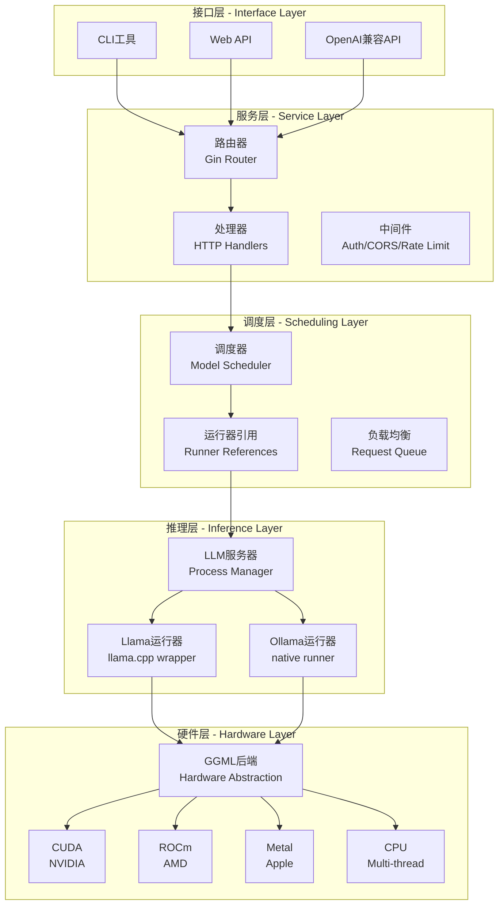
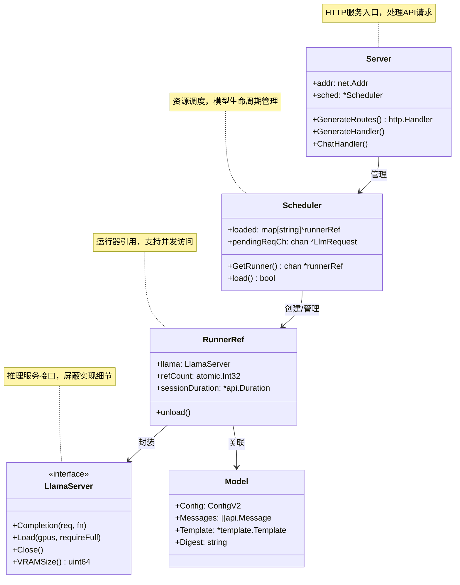
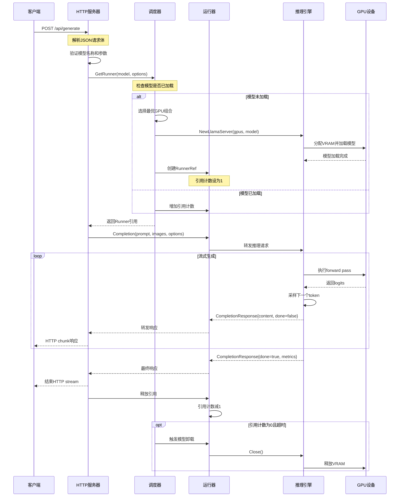
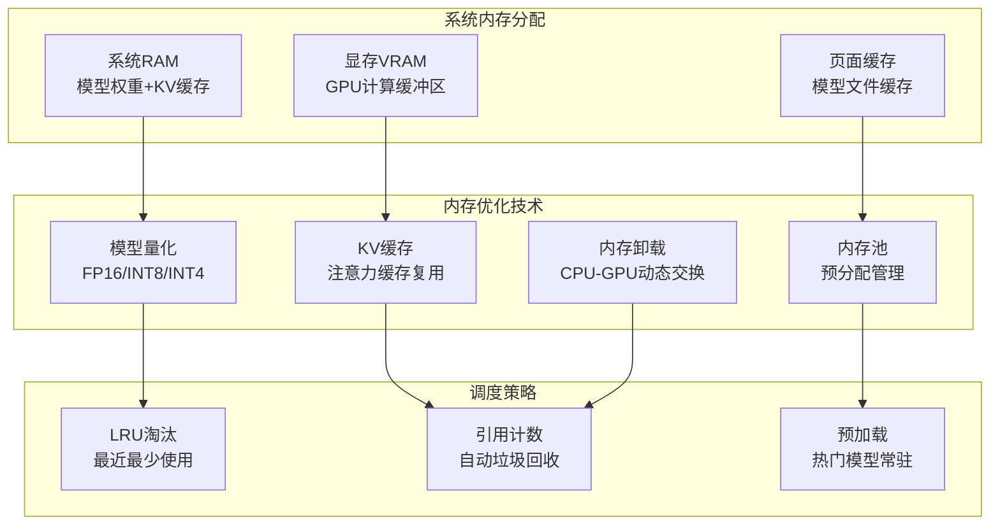
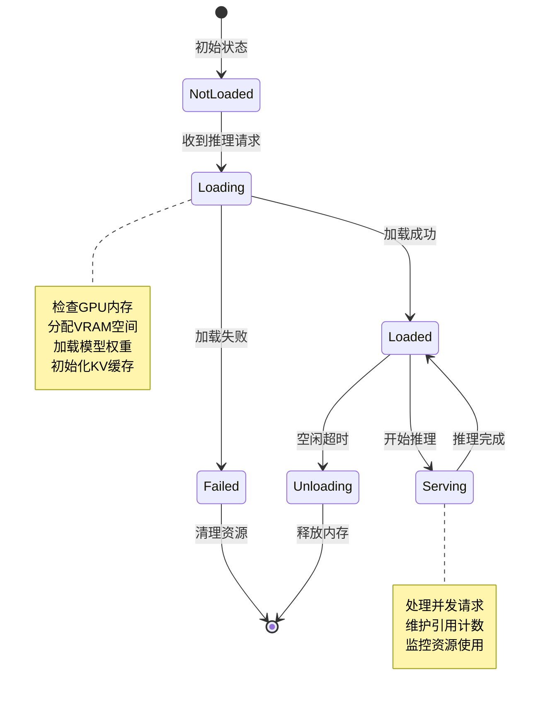
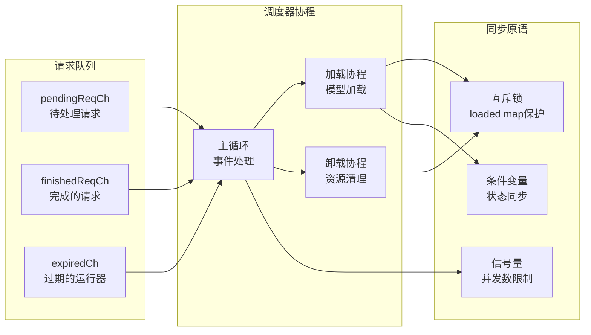

# 系统架构详解

## 🏗️ 整体架构

Ollama 采用**分层架构**设计，从上到下分为接口层、服务层、调度层、推理层和硬件层：

## 🔄 核心组件交互

### 服务器组件关系

## 🚀 请求处理流程

### HTTP请求到推理输出的完整链路

## 🧠 内存管理策略

### 分层内存架构

### 模型加载生命周期

## 🔧 并发控制机制

### Channel通信模式

## 📊 性能监控指标

### 关键性能指标
| 指标类别 | 指标名称 | 说明 | 正常范围 |
|----------|----------|------|----------|
| **延迟** | 首token延迟 | 第一个token生成时间 | < 500ms |
| **延迟** | token间延迟 | 相邻token生成间隔 | < 50ms |
| **吞吐** | tokens/秒 | 每秒生成token数量 | 20-100 |
| **资源** | GPU利用率 | GPU计算资源使用 | 60-90% |
| **资源** | 内存使用率 | VRAM占用百分比 | < 80% |
| **并发** | 活跃请求数 | 同时处理的请求 | < CPU核数×2 |

---

**相关文档**:
- [调度器详解](./06-调度器详解.md) - 深入了解资源调度机制
- [推理引擎](./07-推理引擎.md) - 推理实现和优化细节
- [并发模型](./10-并发模型.md) - Goroutine和Channel最佳实践