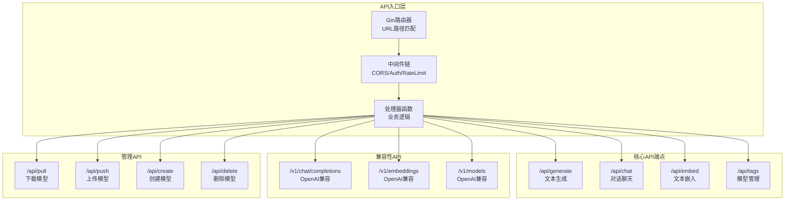
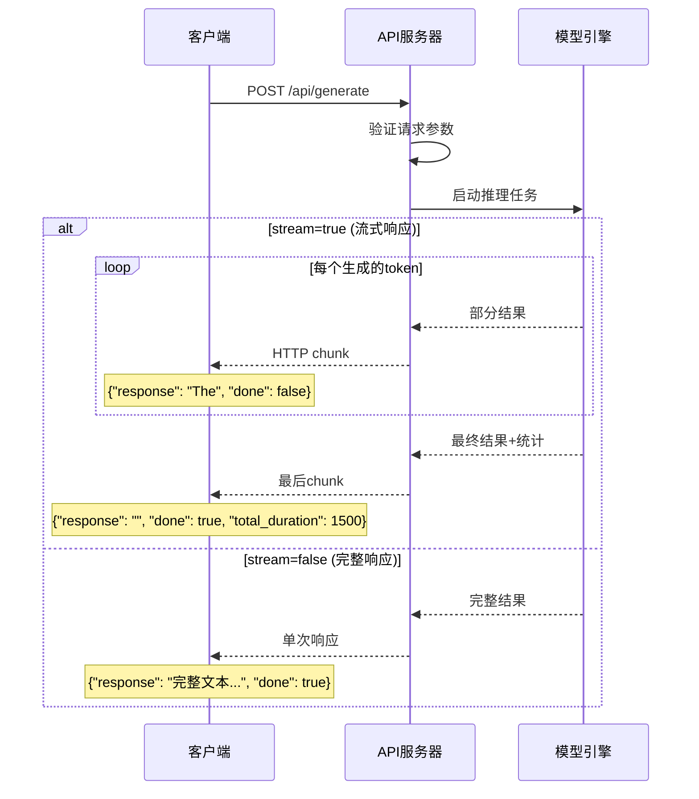
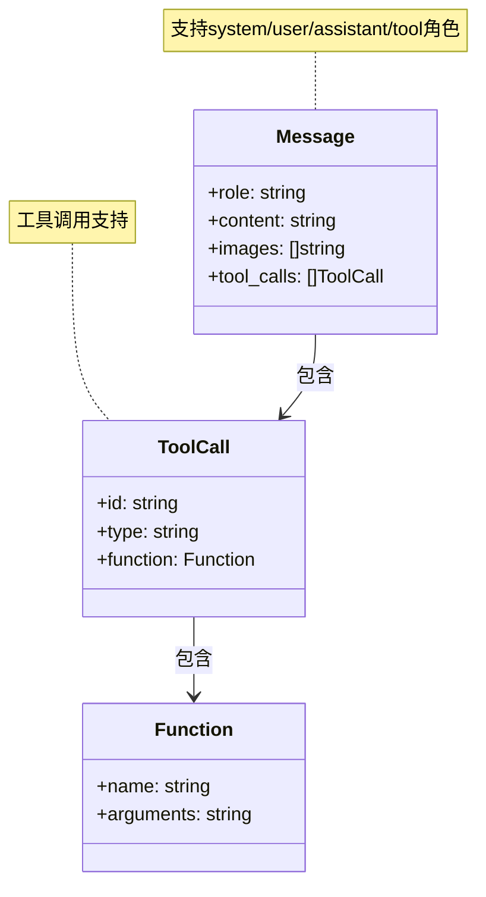
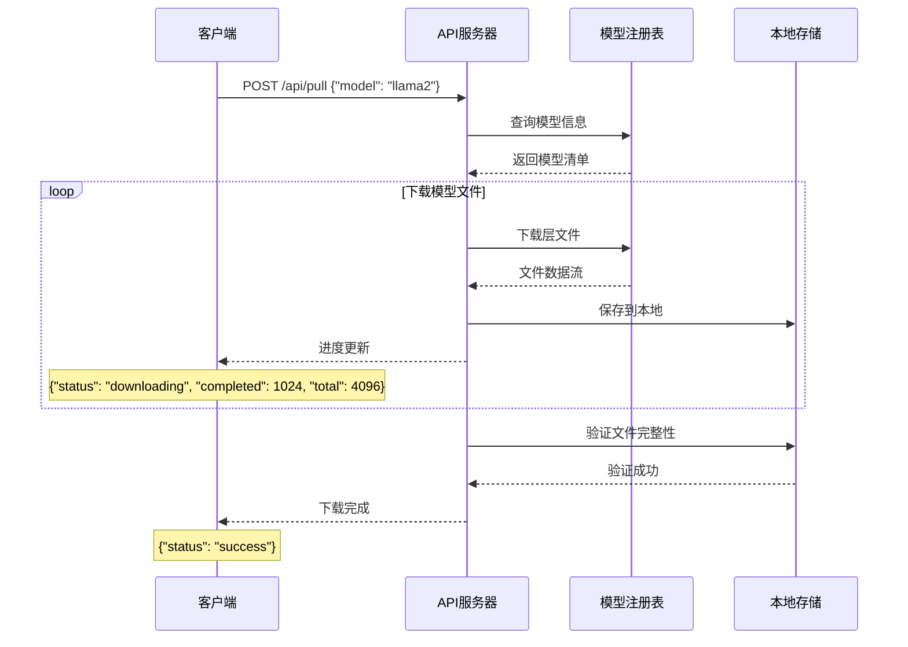
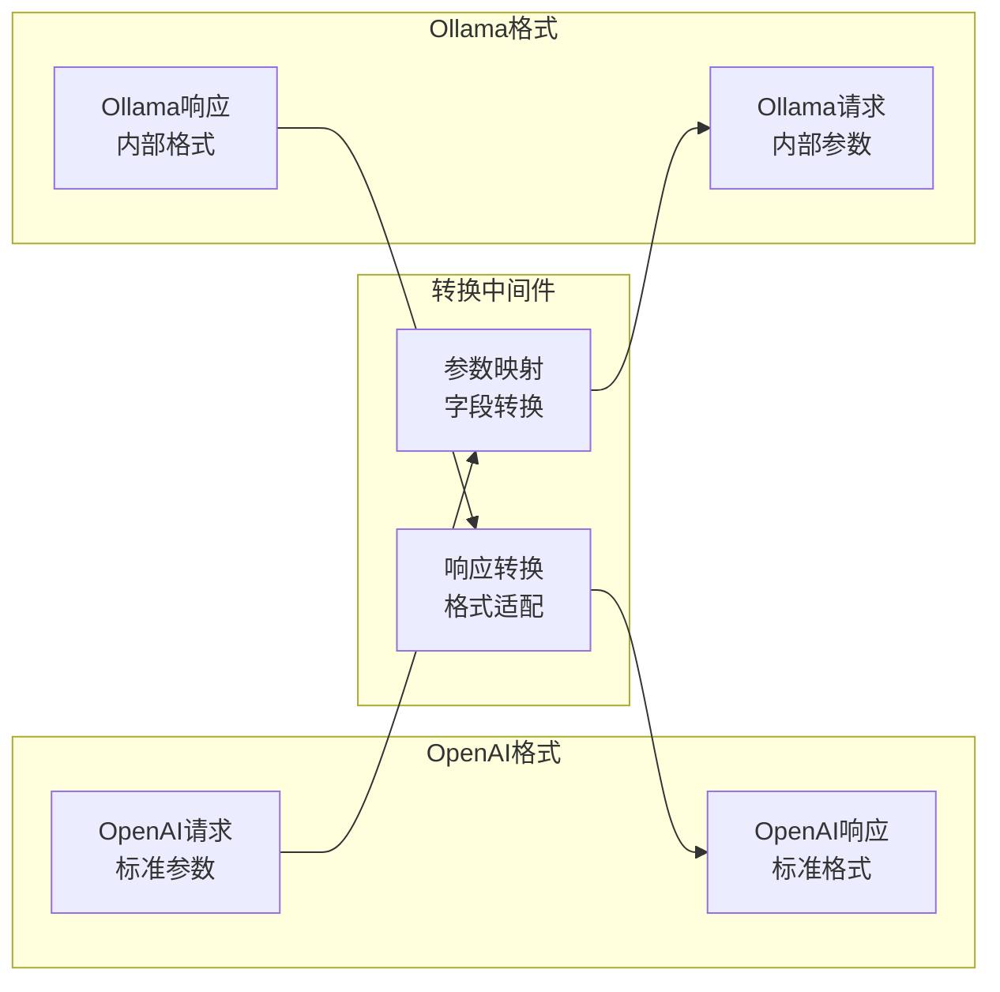
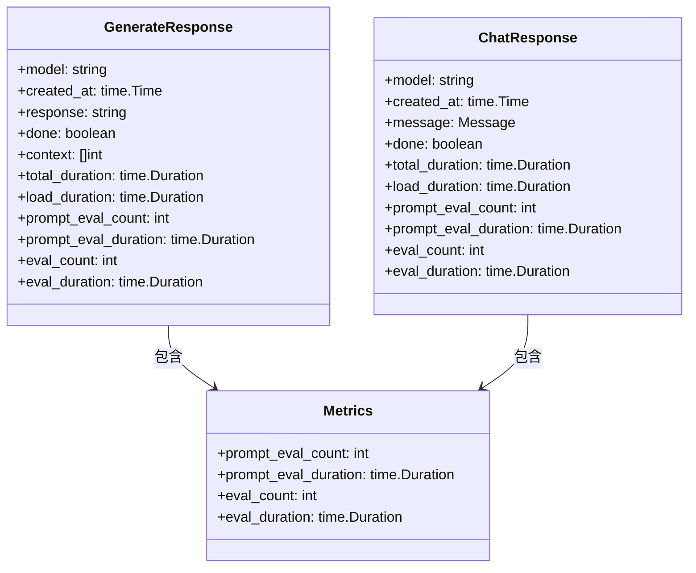
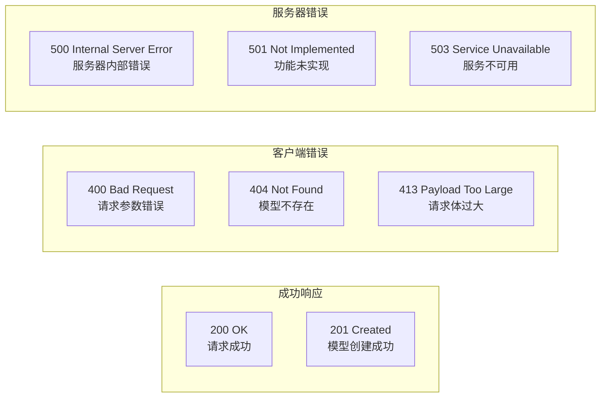
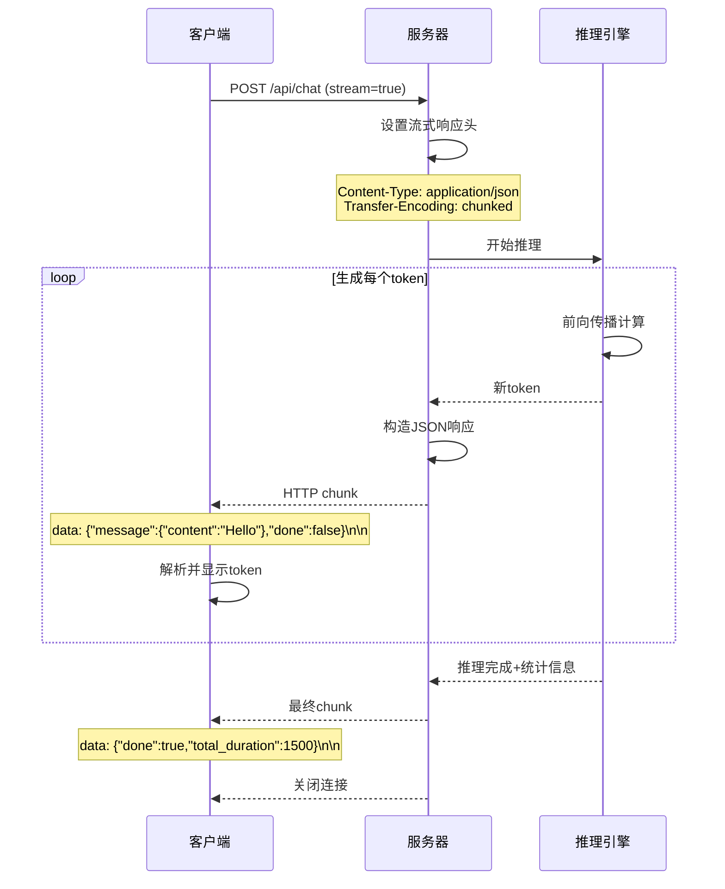
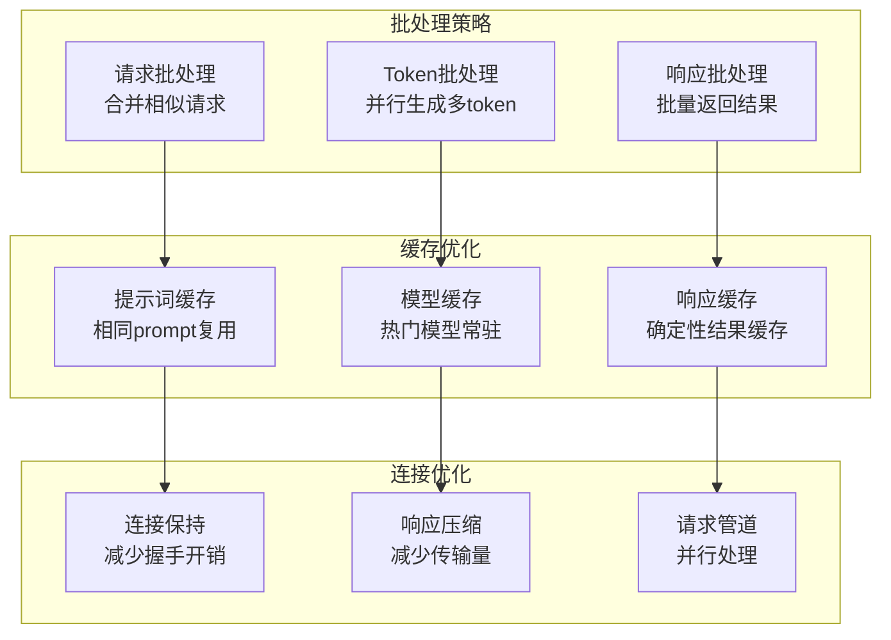

# API设计详解

## 🌐 API架构概览

Ollama提供**RESTful API**设计，兼容OpenAI格式，支持流式和非流式响应模式。



## 📝 核心API端点详解

### 1. 文本生成 API
```http
POST /api/generate
Content-Type: application/json

{
  "model": "llama2",
  "prompt": "Why is the sky blue?",
  "stream": true,
  "options": {
    "temperature": 0.7,
    "top_p": 0.9,
    "max_tokens": 2048
  }
}
```

**响应格式**:


### 2. 对话聊天 API
```http
POST /api/chat
Content-Type: application/json

{
  "model": "llama2",
  "messages": [
    {"role": "system", "content": "You are a helpful assistant."},
    {"role": "user", "content": "Hello!"}
  ],
  "stream": true
}
```

**消息格式标准**:


### 3. 模型管理 API

#### 列出模型
```http
GET /api/tags
```

```json
{
  "models": [
    {
      "name": "llama2:latest",
      "size": 3825819519,
      "digest": "fe938a131f40e6f6d40083c9f0f430a515233eb2edaa6d72eb85c50d64f2300e",
      "modified_at": "2023-12-07T09:32:18.757212583-08:00"
    }
  ]
}
```

#### 下载模型


## 🔄 OpenAI兼容性

### API映射关系
| OpenAI API | Ollama API | 功能映射 |
|------------|------------|----------|
| `/v1/chat/completions` | `/api/chat` | 对话补全 |
| `/v1/completions` | `/api/generate` | 文本生成 |
| `/v1/embeddings` | `/api/embed` | 文本嵌入 |
| `/v1/models` | `/api/tags` | 模型列表 |

### 参数转换机制


## 📊 请求响应数据结构

### 生成请求结构
```go
type GenerateRequest struct {
    Model     string                 `json:"model"`
    Prompt    string                 `json:"prompt"`
    Suffix    string                 `json:"suffix,omitempty"`
    System    string                 `json:"system,omitempty"`
    Template  string                 `json:"template,omitempty"`
    Context   []int                  `json:"context,omitempty"`
    Stream    *bool                  `json:"stream,omitempty"`
    Raw       bool                   `json:"raw,omitempty"`
    Format    json.RawMessage        `json:"format,omitempty"`
    KeepAlive *Duration              `json:"keep_alive,omitempty"`
    Images    []ImageData            `json:"images,omitempty"`
    Options   map[string]interface{} `json:"options,omitempty"`
}
```

### 响应结构设计


## 🔧 错误处理机制

### HTTP状态码设计


### 错误响应格式
```json
{
  "error": "model not found",
  "details": "The model 'llama3' was not found. Available models: llama2, mistral",
  "code": "MODEL_NOT_FOUND",
  "timestamp": "2023-12-07T17:32:18Z"
}
```

## 🚀 流式响应实现

### 服务端推送事件流


### 客户端流式处理
```javascript
async function* streamChat(messages) {
  const response = await fetch('/api/chat', {
    method: 'POST',
    headers: {'Content-Type': 'application/json'},
    body: JSON.stringify({
      model: 'llama2',
      messages: messages,
      stream: true
    })
  });
  
  const reader = response.body.getReader();
  const decoder = new TextDecoder();
  
  while (true) {
    const {done, value} = await reader.read();
    if (done) break;
    
    const chunk = decoder.decode(value);
    const lines = chunk.split('\n');
    
    for (const line of lines) {
      if (line.trim()) {
        const data = JSON.parse(line);
        yield data;
      }
    }
  }
}
```

## 📈 性能优化特性

### 请求批处理


---

**相关代码文件**:
- `server/routes.go` - API路由和处理器
- `api/types.go` - 请求响应数据结构
- `middleware/` - 中间件实现
- `openai/` - OpenAI兼容性实现

**下一步**: 查看 [模型管理](./05-模型管理.md) 了解模型生命周期管理