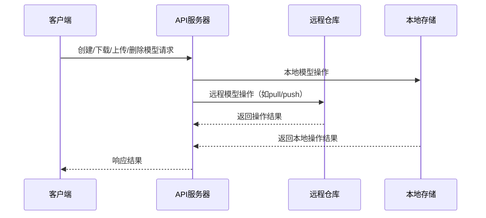

# 模型管理详解

## 📦 模型生命周期管理

Ollama的模型管理模块负责模型的创建、导入、导出、删除、版本控制及元数据维护，确保模型安全、高效地流转于本地与远程环境。

### 主要API端点
| 路径 | 方法 | 说明 |
|------|------|------|
| "/api/create" | POST | 创建新模型 |
| "/api/pull"   | POST | 从远程仓库下载模型 |
| "/api/push"   | POST | 上传模型到远程仓库 |
| "/api/delete" | POST | 删除本地模型 |
| "/api/tags"   | GET  | 列出所有模型及版本 |

### 模型元数据结构
```go
type ModelInfo struct {
    Name       string    `json:"name"`
    Size       int64     `json:"size"`
    Digest     string    `json:"digest"`
    ModifiedAt time.Time `json:"modified_at"`
}
```

### 生命周期流程


### 版本与标签管理
- 支持多版本（如 llama2:latest、mistral:v1）
- 标签用于区分模型快照与发布版本
- Digest用于唯一标识模型内容

### 典型操作流程
1. **创建模型**：上传权重文件及元数据，生成新标签
2. **拉取模型**：从远程仓库下载指定版本到本地
3. **推送模型**：将本地模型上传至远程，便于分发
4. **删除模型**：清理本地存储，释放空间
5. **列出模型**：查询所有已注册模型及其版本信息

### 错误处理
- 模型不存在、版本冲突、存储空间不足等均有详细错误码与提示

---
**相关代码文件**:
- `server/model.go` - 模型管理主逻辑
- `api/types.go` - 模型元数据结构
- `server/routes.go` - API路由集成
- `convert/` - 支持多种模型格式转换

**下一步**: 查看 [调度器详解](./06-调度器详解.md) 了解模型加载与资源分配
