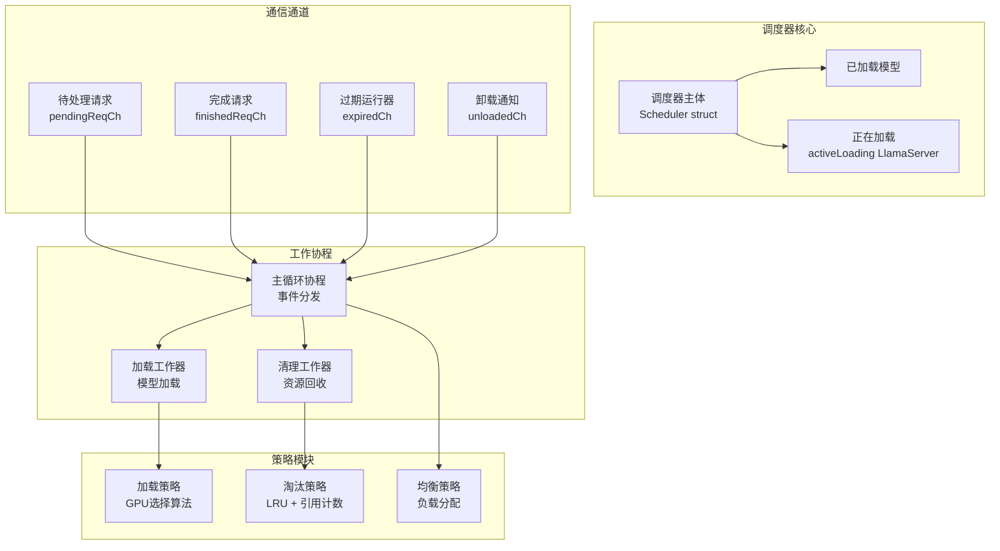
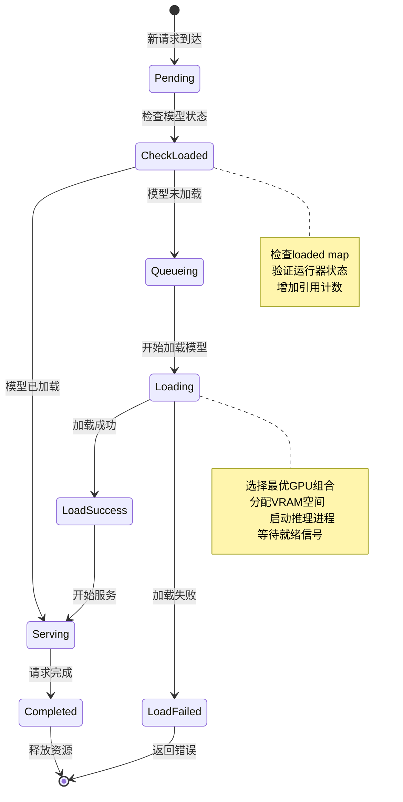
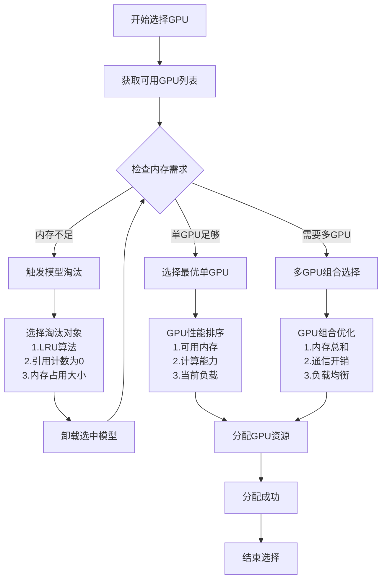
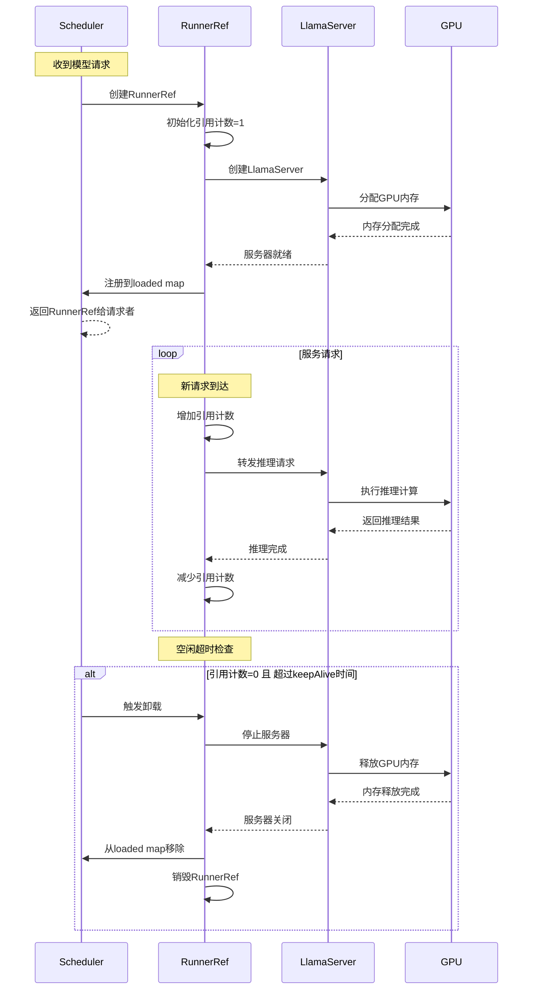
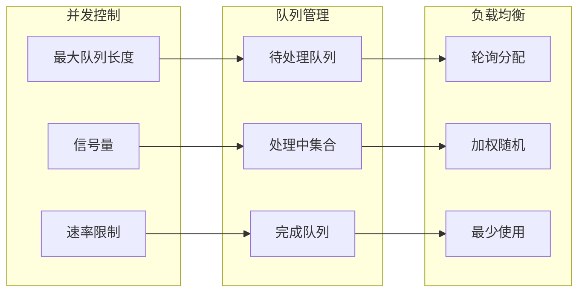
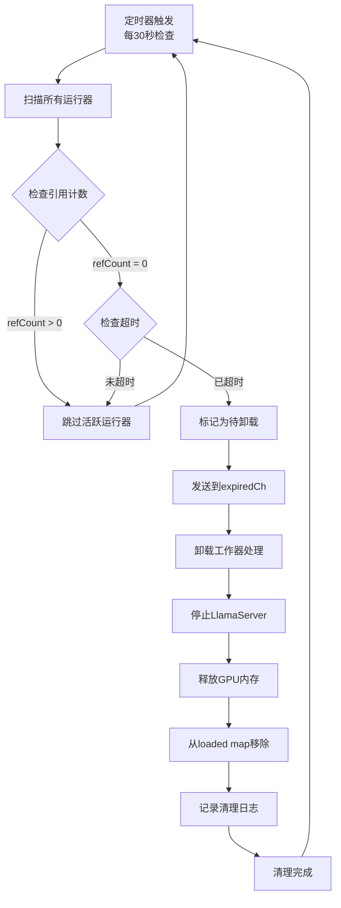
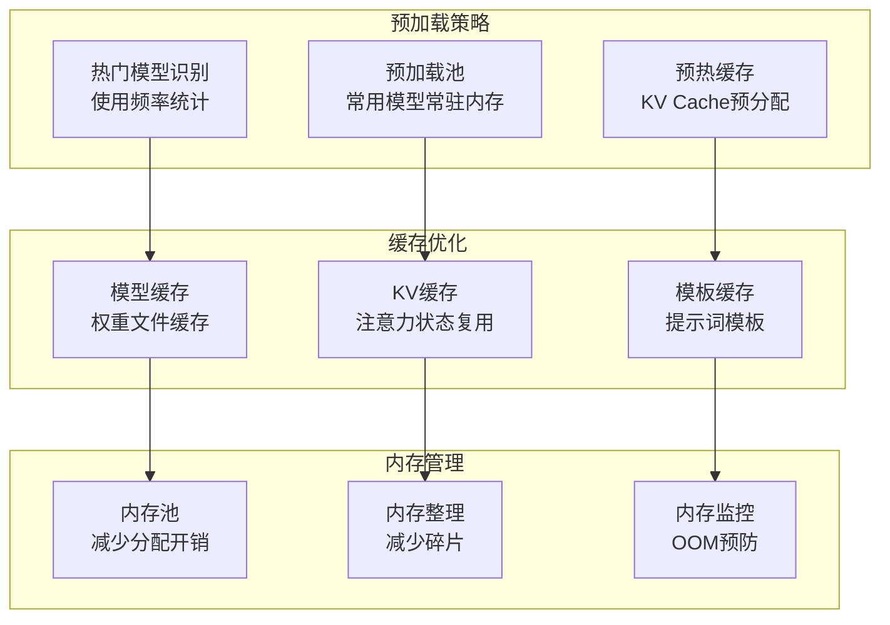

# 调度器详解

## 🎯 调度器职责

调度器(Scheduler)是Ollama的**资源管理中枢**，负责模型的智能调度、生命周期管理和资源优化分配。

## 🏗️ 调度器架构



## 🔄 调度流程详解

### 请求调度状态机


### GPU资源选择算法


## 📊 运行器引用管理

### RunnerRef生命周期


### 引用计数实现
```go
type runnerRef struct {
    refCount      atomic.Int32
    sessionDuration *api.Duration
    lastUsed      time.Time
    // ... 其他字段
}

// 获取运行器引用（增加计数）
func (r *runnerRef) acquire() {
    r.refCount.Add(1)
    r.lastUsed = time.Now()
}

// 释放运行器引用（减少计数）  
func (r *runnerRef) release() {
    count := r.refCount.Add(-1)
    if count == 0 {
        // 启动超时检查
        r.scheduleTimeout()
    }
}

// 检查是否可以卸载
func (r *runnerRef) canUnload() bool {
    if r.refCount.Load() > 0 {
        return false // 仍有活跃请求
    }
    
    timeout := r.sessionDuration.Duration
    return time.Since(r.lastUsed) > timeout
}
```

## ⚡ 并发控制策略

### 信号量限制并发数


## 🧹 垃圾回收机制

### 自动清理流程


## 📈 性能优化策略

### 预加载和缓存优化


### 关键性能指标监控
| 指标 | 描述 | 目标值 | 监控方法 |
|------|------|--------|----------|
| **模型加载时间** | 从请求到模型就绪 | < 10s | 时间戳diff |
| **调度延迟** | 请求排队到开始处理 | < 100ms | 队列时间统计 |
| **内存利用率** | GPU内存使用效率 | 70-90% | CUDA/ROCm API |
| **并发处理数** | 同时处理的请求数量 | 符合硬件能力 | 引用计数统计 |
| **模型命中率** | 请求模型已加载比例 | > 80% | 缓存命中统计 |

---

**相关代码**:
- `server/sched.go` - 调度器主要实现
- `server/routes.go` - HTTP处理器集成  
- `discover/gpu.go` - GPU资源发现

**下一步**: 查看 [推理引擎](./07-推理引擎.md) 了解模型推理实现细节