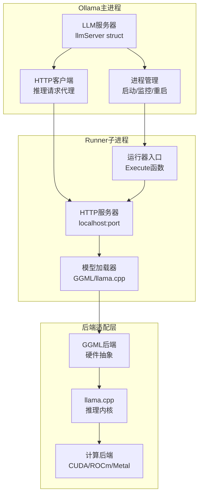
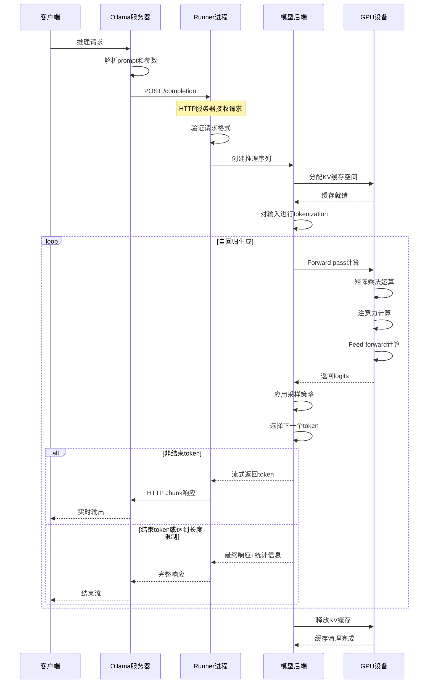
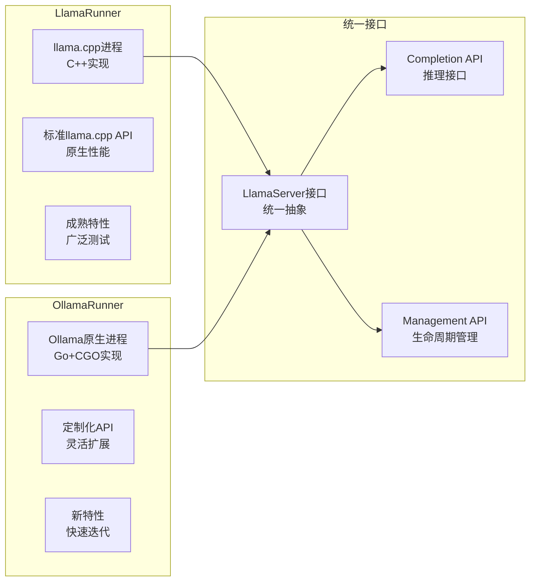
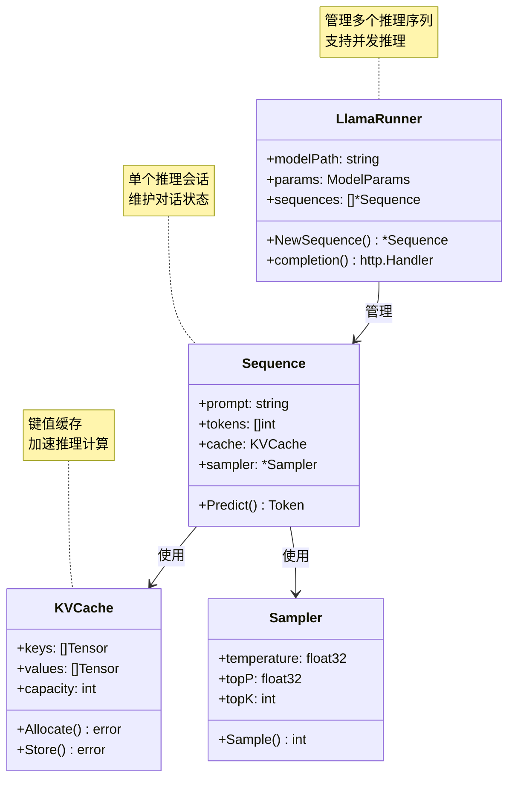
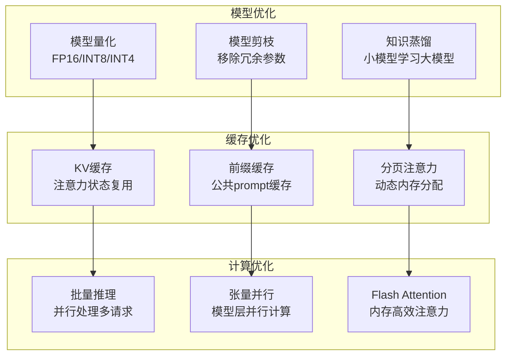
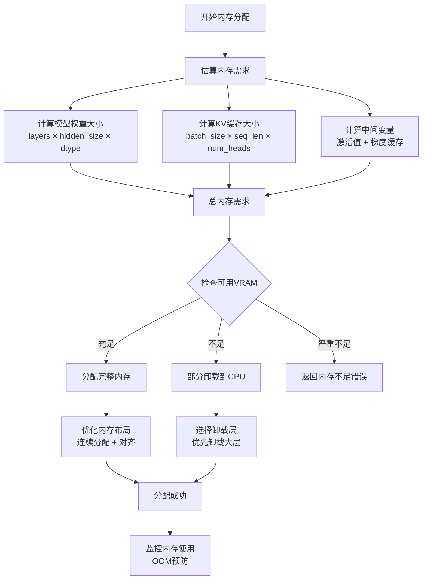
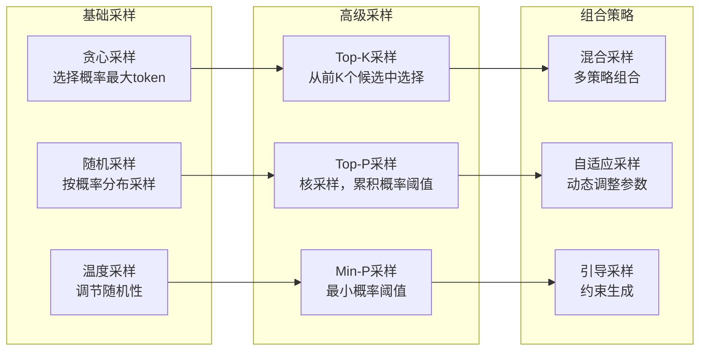
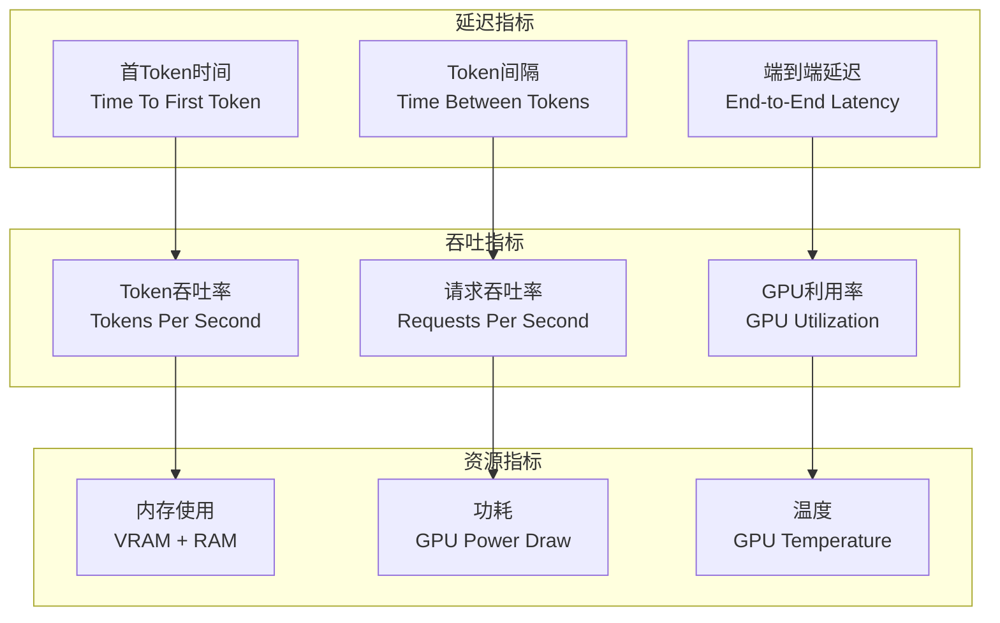

# 推理引擎详解

## 🧠 推理引擎架构

Ollama的推理引擎基于**分离式设计**，将推理计算独立为子进程，通过HTTP通信实现解耦和容错。

## 🚀 推理流程详解

### 端到端推理管道

## 🏗️ 运行器实现

### 双运行器架构

### LlamaRunner实现细节

## ⚡ 性能优化技术

### 内存优化策略

### GPU内存分配策略

## 🔧 采样策略实现

### 多种采样算法

### 采样参数调优指南
| 参数 | 范围 | 效果 | 推荐场景 |
|------|------|------|----------|
| **temperature** | 0.1-2.0 | 控制创造性 | 0.7(对话), 0.1(代码) |
| **top_k** | 1-100 | 限制候选数量 | 40(平衡), 1(确定性) |
| **top_p** | 0.1-1.0 | 动态候选集 | 0.9(创意), 0.5(准确) |
| **repeat_penalty** | 0.9-1.3 | 避免重复 | 1.1(通用), 1.0(禁用) |

## 📊 推理性能监控

### 关键性能指标

### 性能优化检查清单
- [ ] **模型量化**: 启用FP16或INT8量化减少内存占用
- [ ] **批量推理**: 合并多个请求提高GPU利用率  
- [ ] **KV缓存**: 启用注意力缓存避免重复计算
- [ ] **内存预分配**: 避免推理过程中的动态分配
- [ ] **异步处理**: 使用流式输出减少感知延迟
- [ ] **硬件选择**: 根据模型大小选择合适的GPU配置

---

**核心代码文件**:
- `llm/server.go` - LLM服务器实现
- `runner/llamarunner/` - Llama运行器
- `runner/ollamarunner/` - Ollama运行器  
- `ml/backend/ggml/` - GGML后端适配

**下一步**: 查看 [设备发现](./08-设备发现.md) 了解硬件检测和管理机制