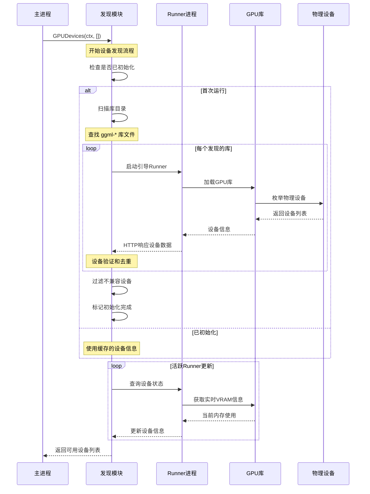
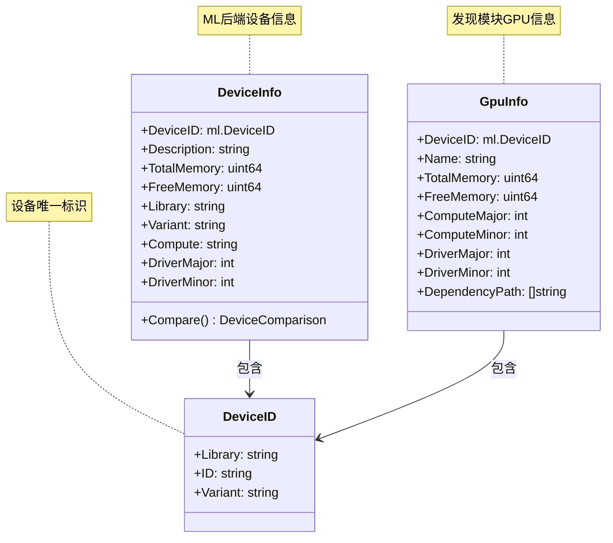
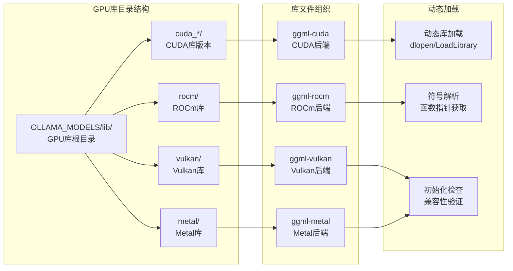
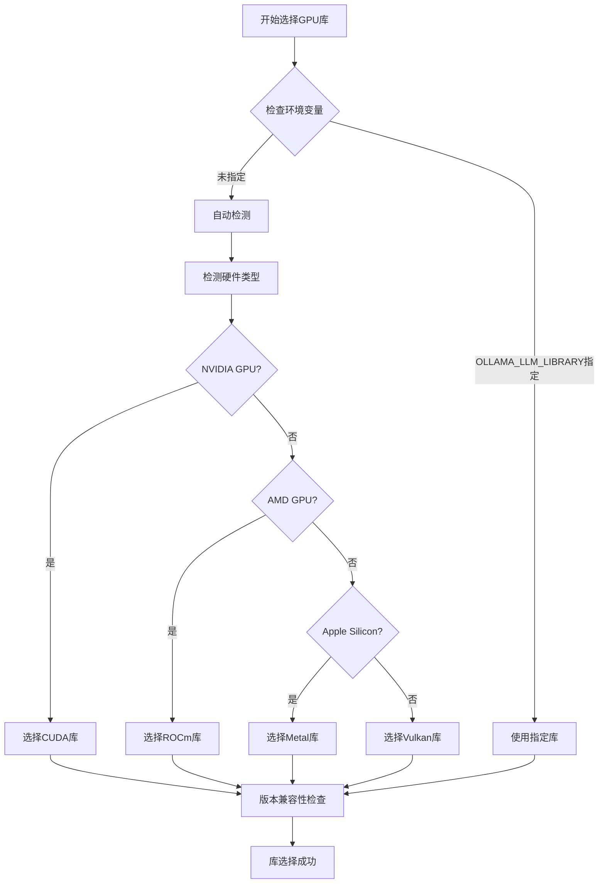
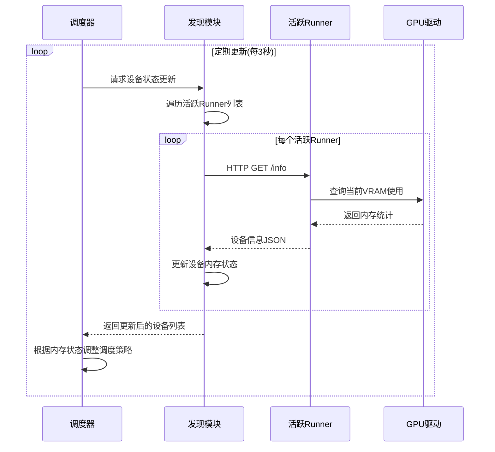
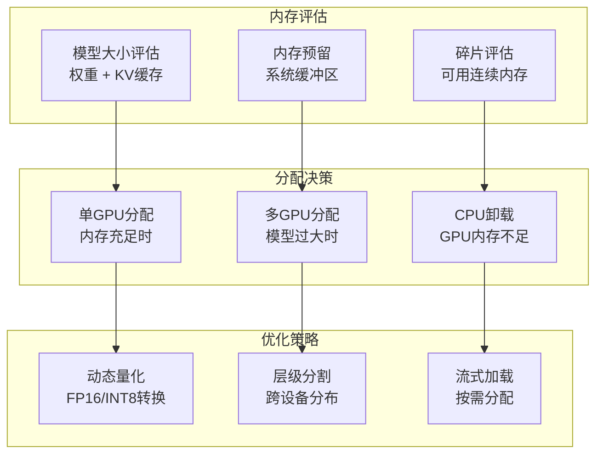
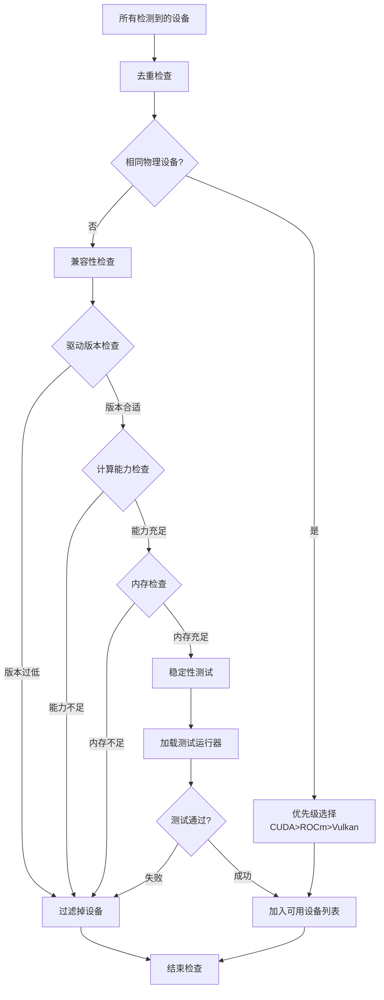

# 设备发现与管理

## 🔍 设备发现架构

Ollama的设备发现模块负责**自动检测**和**智能管理**系统中的计算设备，为模型推理提供最优的硬件资源配置。

```mermaid
graph TB
    subgraph "发现入口"
        DiscoverEntry[设备发现入口<br/>discover.GPUDevices()]
        Bootstrap[引导程序<br/>bootstrapDevices()]
        RunnerProbe[运行器探测<br/>GetDevicesFromRunner()]
    end
    
    subgraph "设备检测"
        GPUDetect[GPU检测器<br/>枚举显卡设备]
        CPUDetect[CPU检测器<br/>处理器信息]
        MemoryProbe[内存探测<br/>VRAM/RAM查询]
    end
    
    subgraph "硬件抽象"
        CUDA[CUDA设备<br/>NVIDIA显卡]
        ROCm[ROCm设备<br/>AMD显卡]
        Metal[Metal设备<br/>Apple GPU]
        Vulkan[Vulkan设备<br/>通用GPU API]
        OpenCL[OpenCL设备<br/>异构计算]
    end
    
    subgraph "设备信息"
        DeviceInfo[设备信息结构<br/>ml.DeviceInfo] 
        GpuInfo[GPU信息<br/>discover.GpuInfo]
        Capabilities[能力检测<br/>性能特征]
    end
    
    DiscoverEntry --> GPUDetect
    Bootstrap --> CPUDetect
    RunnerProbe --> MemoryProbe
    
    GPUDetect --> CUDA
    GPUDetect --> ROCm
    GPUDetect --> Metal
    GPUDetect --> Vulkan
    GPUDetect --> OpenCL
    
    CUDA --> DeviceInfo
    ROCm --> DeviceInfo
    Metal --> GpuInfo
    Vulkan --> Capabilities
    OpenCL --> Capabilities
```

## 🚀 发现流程详解

### 设备发现时序图


## 🏗️ 设备信息结构

### 核心数据结构


### 设备比较算法
```go
type DeviceComparison int

const (
    DevicesDifferent DeviceComparison = iota
    SameBackendDevice    // 相同后端相同设备
    DuplicateDevice      // 不同后端相同物理设备
)

func (d DeviceInfo) Compare(other DeviceInfo) DeviceComparison {
    // 1. 检查是否为完全相同的设备
    if d.Library == other.Library && d.DeviceID.ID == other.DeviceID.ID {
        return SameBackendDevice
    }
    
    // 2. 检查是否为相同物理设备的不同接口
    if d.isSamePhysicalDevice(other) {
        return DuplicateDevice  
    }
    
    return DevicesDifferent
}
```

## 🎯 GPU库管理

### 多GPU库架构


### 库优先级策略


## 💾 内存管理策略

### VRAM监控机制


### 内存分配策略


## 🔧 设备过滤机制

### 兼容性检查流程


### 设备优先级算法
```go
type DevicePriority struct {
    Device   GpuInfo
    Score    int
    Category string
}

func calculateDevicePriority(device GpuInfo) DevicePriority {
    score := 0
    category := "unknown"
    
    // 基础性能分数
    score += int(device.ComputeMajor) * 100
    score += int(device.ComputeMinor) * 10
    
    // 内存容量分数
    memGB := device.TotalMemory / (1024 * 1024 * 1024)
    score += int(memGB) * 50
    
    // 库类型加权
    switch device.Library {
    case "CUDA":
        score += 1000
        category = "nvidia"
    case "ROCm":
        score += 800  
        category = "amd"
    case "Metal":
        score += 600
        category = "apple"
    case "Vulkan":
        score += 400
        category = "universal"
    }
    
    // 新驱动加分
    if device.DriverMajor >= 12 { // 现代驱动
        score += 100
    }
    
    return DevicePriority{device, score, category}
}
```

## 📊 性能监控指标

### 关键监控指标
| 指标类别 | 指标名称 | 正常范围 | 异常阈值 |
|----------|----------|----------|----------|
| **发现延迟** | 设备发现时间 | < 5s | > 15s |
| **内存精度** | VRAM查询误差 | < 5% | > 20% |
| **设备稳定性** | 设备掉线率 | < 1% | > 5% |
| **更新频率** | 状态更新间隔 | 3s | > 10s |

### 故障诊断
```bash
# 检查设备发现日志
ollama logs | grep "discovering"

# 手动触发设备重新发现  
killall ollama
OLLAMA_DEBUG=1 ollama serve

# 检查特定GPU库
ldd /usr/local/lib/ollama/ggml-cuda.so  # Linux
otool -L /usr/local/lib/ollama/ggml-metal.so  # macOS
```

---

**核心代码文件**:
- `discover/gpu.go` - GPU设备发现主逻辑
- `discover/runner.go` - Runner进程通信
- `discover/types.go` - 设备信息数据结构
- `ml/backend/ggml/ggml.go` - GGML后端集成

**下一步**: 查看 [并发模型](./10-并发模型.md) 了解Goroutine和Channel的使用模式