# 包引用与功能总览

## 🗂️ Ollama主要包结构与功能

```mermaid
graph TD
    main[main.go 项目入口]
    server[server/ 服务端核心]
    api[api/ API数据结构与客户端]
    convert[convert/ 模型格式转换]
    discover[discover/ 设备与资源发现]
    llm[llm/ 推理引擎抽象]
    runner[runner/ 运行器调度]
    openai[openai/ OpenAI兼容层]
    format[format/ 格式化工具]
    fs[fs/ 文件系统与存储]
    auth[auth/ 认证与权限]
    logutil[logutil/ 日志工具]
    app[app/ 桌面集成与UI]
    harmony[harmony/ Harmony解析器]
    integration[integration/ 集成测试]
    tools[tools/ 工具脚本]
    middleware[middleware/ HTTP中间件]
    model[model/ 模型元数据与管理]
    sample[sample/ 采样算法]
    version[version/ 版本信息]

    main --> server
    main --> api
    main --> convert
    main --> discover
    main --> llm
    main --> runner
    main --> openai
    main --> format
    main --> fs
    main --> auth
    main --> logutil
    main --> app
    main --> harmony
    main --> integration
    main --> tools
    main --> middleware
    main --> model
    main --> sample
    main --> version

    server --> api
    server --> runner
    server --> model
    server --> middleware
    server --> openai
    server --> auth
    server --> logutil
    server --> fs
    server --> discover
    server --> convert
    server --> llm
    server --> format

    runner --> llm
    runner --> fs
    runner --> model
    runner --> logutil

    llm --> fs
    llm --> format
    llm --> logutil

    convert --> fs
    convert --> format
    convert --> logutil

    openai --> api
    openai --> server

    app --> server
    app --> api

    integration --> server
    integration --> api

    harmony --> format
    harmony --> logutil

    tools --> server
    tools --> api

    model --> fs
    model --> format

    sample --> format

    version --> server
```

## 📚 各包功能简介

- **main.go**：项目入口，初始化服务、加载配置、启动API。
- **server/**：核心服务逻辑，API路由、调度器、模型管理、推理任务分发。
- **api/**：API请求/响应结构体定义，客户端SDK。
- **convert/**：支持多种模型格式转换（如GGML、Safetensors等）。
- **discover/**：硬件资源发现与管理（GPU/CPU检测、负载评估）。
- **llm/**：推理引擎抽象层，统一不同模型后端。
- **runner/**：模型运行器调度与生命周期管理。
- **openai/**：OpenAI API兼容层，参数映射与协议适配。
- **format/**：通用格式化工具（如字节、时间、文本等）。
- **fs/**：文件系统操作、模型权重存储、KV缓存。
- **auth/**：用户认证、权限校验。
- **logutil/**：日志收集与输出工具。
- **app/**：桌面端集成、UI资源、系统托盘等。
- **harmony/**：Harmony格式解析与转换。
- **integration/**：集成测试、端到端验证。
- **tools/**：辅助脚本与工具集。
- **middleware/**：HTTP中间件（CORS、Auth、限流等）。
- **model/**：模型元数据结构、标签与版本管理。
- **sample/**：采样算法实现（如温度采样、Top-p等）。
- **version/**：版本信息、构建元数据。

## 🔗 包间依赖关系说明
- server为核心枢纽，依赖调度、模型、推理、存储、认证等模块。
- runner与llm紧密协作，负责模型实例化与推理。
- convert、discover、fs等为底层工具包，支撑模型加载与硬件管理。
- openai包实现协议兼容，连接API与核心推理逻辑。
- middleware、auth、logutil等为通用服务支撑。

---
如需深入某个包，可查阅对应包下README或主实现文件。
