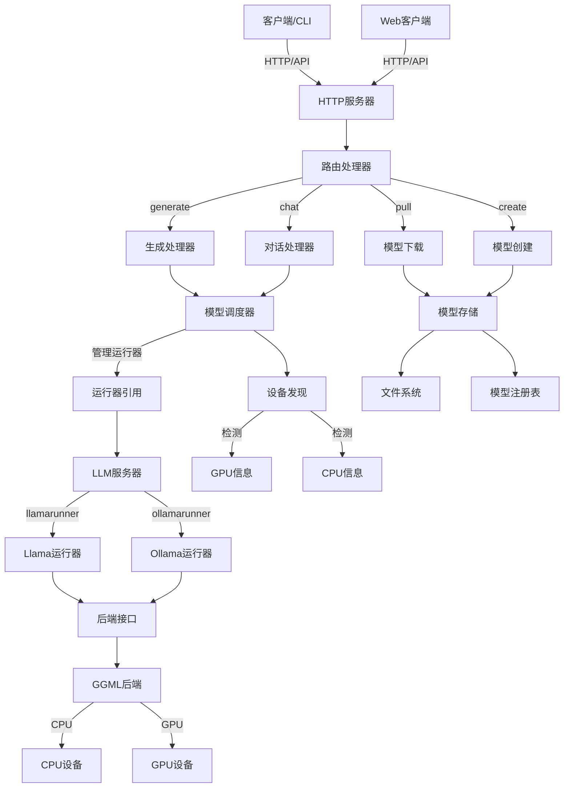
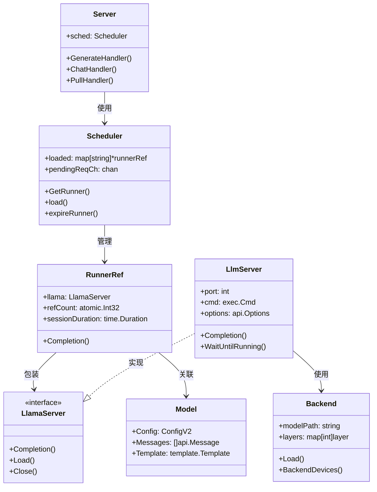
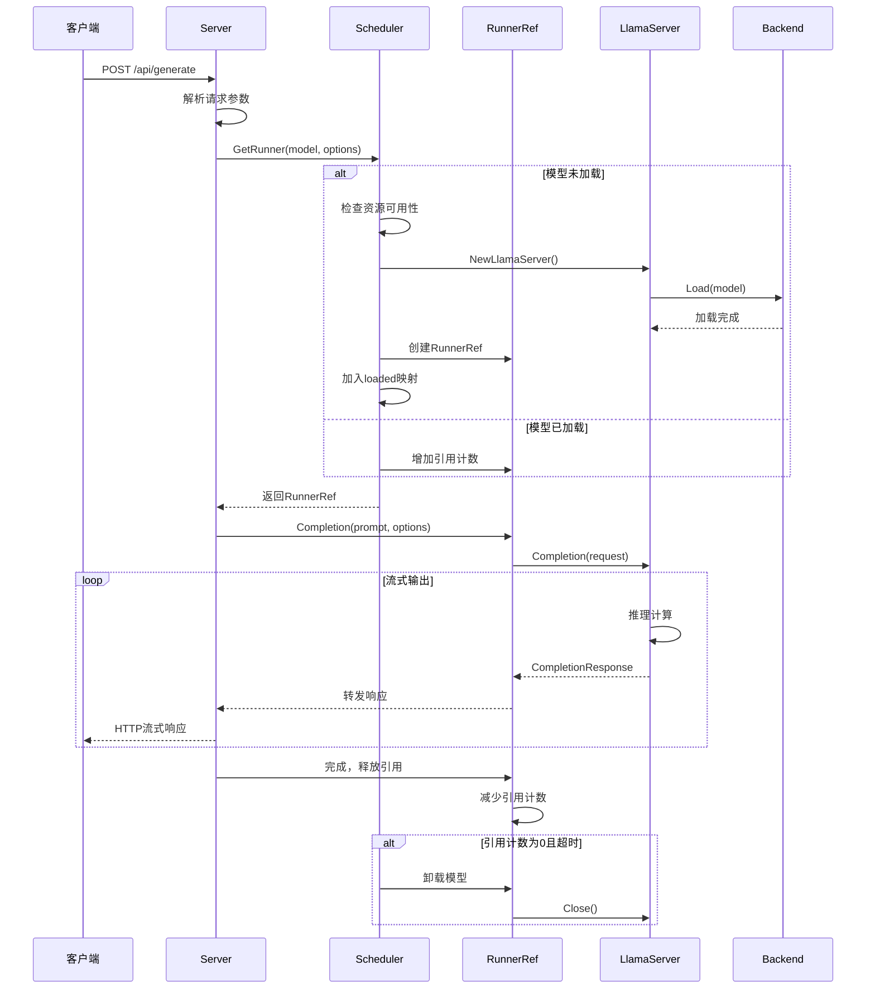
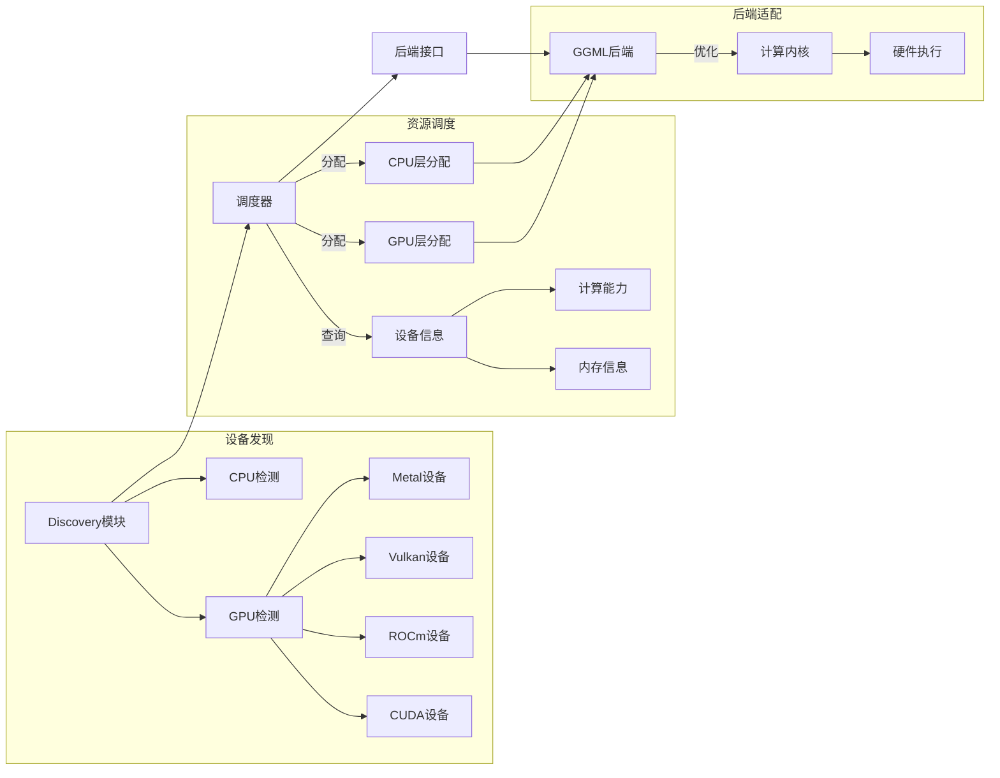
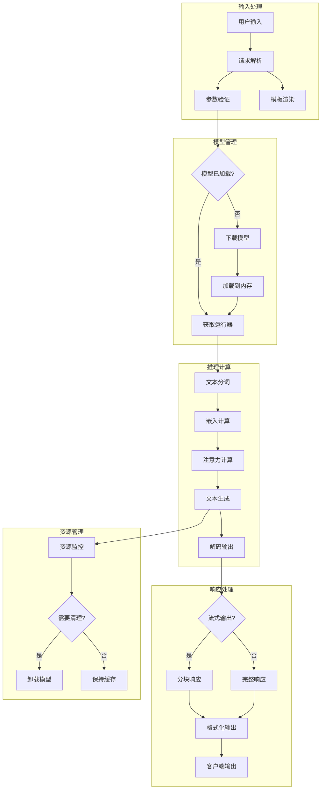

# Ollama 系统架构文档

## 项目概览

Ollama 是一个本地大语言模型推理服务平台，支持多种模型格式和硬件加速。它提供了简洁的 API 接口，支持模型下载、管理和推理服务。

## 系统架构图

此架构图展示了Ollama的分层设计：从客户端HTTP请求到底层硬件设备的完整数据流。核心调度器负责模型生命周期管理，推理引擎抽象了不同的运行时实现，设备发现模块自动检测可用的计算资源。

## 核心组件关系图

该类图显示了核心组件间的依赖关系：Server 通过 Scheduler 管理多个 RunnerRef，每个 RunnerRef 封装一个 LlamaServer 实例，实现模型的并发访问和生命周期管理。

## 请求处理时序图

此时序图展示了从HTTP请求到模型推理的完整流程，包括模型的懒加载机制和资源管理策略。调度器实现了智能的模型生命周期管理，避免频繁加载卸载。

## 设备发现与调度

设备发现模块自动检测系统中的可用计算设备，调度器根据模型需求和设备能力进行智能分配，GGML后端提供统一的硬件抽象接口。

## 数据流向图

数据流图展示了从用户输入到最终输出的完整处理链路，包括模型管理、推理计算和资源管理的并行处理机制。

## 技术栈总结

### 核心技术栈
- **语言**: Go (服务端), C++ (推理引擎)
- **网络**: HTTP/RESTful API, Gin框架
- **推理**: GGML, llama.cpp
- **并发**: Goroutines, Channels
- **硬件加速**: CUDA, ROCm, Metal, Vulkan

### 关键设计模式
1. **调度器模式**: 集中管理模型生命周期和资源分配
2. **适配器模式**: 统一不同硬件后端的接口
3. **观察者模式**: 流式输出和进度监控
4. **工厂模式**: 动态创建不同类型的运行器
5. **单例模式**: 全局设备发现和配置管理

### 性能优化特性
- **懒加载**: 按需加载模型到内存
- **引用计数**: 智能资源管理和自动清理
- **层级分割**: CPU/GPU混合推理优化
- **流式输出**: 减少首次响应时间
- **并发控制**: 信号量限制并发请求数

Ollama通过模块化的架构设计，实现了高性能、可扩展的本地大语言模型服务，支持多种硬件平台和模型格式，为用户提供了简洁易用的AI推理能力。