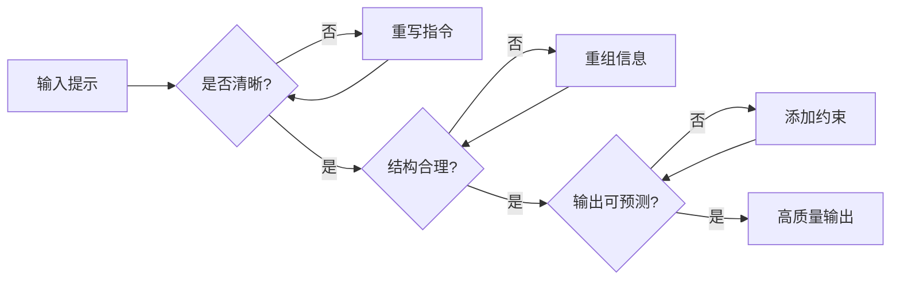
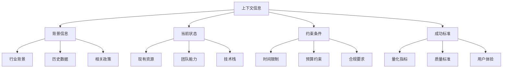
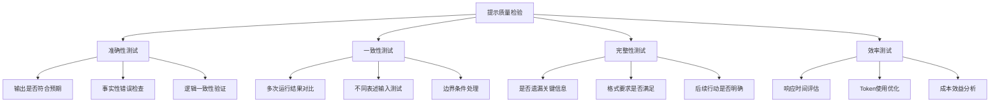

# 基础篇：构建有效提示的核心原则

## 🎯 核心理念

有效的提示工程基于三个核心原则：**清晰性**、**结构性**、**可预测性**。掌握这些基础，您就能构建80%场景下都有效的提示。



## 1. API结构与参数优化

### 最佳实践配置

```python
# 推荐的基础配置
import anthropic

client = anthropic.Anthropic(api_key="your-api-key")

def create_optimized_message(content, role="assistant"):
    response = client.messages.create(
        model="claude-3-sonnet-20240229",  # 平衡性能和成本
        max_tokens=1000,                   # 根据需要调整
        temperature=0.1,                   # 低温度提高一致性
        system="你是一位专业的助手，总是提供准确、有用的回答。",
        messages=[
            {"role": "user", "content": content}
        ]
    )
    return response.content[0].text
```

### 关键参数说明

| 参数 | 推荐值 | 使用场景 |
|------|--------|----------|
| `temperature` | 0.0-0.3 | 需要一致性的任务（分析、总结） |
| `temperature` | 0.7-1.0 | 需要创造性的任务（写作、头脑风暴） |
| `max_tokens` | 1000-4000 | 大多数任务的合理范围 |
| `system` | 必须设置 | 定义AI的角色和行为规范 |

## 2. 清晰表达的实用技巧

### ✅ 好的提示特征

```python
# 示例：清晰的任务指令
GOOD_PROMPT = """
请分析以下销售数据，并生成月度报告：

数据：Q1销售额 150万，Q2销售额 180万，Q3销售额 165万

要求：
1. 计算季度环比增长率
2. 识别增长趋势
3. 提供3条具体的改进建议

输出格式：
## 数据分析
- 环比增长率：[具体数值]
- 趋势分析：[2-3句话]

## 改进建议
1. [具体建议1]
2. [具体建议2] 
3. [具体建议3]
"""
```

### ❌ 避免的模糊表达

```python
# 示例：模糊的提示
BAD_PROMPT = """
帮我看看这些数字，给点建议
数据：150万，180万，165万
"""
```

### 清晰性检查清单

- [ ] 任务目标明确且单一
- [ ] 提供了必要的上下文信息
- [ ] 指定了期望的输出格式
- [ ] 设定了明确的约束条件
- [ ] 使用了具体而非抽象的词汇

## 3. 角色设定与上下文管理

### 高效的角色设定模式

```python
# 专家角色模板
EXPERT_ROLE_TEMPLATE = """
你是一位{专业领域}专家，拥有{年限}年的实战经验。
你的专长包括：{具体技能列表}
你的工作风格：{风格描述}

在回答问题时，你会：
1. 基于实际经验提供建议
2. 考虑实施的可行性
3. 指出潜在的风险和机会
4. 提供具体的下一步行动
"""

# 实际应用示例
MARKETING_EXPERT = """
你是一位数字营销专家，拥有8年的互联网营销实战经验。
你的专长包括：SEO优化、社交媒体营销、内容策略、数据分析
你的工作风格：数据驱动、注重ROI、用户导向

在回答营销问题时，你会：
1. 基于市场数据和用户行为分析
2. 考虑预算和资源限制
3. 指出执行中的关键风险点
4. 提供可衡量的具体行动方案
"""
```

### 上下文信息的层次化管理



## 4. 信息分离与结构化

### 数据与指令分离模式

```python
# 推荐：清晰分离
STRUCTURED_PROMPT = """
# 任务指令
请对以下客户反馈进行情感分析和分类。

# 分析要求
1. 情感倾向：正面/中性/负面
2. 关键主题：产品/服务/价格/其他
3. 紧急程度：高/中/低
4. 建议行动：具体的跟进建议

# 输出格式
每条反馈输出格式如下：
\`\`\`output
反馈ID: [编号]
情感: [正面/中性/负面]
主题: [具体分类]
紧急程度: [高/中/低]
建议: [具体行动建议]
\`\`\`

# 待分析数据
<data>
1. "你们的产品质量还不错，但是价格有点贵"
2. "客服态度很差，完全不解决问题！"
3. "物流很快，包装也很好，满意"
</data>
"""
```

## 5. 输出格式控制

### 常用格式模板

```python
# JSON格式输出
JSON_FORMAT = """
请以JSON格式输出，严格遵循以下结构：
{
    "summary": "总结内容",
    "key_points": ["要点1", "要点2", "要点3"],
    "recommendation": "具体建议",
    "confidence": 0.95
}
"""

# 表格格式输出
TABLE_FORMAT = """
请以Markdown表格格式输出：

| 项目 | 现状 | 目标 | 差距 | 行动计划 |
|------|------|------|------|----------|
| [项目名] | [当前情况] | [目标状态] | [差距分析] | [具体行动] |
"""

# 步骤化输出
STEP_FORMAT = """
请按以下步骤格式输出：

## 第一步：[步骤名称]
**目标**：[该步骤要达成什么]
**行动**：[具体要做什么]
**预期结果**：[期望看到的成果]
**时间估计**：[所需时间]

## 第二步：[步骤名称]
[同样格式...]
"""
```

## 6. 实用提示模板库

### 通用业务分析模板

```python
BUSINESS_ANALYSIS_TEMPLATE = """
作为业务分析专家，请分析以下情况：

**背景信息**：
{business_context}

**当前挑战**：
{current_challenges}

**可用资源**：
{available_resources}

**分析要求**：
1. 问题根因分析（使用5Why方法）
2. 解决方案设计（至少3个选项）
3. 实施计划（包含时间线和责任人）
4. 风险评估（识别前3大风险）
5. 成功指标（可量化的KPI）

请以专业报告格式输出，每个部分都要有具体的数据支撑或逻辑推理。
"""
```

### 技术方案评估模板

```python
TECH_EVALUATION_TEMPLATE = """
作为技术架构师，请评估以下技术方案：

**项目需求**：
{project_requirements}

**技术选项**：
{technology_options}

**评估维度**：
1. 技术成熟度（1-5分）
2. 开发效率（1-5分）
3. 维护成本（1-5分）
4. 扩展性（1-5分）
5. 团队掌握度（1-5分）

**输出要求**：
- 对比分析表格
- 推荐方案及理由
- 实施路线图
- 潜在风险点

请基于实际工程经验给出建议。
"""
```

## 7. 质量检验与迭代

### 提示质量评估标准



### 快速迭代工作流

```python
def iterate_prompt(initial_prompt, test_cases, iterations=3):
    """
    快速提示迭代工作流
    """
    current_prompt = initial_prompt
    
    for i in range(iterations):
        print(f"=== 迭代 {i+1} ===")
        
        # 1. 测试当前提示
        results = []
        for test_case in test_cases:
            result = test_prompt(current_prompt, test_case)
            results.append(result)
        
        # 2. 评估结果
        evaluation = evaluate_results(results)
        print(f"当前得分: {evaluation['score']}")
        
        # 3. 识别问题
        issues = identify_issues(results)
        if not issues:
            print("提示已优化完成！")
            break
            
        # 4. 改进提示
        current_prompt = improve_prompt(current_prompt, issues)
        
    return current_prompt
```

## 📋 实践练习

### 练习1：基础提示重写

将以下模糊提示改写为清晰的指令：

**原始提示**：
```
帮我写个东西关于市场营销的
```

**改写要求**：
- 明确具体任务
- 设定输出格式
- 添加必要约束

### 练习2：角色设定实践

为以下场景设计合适的角色：
- 企业数字化转型咨询
- 个人职业发展规划
- 产品需求分析

### 练习3：模板应用

使用本章的通用模板，为您的实际工作场景创建一个专用提示。

---

**下一步：[进阶篇：高效提示技术](./02_advanced_techniques.md)**