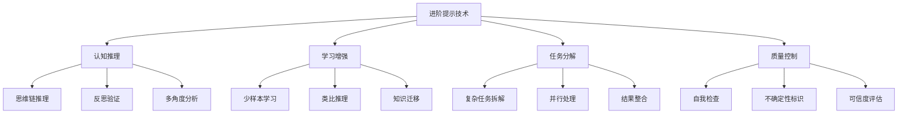
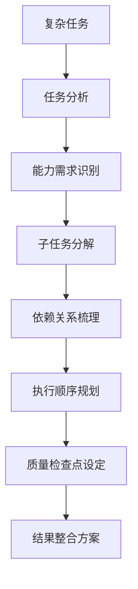
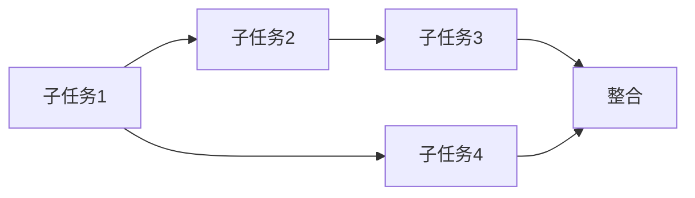

# 进阶篇：高效提示技术

## 🧠 认知增强技术

掌握基础后，这些进阶技术能让AI的推理能力和准确性显著提升。每种技术都有特定的适用场景和实施要点。



## 1. 思维链推理(Chain of Thought)

### 核心原理

思维链推理让AI显示中间推理步骤，大幅提高复杂问题的准确性。特别适用于：
- 数学计算
- 逻辑推理
- 多步骤分析
- 因果关系判断

### 实用模板

```python
# 基础思维链模板
COT_TEMPLATE = """
请逐步分析以下问题：

问题：{problem_statement}

请按照以下步骤思考：
1. **理解问题**：重新表述问题的核心要求
2. **收集信息**：列出所有已知条件和约束
3. **分析关系**：识别变量之间的关系
4. **推理过程**：展示详细的推理步骤
5. **验证结果**：检查答案的合理性
6. **得出结论**：给出最终答案

让我们开始：
"""

# 商业决策思维链
BUSINESS_COT_TEMPLATE = """
作为经验丰富的商业顾问，请分析以下商业决策：

**决策情境**：{decision_context}

**分析框架**：
1. **现状评估**
   - 当前业务状况如何？
   - 主要痛点和机会是什么？
   
2. **选项分析**
   - 有哪些可行的选择？
   - 每个选项的优缺点是什么？
   
3. **影响评估**
   - 短期影响（1-6个月）
   - 中期影响（6个月-2年）
   - 长期影响（2年以上）
   
4. **风险分析**
   - 主要风险有哪些？
   - 如何降低风险？
   
5. **资源需求**
   - 需要什么资源？
   - 资源获取的可行性如何？
   
6. **推荐方案**
   - 基于以上分析，推荐哪个选项？
   - 实施的关键成功因素是什么？

请逐步分析，每一步都要有具体的论据支撑。
"""
```

### 思维链质量提升技巧

```python
# 增强版思维链（包含反思）
ENHANCED_COT = """
让我采用系统性思维来解决这个问题：

## 第一轮分析
{initial_analysis}

## 反思检查
现在让我重新审视我的分析：
- 是否考虑了所有重要因素？
- 推理逻辑是否存在漏洞？
- 有没有更好的解决方案？

## 修正后的分析
基于反思，我需要调整以下方面：
{corrected_analysis}

## 最终结论
{final_conclusion}

## 置信度评估
我对这个结论的置信度：{confidence_level}
理由：{confidence_reasoning}
"""
```

## 2. 示例驱动学习(Few-Shot Learning)

### 高质量示例设计

```python
# 示例选择原则
EXAMPLE_CRITERIA = """
好的示例应该具备：
1. **代表性**：覆盖不同类型的输入
2. **多样性**：展示不同的处理方式
3. **质量性**：每个示例都是高质量的输出
4. **渐进性**：从简单到复杂
5. **边界性**：包含边界情况的处理
"""

# 实用的Few-Shot模板
FEW_SHOT_TEMPLATE = """
我将向你展示几个{task_type}的示例，然后请你处理新的案例。

## 示例1：{example_type_1}
**输入**：{input_1}
**输出**：{output_1}
**说明**：{explanation_1}

## 示例2：{example_type_2}
**输入**：{input_2}
**输出**：{output_2}
**说明**：{explanation_2}

## 示例3：{example_type_3}
**输入**：{input_3}
**输出**：{output_3}
**说明**：{explanation_3}

现在请处理新案例：
**输入**：{new_input}
**要求**：请按照上述示例的风格和质量标准来处理。
"""
```

### 商业文案Few-Shot示例

```python
COPYWRITING_EXAMPLES = """
我需要你根据以下示例学习写作风格，然后创作新的文案：

## 示例1：科技产品发布
**产品**：智能手表
**文案**：
"不只是时间的记录者，更是健康的守护者。全新智能手表，24小时心率监测，让每一次心跳都被细心呵护。轻松一戴，健康常在。"

**分析**：情感化开头 + 功能特点 + 价值承诺 + 简洁收尾

## 示例2：教育服务推广
**服务**：在线编程课程
**文案**：
"代码改变世界，从今天开始。零基础到项目实战，100天完整学习路径，1对1导师陪伴。不是每个人都能成为程序员，但每个程序员都曾是初学者。"

**分析**：愿景引导 + 具体承诺 + 差异化优势 + 情感共鸣

## 示例3：生活服务应用
**产品**：外卖配送APP
**文案**：
"30分钟送达不是承诺，是标准。雨天不加价，深夜不停歇。好的服务，就是让生活更简单一点点。"

**分析**：超预期服务 + 特殊情况保障 + 品牌理念升华

现在请为以下产品创作文案：
**产品**：{new_product}
**目标用户**：{target_audience}
**核心卖点**：{key_features}

请保持与示例相同的质量和风格。
"""
```

## 3. 复杂任务分解策略

### 系统化分解框架



### 分解模板

```python
# 复杂任务分解模板
TASK_DECOMPOSITION = """
## 任务分解分析

### 原始任务
{original_task}

### 第一步：任务理解
- 最终目标：{final_goal}
- 成功标准：{success_criteria}
- 约束条件：{constraints}

### 第二步：能力需求分析
需要的核心能力：
1. {capability_1}
2. {capability_2}
3. {capability_3}
...

### 第三步：子任务分解
我将把这个复杂任务分解为以下可管理的子任务：

#### 子任务1：{subtask_1_name}
- **目标**：{subtask_1_goal}
- **输入**：{subtask_1_input}
- **输出**：{subtask_1_output}
- **预估复杂度**：{subtask_1_complexity}

#### 子任务2：{subtask_2_name}
- **目标**：{subtask_2_goal}
- **输入**：{subtask_2_input}
- **输出**：{subtask_2_output}
- **预估复杂度**：{subtask_2_complexity}

### 第四步：依赖关系


### 第五步：执行计划
1. 首先执行：{first_tasks}
2. 然后执行：{second_tasks}
3. 最后执行：{final_tasks}

### 第六步：质量检查
每个子任务完成后的检查要点：
- {checkpoint_1}
- {checkpoint_2}
- {checkpoint_3}

现在开始执行第一个子任务...
"""
```

### 实际应用案例

```python
# 市场分析项目分解示例
MARKET_ANALYSIS_DECOMPOSITION = """
## 复杂任务：新产品市场进入策略分析

### 分解后的子任务：

#### 任务1：市场环境分析
```
输入：行业报告、竞争对手信息
处理：PEST分析框架
输出：市场环境评估报告
```

#### 任务2：目标客户画像
```
输入：用户调研数据、行为数据
处理：用户分群和画像分析
输出：详细客户画像文档
```

#### 任务3：竞争对手分析
```
输入：竞品信息、价格策略
处理：竞争态势分析
输出：竞争优劣势对比表
```

#### 任务4：SWOT分析
```
输入：前三个任务的输出
处理：综合SWOT分析
输出：战略定位建议
```

#### 任务5：进入策略制定
```
输入：所有前期分析结果
处理：策略选择和路径规划
输出：完整的市场进入方案
```

让我们开始执行任务1...
"""
```

## 4. 自我验证与纠错

### 多重验证机制

```python
# 自我验证模板
SELF_VERIFICATION = """
## 初步分析
{initial_analysis}

## 验证检查

### 逻辑一致性检查
- 前提和结论是否一致？
- 推理步骤是否有漏洞？
- 是否存在自相矛盾的地方？

检查结果：{logic_check_result}

### 事实准确性检查
- 引用的数据是否准确？
- 是否有不确定的信息？
- 需要进一步确认的事实有哪些？

检查结果：{fact_check_result}

### 完整性检查
- 是否遗漏了重要的考虑因素？
- 分析覆盖是否全面？
- 还有哪些角度需要补充？

检查结果：{completeness_check_result}

## 修正后的分析
基于以上验证，我需要做以下修正：
{corrected_analysis}

## 最终输出
{final_output}

## 不确定性声明
以下方面存在不确定性，需要进一步验证：
- {uncertainty_1}
- {uncertainty_2}
- {uncertainty_3}
"""
```

### 置信度评估

```python
CONFIDENCE_ASSESSMENT = """
## 答案置信度评估

### 高置信度部分（90%以上）
{high_confidence_parts}
**原因**：基于充分的事实依据和逻辑推理

### 中等置信度部分（70-90%）
{medium_confidence_parts}
**原因**：有一定依据，但可能受限于信息不完整

### 低置信度部分（70%以下）
{low_confidence_parts}
**原因**：缺乏充分证据或涉及高度不确定的预测

### 建议采取的行动
- 对于高置信度部分：可以直接采纳
- 对于中等置信度部分：建议进一步验证
- 对于低置信度部分：需要收集更多信息或寻求专家意见

### 风险提示
如果基于此分析做决策，主要风险包括：
{risk_warnings}
"""
```

## 5. 类比推理技术

### 跨领域类比

```python
ANALOGY_TEMPLATE = """
## 类比推理分析

### 目标问题
{target_problem}

### 寻找类比
让我从其他领域寻找相似的情况：

#### 类比1：{analogy_domain_1}
**相似情况**：{similar_situation_1}
**解决方案**：{solution_1}
**可借鉴的要点**：{key_insights_1}

#### 类比2：{analogy_domain_2}
**相似情况**：{similar_situation_2}
**解决方案**：{solution_2}
**可借鉴的要点**：{key_insights_2}

### 类比映射
将类比中的成功经验映射到当前问题：

| 类比要素 | 当前问题对应 | 适用性分析 |
|----------|-------------|-----------|
| {analogy_element_1} | {current_element_1} | {applicability_1} |
| {analogy_element_2} | {current_element_2} | {applicability_2} |

### 适应性调整
考虑到当前问题的特殊性，需要做以下调整：
{adaptations}

### 最终方案
基于类比推理，建议的解决方案：
{final_solution}
"""
```

## 6. 多角度分析

### 利益相关者分析

```python
STAKEHOLDER_ANALYSIS = """
## 多角度分析框架

### 问题描述
{problem_description}

### 利益相关者识别
{stakeholder_identification}

### 分角度分析

#### 角度1：{stakeholder_1}的视角
**关注点**：{concerns_1}
**期望结果**：{expectations_1}
**潜在阻力**：{resistance_1}
**支持条件**：{support_conditions_1}

#### 角度2：{stakeholder_2}的视角
**关注点**：{concerns_2}
**期望结果**：{expectations_2}
**潜在阻力**：{resistance_2}
**支持条件**：{support_conditions_2}

#### 角度3：{stakeholder_3}的视角
**关注点**：{concerns_3}
**期望结果**：{expectations_3}
**潜在阻力**：{resistance_3}
**支持条件**：{support_conditions_3}

### 综合分析
**共同关注点**：{common_concerns}
**利益冲突点**：{conflicts}
**协调可能性**：{coordination_potential}

### 平衡方案
基于多角度分析，建议的平衡方案：
{balanced_solution}
"""
```

## 7. 实战练习

### 练习1：思维链推理
**场景**：公司正在考虑是否要进入新的市场领域
**要求**：使用思维链推理分析这个决策

### 练习2：Few-Shot学习
**任务**：为不同类型的产品写推广文案
**要求**：先给出3个高质量示例，然后创作新文案

### 练习3：复杂任务分解
**项目**：设计并实施一个客户满意度提升计划
**要求**：将项目分解为可执行的子任务

### 练习4：自我验证
**挑战**：对自己的分析结果进行多重验证
**要求**：识别不确定性并给出置信度评估

---

**下一步：[实战篇：业务应用与案例](./03_practical_applications.md)**