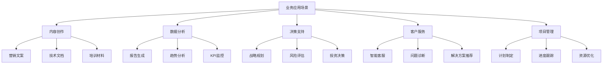

# 实战篇：业务应用与案例

## 🎯 实战导向

这一章将理论转化为实践，提供可直接应用的业务场景模板和解决方案。每个模板都是基于实际需求打磨的，可以快速适配到具体的工作场景中。



## 1. 内容创作场景

### 1.1 营销文案生成系统

```python
# 全能营销文案生成器
MARKETING_COPY_GENERATOR = """
作为资深文案策划师，请为以下产品/服务创作营销文案：

## 产品信息
- **产品名称**：{product_name}
- **核心功能**：{core_features}
- **目标用户**：{target_audience}
- **竞争优势**：{competitive_advantages}
- **价格定位**：{price_positioning}

## 文案要求
- **平台**：{platform} (微信/微博/小红书/LinkedIn等)
- **目标**：{campaign_goal} (品牌认知/转化/留存等)
- **风格**：{tone_of_voice} (专业/亲和/时尚/权威等)
- **字数限制**：{word_limit}

## 创作框架
请按以下结构创作：

### 1. 核心价值主张 (一句话打动用户)
{value_proposition}

### 2. 痛点共鸣 (用户痛点+解决方案)
{pain_point_solution}

### 3. 产品亮点 (3个核心卖点)
- {feature_1}
- {feature_2}  
- {feature_3}

### 4. 行动召唤 (明确的下一步指引)
{call_to_action}

### 5. 社会证明 (如适用)
{social_proof}

## 输出格式
请提供：
1. **主文案**：完整的营销文案
2. **变体版本**：同样内容的2个不同表达版本
3. **适配建议**：针对不同平台的调整建议
4. **A/B测试要点**：可测试的关键变量

开始创作：
"""

# 实际应用示例
SAAS_PRODUCT_COPY = """
## 产品信息
- **产品名称**：企业知识管理系统
- **核心功能**：文档管理、知识搜索、协作编辑
- **目标用户**：中大型企业的HR和IT部门
- **竞争优势**：AI智能搜索、无缝集成现有系统
- **价格定位**：中高端，按用户数收费

## 创作结果

### 主文案
"还在为找不到文档而加班？企业知识不再是孤岛！

AI智能搜索，3秒找到任何资料
无缝集成现有系统，零学习成本
500+企业的共同选择

立即申请14天免费试用，让知识为企业赋能！"

### 变体版本A（理性导向）
"企业知识管理难题一次性解决：
✓ 智能搜索技术，效率提升300%
✓ 零门槛集成，部署仅需1天
✓ 银行级安全保障，数据零泄露风险

现在试用，送价值5000元实施服务！"

### 变体版本B（情感导向）
"还记得为了找一份文档翻遍整个电脑的焦虑吗？
还记录因为信息不同步导致项目延期的懊恼吗？

现在，这些都成为历史。
让AI成为你的知识助手，让协作更简单。

开启你的智能办公时代 →"
"""
```

### 1.2 技术文档写作助手

```python
TECHNICAL_DOCUMENTATION = """
作为技术写作专家，请帮我创建以下技术文档：

## 文档类型
{doc_type} (API文档/用户手册/技术规范/故障排除指南等)

## 目标读者
{target_readers} (开发者/终端用户/系统管理员等)

## 技术背景
- **产品/系统**：{product_system}
- **技术栈**：{tech_stack}
- **核心功能**：{core_functionality}
- **使用场景**：{use_cases}

## 文档要求
- **详细程度**：{detail_level} (入门/进阶/专家)
- **包含代码示例**：{include_code_examples} (是/否)
- **包含截图**：{include_screenshots} (是/否)
- **预期长度**：{expected_length}

## 文档结构

### 1. 概述 (Executive Summary)
- 产品/功能简介
- 适用对象
- 前置条件

### 2. 快速开始 (Quick Start)
- 最小可行示例
- 5分钟内可运行的demo

### 3. 详细说明 (Detailed Guide)
- 完整功能介绍
- 参数说明
- 配置选项

### 4. 最佳实践 (Best Practices)
- 推荐用法
- 性能优化
- 安全考虑

### 5. 故障排除 (Troubleshooting)
- 常见问题
- 错误码说明
- 解决方案

### 6. 参考资料 (References)
- API参考
- 相关链接
- 版本历史

请开始创建文档：
"""
```

## 2. 数据分析场景

### 2.1 业务报告生成器

```python
DATA_ANALYSIS_REPORTER = """
作为数据分析师，请基于以下数据生成业务分析报告：

## 数据概况
- **分析时间段**：{time_period}
- **业务领域**：{business_domain}
- **关键指标**：{key_metrics}
- **数据来源**：{data_sources}

## 原始数据
{raw_data}

## 分析要求
- **报告受众**：{report_audience} (高管/运营/技术等)
- **分析深度**：{analysis_depth} (概览/详细/深度)
- **决策支持**：{decision_support} (是否需要具体建议)

## 报告结构

### 执行摘要 (Executive Summary)
**关键发现**：
- {key_finding_1}
- {key_finding_2}
- {key_finding_3}

**核心建议**：
- {recommendation_1}
- {recommendation_2}

### 数据洞察 (Data Insights)

#### 趋势分析
{trend_analysis}

#### 异常识别
{anomaly_detection}

#### 相关性分析
{correlation_analysis}

### 业务影响评估

#### 正面影响
{positive_impacts}

#### 风险点
{risk_points}

#### 机会点
{opportunities}

### 行动建议

#### 立即行动 (0-30天)
{immediate_actions}

#### 短期规划 (1-3个月)
{short_term_plans}

#### 长期战略 (3-12个月)
{long_term_strategies}

### 监控指标
建议持续关注以下指标：
{monitoring_metrics}

请开始分析：
"""

# 电商业务分析示例
ECOMMERCE_ANALYSIS_EXAMPLE = """
## 电商平台Q3业绩分析报告

### 执行摘要
**关键发现**：
- 总销售额同比增长25%，环比增长8%
- 移动端转化率提升15%，成为主要增长动力
- 客单价下降12%，但订单量增长42%

**核心建议**：
- 加大移动端用户体验优化投入
- 针对高价值商品设计专门的营销策略
- 建立更精细的用户分层运营体系

### 详细分析

#### 销售表现分析
/```
时间维度对比：
- Q3 vs Q2：增长8% (季节性因素影响)
- Q3 vs 去年Q3：增长25% (业务扩张效果)

渠道表现：
- 移动端：占比65%，增长35%
- PC端：占比35%，增长10%
/```

#### 用户行为洞察
- 新用户占比45%，留存率78%
- 重复购买率32%，同比提升5%
- 平均浏览深度3.2页，转化路径缩短

#### 商品表现分析
- 热销品类：数码3C、家居用品、服装
- 增长最快：健康保健品（+180%）
- 需要关注：图书音像（-15%）

### 行动建议

#### 立即执行（30天内）
1. 优化移动端购买流程，减少步骤
2. 针对高价值商品推出分期付款
3. 加强热销品类的库存管理

#### 短期规划（3个月内）
1. 建立用户生命周期管理体系
2. 开发个性化推荐算法
3. 扩大健康保健品类商品覆盖

### 风险提示
- 客单价下降趋势需要密切关注
- 物流成本随订单量增长压力加大
- 竞争对手促销活动可能影响Q4表现
"""
```

### 2.2 KPI监控与预警系统

```python
KPI_MONITORING_SYSTEM = """
作为业务监控专家，请建立以下KPI监控体系：

## 监控对象
- **业务领域**：{business_area}
- **关键流程**：{key_processes}
- **核心目标**：{core_objectives}

## KPI体系设计

### 一级指标（北极星指标）
{north_star_metrics}

### 二级指标（过程指标）
{process_metrics}

### 三级指标（细分指标）
{detailed_metrics}

## 监控机制

### 数据收集
- **频率**：{collection_frequency}
- **来源**：{data_sources}
- **质量控制**：{quality_control}

### 预警设置
/```python
# 预警规则示例
alert_rules = {
    "critical": {
        "condition": "指标偏离目标值30%以上",
        "action": "立即通知相关负责人",
        "escalation": "1小时内无响应则升级"
    },
    "warning": {
        "condition": "指标偏离目标值15-30%",
        "action": "发送预警通知",
        "escalation": "24小时内需要分析原因"
    },
    "attention": {
        "condition": "指标偏离目标值5-15%",
        "action": "日报中重点关注",
        "escalation": "周会讨论改进措施"
    }
}
/```

### 分析框架
当KPI异常时，按以下框架分析：

#### 1. 异常确认
- 数据质量检查
- 外部因素排除
- 趋势vs异常判断

#### 2. 根因分析
- 上游指标检查
- 同期对比分析
- 细分维度拆解

#### 3. 影响评估
- 短期业务影响
- 长期战略风险
- 关联业务影响

#### 4. 行动方案
- 应急处理措施
- 根本性改进计划
- 预防性措施

### 报告机制
- **日报**：关键指标趋势
- **周报**：深度分析和建议
- **月报**：整体表现和优化方向

请开始设计监控体系：
"""
```

## 3. 决策支持场景

### 3.1 投资决策分析

```python
INVESTMENT_DECISION_ANALYZER = """
作为投资分析专家，请评估以下投资机会：

## 投资项目概况
- **项目名称**：{project_name}
- **投资金额**：{investment_amount}
- **项目周期**：{project_duration}
- **预期回报**：{expected_returns}
- **风险等级**：{risk_level}

## 分析框架

### 1. 项目可行性分析

#### 市场分析
- **市场规模**：{market_size}
- **增长趋势**：{growth_trend}
- **竞争态势**：{competitive_landscape}
- **进入壁垒**：{entry_barriers}

#### 技术分析
- **技术成熟度**：{tech_maturity}
- **技术门槛**：{tech_threshold}
- **替代风险**：{substitution_risk}

#### 团队分析
- **核心团队经验**：{team_experience}
- **执行能力**：{execution_capability}
- **过往业绩**：{track_record}

### 2. 财务分析

#### 现金流预测
/```
年份    | 现金流入 | 现金流出 | 净现金流 | 累计现金流
Year 1  | {cf_in_1} | {cf_out_1} | {net_cf_1} | {cum_cf_1}
Year 2  | {cf_in_2} | {cf_out_2} | {net_cf_2} | {cum_cf_2}
Year 3  | {cf_in_3} | {cf_out_3} | {net_cf_3} | {cum_cf_3}
/```

#### 关键财务指标
- **NPV (净现值)**：{npv_value}
- **IRR (内部收益率)**：{irr_value}
- **回收期**：{payback_period}
- **盈亏平衡点**：{breakeven_point}

### 3. 风险评估

#### 主要风险识别
| 风险类别 | 风险描述 | 发生概率 | 影响程度 | 应对措施 |
|----------|----------|----------|----------|----------|
| 市场风险 | {market_risk} | {market_prob} | {market_impact} | {market_mitigation} |
| 技术风险 | {tech_risk} | {tech_prob} | {tech_impact} | {tech_mitigation} |
| 运营风险 | {ops_risk} | {ops_prob} | {ops_impact} | {ops_mitigation} |
| 财务风险 | {finance_risk} | {finance_prob} | {finance_impact} | {finance_mitigation} |

#### 敏感性分析
关键变量对项目收益的影响：
- 收入变化±20%：影响NPV {revenue_sensitivity}
- 成本变化±20%：影响NPV {cost_sensitivity}
- 时间延迟6个月：影响NPV {time_sensitivity}

### 4. 决策建议

#### 综合评分 (100分制)
- **市场前景**: {market_score}/25
- **技术可行性**: {tech_score}/25  
- **团队能力**: {team_score}/25
- **财务收益**: {finance_score}/25
- **总分**: {total_score}/100

#### 决策建议
基于以上分析，我的建议是：{decision_recommendation}

#### 关键成功因素
1. {success_factor_1}
2. {success_factor_2}
3. {success_factor_3}

#### 监控要点
1. {monitoring_point_1}
2. {monitoring_point_2}
3. {monitoring_point_3}

请开始分析：
"""
```

### 3.2 战略规划助手

```python
STRATEGIC_PLANNING_ASSISTANT = """
作为战略顾问，请协助制定以下战略规划：

## 战略规划背景
- **组织类型**：{organization_type}
- **当前规模**：{current_scale}
- **所处行业**：{industry}
- **规划周期**：{planning_horizon}
- **核心挑战**：{key_challenges}

## 战略分析框架

### 1. 环境分析 (PEST)

#### 政治环境 (Political)
- **相关政策**：{political_factors}
- **监管变化**：{regulatory_changes}
- **政策机会**：{policy_opportunities}

#### 经济环境 (Economic)
- **宏观经济**：{economic_conditions}
- **市场状况**：{market_conditions}
- **成本变化**：{cost_trends}

#### 社会环境 (Social)
- **人口结构**：{demographic_trends}
- **消费习惯**：{consumer_behavior}
- **文化变迁**：{cultural_shifts}

#### 技术环境 (Technological)
- **技术趋势**：{tech_trends}
- **创新机会**：{innovation_opportunities}
- **数字化程度**：{digitalization_level}

### 2. 内部分析 (价值链分析)

#### 核心业务活动
- **研发能力**：{rd_capability}
- **生产/服务交付**：{operations_capability}
- **营销销售**：{marketing_capability}
- **客户服务**：{service_capability}

#### 支持性活动
- **人力资源**：{hr_capability}
- **技术支持**：{tech_support}
- **采购管理**：{procurement}
- **基础设施**：{infrastructure}

### 3. SWOT分析

#### 优势 (Strengths)
- {strength_1}
- {strength_2}
- {strength_3}

#### 劣势 (Weaknesses)
- {weakness_1}
- {weakness_2}
- {weakness_3}

#### 机会 (Opportunities)
- {opportunity_1}
- {opportunity_2}
- {opportunity_3}

#### 威胁 (Threats)
- {threat_1}
- {threat_2}
- {threat_3}

### 4. 战略选择

#### 战略定位
基于分析结果，建议的战略定位：{strategic_positioning}

#### 战略目标
- **愿景**：{vision_statement}
- **使命**：{mission_statement}
- **价值观**：{core_values}

#### 具体目标 (SMART原则)
| 目标类别 | 具体目标 | 衡量指标 | 完成时间 | 责任人 |
|----------|----------|----------|----------|--------|
| 财务目标 | {financial_goal} | {financial_kpi} | {financial_timeline} | {financial_owner} |
| 市场目标 | {market_goal} | {market_kpi} | {market_timeline} | {market_owner} |
| 运营目标 | {operational_goal} | {operational_kpi} | {operational_timeline} | {operational_owner} |

### 5. 实施计划

#### 关键举措
1. **{initiative_1_name}**
   - 目标：{initiative_1_goal}
   - 资源需求：{initiative_1_resources}
   - 时间计划：{initiative_1_timeline}
   - 成功指标：{initiative_1_metrics}

2. **{initiative_2_name}**
   - 目标：{initiative_2_goal}
   - 资源需求：{initiative_2_resources}
   - 时间计划：{initiative_2_timeline}
   - 成功指标：{initiative_2_metrics}

#### 资源配置
- **人力资源**：{hr_allocation}
- **财务预算**：{budget_allocation}
- **技术投入**：{tech_investment}

#### 风险控制
- **主要风险**：{major_risks}
- **应对策略**：{risk_mitigation}
- **应急计划**：{contingency_plans}

### 6. 监控与评估

#### 关键绩效指标
- **战略层面**：{strategic_kpis}
- **运营层面**：{operational_kpis}
- **财务层面**：{financial_kpis}

#### 评估机制
- **评估频率**：{review_frequency}
- **评估方法**：{review_methodology}
- **调整机制**：{adjustment_process}

请开始制定战略规划：
"""
```

## 4. 客户服务场景

### 4.1 智能客服问答系统

```python
INTELLIGENT_CUSTOMER_SERVICE = """
作为资深客服专家，请为以下客户咨询提供专业解答：

## 客服背景设定
- **公司类型**：{company_type}
- **主要产品/服务**：{products_services}
- **客服风格**：{service_style} (专业正式/亲和友好/简洁高效)
- **授权范围**：{authorization_scope}

## 客户信息
- **客户类型**：{customer_type} (新客户/老客户/VIP客户)
- **历史问题**：{previous_issues}
- **当前情绪**：{customer_emotion} (满意/中性/不满/愤怒)

## 咨询内容
{customer_inquiry}

## 回复框架

### 1. 问题理解确认
首先，让我确认一下您的问题：
{problem_understanding}

### 2. 情感回应
{emotional_response}

### 3. 解决方案
针对您的问题，我为您提供以下解决方案：

#### 方案一：{solution_1_name}
- **具体步骤**：{solution_1_steps}
- **预期效果**：{solution_1_outcome}
- **所需时间**：{solution_1_timeline}

#### 方案二：{solution_2_name} (如适用)
- **具体步骤**：{solution_2_steps}
- **预期效果**：{solution_2_outcome}
- **所需时间**：{solution_2_timeline}

### 4. 后续跟进
{follow_up_plan}

### 5. 额外关怀
{additional_care}

## 质量控制要点
- [ ] 回复是否准确解决了客户问题
- [ ] 语言是否符合公司服务标准
- [ ] 是否提供了明确的下一步指引
- [ ] 是否考虑了客户的情感需求
- [ ] 是否留有进一步沟通的渠道

请开始回复客户：
"""

# 实际应用示例
ECOMMERCE_CUSTOMER_SERVICE_EXAMPLE = """
## 客户咨询场景

**客户类型**：首次购买的新客户
**情感状态**：有些焦虑和不确定
**咨询内容**：
"您好，我是第一次在你们平台购买，下了订单后有点担心。我想知道我的订单什么时候能到？如果商品有问题怎么办？还有，我看到有些评论说客服联系不上，是真的吗？"

## 客服回复

您好！很高兴为您服务，也非常感谢您选择我们平台！

作为新客户，有这些担心是完全可以理解的，我来详细为您解答：

### 关于订单配送
📦 **您的订单状态**：我查看了您的订单（订单号：xxxxx），商品已在打包中，预计今天下午发货
📦 **配送时效**：您所在的城市通常1-2个工作日即可收到，我们会及时发送物流信息到您的手机
📦 **配送跟踪**：您可以在"我的订单"中实时查看配送进度

### 关于商品质量保障
✅ **质量承诺**：我们所有商品都经过严格质检，有任何质量问题7天无理由退换
✅ **售后服务**：收到商品后如有任何问题，可直接联系我们，我们会第一时间处理
✅ **退换流程**：操作简单，在线申请即可，我们承担来回运费

### 关于客服服务
🌟 **服务时间**：我们7×12小时在线服务（9:00-21:00）
🌟 **联系方式**：在线客服、400电话、微信客服都能找到我们
🌟 **响应承诺**：工作时间内5分钟内必回复

为了让您更安心，我特别为您：
1. 加了特别关注标记，任何问题都会优先处理
2. 留下我的工号（xxx），您可以直接找我
3. 商品到达后会主动回访确认

还有任何疑问吗？我随时为您解答！😊
"""
```

### 4.2 投诉处理专家系统

```python
COMPLAINT_HANDLING_SYSTEM = """
作为投诉处理专家，请协助处理以下客户投诉：

## 投诉基本信息
- **客户等级**：{customer_tier}
- **投诉渠道**：{complaint_channel}
- **紧急程度**：{urgency_level}
- **影响范围**：{impact_scope}

## 投诉内容
{complaint_details}

## 处理框架

### 第一步：投诉分类与评估

#### 投诉类型分析
- **主要类别**：{complaint_category}
- **次要类别**：{sub_category}
- **责任归属**：{responsibility_attribution}

#### 影响评估
- **客户影响**：{customer_impact}
- **业务影响**：{business_impact}
- **声誉风险**：{reputation_risk}
- **法律风险**：{legal_risk}

### 第二步：根因分析

#### 问题根源
使用5Why分析法：
1. **为什么发生这个问题？** {why_1}
2. **为什么会出现上述原因？** {why_2}
3. **为什么没有预防这种情况？** {why_3}
4. **为什么预防机制失效？** {why_4}
5. **为什么系统存在这种缺陷？** {why_5}

#### 系统性问题识别
- **流程缺陷**：{process_gaps}
- **培训不足**：{training_gaps}
- **系统问题**：{system_issues}
- **管理疏漏**：{management_oversight}

### 第三步：解决方案设计

#### 立即行动 (24小时内)
1. **客户安抚**：{immediate_customer_care}
2. **问题控制**：{immediate_problem_control}
3. **影响降低**：{immediate_impact_reduction}

#### 短期解决 (1周内)
1. **根本解决**：{short_term_solution}
2. **补偿方案**：{compensation_plan}
3. **关系修复**：{relationship_repair}

#### 长期改进 (1个月内)
1. **流程优化**：{process_improvement}
2. **系统升级**：{system_upgrade}
3. **培训强化**：{training_enhancement}

### 第四步：沟通策略

#### 回复模板
/```
尊敬的{customer_name}：

非常感谢您的反馈，我们对给您造成的不便深表歉意。

**我们的理解**：
{problem_acknowledgment}

**我们的行动**：
{action_taken}

**解决方案**：
{solution_offered}

**预防措施**：
{prevention_measures}

**联系方式**：
如有任何疑问，请直接联系我：{contact_info}

再次为给您造成的困扰道歉，期待为您提供更好的服务。

{signature}
/```

#### 跟进计划
- **24小时内**：确认客户收到回复并开始解决
- **3天内**：跟进解决进展
- **1周后**：确认问题完全解决
- **1个月后**：回访确认满意度

### 第五步：预防措施

#### 系统改进
- **流程修订**：{process_revision}
- **检查机制**：{quality_check}
- **预警系统**：{early_warning}

#### 团队提升
- **培训计划**：{training_plan}
- **考核标准**：{performance_standards}
- **激励机制**：{incentive_system}

### 第六步：总结学习

#### 案例总结
- **关键教训**：{key_lessons}
- **最佳实践**：{best_practices}
- **知识更新**：{knowledge_updates}

#### 分享机制
- **团队分享**：{team_sharing}
- **知识库更新**：{knowledge_base_update}
- **培训材料**：{training_materials}

请开始处理投诉：
"""
```

## 5. 项目管理场景

### 5.1 项目计划制定助手

```python
PROJECT_PLANNING_ASSISTANT = """
作为项目管理专家，请协助制定以下项目计划：

## 项目基本信息
- **项目名称**：{project_name}
- **项目类型**：{project_type}
- **预算范围**：{budget_range}
- **时间约束**：{time_constraints}
- **关键干系人**：{key_stakeholders}

## 项目目标
- **主要目标**：{primary_objectives}
- **成功标准**：{success_criteria}
- **验收标准**：{acceptance_criteria}

## 计划制定框架

### 1. 工作分解结构 (WBS)

#### 第一层：主要阶段
1. **{phase_1_name}**
   - 目标：{phase_1_objective}
   - 交付物：{phase_1_deliverables}
   - 持续时间：{phase_1_duration}

2. **{phase_2_name}**
   - 目标：{phase_2_objective}
   - 交付物：{phase_2_deliverables}
   - 持续时间：{phase_2_duration}

3. **{phase_3_name}**
   - 目标：{phase_3_objective}
   - 交付物：{phase_3_deliverables}
   - 持续时间：{phase_3_duration}

#### 第二层：具体任务
/```mermaid
graph TD
    A[{project_name}] --> B[{phase_1_name}]
    A --> C[{phase_2_name}]
    A --> D[{phase_3_name}]
    
    B --> B1[{task_1_1}]
    B --> B2[{task_1_2}]
    B --> B3[{task_1_3}]
    
    C --> C1[{task_2_1}]
    C --> C2[{task_2_2}]
    C --> C3[{task_2_3}]
    
    D --> D1[{task_3_1}]
    D --> D2[{task_3_2}]
    D --> D3[{task_3_3}]
/```

### 2. 进度计划

#### 关键路径分析
| 任务名称 | 持续时间 | 前置任务 | 资源需求 | 关键路径 |
|----------|----------|----------|----------|----------|
| {task_name_1} | {duration_1} | {predecessors_1} | {resources_1} | {critical_1} |
| {task_name_2} | {duration_2} | {predecessors_2} | {resources_2} | {critical_2} |
| {task_name_3} | {duration_3} | {predecessors_3} | {resources_3} | {critical_3} |

#### 里程碑计划
- **{milestone_1}**：{milestone_1_date} - {milestone_1_criteria}
- **{milestone_2}**：{milestone_2_date} - {milestone_2_criteria}
- **{milestone_3}**：{milestone_3_date} - {milestone_3_criteria}

### 3. 资源规划

#### 人力资源
| 角色 | 技能要求 | 投入时间 | 关键时期 | 备注 |
|------|----------|----------|----------|------|
| {role_1} | {skills_1} | {effort_1} | {peak_period_1} | {notes_1} |
| {role_2} | {skills_2} | {effort_2} | {peak_period_2} | {notes_2} |
| {role_3} | {skills_3} | {effort_3} | {peak_period_3} | {notes_3} |

#### 预算分配
/```
预算类别          金额        占比    使用时期
人力成本        {hr_cost}    {hr_percent}%   {hr_period}
设备采购        {equipment_cost}  {equipment_percent}%  {equipment_period}
外包服务        {outsource_cost}  {outsource_percent}%  {outsource_period}
其他费用        {other_cost}      {other_percent}%      {other_period}
应急储备        {contingency}     {contingency_percent}% 全期
总计           {total_budget}    100%
/```

### 4. 风险管理

#### 风险识别与评估
| 风险描述 | 概率 | 影响 | 风险等级 | 应对策略 | 责任人 |
|----------|------|------|----------|----------|--------|
| {risk_1} | {prob_1} | {impact_1} | {level_1} | {strategy_1} | {owner_1} |
| {risk_2} | {prob_2} | {impact_2} | {level_2} | {strategy_2} | {owner_2} |
| {risk_3} | {prob_3} | {impact_3} | {level_3} | {strategy_3} | {owner_3} |

#### 应急计划
- **关键路径延误**：{critical_path_contingency}
- **关键人员离职**：{key_personnel_contingency}
- **预算超支**：{budget_overrun_contingency}
- **技术难题**：{technical_challenge_contingency}

### 5. 沟通计划

#### 沟通矩阵
| 干系人 | 沟通内容 | 频率 | 方式 | 责任人 |
|--------|----------|------|------|--------|
| {stakeholder_1} | {content_1} | {frequency_1} | {method_1} | {responsible_1} |
| {stakeholder_2} | {content_2} | {frequency_2} | {method_2} | {responsible_2} |
| {stakeholder_3} | {content_3} | {frequency_3} | {method_3} | {responsible_3} |

#### 报告机制
- **日报**：团队内部进展同步
- **周报**：向管理层汇报状态
- **月报**：全面的项目健康度报告
- **专题报告**：重大问题或里程碑

### 6. 质量管理

#### 质量标准
- **交付物质量**：{deliverable_quality_standards}
- **过程质量**：{process_quality_standards}
- **客户满意度**：{customer_satisfaction_standards}

#### 质量控制活动
- **同行评审**：{peer_review_plan}
- **测试验证**：{testing_plan}
- **客户确认**：{customer_confirmation_plan}

请开始制定项目计划：
"""
```

## 6. 行业特定应用模板

### 6.1 电商运营分析

```python
ECOMMERCE_OPERATIONS_ANALYZER = """
作为电商运营专家，请分析以下运营数据并提供改进建议：

## 运营数据概览
- **分析时期**：{analysis_period}
- **平台类型**：{platform_type}
- **主营品类**：{main_categories}
- **目标市场**：{target_market}

## 核心指标表现
{performance_data}

## 分析框架

### 1. 流量分析

#### 流量来源分析
- **自然搜索**：{organic_traffic}%
- **付费推广**：{paid_traffic}%
- **直接访问**：{direct_traffic}%
- **社交媒体**：{social_traffic}%
- **其他渠道**：{other_traffic}%

#### 流量质量评估
- **跳出率**：{bounce_rate}
- **页面停留时间**：{dwell_time}
- **浏览深度**：{page_depth}
- **新老用户比例**：{new_vs_returning}

### 2. 转化分析

#### 转化漏斗
/```
访问用户 → 浏览商品 → 加入购物车 → 下单 → 支付完成
{visitors} → {product_views} → {cart_adds} → {orders} → {completed_orders}
转化率：  {view_rate}%    {cart_rate}%    {order_rate}%   {payment_rate}%
/```

#### 转化影响因素
- **商品页面优化空间**：{product_page_optimization}
- **购物车放弃原因**：{cart_abandonment_reasons}
- **支付流程障碍**：{payment_friction_points}

### 3. 商品表现分析

#### 热销商品分析
| 商品名称 | 销量 | 收入 | 利润率 | 库存周转 | 用户评价 |
|----------|------|------|--------|----------|----------|
| {product_1} | {sales_1} | {revenue_1} | {margin_1} | {turnover_1} | {rating_1} |
| {product_2} | {sales_2} | {revenue_2} | {margin_2} | {turnover_2} | {rating_2} |

#### 商品优化建议
- **定价策略调整**：{pricing_recommendations}
- **库存管理优化**：{inventory_optimization}
- **商品组合建议**：{product_mix_suggestions}

### 4. 用户行为分析

#### 用户生命周期价值
- **新用户获取成本**：{customer_acquisition_cost}
- **用户生命周期价值**：{customer_lifetime_value}
- **用户留存率**：{retention_rates}
- **重复购买率**：{repeat_purchase_rate}

#### 用户分群策略
1. **高价值用户** ({high_value_percent}%)
   - 特征：{high_value_characteristics}
   - 策略：{high_value_strategy}

2. **活跃用户** ({active_percent}%)
   - 特征：{active_characteristics}
   - 策略：{active_strategy}

3. **流失风险用户** ({at_risk_percent}%)
   - 特征：{at_risk_characteristics}
   - 策略：{at_risk_strategy}

### 5. 营销效果分析

#### 营销渠道ROI
| 渠道 | 投入 | 产出 | ROI | 获客成本 | 转化率 |
|------|------|------|-----|----------|--------|
| {channel_1} | {investment_1} | {return_1} | {roi_1} | {cac_1} | {conversion_1} |
| {channel_2} | {investment_2} | {return_2} | {roi_2} | {cac_2} | {conversion_2} |

#### 促销活动分析
- **最佳促销类型**：{best_promotion_type}
- **最佳促销时机**：{best_promotion_timing}
- **促销力度建议**：{promotion_intensity_recommendation}

### 6. 改进建议

#### 立即改进 (本周内)
1. {immediate_improvement_1}
2. {immediate_improvement_2}
3. {immediate_improvement_3}

#### 短期优化 (本月内)
1. {short_term_optimization_1}
2. {short_term_optimization_2}
3. {short_term_optimization_3}

#### 长期战略 (季度规划)
1. {long_term_strategy_1}
2. {long_term_strategy_2}
3. {long_term_strategy_3}

请开始分析：
"""
```

## 7. 快速实战检查清单

### 📋 提示质量检查

- [ ] **目标明确**：是否清楚要解决什么问题？
- [ ] **角色合适**：选择的AI角色是否匹配任务需求？
- [ ] **信息完整**：是否提供了足够的背景信息？
- [ ] **格式规范**：输出格式是否明确指定？
- [ ] **约束清晰**：边界条件是否明确设定？

### 📋 业务应用检查

- [ ] **实用性**：解决方案是否可执行？
- [ ] **完整性**：是否覆盖了关键的业务环节？
- [ ] **可衡量**：结果是否可以量化评估？
- [ ] **可扩展**：模板是否可以复用到类似场景？
- [ ] **风险控制**：是否考虑了潜在的风险点？

---

**下一步：[优化篇：质量控制与改进](./04_optimization.md)**